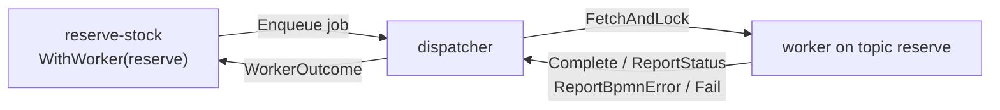

# External workers

A [Service Task](../tasks/service-task.md) can run its work **outside the
engine**. Instead of calling a Go operation in-process, the engine *enqueues* a
job, *parks* the task, and a **worker** fetches the job, locks it, executes, and
reports a verdict; the report re-enters the instance loop and resumes the parked
track. This is how you keep slow, flaky, or independently-deployed work off the
process track. This page is the runtime reference — the fetch-and-lock contract,
the four worker outcomes, the trust model, and the public interfaces you wire
against.

The mechanism is `pkg/tasks`; the built-in in-process dispatcher is
`pkg/tasks/localdispatcher`. The internal parking/resume machinery is
[ADR-021](../../design/ADR-021-service-task-execution-model.md) — this page
describes only observable behavior and the public contracts.

## How it works

The lifecycle is an asynchronous fetch-and-lock queue. Task-side wiring lives on
the Service Task (`WithWorker`, `WithRetryPolicy`, `WithOutputMapping`,
`WithStatus`); the engine drives the enqueue/park/resume; the worker fetches,
runs, and reports.



- **Enqueue + park.** When the instance reaches a `WithWorker` task the engine
  builds a `tasks.Job` (topic + the single bound input item) and `Enqueue`s it on
  the dispatcher, then parks the task — releasing its goroutine, exactly like a
  parked User Task. Nothing on the track blocks.
- **Fetch-and-lock.** A worker `FetchAndLock`s the next job for its topics; the
  job is locked to that worker until a deadline (extendable via `ExtendLock`), so
  no other worker picks it up. The worker reads its bound input via `LockedJob.Input`.
- **Report one verdict.** The worker calls exactly one terminal report —
  `Complete`, `ReportStatus`, `ReportBpmnError`, or `Fail`. That report rides
  back as a synthetic event and resumes the parked track. The instance only ever
  sees the *final* verdict; retries and classification happen off the track.

> **The instance takes only final results.** Failed attempts, retries, and raw
> faults never reach the track. Where that classification and retry runs — worker
> or engine — is the *trust mode*, below.

## The four worker outcomes

Every job resolves to one of four outcomes ([ADR-021](../../design/ADR-021-service-task-execution-model.md) §2.6). They map one-to-one onto the four
worker-facing report methods:

| Outcome | Report method | What the instance sees |
|---|---|---|
| **Complete** | `Complete(…, output *data.ItemDefinition)` | the result body, shaped by output mapping, committed as outputs. |
| **Business Status** | `ReportStatus(…, value data.Value)` | `value` written to the task's `WithStatus` variable; a downstream gateway routes on it. **State, not an error.** |
| **Business Error** | `ReportBpmnError(…, code, message string)` | `code` raised as a BPMN error, caught by a matching interrupting [Error boundary](../events/error.md). |
| **Technical fault** | `Fail(…, fault Fault)` | a raw `Fault` the engine `ErrorMapper` classifies (§2.6); an all-empty fault falls through to the default technical outcome. |

A local `WorkerFunc` doesn't call these directly — it returns a value or an
error and the pool translates (see [Local dispatcher](#local-dispatcher)).

## The WorkerDispatcher contract

The dispatcher is the seam between the engine and however workers are hosted.
`Enqueue` is engine-facing; `FetchAndLock` / `ExtendLock` and the four terminal
reports are worker-facing.

```go
type WorkerDispatcher interface {
    Enqueue(ctx context.Context, job Job) error
    FetchAndLock(ctx context.Context, workerID WorkerID,
        topics []Topic, lockDuration time.Duration) ([]LockedJob, error)
    ExtendLock(ctx context.Context, jobID JobID,
        workerID WorkerID, newDuration time.Duration) error
    Complete(ctx context.Context, jobID JobID,
        workerID WorkerID, output *data.ItemDefinition) error
    ReportBpmnError(ctx context.Context, jobID JobID,
        workerID WorkerID, code, message string) error
    ReportStatus(ctx context.Context, jobID JobID,
        workerID WorkerID, value data.Value) error
    Fail(ctx context.Context, jobID JobID, workerID WorkerID, fault Fault) error
}
```

You implement this only to back a **remote** or **durable** queue — the default
in-process `localdispatcher` already implements it. Building your own is covered
in [Custom worker dispatcher](../extending/worker-dispatcher.md). The key job and
report types:

| Type | Role |
|---|---|
| `Job{ ID, Topic, Input *data.ItemDefinition, Policy *Policy }` | the unit the engine `Enqueue`s. `Input` is the single bound input-message item (nil if the operation has no `inMessage`). |
| `LockedJob{ Job; WorkerID; Deadline time.Time }` | a `Job` returned by `FetchAndLock`, with its lock holder and expiry. |
| `Fault{ Code string, Body *data.ItemDefinition, Cause error }` | a worker's raw, unclassified fault for `Fail`; the engine `ErrorMapper` classifies `{Code, Body}`. |

## Local dispatcher

The built-in `localdispatcher` is an in-memory fetch-and-lock store with a local
worker pool — zero extra infrastructure. You build it, register one handler per
topic, and hand it to the engine:

```go
disp := localdispatcher.New(nil, 0) // system clock, default max-lock
_ = disp.RegisterWorker(ctx, "reserve", reserveWorker())
_ = disp.RegisterWorker(ctx, "authorize", authorizeWorker())

engine, _ := thresher.New("order-engine", thresher.WithWorkerDispatcher(disp))
```

| Call | Meaning |
|---|---|
| `New(clk clock.Clock, maxLock time.Duration) *Dispatcher` | new pool; `clk` nil → system clock, `maxLock` ≤ 0 → the default lock cap. |
| `RegisterWorker(ctx, topic Topic, fn WorkerFunc) error` | register the handler for `topic`. |

A handler is a `WorkerFunc` — it receives a `LockedJob` and returns the operation
result (or nil), or an error. The pool translates the return into a terminal
report: a value → `Complete`, a `*tasks.WorkerError` → its self-declared outcome,
any other error → `Fail`.

```go
type WorkerFunc func(ctx context.Context, job tasks.LockedJob) (*data.ItemDefinition, error)
```

To *self-classify* under `WorkerTrusted`, return a `*tasks.WorkerError`. Its
precedence is `BpmnErrorCode` → `Status` → technical (`Cause`):

```go
func authorizeWorker() localdispatcher.WorkerFunc {
    return func(ctx context.Context, lj tasks.LockedJob) (*data.ItemDefinition, error) {
        amount := 0
        if lj.Input != nil {
            amount, _ = lj.Input.Structure().Get(ctx).(int)
        }
        switch {
        case amount < 0:
            return nil, &tasks.WorkerError{
                BpmnErrorCode: "PaymentGatewayDown",
                Message:       "payment gateway unreachable"}
        case amount > 1000:
            return nil, &tasks.WorkerError{Status: values.NewVariable("DECLINED")}
        default:
            return nil, &tasks.WorkerError{Status: values.NewVariable("AUTHORIZED")}
        }
    }
}
```

## Trust modes

The `TrustMode` decides **where** the outcome policy — output mapping,
classification, retry — runs. The default is `WorkerTrusted`.

| Mode | Locus | Behavior |
|---|---|---|
| `WorkerTrusted` (default) | the worker | the policy ships to the worker: it maps its output, self-classifies faults (via `*WorkerError`), and retries technical faults in-process (holding the lock, no re-enqueue). Only a final verdict is reported. |
| `EngineAuthoritative` | the engine's dispatcher | the worker returns the raw `{code, body}` and the **engine** maps, classifies, and retries by re-enqueue. |

Set it per task with `activities.WithWorkerTrust(mode)`, or engine-wide with
`thresher.WithWorkerTrustDefault(mode)`; a per-task value overrides the
engine-wide default, and absent both, `WorkerTrusted` applies.

## Task-side wiring

The catalog lives on the [Service Task](../tasks/service-task.md); the
worker-relevant options are:

| Option | Effect |
|---|---|
| `activities.WithWorker(topic string)` | make the task an external-worker wait node on `topic`. Message-operation only — combining it with an in-process Go operation is a build-time error. An empty topic is a no-op. |
| `activities.WithRetryPolicy(p tasks.RetryPolicy)` | bound retries + backoff for a transient technical fault. |
| `activities.WithOutputMapping(rules ...tasks.OutputRule)` | shape the completion body into named outputs by path. |
| `activities.WithStatus(name string, overwrite bool)` | name the variable a Business Status writes; `overwrite=false` makes a pre-existing value a collision fault. |
| `activities.WithWorkerTrust(mode tasks.TrustMode)` | flip the trust mode for this task. |

**Retry policies** (`tasks`): `FixedDelay(maxAttempts, delay)`,
`ExponentialBackoff(maxAttempts, base, maxBackoff, jitter)`, `NoRetry()`,
`DefaultRetryPolicy()`. `attempt` is the 1-based number of the attempt that just
failed.

**Output mapping** reaches *into* the worker's structured body by path. Each
`OutputRule{Path, Var, Required}` extracts one value: `Path` is a body-path
expression (reading the body as the `body` datum), `Var` the output variable it
fills — a plain name or a structural path — and `Required` makes an unsatisfied
path a fault instead of a skipped mapping.

```go
st, _ := activities.NewServiceTask("reserve-stock",
    service.MustOperation("reserve-op", nil, nil, nil),
    activities.WithWorker("reserve"),
    activities.WithOutputMapping(
        tasks.OutputRule{Path: bodyPath("body.reservationId"), Var: "reservationId"},
        tasks.OutputRule{Path: bodyPath("body.warehouse.zone"), Var: "warehouseZone"}),
    activities.WithRetryPolicy(tasks.FixedDelay(3, 300*time.Millisecond)),
    activities.WithoutParams())
```

## Run it

`examples/service-task-worker/` walks all four outcomes across three orders under
the default `WorkerTrusted` mode. `reserve-stock` fails transiently twice, retries
in-process, then output-maps its structured body; `authorize-payment` reports a
Business Status (routed by a gateway) or a Business Error (caught by the boundary).

```bash
cd examples/service-task-worker && go run .
```

```
order-normal (amount 50):
  reserve attempt 1: inventory timeout — worker retries in-process…
  reserve attempt 2: inventory timeout — worker retries in-process…
  reserve attempt 3: reserved (reservationId=R-1001, zone=A-3)
  authorize: AUTHORIZED (Business Status)
  ✓ completed (Completed) → shipped [paymentStatus=AUTHORIZED, reservationId=R-1001, warehouseZone=A-3]

order-over-limit (amount 5000):
  ...
  authorize: DECLINED (Business Status)
  ✓ completed (Completed) → held [paymentStatus=DECLINED, reservationId=R-1002, warehouseZone=A-3]

order-gateway-down (amount -1):
  ...
  authorize: PaymentGatewayDown (Business Error) → boundary
  ✓ completed (Completed) → payment-failed (Business Error caught by the boundary)
```

The two attempts that timed out never reach the track — under `WorkerTrusted` the
pool retries them in-process, and the instance sees only the successful, shaped
completion.

## Local vs remote

The `localdispatcher` pool is for a single deployment. The **same** task-side
wiring drives a remote/durable dispatcher unchanged — only the
`tasks.WorkerDispatcher` implementation differs. A remote transport (HTTP/gRPC)
and a durable job store are documented as future extensions in the package doc,
alternative implementations of that one interface; see
[Custom worker dispatcher](../extending/worker-dispatcher.md).

## See also

- Example: `examples/service-task-worker/`
- Related guides: [Service Task](../tasks/service-task.md) · [Error events](../events/error.md) · [Reading & writing by path](../data/structural.md) · [Custom worker dispatcher](../extending/worker-dispatcher.md)
- Design: [ADR-021 — Service Task execution model](../../design/ADR-021-service-task-execution-model.md)
- Full API: `go doc github.com/dr-dobermann/gobpm/pkg/tasks` · `go doc github.com/dr-dobermann/gobpm/pkg/tasks/localdispatcher`
