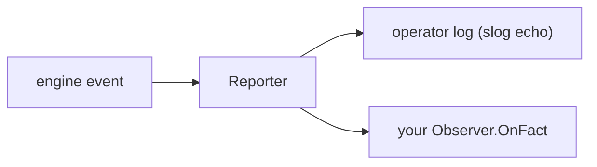

# Observability in practice

gobpm surfaces what the engine is doing through two channels: an **operator
log** (a structured `slog` echo of lifecycle milestones) and a **Fact stream**
you subscribe an `Observer` to. Both are fed by one producer — the engine's
`Reporter` — from a single event type, the `Fact`. This page subscribes an
observer, filters it down to the facts you care about, and tunes how noisy the
operator log is.

For the concept (what a Fact is, why one type, the masking rule) see
[Observability](../concepts/observability.md); the *why* behind the design is
[ADR-013](../../design/ADR-013-instance-observability.md). This page is the
operational how-to.

## The two channels

Every observable engine event — a lifecycle transition or a failure — is one
`observability.Fact`. The engine feeds each Fact to a single `Reporter`, which
does two things at once: it **echoes** loggable kinds to the operator log, and
it **fans** every Fact out to your registered observers.



Some kinds are **observer-only** — they never touch the operator log. The
`DataChange` and `DataObject` kinds are excluded by design (their per-write
volume would drown the log), so an observer is the *only* way to see them.

## Subscribing an observer

An `Observer` is one method. You register it on the engine (or on one instance
handle) and it starts receiving facts on a dedicated goroutine.

```go
type Observer interface {
    OnFact(Fact)
}
```

`OnFact` is called from a per-observer drain goroutine, **never** on the
engine's execution path — it may block or even panic (a panic is recovered)
without stalling the engine. `thresher.Observer` is a re-export of this type.

| Call | Returns | Scope |
|---|---|---|
| `engine.Observe(o Observer)` | `*thresher.Subscription` | engine-wide facts *plus* every instance's (each stamped with `AttrInstanceID`). |
| `handle.Observe(o Observer)` | `*thresher.Subscription` | only that one running instance's facts. |

The `Subscription` handle controls the registration:

| Method | Role |
|---|---|
| `Cancel()` | unregister; drains the buffered facts first (see the delivery note). |
| `Dropped() uint64` | how many facts were dropped because `OnFact` fell behind. |

## Build it

An observer filters to the kind it wants and ignores the rest — the stream
carries the full `Kind` vocabulary, so an early `return` is the idiom:

```go
type dataChangePrinter struct{}

func (p *dataChangePrinter) OnFact(f observability.Fact) {
    if f.Kind != observability.KindDataChange {
        return
    }

    fmt.Printf("  ▶ %s %s @%s\n",
        f.Phase, f.Details[observability.AttrDataPath], f.NodeName)
}
```

Register it on the engine and cancel when done:

```go
sub := engine.Observe(&dataChangePrinter{})
defer sub.Cancel()
```

## Run it

From [`examples/data-change/`](../../../examples/data-change/) — a two-task
process where `produce` commits `receipt={sum:5}` and `reprice` re-commits
`receipt={sum:6}`, so the commit-diff has a change to detect:

```bash
cd examples/data-change && go run .
```

The `INFO` lines are the operator log's default Info echo; the `▶` lines are the
observer:

```
INFO ProcessLifecycle Registered process_id=… version=1
INFO InstanceState Created instance_id=714542650197651618
INFO InstanceState Active instance_id=714542650197651618
  produce → commit receipt={sum:5}
  reprice → commit receipt={sum:6}
  ▶ Value_Added receipt @produce
  ▶ Value_Updated receipt.sum @reprice
INFO InstanceState Completed instance_id=714542650197651618
  ✓ completed (Completed)
```

The first commit is **one** `Value_Added` at the `receipt` root (a new subtree
is one change, not one per leaf); the re-commit is **one** `Value_Updated` at
the changed leaf `receipt.sum`.

> Fact delivery is buffered and lossy — a slow `OnFact` drops facts past its
> buffer rather than stalling the engine (`sub.Dropped()` counts them).
> `sub.Cancel()` drains the buffered facts first, so calling it *before* you
> print a final status guarantees the two `DataChange` lines land — as the
> example does.

## The Fact shape

`Fact` carries identity, phase, and timing only — never process payload values
(the masking rule):

```go
type Fact struct {
    At       time.Time
    Details  map[string]string
    Kind     Kind
    Phase    Phase
    NodeID   string
    NodeName string
}
```

- **`Kind`** classifies the event by object class; **`Phase`** names the
  transition within that kind. Both are open, additive vocabularies (named
  string types, not bare strings) — a consumer must tolerate unknown values.
- **`Details`** is keyed by the `Attr*` vocabulary, *not* free strings —
  `f.Details[observability.AttrDataPath]`, `AttrInstanceID`, and so on. The same
  keys serve the Details map and the slog echo, so the two channels correlate.

## Filtering by kind

Filtering is your job inside `OnFact`; there is no server-side kind filter. The
kinds you will reach for most:

| Kind | What it reports |
|---|---|
| `KindInstanceState` | instance lifecycle (Created / Active / **Dehydrated** / **Hydrated** / Completed / …). |
| `KindNodeProgress` | a track's node execution phase. |
| `KindDataChange` | a data-element change (**observer-only**). |
| `KindFault` | a BPMN error / fault. |
| `KindJobState` | external-worker job lifecycle. |

The full vocabulary, grouped by subsystem:

| Kind | Reports | Echoes to log |
|---|---|---|
| `KindEngineState` | Thresher lifecycle | yes |
| `KindHubState` | EventHub lifecycle | yes |
| `KindProcessLifecycle` | process registration | yes |
| `KindInstanceState` | instance lifecycle | yes |
| `KindNodeProgress` | a track's node execution phase | yes (Debug) |
| `KindGatewayDecision` | the chosen branch(es) | yes (Debug) |
| `KindEventFlow` | event registration / fire / delivery | yes (Debug) |
| `KindCorrelation` | conversation-key decisions | yes |
| `KindJobState` | external-worker job lifecycle | yes |
| `KindTaskState` | user-task lifecycle | yes |
| `KindBoundary` | boundary-event arm / fire / disarm | yes |
| `KindFault` | BPMN error / fault | yes |
| `KindEscalation` | escalation throw / catch | yes |
| `KindCompensation` | completion-ledger + compensation runs | yes |
| `KindRules` | decision evaluation on the rule engine | yes |
| `KindScript` | script execution on the script engine | yes |
| `KindScope` | nested-scope lifecycle | yes |
| `KindCall` | call-activity lifecycle | yes |
| `KindDataChange` | data-element change | **no (observer-only)** |
| `KindDataObject` | per-instance Data Object read / write | **no (observer-only)** |
| `KindDataStore` | engine-global Data Store read / write | yes |
| `KindAdHoc` | Ad-Hoc routing decisions — offered / activated / stopped | yes |

The common `Details` keys (there are more — worker, correlation, call-activity,
decision — see the `go doc` for the full set):

| Attr key | Present on |
|---|---|
| `AttrInstanceID` | every instance-scoped fact. |
| `AttrProcessID` / `AttrTrackID` | process registration / track progress. |
| `AttrNodeID` (also `Fact.NodeID`/`NodeName`) | any node-scoped fact. |
| `AttrDataPath` / `AttrScopePath` | `KindDataChange`. |
| `AttrJobID` / `AttrTopic` / `AttrAttempts` | `KindJobState`. |
| `AttrError` / `AttrEscalation` | `KindFault` / `KindEscalation`. |

## Tuning the operator log

The echo goes through a `*slog.Logger` (any type satisfying the leveled
`observability.Logger` subset — `Debug`/`Info`/`Warn`/`Error`). Each kind has a
fixed echo level — lifecycle milestones at Info, flow tracing (`NodeProgress`,
`GatewayDecision`, `EventFlow`) at Debug — so the handler level you give it sets
the verbosity:

```go
h := slog.NewTextHandler(os.Stderr, &slog.HandlerOptions{Level: slog.LevelWarn})
engine, _ := thresher.New("quiet-engine", thresher.WithLogger(slog.New(h)))
```

At `LevelWarn` the routine `INFO InstanceState …` lines disappear and only
warnings and failures (an uncaught fault, a job that exhausted its retries)
echo; raise the handler to `LevelDebug` to see node-by-node flow tracing.

Two orthogonal knobs and one guard:

| Option | Effect |
|---|---|
| `thresher.WithLogger(l)` | supply the echo logger. `nil` is **rejected** — it would silently erase the default `slog.Default()`; pass a real logger or omit the option. |
| `thresher.WithoutBanner()` | drop the startup ASCII banner. |
| `thresher.WithoutStartupConfig()` | drop the startup config dump. |

> Observer-only kinds never echo, at *any* level. `KindDataChange` and
> `KindDataObject` are excluded from the log by design; an observer is the only
> way to see them regardless of how you set the logger.

## See also

- Full example: [`examples/data-change/`](../../../examples/data-change/)
- Concept: [Observability](../concepts/observability.md) — facts, reporters, observers, the operator log.
- Related: [Running & observing](../getting-started/running-and-observing.md) · [Custom observability](../extending/observability.md) · [Structural data](../data/structural.md)
- Design: [ADR-013 — instance observability](../../design/ADR-013-instance-observability.md)
- Full API: `go doc github.com/dr-dobermann/gobpm/pkg/observability`
