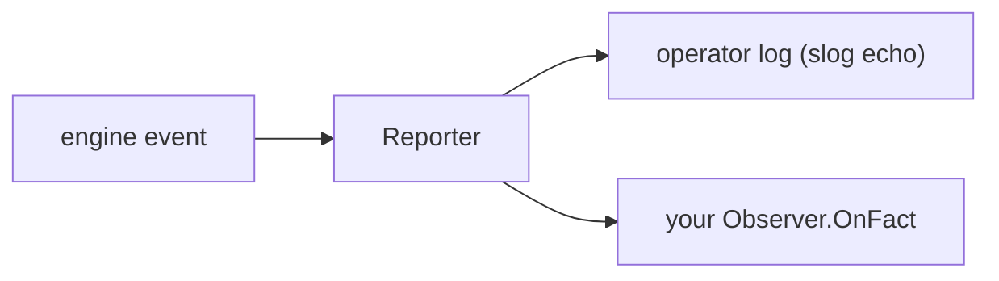

# Observability in practice

gobpm surfaces what the engine is doing through two channels: an **operator
log** (a structured `slog` echo of lifecycle milestones) and a **Fact stream**
you subscribe to with an `Observer`. This page wires an observer, filters it
down to the facts you care about, and tunes how noisy the operator log is. Full
program: [`examples/data-change/`](../../../examples/data-change/).

## What it is

Every observable engine event is one `Fact` — a lifecycle transition or a
failure, carrying a `Kind`, a `Phase`, the node it happened on, and a `Details`
map. The engine feeds each Fact to a single `Reporter`, which does two things at
once: it **echoes** loggable kinds to the operator log, and it **fans** every
Fact out to your registered observers.



Some kinds are **observer-only** — they never touch the operator log. The
`DataChange` fact this example watches is one of them (its per-write volume
would drown the log), so an observer is the *only* way to see it.

## Build it

An observer is one method, `OnFact`. Filter to the kind you want and ignore the
rest — the stream carries every kind:

```go
type dataChangePrinter struct{}

func (p *dataChangePrinter) OnFact(f observability.Fact) {
    if f.Kind != observability.KindDataChange {
        return
    }

    fmt.Printf("  ▶ %s %s @%s\n",
        f.Phase, f.Details[observability.AttrDataPath], f.NodeName)
}
```

Register it on the engine with `Observe`, and cancel the subscription when done:

```go
sub := engine.Observe(&dataChangePrinter{})
defer sub.Cancel()
```

The rest of the program builds a two-task process — `produce` commits
`receipt={sum:5}`, `reprice` re-commits `receipt={sum:6}` — so the commit-diff
has something to detect:

```go
return data.MustItemDefinition(
    values.MustRecord(values.F("sum", values.NewVariable(sum))),
    foundation.WithID("receipt")), nil
```

## Run it

```bash
cd examples/data-change && go run .
```

The `produce`/`reprice` commits print from the tasks; the `▶` lines are your
observer; the `INFO` lines are the operator log's default Info echo:

```
  produce → commit receipt={sum:5}
  reprice → commit receipt={sum:6}
INFO InstanceState Completed instance_id=8193976411489410581
  ▶ Value_Added receipt @produce
  ▶ Value_Updated receipt.sum @reprice
  ✓ completed (Completed)
```

The first commit is **one** `Value_Added` at the `receipt` root (a new subtree
is one change, not one per leaf); the re-commit is **one** `Value_Updated` at
the changed leaf `receipt.sum`.

> **Note:** Fact delivery is buffered and lossy — a slow `OnFact` drops facts
> past its buffer rather than stalling the engine (`sub.Dropped()` counts them).
> `sub.Cancel()` drains the buffered facts first, so calling it before you print
> a final status guarantees the two `DataChange` lines land.

## How it works

- **`engine.Observe`** returns a `Subscription`; the engine drains facts to your
  `OnFact` on a per-observer goroutine, never on the execution path. `OnFact`
  may block or panic without affecting the engine (a panic is recovered).
- **Filtering is your job in `OnFact`.** There is no server-side kind filter —
  the stream is the full `Kind` vocabulary (`KindInstanceState`,
  `KindNodeProgress`, `KindDataChange`, …). An early `return` on the kinds you
  don't want is the idiom.
- **`Details` is keyed by the `Attr*` vocabulary**, not free strings:
  `f.Details[observability.AttrDataPath]`, `AttrInstanceID`, `AttrNodeID`, and
  so on. `Fact` carries identity, phase, and timing only — never payload values
  (the masking rule).
- **Instance-scope observing** is symmetric: `handle.Observe(o)` on a running
  instance's handle receives only that instance's facts. `engine.Observe`
  receives engine-wide facts *plus* every instance's (each stamped with
  `AttrInstanceID`).

## Options & variations

**Tune the operator-log level.** The echo goes through a `*slog.Logger`. Each
kind has a fixed echo level — lifecycle milestones at Info, flow tracing
(`NodeProgress`, `GatewayDecision`, `EventFlow`, …) at Debug — so the log's
verbosity is set by the handler level you give it:

```go
h := slog.NewTextHandler(os.Stderr, &slog.HandlerOptions{Level: slog.LevelWarn})
engine, _ := thresher.New("quiet-engine", thresher.WithLogger(slog.New(h)))
```

At `LevelWarn` the routine `INFO InstanceState …` lines disappear and only
warnings and failures (an uncaught fault, a job that exhausted its retries) echo;
raise the handler to `LevelDebug` to see node-by-node flow tracing.

**Silence the startup blocks.** The example passes `thresher.WithoutBanner()`
and `thresher.WithoutStartupConfig()` to drop the ASCII banner and the config
dump — orthogonal to the log level.

**Observer-only kinds never echo, at any level.** `KindDataChange` and
`KindDataObject` are excluded from the log by design; an observer is the only
way to see them regardless of how you set the logger.

> **Warning:** `WithLogger(nil)` is rejected (it would silently erase the
> default `slog.Default()`). Pass a real logger or omit the option.

## See also

- Full example: [`examples/data-change/`](../../../examples/data-change/)
- Concept: [Observability](../concepts/observability.md) — facts, reporters, observers, the operator log.
- Related: [Running & observing](../getting-started/running-and-observing.md) · [Structural data](../data/structural.md)
