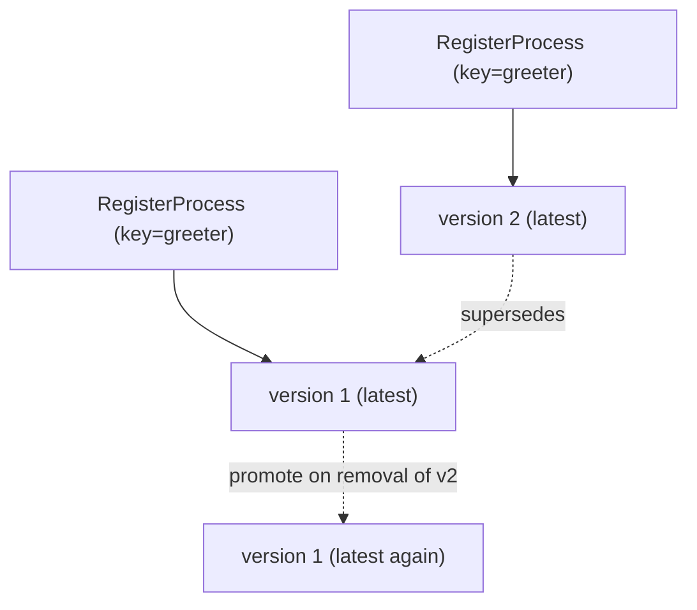

# Registering & versioning

Before a process can run you **register** it with the engine. Register the same
process **key** more than once and gobpm keeps every registration as a numbered
**version** of one definition — not as separate unrelated processes (ADR-019,
Camunda-style). You then start the newest version, pin an older one by number, or
run the exact version a registration handle names. This page is the developer
reference for the registration API on `Thresher` and the versioning behavior it
gives you.

## The key is the process id

The versioning **key** is a process's BPMN id (via `foundation.WithID`), *not*
its display name. Each call to `RegisterProcess` under that key mints the next
version number and becomes the new *latest*; earlier versions stay live and
startable. Two builds sharing one id are two versions of one definition; two
builds with different ids are two definitions.



## The registration API

Every call below is a method on `*thresher.Thresher`. The ones most processes
need:

| Call | Role |
|---|---|
| `RegisterProcess(p, opts…)` | register a definition; mints the next version, returns its receipt. |
| `StartLatest(key)` | start the newest registered version of a key. |
| `Registrations(key)` | list a key's live versions (ascending). |

The full set — registration, resolution, and teardown:

| Method | Signature | Effect |
|---|---|---|
| `RegisterProcess` | `RegisterProcess(p *process.Process, opts ...RegisterOption) (*ProcessRegistration, error)` | register `p`; a re-registered key mints a NEW version (not an idempotent no-op) and supersedes the prior latest. |
| `StartLatest` | `StartLatest(key string) (*InstanceHandle, error)` | start the highest version number of `key`. |
| `StartVersion` | `StartVersion(key string, version int) (*InstanceHandle, error)` | start a specific 1-based version, without holding its handle. |
| `StartProcess` | `StartProcess(reg *ProcessRegistration) (*InstanceHandle, error)` | start the exact version the receipt names — immune to later registrations (nil `reg` rejected). |
| `Registrations` | `Registrations(key string) []*ProcessRegistration` | live versions of a key, ascending by version (empty slice for an unknown key; may be gapped, e.g. `[1 3]`). |
| `UnregisterVersion` | `UnregisterVersion(reg *ProcessRegistration) error` | drop ONE version; removing the latest promotes the now-newest back to latest. |
| `UnregisterProcess` | `UnregisterProcess(key string) error` | drop the WHOLE key (every version) and reset its version counter to 1. |

`RegisterProcess` takes `RegisterOption`s; the only one today:

| Register option | Effect |
|---|---|
| `WithManualStart()` | register no persistent instance-starter — a message never spawns an instance; it starts only via `StartProcess`/`StartLatest`/`StartVersion`. An engine affordance (default is BPMN-conformant auto-instantiation); useful for tests and back-pressure. |

> Registration is not idempotent. Calling `RegisterProcess` again with the same
> id does **not** replace or refresh a version — it mints a fresh one. To roll a
> definition back, `UnregisterVersion` the latest rather than re-registering an
> older build.

## The registration receipt

`RegisterProcess` returns a `*ProcessRegistration` — a read-only receipt naming
the exact `(key, version)` it created. It exposes identity only, never the
engine-internal snapshot:

| Method | Returns |
|---|---|
| `ID()` | the process id (== the key). |
| `Key()` | the versioning key. |
| `Version()` | the version number this receipt names. |

Hold the receipt to address a *specific* release later with `StartProcess`,
regardless of what the latest happens to be — or pass it to `UnregisterVersion`.

## Register & start

Every build carries the **same id**, so successive registrations version one
definition. The example bakes a release label into each build so the console
shows which version ran:

```go
const processKey = "greeter"

func buildGreeter(label string) (*process.Process, error) {
    proc, err := process.New("greeter", foundation.WithID(processKey))
    // ... start → service task (prints label) → end, linked as usual
    return proc, nil
}
```

Register a build and read back the version the engine assigned:

```go
reg, err := engine.RegisterProcess(proc)   // reg is a *thresher.ProcessRegistration
fmt.Printf("registered %s → key=%q version=%d\n",
    label, reg.Key(), reg.Version())
```

Registering the same key twice yields `v1`, then `v2` — and there are three ways
to start a version:

```go
// Highest version number (the latest).
h, err := engine.StartLatest(processKey)

// Pin a specific version by number, without holding its handle.
h, err = engine.StartVersion(processKey, 1)

// The exact version a registration receipt names.
h, err = engine.StartProcess(v1)           // v1 is the *ProcessRegistration
```

Enumerate a key's live versions, then drop the latest to see promote-on-removal:

```go
regs := engine.Registrations(processKey)   // []*ProcessRegistration, one per live version

engine.UnregisterVersion(v2)               // removing latest promotes the next-newest
```

Each `Start*` call returns an `*InstanceHandle` — the read-only observation
window onto the new instance ([Starting instances](starting-instances.md)).

## Run it

Running [`examples/versioning/`](../../../examples/versioning/) (`cd
examples/versioning && go run .`) — after the startup banner (skipped here), the
console reports each registration and which version each start call actually ran:

```
  registered v1 → key="greeter" version=1
  registered v2 → key="greeter" version=2
      ▶ [v2] hello from the greeter
  StartLatest        → expects v2  [instance Completed]
      ▶ [v1] hello from the greeter
  StartVersion(key,1)→ expects v1  [instance Completed]
      ▶ [v1] hello from the greeter
  StartProcess(v1)   → expects v1  [instance Completed]
  registered versions of "greeter": [1 2]
  after UnregisterVersion(v2), versions: [1]
      ▶ [v1] hello from the greeter
  StartLatest        → expects v1 (promoted)  [instance Completed]

✓ versioning example completed
```

## Versioning behavior

The rules a developer must know:

- **Key = id.** The versioning key is the process id passed via
  `foundation.WithID`, not the display name.
- **Register bumps the version.** Each `RegisterProcess` under a known key gets
  the next number and becomes latest; the previous latest is *superseded* but
  stays live and startable by number or receipt. Only the latest version holds
  live instance-starters (latest-supersedes), so a message auto-instantiates the
  latest — a superseded version only finishes its already-running instances.
- **Three start modes** resolve a version at start time: `StartLatest` picks the
  highest number, `StartVersion(key, n)` pins `n`, and `StartProcess(reg)` runs
  the precise version the receipt named — immune to later registrations.
- **Promote on removal.** `UnregisterVersion` of the current latest promotes the
  now-newest remaining version back to latest and re-arms its starters — the
  mirror image of how a new registration supersedes the old one. Removing a
  non-latest version just drops it, leaving a gap (`Registrations` may return
  `[1 3]`). An effective rollback: unregister the latest and the previous version
  becomes latest for every subsequent `StartLatest`.
- **Running instances are unaffected** by unregistering their version — each
  keeps executing against its own frozen snapshot; stop everything via engine
  shutdown, not by unregistering.
- **`UnregisterProcess` is bulk.** It drops every version of a key and resets the
  counter, so a later registration of that key is `v1` again.

## See also

- Examples: [`examples/versioning/`](../../../examples/versioning/)
- Related guides: [Starting instances](starting-instances.md) · [Instance lifecycle](instance-lifecycle.md) · [The engine (Thresher)](../concepts/engine.md)
- Design: [ADR-019 — Definition versioning](../../design/ADR-019-definition-versioning.md)
- Full API: `go doc github.com/dr-dobermann/gobpm/pkg/thresher`
