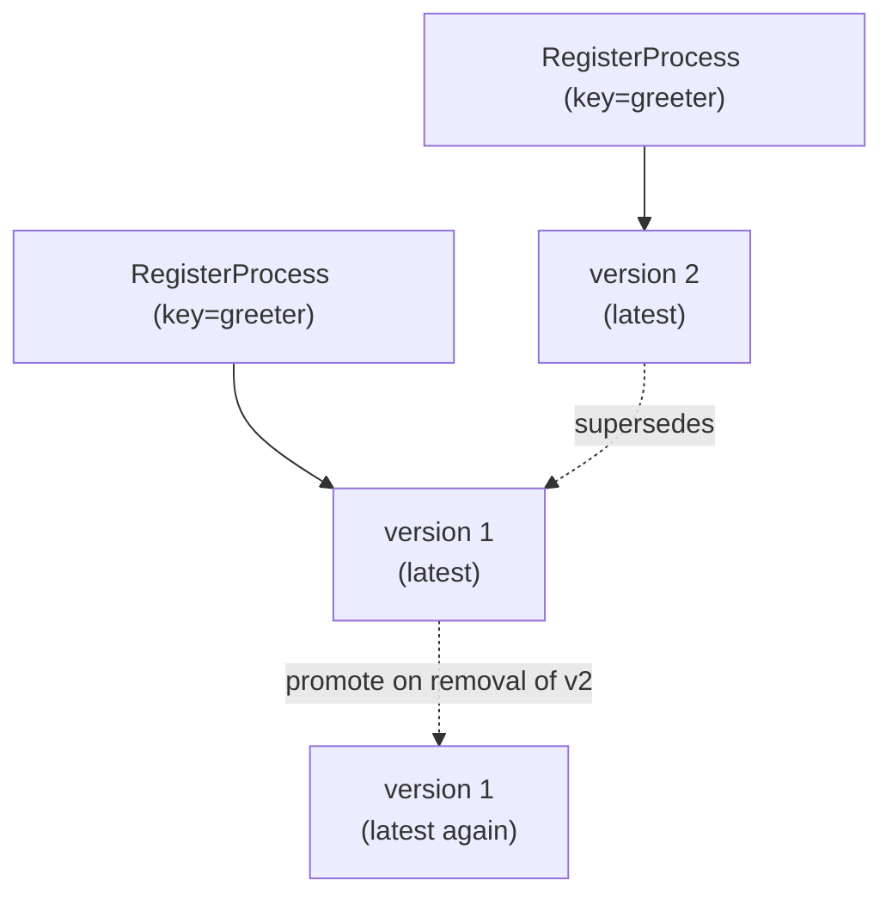

# Definition versioning

Register the same process **key** more than once and gobpm keeps every
registration as a numbered **version** of one definition — not as separate
unrelated processes. You then start the newest version, pin an older one, or run
the exact version a handle names. Full program:
[`examples/versioning/`](../../../examples/versioning/).

## What it is

The **key** is a process's BPMN id (not its display name). Each call to
`RegisterProcess` under that key gets the next version number and becomes the new
*latest*; earlier versions stay live and startable. `RegisterProcess` returns a
`ProcessRegistration` handle that names the exact `(key, version)` it created.



## Build it

Every build carries the **same id**, so successive registrations version one
definition. The example bakes a release label into each build so the console
shows which version ran:

```go
const processKey = "greeter"

func buildGreeter(label string) (*process.Process, error) {
    proc, err := process.New("greeter", foundation.WithID(processKey))
    // ... start → service task (prints label) → end, linked as usual
    return proc, nil
}
```

Register a build and read back the version the engine assigned:

```go
reg, err := engine.RegisterProcess(proc)   // reg is a *ProcessRegistration
fmt.Printf("registered %s → key=%q version=%d\n",
    label, reg.Key(), reg.Version())
```

Registering the same key twice yields `v1`, then `v2` — and there are three ways
to start a version:

```go
// Highest version number (the latest).
h, err := engine.StartLatest(processKey)

// Pin a specific version by number, without holding its handle.
h, err = engine.StartVersion(processKey, 1)

// The exact version a registration handle names.
h, err = engine.StartProcess(v1)           // v1 is the *ProcessRegistration
```

Enumerate a key's live versions, and drop the latest to see promote-on-removal:

```go
regs := engine.Registrations(processKey)   // []*ProcessRegistration, one per live version

engine.UnregisterVersion(v2)               // removing latest promotes the next-newest
```

## Run it

```bash
cd examples/versioning && go run .
```

After the engine's startup banner (skipped here), the console reports each
registration and which version each start call actually ran:

```
  registered v1 → key="greeter" version=1
  registered v2 → key="greeter" version=2
      ▶ [v2] hello from the greeter
  StartLatest        → expects v2  [instance Completed]
      ▶ [v1] hello from the greeter
  StartVersion(key,1)→ expects v1  [instance Completed]
      ▶ [v1] hello from the greeter
  StartProcess(v1)   → expects v1  [instance Completed]
  registered versions of "greeter": [1 2]
  after UnregisterVersion(v2), versions: [1]
      ▶ [v1] hello from the greeter
  StartLatest        → expects v1 (promoted)  [instance Completed]

✓ versioning example completed
```

## How it works

- **Key = id.** The versioning key is the process id passed via
  `foundation.WithID`, not the display name. Two builds with the same id become
  two versions of one definition; two builds with different ids are two
  definitions.
- **Register bumps the version.** Each `RegisterProcess` under a known key gets
  the next number and becomes latest; the previous latest is *superseded* but
  stays live and startable by number or handle.
- **Three start modes** resolve a version at start time: `StartLatest` picks the
  highest number, `StartVersion(key, n)` pins `n`, and `StartProcess(reg)` runs
  the precise version the handle named — immune to later registrations.
- **Promote on removal.** `UnregisterVersion` of the current latest promotes the
  now-newest remaining version back to latest, the mirror image of how a new
  registration supersedes the old one. Removing a non-latest version just drops
  it; `Registrations(key)` reflects the shrunk set.

> **Note:** A registration handle is stable — `StartProcess(v1)` keeps running v1
> even after v2 (and later v3, …) register. Reach for it when a caller must run a
> *specific* release regardless of what the latest happens to be.

## Options & variations

- **Pin without a handle.** If you did not keep the `ProcessRegistration`, use
  `StartVersion(key, n)` — same effect as `StartProcess(reg)` for that version.
- **Introspect the registry.** `Registrations(key)` returns one handle per live
  version; read `.Version()` off each to list them, or `.Key()` to confirm the
  id.
- **Rollback by unregister.** Unregistering the latest is an effective rollback:
  the previous version becomes latest again for every subsequent `StartLatest`.

## See also

- Full example: [`examples/versioning/`](../../../examples/versioning/)
- Related: [The engine (Thresher)](../concepts/engine.md) · [Your first process](../getting-started/first-process.md) · [Running & observing](../getting-started/running-and-observing.md)
