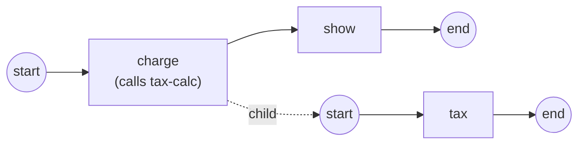

# Call Activity

A **Call Activity** invokes a *separately registered* process as its own child
instance — the reuse boundary. One callee, many callers, each call an isolated
run. Reach for it when a fragment (tax calculation, credit check, notification)
is worth registering once and reusing from several processes. Full program:
[`examples/call-activity/`](../../../examples/call-activity/).

## What it is

Where an [embedded Sub-Process](embedded.md) runs a nested scope *inside* the
same instance, a Call Activity launches a wholly separate instance of another
registered process. The two sides meet only through the declared **Input** and
**Output** parameters — everything else is isolated.



The caller `checkout` seeds `subtotal`; the call crosses it into the `tax-calc`
child, which computes `total` and hands it back.

## Build it

The callee is an ordinary process, registered on its own by key. Nothing in it
knows it will be called:

```go
p, err := process.New("tax-calc", foundation.WithID(calcKey))
// … start → tax(reads "subtotal", writes "total") → end
```

The caller adds a Call Activity naming the callee's key, plus the **Input** and
**Output** parameters — the call contract. The parameter *name* is what crosses
the boundary:

```go
call, err := activities.NewCallActivity("charge", calcKey,
    activities.WithParameters(data.Input, param("subtotal")),
    activities.WithParameters(data.Output, param("total")))
```

Register both processes with the engine, then start the caller:

```go
engine.RegisterProcess(callee)   // "tax-calc" — the reusable child
engine.RegisterProcess(caller)   // "checkout" — invokes it
h, _ := engine.StartLatest(caller.ID())
state, _ := h.WaitCompletion(ctx)
```

> **Note:** the registry is not consulted when you build the Call Activity —
> resolution happens at call time. The callee may be registered later or
> re-versioned; only the key has to match when the call actually runs.

## Run it

```bash
cd examples/call-activity && go run .
```

```
  ▶ call charge: Started (tax-calc v.1 → instance 8056749551989599146)
    (child) subtotal=100 → total=120
  ✓ caller sees total=120
  ▶ call charge: Completed (tax-calc v.1 → instance 8056749551989599146)
  ✓ completed (Completed)
```

## How it works

When the caller's token reaches the Call Activity:

- the token **parks** and the engine launches the callee through its registry —
  **latest-at-launch** by default, or the version pinned with
  `WithCalledVersion`;
- the declared **Input** parameters are resolved by name at the caller's scope
  and **cloned across the boundary** — the child runs on an isolated data plane,
  with no walk-up to the caller (this is the isolation contract, unlike the
  embedded Sub-Process);
- when the child completes, its declared **Output** parameters are read by name
  from the child's root and **committed back** into the caller's scope, and the
  caller resumes onto its outgoing flows.

Because the data plane is isolated, the child cannot see the caller's other
properties — only what you declare as Input crosses in, and only what you
declare as Output crosses back.

## Options & variations

**Pin a version.** By default the call binds the newest registered version at
launch. Pin an exact version to make the call reproducible across later
re-registrations:

```go
call, _ := activities.NewCallActivity("charge", "tax-calc",
    activities.WithCalledVersion(2),
    activities.WithParameters(data.Input, param("subtotal")),
    activities.WithParameters(data.Output, param("total")))
```

**Errors cross the boundary.** A child `BpmnError` faults the caller *at the
Call Activity node*, where an [Error boundary](../events/boundary.md) can catch
it per the scope-chain rules; uncaught, the instance faults. The child
**terminates with the caller** — the cancel cascade fires when the caller track
ends, its scope is canceled, or the instance terminates.

**Trace both sides.** `Call` facts carry `Started` / `Completed` / `Failed` /
`Terminated` phases with the called key, the *resolved* version, and the child
instance id; every fact the child emits carries `parent_instance_id` and
`call_activity_node_id`, stitching the trace across the boundary. The example's
`observer.go` prints one line per `Call` fact.

## See also

- Full example: [`examples/call-activity/`](../../../examples/call-activity/)
- Related: [Embedded Sub-Process](embedded.md) · [Definition versioning](../operating/versioning.md) · [Error events](../events/error.md)
