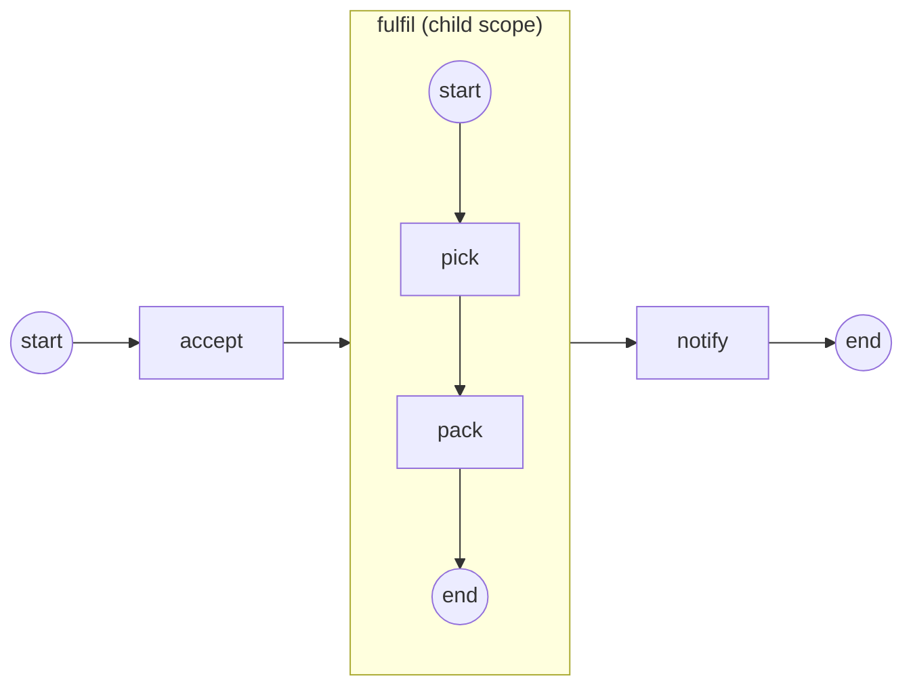

# Embedded Sub-Process

An **embedded Sub-Process** groups a fragment of your flow into a single
activity that is *also* a container of its own inner graph. You reach for it
when a stretch of work belongs together — a fulfillment fragment, a validation
block — and you want it to enter, run, and drain as one node, with its own
data scope. Full program:
[`examples/embedded-subprocess/`](../../../examples/embedded-subprocess/).

## What it is

The sub-process is an ordinary activity in its parent's graph: a token enters
it like any other node. But entering it **opens a child scope** that runs the
inner graph, and the parent's token **parks** until that scope drains. Inner
tasks read the parent's data through a walk-up; their own commits stay local to
the scope and are disposed when it closes.



## Build it

Create the sub-process, build its inner nodes, and `Add` each one **into** the
sub-process (not the parent). The inner graph needs its own None Start Event:

```go
fulfil, _ := activities.NewSubProcess("fulfil")

fStart, _ := events.NewStartEvent("f-start")   // exactly one None start
pick, _ := step("pick", "picked", 1)
pack, _ := step("pack", "", 0)
fEnd, _ := events.NewEndEvent("f-end")

for _, e := range []flow.Element{fStart, pick, pack, fEnd} {
    fulfil.Add(e)
}
```

The sub-process itself is added to the **parent** and linked like any activity —
one flow enters it, one continues when it drains:

```go
proc.Add(fulfil)                 // an activity in the parent's graph
flow.Link(accept, fulfil)        // enters like any activity
flow.Link(fulfil, notify)        // continues when the scope drains
```

Inner links stay inside the fragment (`fStart → pick → pack → fEnd`); a flow
must never cross the sub-process boundary. The inner tasks reach the parent's
`order-id` property by name — no extra wiring:

```go
op, _ := gooper.New(name,
    func(_ context.Context, ds service.DataReader,
        _ *data.ItemDefinition) (*data.ItemDefinition, error) {
        d, _ := ds.GetData("order-id")   // the parent's property, via walk-up
        fmt.Printf("  %s (sees order-id=%v)\n",
            name, d.Value().Get(context.Background()))
        return nil, nil
    })
```

## Run it

```bash
cd examples/embedded-subprocess && go run .
```

The parent runs `accept`, the fragment opens its scope and runs `pick`/`pack`,
the scope completes, and the parent resumes onto `notify`:

```
  accept (sees order-id=4711)
  pick (sees order-id=4711)
  ▶ scope fulfil: Opened (/embedded-subprocess/sp-5111508439227514026)
  pack (sees order-id=4711)
  ▶ scope fulfil: Completed (/embedded-subprocess/sp-5111508439227514026)
  notify (sees order-id=4711)
  ✓ completed (Completed)
```

## How it works

- **Enter and park.** When the host token reaches the sub-process, a child
  scope opens (path `/embedded-subprocess/sp-…`) and the inner flow seeds from
  its None Start Event (BPMN §13.3.4). The host token parks on the node.
- **Drain, then resume.** The scope **completes when no tokens remain inside**;
  only then does the host resume onto its outgoing flow. That is why `notify`
  always prints after both inner tasks.
- **Data walk-up.** Inner nodes read the parent's data through the container
  walk-up (§10.5.7) — `pick` and `pack` both see `order-id=4711`. A task's own
  commit (here `pick` writes `picked`) lands in the **child** scope and is
  **disposed at close**; the parent never sees it.
- **Nesting is a tree.** Scopes nest without bound; a sub-process inside a
  sub-process just deepens the path (`/proc/sp-a/sp-b`).

The scope lifecycle is observable: subscribe an observer and watch for
`KindScope` facts, whose `Phase` moves `Opened → Completed` and whose details
carry the scope path.

```go
func (p *scopePrinter) OnFact(f observability.Fact) {
    if f.Kind != observability.KindScope {
        return
    }
    fmt.Printf("  ▶ scope %s: %s (%s)\n",
        f.NodeName, f.Phase, f.Details[observability.AttrScopePath])
}
```

## Options and variations

- **No start event.** A sub-process may declare **no** start event instead of
  exactly one None start; then every flow-less inner activity/gateway is seeded
  with a token directly. Triggered starts, multiple starts, mixed shapes, an
  empty body, or flows crossing the boundary are all rejected at registration.
- **Interruption is scope-wide.** The scope dies as a unit. An interrupting
  **boundary event** on the sub-process cancels every inner track and routes
  its exception flow; a **Terminate End Event** inside discards only *this*
  scope's tokens and lets the parent continue; an **error** escaping an inner
  activity walks the scope chain to the innermost enclosing catcher.
- **Reuse across processes.** When the fragment is a whole reusable process with
  its own isolated data, use a **Call Activity** instead — see below.

## See also

- Full example: [`examples/embedded-subprocess/`](../../../examples/embedded-subprocess/)
- Next: [Call Activity](call-activity.md) — invoke a separately registered process as a child instance.
- Related: [Process, instance, track, token](../concepts/execution-model.md) · [Your first process](../getting-started/first-process.md)
