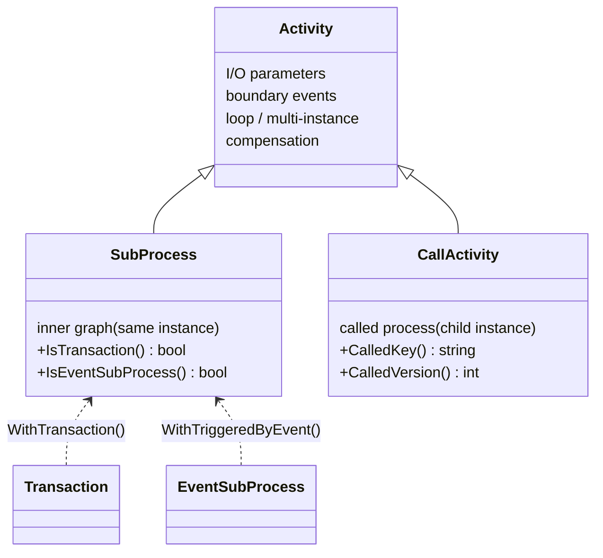

# Sub-processes & reuse

Composition keeps a large process readable: fold a stretch of work into one
node, invoke a whole process by reference, or wrap a fragment so a failure
abandons it cleanly. gobpm offers three composition activities, all in
`github.com/dr-dobermann/gobpm/pkg/model/activities`. They split on one axis —
whether the inner work runs **in the same instance's scope tree** or as a
**separate child instance**:

- an **embedded Sub-Process** opens a child *scope* inside the running instance
  and runs an inner graph you build in place;
- a **Transaction Sub-Process** is that same scope with ACID-like abort — a
  Cancel inside compensates completed work and unwinds it;
- a **Call Activity** parks the caller's token and runs a *separately
  registered* process as its own isolated child instance.

This is the family map — the class tree, every member with its role and page,
and the attributes and options they share. Each member has its own reference
page linked below.

## The family



`SubProcess` and `CallActivity` are the two concrete types. **Transaction** and
**Event Sub-Process** are not separate types — they are a plain `SubProcess`
tagged by a construction option (`WithTransaction` / `WithTriggeredByEvent`),
reported at runtime by `IsTransaction()` / `IsEventSubProcess()`.

## Members

Most composition is one of the first two rows; reach past them only when you
need transactional abort or event-triggered handling.

| Type | Role | Page |
|---|---|---|
| `SubProcess` | a nested scope in the **same instance**: an activity that also contains its own inner graph, entered by a token and drained as a unit. | [Embedded Sub-Process](embedded.md) |
| `CallActivity` | invoke a **separately registered** process as an isolated **child instance**; the caller's token parks until it finishes. | [Call Activity](call-activity.md) |
| `SubProcess` + `WithTransaction()` | the embedded scope with **ACID-like abort**: a Cancel End Event inside compensates completed work and leaves through the Cancel boundary. | [Transaction Sub-Process](transaction.md) |
| `SubProcess` + `WithTriggeredByEvent()` | an **Event Sub-Process**: a scope-armed handler entered only when its single triggered Start Event fires — not by a sequence flow. | [Event sub-processes](../events/event-subprocess.md) |

Where these sit in the wider activity family (Tasks, Sub-Process, Call
Activity): [Activities taxonomy](../tasks/index.md).

## Constructors

```go
func NewSubProcess(name string, opts ...options.Option) (*SubProcess, error)
func NewCallActivity(name, calledKey string, opts ...options.Option) (*CallActivity, error)
```

| Parameter | Meaning |
|---|---|
| `name` | the activity's diagram name (and default id source). |
| `calledKey` | (Call Activity) the registry key of the callable process; resolved at call time to latest-at-launch, or the version pinned by `WithCalledVersion`. |
| `opts` | zero or more options (below). |

Both return an error — never panic — on an invalid combination (e.g. a
mutually-exclusive marker pair, or a bad option value).

> A `SubProcess`'s inner elements are added like a process's: `Add` each inner
> node into the sub-process, then `flow.Link` them **within** the container.
> A flow must never cross the sub-process boundary. A `CallActivity` has no
> inner graph to build — its body is the called process.

## Shared attributes

Both types embed the same `Activity` base and carry its attributes and
associations:

| Attribute | Method(s) | Notes |
|---|---|---|
| I/O parameters | `Properties()`; Call Activity also `CallInputs()` / `CallOutputs()` | the Call Activity's declared inputs/outputs are its call contract (BPMN §10.4 direct mapping by name). |
| Boundary events | `AddBoundaryEvent(be)` / `BoundaryEvents()` | attach interrupting/non-interrupting boundary events — see [Boundary events](../events/boundary.md). |
| Loop / multi-instance | `LoopCharacteristics()` (set via `WithLoop` / `WithMultyInstance`) | repeat the whole composition — see [Standard Loop](../iteration/standard-loop.md), [Multi-Instance](../iteration/multi-instance.md). |
| Compensation | `ForCompensation()` (set via `WithCompensation`) | mark the activity a compensation handler, armed off the normal flow. |
| Introspection | `ActivityType()`, `NodeType()`, `Node()` | the activity's BPMN kind and its node identity. |
| Default flow | `DefaultFlow()` / `SetDefaultFlow(id)` | the unconditional outgoing flow when the activity has conditional splits. |

The engine drives both through `Exec(ctx, re) ([]*flow.SequenceFlow, error)` —
you rarely call it directly. A `SubProcess` additionally exposes container
methods (`Add`, `Remove`, `DataObjects`, `DataStoreReferences`) and the runtime
predicates `IsTransaction()` / `IsEventSubProcess()`; a `CallActivity` exposes
`CalledKey()` / `CalledVersion()` and the resolved call parameters
(`CallInputs()` / `CallOutputs()`).

## Options

Two members take construction-time options; both option types satisfy
`options.Option` (each has an `Option()` marker method), so you pass them
straight to the constructor.

Sub-Process markers (`SubProcessOption`) — mutually exclusive; a plain embedded
Sub-Process needs neither:

| Option | Effect |
|---|---|
| `WithTransaction()` | mark the scope a Transaction Sub-Process (BPMN §10.7): only Cancel End/boundary is permitted, and reaching a Cancel inside triggers the ACID-like abort. |
| `WithTriggeredByEvent()` | mark the scope an Event Sub-Process (BPMN §13.5.4): a scope-armed handler entered by its single triggered Start Event, not by a flow. |

Call-Activity option (`CallActivityOption`):

| Option | Effect |
|---|---|
| `WithCalledVersion(v int)` | pin the call to an exact registered version (1-based, per definition versioning). Without it the call binds the newest version registered at the moment it executes. |

Both types also accept the shared **activity options** (`ActivityOption`) from
the base — the same `WithParameters` / `WithoutParams` / `WithCompensation` /
`WithLoop` / `WithMultyInstance` / `WithStartQuantity` /
`WithCompletionQuantity` documented on the
[Activities taxonomy](../tasks/index.md#shared-activity-options).

A minimal Transaction Sub-Process is just the marker on a normal sub-process:

```go
sp, _ := activities.NewSubProcess("charge", activities.WithTransaction())
// build its inner graph; a Cancel End Event inside aborts the scope.
```

## See also

- Members: [Embedded Sub-Process](embedded.md) · [Call Activity](call-activity.md) · [Transaction Sub-Process](transaction.md) · [Event sub-processes](../events/event-subprocess.md)
- Related: [Activities taxonomy](../tasks/index.md) · [Boundary events](../events/boundary.md) · [Registering & versioning](../operating/registering-and-versioning.md)
- Design: [ADR-023 — Sub-Process & Call Activity](../../design/ADR-023-sub-process-and-call-activity.md) · [ADR-028 — Transaction Sub-Process](../../design/ADR-028-transaction-sub-process.md)
- Full API: `go doc github.com/dr-dobermann/gobpm/pkg/model/activities`
</content>
</invoke>
