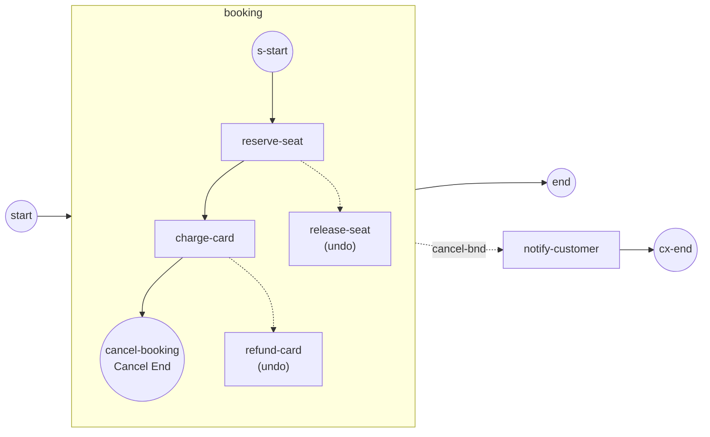

# Transaction Sub-Process

A **Transaction Sub-Process** is a nested scope that runs as an all-or-nothing
unit: if it reaches a **Cancel End Event**, the engine undoes the work that
already completed and leaves through a **Cancel boundary** instead of the normal
exit. Reach for it when a group of steps must either all stick or be rolled back
together — a booking, a payment, an order. Full program:
[`examples/transaction-sub-process/`](../../../examples/transaction-sub-process/).

## What it is

An ordinary Sub-Process built with `activities.WithTransaction()`. Its steps run
in order; each completed step enters the scope's **completion ledger**, guarded
by a **Compensation boundary** wired to an undo handler. A **Cancel End Event**
(legal only inside a Transaction) aborts the scope: it compensates the ledger in
**reverse completion order**, terminates anything still running, then hands
control to the interrupting **Cancel boundary** on the outside.



## Build it

The scope is a Sub-Process flagged as a Transaction. Its steps are linked in a
line ending at a **Cancel End Event**:

```go
tx, _ := activities.NewSubProcess("booking", activities.WithTransaction())

sStart, _ := events.NewStartEvent("s-start")
reserve, _ := stepTask("reserve-seat", "  ✓ seat reserved")
charge, _ := stepTask("charge-card", "  ✓ card charged")

cancEd, _ := events.NewCancelEventDefinition()
cancelBooking, _ := events.NewEndEvent("cancel-booking",
    events.WithCancelTrigger(cancEd))
```

Each undo handler is a task marked `activities.WithCompensation()` — it sits
**outside** the normal flow and runs only when the abort sweeps the ledger:

```go
st, _ := activities.NewServiceTask(name, op,
    activities.WithoutParams(), activities.WithCompensation())
```

A **Compensation boundary** links a step (the host) to its undo handler, making
the host's completed work compensable:

```go
ced, _ := events.NewCompensationEventDefinition(nil, true)
be, _ := events.NewCompensationBoundaryEvent(name, host, ced, handler)
```

Outside the Transaction, an **interrupting Cancel boundary** catches the abort
and routes to the recovery path:

```go
cbEd, _ := events.NewCancelEventDefinition()
cancelBnd, _ := events.NewBoundaryEvent("cancel-bnd", tx, cbEd, true) // interrupting
// start → tx → end ; cancelBnd → notify-customer → cx-end
```

## Run it

```bash
cd examples/transaction-sub-process && go run .
```

The two steps run, the Cancel End aborts, the undo handlers fire in reverse
order, and control leaves through the Cancel boundary:

```
  ✓ seat reserved
  ✓ card charged
  ↩ card refunded
  ↩ seat released
  ✉ customer notified: booking canceled

✓ transaction-sub-process completed (Completed): the Cancel End compensated the booking in reverse order and control left through the Cancel boundary
```

Note `refund-card` (undo for `charge-card`) runs **before** `release-seat`
(undo for `reserve-seat`) — reverse of the order they completed in.

## How it works

Reaching the Cancel End Event aborts the Transaction in a fixed order:

1. **compensate** the completed activities — scope-wide, in **reverse completion
   order**, so `refund-card` runs before `release-seat`;
2. **terminate** any activities still running in the scope;
3. **leave** through the interrupting Cancel boundary onto the recovery path.

The order is load-bearing: compensation runs **before** the scope teardown,
because the teardown discards the very ledger the compensation sweeps. In the
run above this shows as the `Scope Canceled` log line appearing *after* both
undo handlers print.

- A **Cancel End Event** performs no other end-event behavior — it wins the
  race like Terminate, and is legal only inside a Transaction (validated at
  registration).
- The **Cancel boundary** is a model-declared exit, always interrupting. It is
  resolved by the abort directly, never routed through the event bus.
- Compensation handlers must be marked `WithCompensation()`; unmarked tasks are
  ordinary flow nodes and are never swept by the abort.

> **Note:** A Cancel End Event outside a Transaction Sub-Process is rejected at
> `RegisterProcess`. The Cancel trigger only has meaning as a Transaction abort.

## Options & variations

- **A Transaction that completes normally** ends at an ordinary End Event; the
  ledger is committed and no compensation runs. Only the Cancel path rolls back.
- **`WithCompensation()`** is what makes a task an undo handler; leave it off and
  the task is a normal step in the flow.
- The **Cancel boundary** must be interrupting (`true`) — a Transaction abort
  always tears the scope down, so a non-interrupting Cancel boundary is not
  meaningful.
- Compensation and the Cancel boundary are independent knobs: a Transaction can
  declare compensation handlers without an outer Cancel boundary (the abort then
  just compensates and ends), or a Cancel boundary without handlers (abort with
  nothing to undo).

## See also

- Full example: [`examples/transaction-sub-process/`](../../../examples/transaction-sub-process/)
- Related: [Terminate](../events/terminate.md) — the other "wins immediately" end trigger · [Error](../events/error.md) — throw/catch and error boundaries · [Your first process](../getting-started/first-process.md) — the base start → task → end wiring
