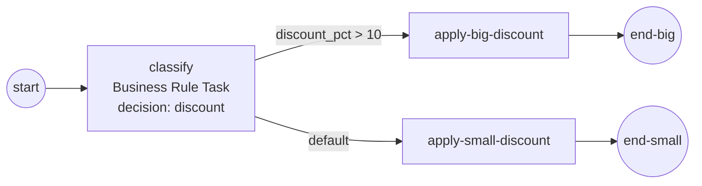

# Business Rule Task

A **Business Rule Task** hands a named decision to a pluggable rule engine,
takes back one result, and commits it to process data — so a downstream
condition or task can read the answer with zero ceremony. Reach for it when a
"which rate / which tier / which route" choice belongs in a rules artifact, not
scattered across `if`-branches. Full example:
[`examples/business-rule-task/`](../../../examples/business-rule-task/).

## What it is

One flow node that names a **decision** (`"discount"`) on the engine's
configured **rule engine**. The engine evaluates that decision against process
data and yields a result row; the task folds a single-row / single-output
result into a scalar process variable. Here the committed `discount_pct` then
drives an exclusive split.



## Build it

The task itself is one line — a name and the decision reference. It carries no
inline logic:

```go
classify, err := activities.NewBusinessRuleTask("classify", "discount")
```

The decision lives on the **rule engine**. The batteries-included choice is the
`gorules` registry: register the decision by name as a plain Go function that
reads process data and returns one `rules.Row`:

```go
reg := gorules.New()

err := reg.Register("discount",
    func(ctx context.Context, r service.DataReader) (rules.Row, error) {
        d, err := r.GetData("total")
        if err != nil {
            return nil, err
        }
        total, _ := d.Value().Get(ctx).(int)

        pct := 5
        if total > 100 {
            pct = 15
        }
        return rules.Row{"discount_pct": values.NewVariable(pct)}, nil
    })
```

Plug the engine into the Thresher and wire the flows. The condition reads the
committed `discount_pct` like any other property:

```go
engine, _ := thresher.New("business-rule-task-engine",
    thresher.WithRuleEngine(reg))

flow.Link(start, classify)
flow.Link(classify, big, flow.WithCondition(cond)) // discount_pct > 10
sf, _ := flow.Link(classify, small)
classify.SetDefaultFlow(sf.ID())                   // fallback lane
```

## Run it

```bash
cd examples/business-rule-task && go run .
```

The decision fires once, commits `discount_pct=15` for the 250 order, and the
conditional flow routes to the big-discount lane:

```
  [decision discount] total=250 -> discount_pct=15
  [apply-big-discount] wholesale rate applied

✓ business-rule-task completed (Completed): the pluggable rule engine (##GoRules) evaluated "discount" for a 250 order, the task committed discount_pct=15, and the conditional flow routed to apply-big-discount
```

## How it works

The task is a thin caller over a **pluggable rule-engine seam** — the model
element never knows which engine is behind it.

- **Lookup by name.** `NewBusinessRuleTask(name, decision)` binds only the
  decision *reference*. At run time the task asks the configured rule engine to
  evaluate that reference against the instance's data.
- **1-row / 1-output fold.** When the decision yields exactly one row with one
  output, the task commits it as a **scalar** process variable named by that
  output key (`discount_pct`). No output mapping to declare.
- **Data by name.** The decision reads inputs (`total`) through the ordinary
  process-data walk-up, and the committed result is readable the same way — so
  a `goexpr` condition on the outgoing flow can compare `discount_pct > 10`
  directly.
- **Fails loud.** An unknown decision reference surfaces a classified error
  through the normal fault machinery, not a silent no-op. Every evaluation also
  emits a `Rules` observability fact carrying the decision reference, the engine
  kind, and the result shape.

> **Note:** Run `data.CreateDefaultStates()` once before building
> data-carrying elements — it registers the standard data states the properties
> and committed result rely on.

## Options & variations

- **Swap the engine, keep the model.** The same
  `NewBusinessRuleTask("classify", "discount")` runs on any engine passed to
  `thresher.WithRuleEngine(...)`. Move from the in-core `gorules` registry to a
  JSON **decision table** (`adapters/dtable`) — or a future DMN adapter —
  without touching the process.
- **Decision tables (structure as data).** The `decision-table` example deploys
  a JSON grid where **structure is data** and **behavior stays compiled Go**:
  the rules reference conditions and yields registered by name in a
  `Vocabulary`.

  ```go
  vocab := dtable.NewVocabulary()
  vocab.AddCondition("vip", dtable.Eq("tier", "vip"))
  vocab.AddCondition("big-order", dtable.GT("total", 100))
  vocab.AddYield("default-discount", func(context.Context, service.DataReader) (rules.Row, error) {
      return rules.Row{"discount_pct": values.NewVariable(float64(5))}, nil
  })

  dec, _ := dtable.NewJSONDecoder(vocab)
  engine, _ := dtable.New(dtable.WithDecoder(dec))
  engine.Deploy(context.Background(), tableJSON)
  ```

  The embedded artifact carries only the rule grid, the **FIRST** hit policy,
  and the names; re-ordering rules or moving a threshold is a redeploy, and an
  unresolved name fails the deploy loud.

## See also

- Full example: [`examples/business-rule-task/`](../../../examples/business-rule-task/)
- Decision table adapter: [`examples/decision-table/`](../../../examples/decision-table/)
- Related: [Script Task](script-task.md) · [Exclusive (XOR) gateway](../gateways/exclusive.md) · [Expressions](../data/expressions.md)
