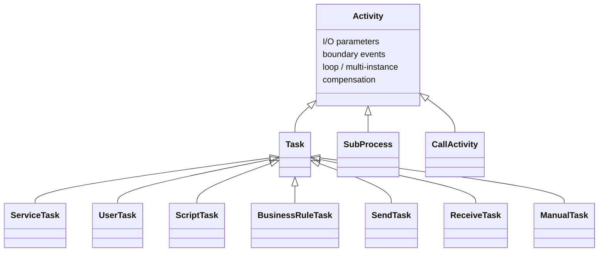

# Activities

An **activity** is a unit of work in a process: the engine activates it, runs
its behavior, and moves the token on. Every member of the family lives in
`github.com/dr-dobermann/gobpm/pkg/model/activities` and is either a **Task**
(an atomic step — your Go code, a human step, a script, a rule table, a
message), a **Sub-Process** (a container of its own inner graph), or a **Call
Activity** (a reference to a separately registered process). They all share the
same base — the `Activity` attributes and associations: I/O parameters,
boundary events, loop/multi-instance characteristics, and compensation — so the
shared options below apply to any of them. This page is the family map; each
member has its own reference page.

## The family



The three branches map to the `flow.ActivityType` a member reports from
`ActivityType()`:

| `flow.ActivityType` | Members |
|---|---|
| `TaskActivity` (`"Task"`) | Service, User, Script, Business Rule, Send, Receive, Manual |
| `SubProcessActivity` (`"SubProcess"`) | `SubProcess` (embedded, event, transaction) |
| `CallActivity` (`"CallActivity"`) | `CallActivity` |

## Most-used members

The steps most processes reach for first:

| Type | Role | Page |
|---|---|---|
| `ServiceTask` | run your own Go code — in-process or dispatched to a worker. | [Service Task](service-task.md) |
| `UserTask` | a human step: assign, list, claim, complete. | [User Task](user-task.md) |
| `SubProcess` | group inner flow as one collapsible step. | [Embedded Sub-Process](../subprocesses/embedded.md) |
| `CallActivity` | invoke a separately registered process as a child. | [Call Activity](../subprocesses/call-activity.md) |

## Every member

| Type | Constructor | Role | Page |
|---|---|---|---|
| `ServiceTask` | `NewServiceTask(name, operation, opts…)` | automated work — a `service.Operation` in-process, or a worker topic. | [Service Task](service-task.md) |
| `UserTask` | `NewUserTask(name, opts…)` | a human step gated by assignee / candidate users & groups, then **claimed** for exclusive hold — only the holder may complete it. | [User Task](user-task.md) |
| `ScriptTask` | `NewScriptTask(name, format, body, opts…)` | evaluate an inline script/expression body. | [Script Task](script-task.md) |
| `BusinessRuleTask` | `NewBusinessRuleTask(name, decisionRef, opts…)` | evaluate a decision table by reference. | [Business Rule Task](business-rule-task.md) |
| `SendTask` | `NewSendTask(name, msg, opts…)` | throw a message out of the process. | [Send / Receive Task](send-receive-task.md) |
| `ReceiveTask` | `NewReceiveTask(name, msg, opts…)` | wait for a matching message (optionally instantiating). | [Send / Receive Task](send-receive-task.md) |
| `ManualTask` | `NewManualTask(name, opts…)` | non-operational; a no-op pass-through in gobpm. | [Manual Task](manual-task.md) |
| `SubProcess` | `NewSubProcess(name, opts…)` | container of an inner graph; embedded, event, or transaction. | [Embedded Sub-Process](../subprocesses/embedded.md) |
| `CallActivity` | `NewCallActivity(name, calledKey, opts…)` | invoke a registered process as an isolated child instance. | [Call Activity](../subprocesses/call-activity.md) |

Every constructor takes `...options.Option` and returns `(*T, error)` — it
rejects an invalid combination rather than panicking. The task types share the
`Activity` options below; each also has its own typed option family covered on
its page (`SrvTaskOption`, `UsrTaskOption`, `RcvTaskOption`, `SndTaskOption`,
`SubProcessOption`, `CallActivityOption`).

## Shared activity options

Every member accepts these `ActivityOption`s — they configure the common
`Activity` base. Most activities need only I/O declaration:

| Option | When you reach for it |
|---|---|
| `WithParameters(dir, params…)` | declare typed `data.Input` / `data.Output` parameters. |
| `WithoutParams()` | declare no parameters — the activity reads/writes process data by name instead. |

The full set:

| Option | Effect |
|---|---|
| `WithParameters(d data.Direction, params ...*data.Parameter)` | declare the activity's inputs or outputs for a direction; accumulates across calls, skips ids already present. |
| `WithoutParams()` | declare an empty input and output set; ignores any `WithParameters`. |
| `WithCompensation()` | set the `isForCompensation` flag — the activity is a compensation handler (armed, off the normal flow). |
| `WithLoop(lc LoopCharacteristics)` | attach loop / multi-instance characteristics so the activity iterates (a later `WithLoop` replaces an earlier one). |
| `WithStartQuantity(qty int)` | BPMN start-token quantity (default 1). |
| `WithCompletionQuantity(qty int)` | BPMN completion-token quantity (default 1). |

> `WithMultyInstance()` returns a bare `options.Option` (not an `ActivityOption`)
> and sets the task's multi-instance flag. For real multi-instance semantics
> build a `LoopCharacteristics` and pass it via `WithLoop` — see
> [Iteration](../iteration/index.md).

> Boundary events are **not** a construction option — attach them after the fact
> with the `AddBoundaryEvent` method on the activity. See
> [Boundary events](../events/boundary.md).

## Loop characteristics

`WithLoop` takes a `LoopCharacteristics` — a sealed interface whose concrete
kind selects the iteration mechanism. Build one and hand it to any activity:

| Constructor | Kind | Page |
|---|---|---|
| `NewStandardLoop(loopCondition, opts…)` | Standard Loop — repeat while a condition holds. | [Standard Loop](../iteration/standard-loop.md) |
| `NewMultiInstance(opts…)` | Multi-Instance — one iteration per collection item, sequential or parallel. | [Multi-Instance](../iteration/multi-instance.md) |

```go
loop, _ := activities.NewStandardLoop(cond, activities.WithTestBefore())
task, _ := activities.NewServiceTask("retry", op,
    activities.WithLoop(loop),
    activities.WithoutParams())
```

## Sub-process & call flavors

`SubProcess` and `CallActivity` carry their own typed options that shape *which*
kind of container / reference you get:

| Option | Family | Effect |
|---|---|---|
| `WithTriggeredByEvent()` | `SubProcessOption` | make it an Event Sub-Process — a handler entered by its triggered Start Event, not a sequence flow. |
| `WithTransaction(opts...)` | `SubProcessOption` | make it a Transaction Sub-Process — a Cancel End inside triggers an ACID-like abort (mutually exclusive with `WithTriggeredByEvent`). |
| `WithCalledVersion(v int)` | `CallActivityOption` | pin the call to an exact registered version; without it the call binds latest-at-launch. |

See [Composition](../subprocesses/index.md) for the container/reuse family.

## Reusing tasks

BPMN has a `GlobalTask` — a task defined once, outside any process, called from
many places. gobpm has no such element, and does not need one for authoring: it
exists because **XML has no functions**. A file cannot call a builder, so the
standard needs a named, referenceable definition to get reuse at all. You have
functions.

**Write a constructor.** The reusable definition is a Go function returning a
configured task:

```go
// ApprovalTask is the reusable definition: every process that needs an approval
// step calls this, and each call yields its own configured task.
func ApprovalTask(name string, approvers ...string) (*activities.UserTask, error) {
    return activities.NewUserTask(name,
        activities.WithCandidateUsers(approvers...),
        activities.WithOutput("decision", "string", true),
        activities.WithoutParams())
}
```

Then use it wherever you need it:

```go
review, err := ApprovalTask("review", "alice", "bob")
sign,   err := ApprovalTask("sign", "carol")
```

This is strictly more capable than `GlobalTask`: the definition takes
**parameters**, so one constructor covers a family of related tasks that XML
would need a separate `<globalTask>` for each of.

**Give each task its own node.** A task object belongs to one container — add
the *same* object to two processes and the second `Add` fails. Call the
constructor once per use site; that is the point of it being a constructor.

**Reuse by copy vs by reference.** The pattern above is reuse **by copy**: each
call site gets its own node, built from one definition in your code. BPMN's
`GlobalTask` is reuse **by reference** — one registered definition, many callers.
That needs a registry of callable definitions, and the **process registry is
one**: a global task is a callable process whose body is that one task, so the
by-reference path is `CallActivity` against the process registry, and it
launches a child instance:

```go
// by reference — but the target is a registered PROCESS, so this call
// creates a child instance with its own lifecycle and id.
call, err := activities.NewCallActivity("do-approval", "approval-process")
```

Wrapping a single task in a one-activity process is a legitimate model, but be
aware of what it costs: an instance per call, with its own scope and fact
stream. For a step used in many places in **your own code**, prefer the
constructor — it is cheaper and can be parameterized.

Reuse by reference is what a **document** needs, because XML has no functions:
a `.bpmn` file cannot call a Go constructor, so the standard gives it
`GlobalTask` instead. An imported `<globalTask>` (and its four siblings)
therefore becomes exactly the one-activity process described above, built for
you and registered under the global task's own id — see
[`examples/bpmn-callable`](https://github.com/dr-dobermann/gobpm/tree/master/examples/bpmn-callable).

## What every member implements

An activity is a `flow.Node` and a `flow.ActivityNode` (it adds
`ActivityType() flow.ActivityType`). Beyond that the engine drives it through a
common surface — you rarely call these directly:

| Method | Role |
|---|---|
| `ActivityType() flow.ActivityType` | which of the three branches this member is. |
| `Exec(ctx, re) ([]*flow.SequenceFlow, error)` | run the behavior and return the outgoing flows. |
| `AddBoundaryEvent(be)` / `BoundaryEvents()` | attach / inspect boundary events. |
| `ForCompensation() bool` | whether the activity is a compensation handler. |
| `Clone() (flow.Node, error)` | per-instance copy taken from the snapshot. |

## See also

- Members: [Service Task](service-task.md) · [User Task](user-task.md) · [Script Task](script-task.md) · [Business Rule Task](business-rule-task.md) · [Send / Receive Task](send-receive-task.md) · [Manual Task](manual-task.md)
- Composition: [Embedded Sub-Process](../subprocesses/embedded.md) · [Call Activity](../subprocesses/call-activity.md) · [Transaction Sub-Process](../subprocesses/transaction.md)
- Iteration: [Standard Loop](../iteration/standard-loop.md) · [Multi-Instance](../iteration/multi-instance.md)
- Design: [ADR-023 — Sub-Process & Call Activity](../../design/ADR-023-sub-process-and-call-activity.md) · [ADR-025 — Activity iteration](../../design/ADR-025-activity-iteration-loop-and-multi-instance.md)
- Full API: `go doc github.com/dr-dobermann/gobpm/pkg/model/activities`
