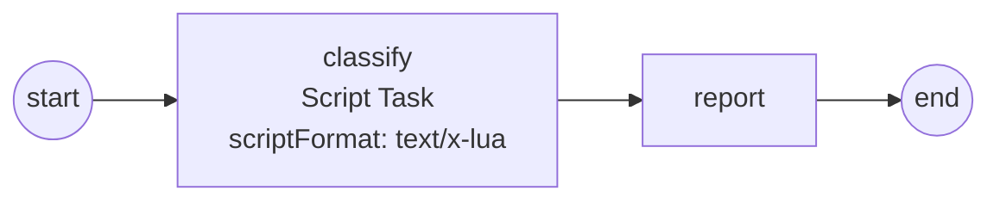

# Script Task

A **Script Task** carries a snippet of script — a `.lua` file, an expression, a
small DSL — that the engine evaluates in place. You reach for it when a step is
pure data logic (classify, compute, decide) that you'd rather keep as editable
script than compile into Go. Full program:
[`examples/script-task/`](../../../examples/script-task/).

## What it is

The task holds two things: a **`scriptFormat`** (a MIME hint like
`text/x-lua`) and a **script body**. At activation the engine routes the body
to the Script Engine that claims that format, runs it sandboxed, and commits
whatever the script returns as named process data for downstream nodes to read.



The script body is opaque to the model — the wired interpreter executes it — so
the same process runs under whichever engine the embedder registered.

## Build it

Register a Script Engine on the Thresher. The option is **repeatable**, so more
interpreters can coexist, each owning its formats:

```go
engine, err := thresher.New(
    fmt.Sprintf("script-task-%d", total),
    thresher.WithScriptEngine(lua.New()))
```

Construct the task with a name, its `scriptFormat`, and the body. Here the body
is an embedded `.lua` file, editable without recompiling the model:

```go
//go:embed order.lua
var orderLua string

classify, err := activities.NewScriptTask("classify", "text/x-lua", orderLua)
```

The script reads process data lazily by name and returns its outputs as a
table (`order.lua`):

```lua
local total = data.total
local tier  = has("tier") and data.tier or "retail"

-- ... compute pct ...

return {
  discount_pct = pct,
  lane         = pct >= 15 and "wholesale" or "retail",
}
```

The downstream `report` task reads those committed outputs by name, exactly as
it would any process property:

```go
pct, err := r.GetData("discount_pct")
lane, err := r.GetData("lane")
```

## Run it

```bash
cd examples/script-task && go run .
```

Each order runs its own instance; the Lua `print` line and the matching
`report` line show the classification:

```
order: tier="vip" total=500
  [script] tier=vip total=500 -> 25%
  [report] lane=wholesale discount=25%

order: tier="retail" total=150
  [script] tier=retail total=150 -> 15%
  [report] lane=wholesale discount=15%

order: tier="" total=40
  [script] tier=retail total=40 -> 5%
  [report] lane=retail discount=5%

✓ script-task completed: three orders classified by the sandboxed Lua script (25/15/5%)
```

## How it works

- **Routing by format.** `scriptFormat` is the seam: the engine dispatches the
  body to the registered Script Engine that claims that MIME type. Claim
  conflicts are rejected loudly at engine construction, not at runtime.
- **Lazy, fail-loud reads.** `data.total` resolves through the process data
  walk-up on access. A typo'd name fails the task loud — no silent `nil`. Probe
  optional data explicitly with `has("tier")`.
- **Outputs by return.** The returned table's keys commit as named process
  data. Lua numbers land as `float64` on the Go side, so downstream readers see
  numeric values.
- **The sandbox.** Only base/table/string/math are loaded; `io`/`os` and the
  `load` family don't exist inside the script. Execution is bound to the task
  context — a hung script aborts on cancellation or timeout.

> **Note:** All three arguments to `NewScriptTask` are required. An empty
> `scriptFormat` or an empty body is a programmatic-model bug and fails fast at
> construction.

## Options & variations

- **Multiple engines.** `WithScriptEngine` is repeatable — register a Starlark
  sibling or a custom DSL alongside Lua; each owns its formats, and the task's
  `scriptFormat` selects among them.
- **Embedded vs literal body.** The body is a plain string. Embed a `.lua`
  file with `//go:embed` (editable without recompiling the model) or pass an
  inline literal for a one-liner.
- **Script vs Go.** Prefer a Script Task when the step is portable data logic
  you want to keep as editable script. When the step needs your own Go types or
  I/O, use a [Service Task](service-task.md) instead.

## See also

- Full example: [`examples/script-task/`](../../../examples/script-task/)
- Related: [Service Task](service-task.md) · [Business Rule Task](business-rule-task.md) · [Scope & the data plane](../concepts/scope-and-data.md)
