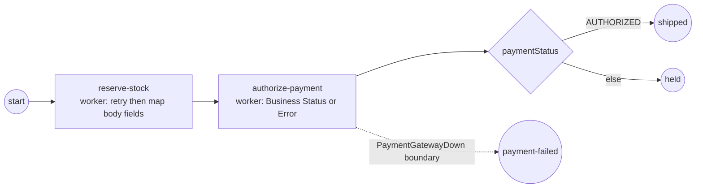

# Service Task

A **Service Task** is the workhorse of a gobpm process: the step that runs *your*
code. It comes in two flavours — an **in-process functor** (a plain Go function
the engine calls inline) or an **external worker** (a handler the engine
dispatches a job to, fetch-and-lock style). This page focuses on the worker
locus, which adds output mapping, retries, and business verdicts. Full program:
[`examples/service-task-worker/`](../../../examples/service-task-worker/).

## What it is

A `ServiceTask` names an **operation** and, optionally, a **worker topic**. With
no worker, the operation's functor runs in the engine goroutine. With
`WithWorker("topic")`, the engine turns the task into a **job**, a worker locks
it, runs off the track, and reports back — the Instance only ever sees the
*final* verdict.



A worker can end a job four ways: **complete** (with a body you map into
variables), report a **Business Status** (state, not an error), throw a
**Business Error** (an interrupting fault an Error boundary catches), or fail
with a **technical error** (retried in-process). All four appear in the example.

## Build it — in-process

The simplest task wraps a Go function as its operation, no worker. This is the
form the [first process](../getting-started/first-process.md) uses:

```go
op, _ := gooper.New("greet",
    func(ctx context.Context, r service.DataReader,
        _ *data.ItemDefinition) (*data.ItemDefinition, error) {
        user, _ := r.GetData("user_name") // reach process data by name
        fmt.Printf("hello, %v\n", user.Value().Get(ctx))
        return nil, nil
    })

task, _ := activities.NewServiceTask("work", op, activities.WithoutParams())
```

## Build it — external worker

To dispatch instead, name a **worker topic** and add the knobs you need. Here
`reserve-stock` maps two **nested** fields out of the worker's structured body
and lets the worker retry a transient fault in-process:

```go
st, err := activities.NewServiceTask("reserve-stock",
    service.MustOperation("reserve-op", nil, nil, nil),
    activities.WithWorker("reserve"),
    activities.WithOutputMapping(
        tasks.OutputRule{Path: bodyPath("body.reservationId"), Var: "reservationId"},
        tasks.OutputRule{Path: bodyPath("body.warehouse.zone"), Var: "warehouseZone"}),
    activities.WithRetryPolicy(tasks.FixedDelay(3, 300*time.Millisecond)),
    activities.WithoutParams())
```

The worker is an ordinary Go function registered under that topic. It returns a
body on success, a plain `error` for a technical fault (retried), or a
`tasks.WorkerError` to declare a verdict:

```go
func authorizeWorker() localdispatcher.WorkerFunc {
    return func(ctx context.Context, lj tasks.LockedJob) (*data.ItemDefinition, error) {
        amount, _ := lj.Input.Structure().Get(ctx).(int)
        switch {
        case amount < 0:
            return nil, &tasks.WorkerError{BpmnErrorCode: "PaymentGatewayDown"}
        case amount > 1000:
            return nil, &tasks.WorkerError{Status: values.NewVariable("DECLINED")}
        default:
            return nil, &tasks.WorkerError{Status: values.NewVariable("AUTHORIZED")}
        }
    }
}
```

Wire the dispatcher, register the handlers, and hand it to the engine:

```go
disp := localdispatcher.New(nil, 0)
_ = disp.RegisterWorker(ctx, "reserve", reserveWorker())
_ = disp.RegisterWorker(ctx, "authorize", authorizeWorker())

engine, _ := thresher.New("order-engine", thresher.WithWorkerDispatcher(disp))
```

## Run it

```bash
cd examples/service-task-worker && go run .
```

The demo starts three orders to walk every path; each shows the reserve worker
retrying twice, then mapping its body, before the authorize verdict routes:

```
order-normal (amount 50):
  reserve attempt 1: inventory timeout — worker retries in-process…
  reserve attempt 2: inventory timeout — worker retries in-process…
  reserve attempt 3: reserved (reservationId=R-1001, zone=A-3)
  authorize: AUTHORIZED (Business Status)
  ✓ completed (Completed) → shipped [paymentStatus=AUTHORIZED, reservationId=R-1001, warehouseZone=A-3]

order-over-limit (amount 5000):
  authorize: DECLINED (Business Status)
  ✓ completed (Completed) → held [paymentStatus=DECLINED, reservationId=R-1002, warehouseZone=A-3]

order-gateway-down (amount -1):
  authorize: PaymentGatewayDown (Business Error) → boundary
  ✓ completed (Completed) → payment-failed (Business Error caught by the boundary)
```

## How it works

- **No worker → in-process.** The operation's functor runs inline in the engine
  goroutine, reading and writing process data by name through its `DataReader`.
- **`WithWorker(topic)` → dispatched.** The task becomes a job on that topic; a
  worker locks it (fetch-and-lock), runs off the track, and reports a single
  final result. Retries and classification happen *in the worker*, so the
  Instance never sees intermediate failures.
- **`WithWorkerTrust`** (unset here) resolves to **`WorkerTrusted`**, the
  default: the worker self-classifies and retries transient faults in-process,
  holding its lock. Flip it to `tasks.EngineAuthoritative` and the worker
  returns raw — the *engine* classifies and retries by re-enqueue.
- **`WithOutputMapping`** extracts fields from the worker's structured body by
  **path** (`body.warehouse.zone`) into named variables, off the track — the
  same resolver expressions and conditions use.
- **`WithStatus("paymentStatus", …)`** names the variable a **Business Status**
  writes; a downstream exclusive gateway routes on it. A **Business Error**
  (`WorkerError{BpmnErrorCode}`) instead interrupts and is caught by an Error
  boundary on the task.

> **Note:** A `WorkerError` is a *verdict*, not a thrown panic — returning one is
> how a worker declares "declined" or "gateway down" as data the process can
> route on, distinct from a plain `error`, which is a technical fault the trust
> mode retries.

## Options & variations

| Option | Effect |
|---|---|
| `WithWorker(topic)` | Dispatch the task to a worker on `topic` instead of running in-process. |
| `WithOutputMapping(rules…)` | Map fields from the worker's body into named variables by path. |
| `WithRetryPolicy(tasks.FixedDelay(n, d))` | Retry a technical fault up to `n` times with delay `d`. |
| `WithStatus(varName, …)` | Name the variable a Business Status verdict writes. |
| `WithWorkerTrust(mode)` | `WorkerTrusted` (default, worker self-classifies) vs `EngineAuthoritative`. |
| `WithoutParams()` | The task binds no operation parameters. |

Engine-wide, set `thresher.WithWorkerTrustDefault(…)` to change the trust mode
for every task at once.

## See also

- Full example: [`examples/service-task-worker/`](../../../examples/service-task-worker/)
- [Your first process](../getting-started/first-process.md) — the in-process functor form.
- [External workers](../operating/external-workers.md) — the fetch-and-lock job model in depth.
- [Error events](../events/error.md) — catching the worker's Business Error on a boundary.
