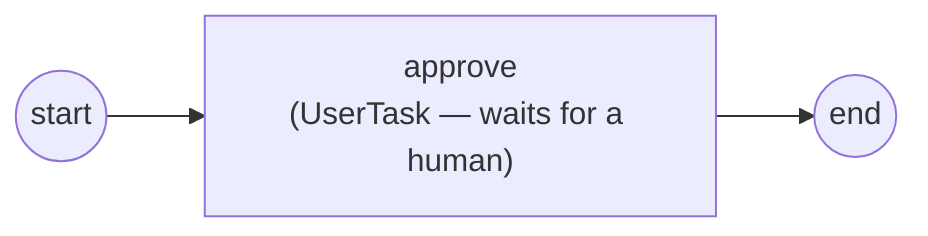

# User Task

A **user task** is a step that a person must do. The engine reaches it, parks
the instance, and waits: someone eligible claims the task, fills in its form,
and completes it — only then does the process move on. Full program:
[`examples/usertask/`](../../../examples/usertask/).

## What it is

Where a [service task](service-task.md) runs your Go code, a user task hands
control to a human. It carries an **assignment** (who may act — an assignee, or
candidate users/groups), a **renderer** (the form the human fills in), and
declared **outputs** (the data the form collects). The engine parks the token
until a `TaskDistributor` drives the task through *take → render → complete*.



## Build it

Build the task with its assignment, form, and outputs, then wire it like any
other node. Here `approve` is claimable by the candidate user `operator` and
collects a `decision` string:

```go
form, _ := consinp.NewRenderer(
    consinp.WithStringInput("decision", "Approve? type a decision"),
    consinp.WithSource(bytes.NewBufferString("approved\n")),
)

ut, _ := activities.NewUserTask("approve",
    activities.WithCandidateUsers("operator"),
    activities.WithRenderer(form),
    activities.WithOutput("decision", "string", true),
    activities.WithoutParams(),
)
```

The `consinp` renderer is a console form. `WithStringInput` declares a prompt;
`WithSource` feeds it a scripted answer so the example runs end-to-end with no
interactive typing. Then link it into the process:

```go
for _, e := range []flow.Element{start, ut, end} {
    p.Add(e)
}
flow.Link(start, ut)
flow.Link(ut, end)
```

## Run it

```bash
cd examples/usertask && go run .
```

The engine parks the task, the console driver takes it, renders the form, and
completes it — resuming the instance to its end event:

```
task available: id=5159375360311167865 node=8702537819366068898
task available:  TaskState Announced node_name=approve
                 TaskState Taken     node_name=approve
Approve? type a decision
                 TaskState Completed node_name=approve
task withdrawn: id=5159375360311167865
task completed:  id=5159375360311167865
process finished: Completed
```

> **Note:** The lines above are trimmed from the real run — the engine emits a
> startup banner and a config dump first, which are omitted here.

## How it works

A user task needs a **`TaskDistributor`**: the component that surfaces parked
tasks to humans and drives them to completion. The example uses the built-in
console driver, which acts as a scripted human — it takes each announced task,
renders its form, and completes it automatically:

```go
driver := console.New(operator{}, os.Stdout)

th, _ := thresher.New("approval-engine",
    thresher.WithTaskDistributor(driver))

driver.Bind(th)
```

- **`console.New(actor, w)`** builds the driver acting *as* a specific human —
  here an `operator{}` whose `UserID()` is `"operator"`, matching the task's
  candidate user. The engine authorizes take/complete against that identity.
- **`WithTaskDistributor(driver)`** registers the driver so the engine has
  somewhere to announce parked tasks.
- **`driver.Bind(th)`** links the driver back to the engine so it can call
  `Take` and `Complete` on it — the two halves must know each other.
- When execution reaches the task the engine announces it (`TaskState
  Announced`), the driver **takes** it (`Taken`), renders the form, and
  **completes** it (`Completed`); the collected `decision` becomes task output
  and the token flows to `end`.

> **Note:** Without a bound `TaskDistributor`, a user task simply parks and the
> instance never completes — the human step has no one to surface it to.

## Options & variations

The assignment options decide *who* may act; each has a static form and an
expression form evaluated per instance:

- **`WithAssignee("bob")`** — a single owning user; only that user may
  read/complete the task.
- **`WithCandidateUsers("alice", "bob")`** — a pool of eligible users; the
  first to claim it owns it.
- **`WithCandidateGroups("reviewers")`** — any member of the group may claim.
- **`WithAssigneeExpr` / `WithCandidateUsersExpr` / `WithCandidateGroupsExpr`**
  — the same, computed per instance from a `data.FormalExpression`.

Other knobs:

- **`WithRenderer(form)`** — attach a form; add more than one for multiple
  renderings (deduplicated by identity, so two distinct forms both survive).
- **`WithOutput(name, type, required)`** — declare a value the form collects;
  `required: true` means completion is rejected without it.

To drive tasks from a real UI instead of the console, supply your own
`TaskDistributor`: announce parked tasks to your front end, then call the
engine's `Take` and `Complete` when a human acts.

## See also

- Full example: [`examples/usertask/`](../../../examples/usertask/)
- Related: [Service Task](service-task.md) · [Your first process](../getting-started/first-process.md) · [Process, instance, track, token](../concepts/execution-model.md)
