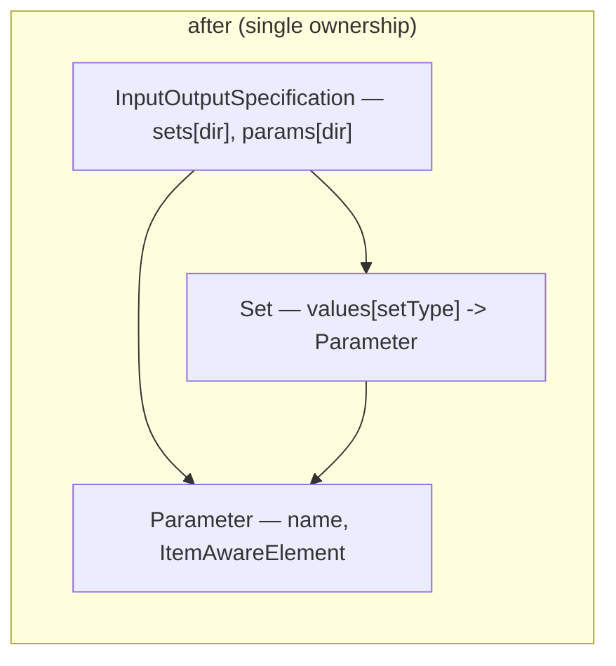

# SRD-008 — Data model-layer hardening

| Field | Value |
|---|---|
| Status | Accepted |
| Version | v.1 |
| Date | 2026-06-13 |
| Owner | Ruslan Gabitov |
| Implements | [ADR-011 v.1 Process Data Flow](../design/ADR-011-process-data-flow.md) |
| Refines | [ADR-001 v.5 Execution Model](../design/ADR-001-execution-model.md) |

This SRD lands the structural and correctness part of [ADR-011](../design/ADR-011-process-data-flow.md) §2.7 — the first of the data-flow ADR's implementing SRDs. It reshapes the I/O graph to single ownership, fixes the two §2.7 defects, and gives `Process` a `Validate()` wired into registration (no freeze — the snapshot is already the frozen model). It does **not** touch the execution semantics (single-set evaluation — a later SRD), the service reader (a later SRD), the value-notification split (deferred until the notification model is defined), or the event-options unification (its own SRD). See §2.2.

## 1. Background & motivation

### 1.1 Current state (verified against the code)

- **The I/O graph is two-sided and mutually referential.** `Parameter` carries a back-reference to every `Set` it belongs to — `sets map[SetType][]*Set` (`io_spec_obj.go:45`) — maintained in lockstep with `Set.values map[SetType][]*Parameter` (`io_spec_obj.go:174`). `Set.AddParameter` calls `p.addSet(s, st)` (`io_spec_obj.go:290`) and `Set.RemoveParameter` calls `p.removeSet(s, st)` (`io_spec_obj.go:324`); every mutation must update two structures in two types. The two files total **885 lines** (`io_spec.go` 414 + `io_spec_obj.go` 471), much of it the bidirectional bookkeeping (`addSet`/`removeSet`/`Sets` on `Parameter`, `io_spec_obj.go:95-170`).
- **`Parameter.Sets()` has no external consumers.** It is called only inside the data package: `InputOutputSpecification.Validate` (`io_spec.go:187`) and `InputOutputSpecification.RemoveParameter` (`io_spec.go:278`), plus tests. The runtime — `task.instantiateData` (`task.go:136,151`) — reads I/O **top-down** via `IoSpec.Parameters(dir)` (`io_spec.go:109`), never bottom-up through `Parameter.Sets()`. So the back-reference serves only two internal callers.
- **Two defects.**
  - `Array.GetKeys` (`values/array.go:192-202`): `res := make([]any, len(a.elements))` then `res = append(res, i)` in the loop — the `make`-with-length pre-fills `len` zero values and `append` extends beyond them, yielding a **double-length, half-nil** slice. `Array.GetKeysT` (`values/array_t.go:84-92`) has the identical bug (`make([]int, len)` + `append`).
  - `InputOutputSpecification.RemoveParameter` (`io_spec.go:248`) has a **value receiver** `(ios InputOutputSpecification)`, inconsistent with every sibling method (`Parameters`, `AddParameter`, `AddSet`, `RemoveSet`, `Sets` — all pointer-receiver). The removal happens to persist today because `ios.params` is a map (a value receiver still writes through to the shared backing), but the value receiver copies the whole struct on each call and would silently drop any future field assignment or map re-creation — a latent fragility, not an active data loss. No production caller exists (tests only).
- **`Process` is freely mutable and unvalidated.** `Process.Add` (`process.go:168`) and `Process.Remove` (`process.go:204`) are public and unguarded; there is **no `Process.Validate()`** (only `processConfig.Validate` on the build config, `process_options.go:24`), so a malformed graph — a flow whose source/target node isn't in the process, a mistyped element — is caught late or not at all. `Add` dispatches on `e.EType()` then does **unchecked** type assertions `e.(flow.Node)` / `e.(*flow.SequenceFlow)` (`process.go:177,180`) that would panic on a malformed element rather than return an error. Execution is already isolated from later mutation: `snapshot.New(p)` (`snapshot/snapshot.go:28`) copies `p.Nodes()`/`p.Flows()` into **fresh maps** (`snapshot.go:43-44,52,88`) and the instance runs a per-instance `Clone()` (`snapshot.go:99`), so the live `Process` is never read during execution. The gap is therefore **not isolation but the absence of a validation gate at registration**: a broken graph silently produces a broken snapshot. `Add`/`Remove` have no production callers (model construction goes through the element constructors' internal `addNode`/`addFlow`); only tests call them.

### 1.2 Why

ADR-011 §2.7 prescribes a clean model-layer foundation for the data-flow conception: single ownership of the I/O graph, the two defects gone, and a process validated at registration. The later data-flow SRDs (single-set evaluation, the service reader) build on this shape; doing the structural hardening first keeps them from building on the two-sided graph and the unvalidated process.

## 2. Goals & scope

### 2.1 Goals (in scope)

- **G1.** The I/O graph is **single-ownership**: `Set` owns its `Parameter`s; a `Parameter` holds **no** back-reference to the Sets it belongs to. The `Parameter.sets` field and its `addSet`/`removeSet`/`Sets` methods are removed; the two internal consumers become derived queries over the Sets.
- **G2.** `InputOutputSpecification.RemoveParameter` takes a **pointer receiver**.
- **G3.** `Array.GetKeys` and `Array.GetKeysT` return the index set, not a double-length half-nil slice.
- **G4.** `Process` gains `Validate()` (well-formed graph), wired into the registration path so `snapshot.New` validates before building and a malformed process is rejected with a clear error. The unchecked type assertions in `Add` become comma-ok guarded. No *freeze* is added — the snapshot is already the frozen model (see §1.1).
- **G5.** No behaviour change for valid processes: existing tests and all five examples pass; the SRD-007 frame/task data path is unaffected (it reads `IoSpec.Parameters(dir)`).

### 2.2 Non-goals (deferred, each with a named home)

- **Value-vs-notification split** (ADR-011 §2.7) — deferred until the notification model (conditional events) is defined; the embedded `Array`/`Variable` notification stays as-is (it blocks nothing and is dead today). Removing it later stays trivial.
- **Event-options unification** (ADR-011 §2.7 — the 8 runtime-asserted trigger adapters → compile-time-checked construction) — its own future SRD; it is event *construction*, not data/process structure, and an API redesign of its own.
- **Single-set I/O evaluation semantics** (ADR-011 §2.2–§2.5) and the **service data reader** (§2.6) — their own later SRDs.

## 3. Requirements

### 3.1 Functional

| # | Requirement |
|---|---|
| FR-1 | `Parameter` (`io_spec_obj.go:44`) drops its `sets map[SetType][]*Set` field and the `addSet`/`removeSet`/`Sets` methods (`io_spec_obj.go:95-170`). A `Parameter` is `{name, ItemAwareElement}`. |
| FR-2 | `Set.AddParameter` / `Set.RemoveParameter` (`io_spec_obj.go:253,303`) maintain **only** `Set.values`; the calls to `p.addSet` / `p.removeSet` are removed. The dedup/validation behaviour (duplicate-name rejection, set-type validation) is preserved. |
| FR-3 | `InputOutputSpecification.Validate` (`io_spec.go:187`) is rewritten to derive a parameter's set-membership by iterating the IoSpec's own `Set`s (per direction) rather than calling `Parameter.Sets()`. The validation result (every parameter belongs to ≥1 set, etc.) is unchanged. |
| FR-4 | `InputOutputSpecification.RemoveParameter` (`io_spec.go:248`) takes a **pointer receiver** `(ios *InputOutputSpecification)` — for consistency with its sibling methods and future-safety (the removal already persisted via map semantics; this is robustness, not a data-loss fix). It removes the parameter from `ios.params[dir]` **and** from every `Set` of that direction via the derived top-down query (iterating `ios.sets[dir]`, calling the unexported error-free `Set.removeParameter`), replacing the old `p.Sets(AllSets)` walk (`io_spec.go:278`). |
| FR-5 | `Array.GetKeys` (`values/array.go:192`) and `Array.GetKeysT` (`values/array_t.go:84`) build the index slice by **index assignment** (`res[i] = i`), returning exactly `len(elements)` keys. |
| FR-6 | `Process` gains `Validate() error` — a well-formedness check: every `SequenceFlow`'s `Source()` and `Target()` resolve to a node present in the process; no nil node/flow; (extend with the obvious structural invariants). It does not enforce BPMN element-completeness (that is the snapshot's existing Start/End check). |
| FR-7 | `snapshot.New` (`snapshot/snapshot.go:28`) calls `Process.Validate()` before building the snapshot and returns its error, so registering a malformed process fails at registration with a clear error (the snapshot's existing Start/End check, `snapshot.go:81-85`, stays). **No** `Freeze()` / frozen-state guard is added — the snapshot already isolates execution (fresh maps + per-instance `Clone()`), so freezing the live `Process` would guard only the test-only `Add`/`Remove` against a path a running instance cannot reach. |
| FR-8 | `Process.Add` (`process.go:168`) replaces the unchecked `e.(flow.Node)` / `e.(*flow.SequenceFlow)` (`process.go:177,180`) with comma-ok assertions that return a classified error on mismatch instead of risking a panic. |

### 3.2 Non-functional

| # | Requirement |
|---|---|
| NFR-1 | No behaviour change for valid processes / well-formed IoSpecs: existing data, activities, events, process, instance, and thresher tests pass; all five examples run. |
| NFR-2 | The SRD-007 frame/task data path is untouched — `IoSpec.Parameters(dir)` keeps its signature and semantics. |
| NFR-3 | `make ci` green per milestone; diff-coverage ≥95 % (target 100 %) on touched files. |
| NFR-4 | Every new/changed public symbol carries a doc comment; new public API validates its parameters with self-identifying errors (project rules). |

## 4. Design & implementation plan

### 4.1 Single-ownership I/O graph

`Set` is the single owner of the parameter→set membership (`Set.values`). A
`Parameter` is a leaf — it carries its name and item-aware element, nothing
about which sets reference it. The two former bottom-up queries are derived
top-down:

- **`IoSpec.Validate`** — instead of `for ss := range p.Sets(AllSets)`, iterate
  `ios.sets[dir]` and check each parameter's membership across those sets.
- **`IoSpec.RemoveParameter`** — instead of `p.Sets(AllSets)` then per-set
  removal, iterate `ios.sets[dir]` and call the unexported error-free
  `Set.removeParameter(p)` on each (it drops `p` wherever referenced, a no-op
  otherwise), then drop `p` from `ios.params[dir]`; pointer receiver for
  consistency with its siblings.

If a public "which sets is this parameter in?" query is wanted later, it is
**promoted** as a derived `IoSpec` method then — not carried as a field now.

### 4.2 The GetKeys / GetKeysT defect

Both build the index slice by assignment, mirroring the already-correct pattern
elsewhere: `res := make([]…, len(a.elements)); for i := range a.elements { res[i] = i }`.

### 4.3 Process validation at registration

- `Process.Validate() error` — every flow's `Source()`/`Target()` node id is in
  `p.nodes`; no nil node/flow; (the obvious structural invariants). It does not
  duplicate the snapshot's BPMN Start/End completeness check (`snapshot.go:81-85`).
- `Process.Add` — the `e.(flow.Node)` / `e.(*flow.SequenceFlow)` assertions become
  comma-ok, returning a classified error on mismatch instead of panicking.
- `snapshot.New(p)` (`snapshot/snapshot.go:28`) — call `p.Validate()` and return
  its error **before** copying the graph, so registration is the single gate that
  rejects a malformed process before a broken snapshot exists.
- **No freeze.** The snapshot copies the graph into its own maps
  (`snapshot.go:43-44,52,88`) and the instance runs a `Clone()` (`snapshot.go:99`);
  the live `Process` is never read during execution, so a `frozen` flag would guard
  only the test-only `Add`/`Remove` against a non-existent production path.

### 4.4 Milestones (each = one commit, CI-green)

- **M1 — single-ownership I/O graph.** FR-1/2/3/4 (incl. the `RemoveParameter`
  pointer-receiver fix). Rewrite `Parameter` (drop the field + 3 methods), `Set`
  (drop the back-ref calls), `IoSpec.Validate` and `IoSpec.RemoveParameter`
  (derived). Update `io_spec_test.go` for the removed `Parameter.Sets()`.
- **M2 — collection key defect.** FR-5: `GetKeys` + `GetKeysT`.
- **M3 — process validation at registration.** FR-6/7/8: `Process.Validate()`,
  comma-ok assertions in `Add`, and `snapshot.New` calling `Validate()` before it
  builds the snapshot.

### 4.5 Tests (per milestone; details §5)

`io_spec_test.go` (membership derived, RemoveParameter actually removes,
duplicate/validation preserved), `values_test.go` (GetKeys/GetKeysT length),
`process_test.go` (Validate well-formed/malformed; comma-ok mismatch on Add),
`snapshot_test.go` (New calls Validate; a malformed process is rejected at New).

## 5. Verification (Definition of Done)

| # | Check | Expectation |
|---|---|---|
| V1 | `Parameter` has no `sets` field / `addSet`/`removeSet`/`Sets`; package builds; `IoSpec.Parameters(dir)` unchanged (NFR-2). | green |
| V2 | `IoSpec.RemoveParameter` (pointer receiver) actually removes the parameter from `params` and from every containing set; re-query confirms absence (FR-4). | removed |
| V3 | `IoSpec.Validate` derives membership from the Sets and gives the same verdicts as before on valid/invalid specs (FR-3). | parity |
| V4 | `GetKeys`/`GetKeysT` return exactly `len(elements)` sequential keys, no nil head (FR-5). | exact length |
| V5 | `Process.Validate` passes a well-formed process and rejects a flow whose source/target node is absent (FR-6). | green |
| V6 | `snapshot.New` rejects a malformed process (a flow to an absent node) with `Validate`'s error before building a snapshot; a well-formed process snapshots as before (FR-7). | validated at registration |
| V7 | `Add` with a mismatched element type returns a classified error, no panic (FR-8). | classified error |
| V8 | Regression: data / activities / events / process / instance / thresher suites pass; all five examples (`basic-process`, `parallel-gateway`, `process-data`, `simple-timer`, `timer-event`) run to exit 0 (NFR-1). | green |
| V9 | `make ci` green; diff-coverage ≥95 % on touched files (NFR-3). | pass |

## 6. Risks & regressions

- **Hidden bottom-up dependence on `Parameter.Sets()`.** Mitigated by the consumer
  sweep (only `IoSpec.Validate`/`RemoveParameter` + tests); both are rewritten.
  V1/V3 guard it; a missed external caller would fail to compile (the method is
  gone), surfacing immediately.
- **`Validate` over-/under-constraining.** Too strict rejects a legitimate process
  at registration; too loose lets a malformed one through. Scoped to the
  uncontroversial graph-connectivity invariants; V5 covers both directions, and
  the snapshot's existing Start/End check is left as-is (not duplicated).
- **`Validate()` in `snapshot.New` rejecting a process that registered before.**
  Wiring validation into registration is a new gate: a graph that previously
  produced a (silently broken) snapshot now fails fast. Scoped to the
  uncontroversial connectivity invariants so it only rejects genuinely malformed
  graphs; V6/V8 (all five examples register and run) confirm no false positive.
- **`RemoveParameter` receiver change altering call sites.** Only tests call it; the
  pointer receiver is source-compatible for pointer values (the field is accessed
  through `*InputOutputSpecification` everywhere). V2 confirms it now works.

## 7. Implementation summary

Landed on branch `feat/data-model-hardening` in three milestone commits after
the doc commit; `make ci` green and diff-coverage 100% on the touched files at
each milestone.

### 7.1 Milestones by commit

| Milestone | Commit | Scope | Tests |
|---|---|---|---|
| Doc | `aaaa5bc` | SRD-008 + the ADR-011 §2.7 freeze→validate amendment | — |
| M1 — single-ownership I/O graph | `f920b11` | dropped `Parameter.sets`/`addSet`/`removeSet`/`Sets`; added `Set.hasParameter`/`removeParameter`; `IoSpec.Validate`/`RemoveParameter` derived; pointer receiver | `TestIOSpecRemoveParameterFromSets` + `TestSet`/`TestIOSpec` parity |
| M2 — collection key defects | `3658acc` | `GetKeys`/`GetKeysT` index assignment | `values_test.go` exact-slice assertions |
| M3 — process validation | `7bba5e6` | `Process.Validate()`, comma-ok `Add`, `snapshot.New` validates before building | `TestProcessValidate`, `TestProcessAddTypeMismatch`, `TestSnapshotNewRejectsMalformed` |

### 7.2 Verification results (§5)

- **V1–V4** (data) — `Parameter` is a leaf; `RemoveParameter` (pointer)
  removes from `params` and every containing set; `Validate` derives membership
  with parity; `GetKeys`/`GetKeysT` return exactly `len(elements)` keys. Green.
- **V5–V7** (process) — `Validate` passes a well-formed graph and rejects a
  flow whose endpoints are absent; `Add` returns a classified error (no panic)
  on a type-mismatched element. Green.
- **V8** — all five examples (`basic-process`, `parallel-gateway`,
  `process-data`, `simple-timer`, `timer-event`) run to exit 0.
- **V9** — `make ci` green; diff-coverage 100% (65/65 changed coverable lines).

### 7.3 Where reality diverged from the §3 draft

- **The `RemoveParameter` value receiver was not an active data-loss bug.**
  The draft framed it as "the removal is silently lost". In fact `ios.params`
  is a map, so a value receiver still writes through to the shared backing and
  the removal persisted (the existing `TestIOSpec` exercised it). The pointer
  receiver is kept for consistency with its siblings and future-safety, not as
  a data-loss fix; §1.1 / FR-4 were corrected to say so. Found while
  implementing M1.
- **`IoSpec.RemoveParameter` uses an unexported `Set.removeParameter`, not the
  public `Set.RemoveParameter`.** The public method re-validates its set-type
  argument and returns an error that is unreachable for an already-validated
  caller — an uncoverable branch. M1 introduced the error-free unexported
  `Set.removeParameter` for the derived removal; §4.1 / FR-4 updated.
- **A flow with exactly one endpoint outside the process is not
  constructible.** `flow.SequenceFlow.BindTo` requires both endpoints to share
  a container, so `Process.Validate`'s only reachable failure is a flow whose
  endpoints are *both* outside the process — the M3 test reflects this.

## 8. References

- [ADR-011 v.1 Process Data Flow](../design/ADR-011-process-data-flow.md) — §2.7
  the model-layer shaping this SRD lands (single-ownership I/O graph, the two
  defects, `Process.Validate()` at registration); the deferred §2.7 items
  (notification split, event-options unification) and the later-SRD items (set
  evaluation, the reader) are named in §2.2.
- [ADR-001 v.5 Execution Model](../design/ADR-001-execution-model.md) — the
  snapshot/instance lifecycle the registration-time validation attaches to.
- [ADR-010 v.1 Process Data Model](../design/ADR-010-process-data-model.md) — the
  per-execution frame/`IoSpec.Parameters(dir)` data path this SRD must not disturb.
- [SAD-001 v.1 §14.1](../design/SAD-001-vision-and-architecture.md) — the
  conformance scope and the deliberate-deviation register ADR-011 feeds.

## 9. Open questions

- None. The notification split and event-options unification are explicitly
  deferred (§2.2) with named homes; the I/O-graph derived-query approach and the
  validation trigger point (`snapshot.New`, no freeze) are decided above. The exact
  `Validate()` invariant list beyond graph connectivity is an implementation
  detail of M3, not an open conception question.

## Document History

| Version | Date | Author | Change |
|---|---|---|---|
| v.1 | 2026-06-13 | Ruslan Gabitov | **Accepted**, landed on `feat/data-model-hardening` (M1 `f920b11`, M2 `3658acc`, M3 `7bba5e6`); `make ci` green, diff-coverage 100%. During implementation §1.1/FR-4/§4.1 were corrected (the value-receiver was a consistency fix, not a data-loss fix — `ios.params` is a map; derived removal uses an unexported `Set.removeParameter`) and §7 filled — see §7.3. Lands the structural/correctness part of ADR-011 v.1 §2.7: single-ownership I/O graph (drop `Parameter`'s set back-reference + `addSet`/`removeSet`/`Sets`; `Set` owns parameters; `IoSpec.Validate`/`RemoveParameter` become derived queries; `RemoveParameter` gets a pointer receiver); the `GetKeys`/`GetKeysT` double-length defect; `Process.Validate()` wired into `snapshot.New` (validation at registration), with comma-ok `Add` assertions. No process *freeze* — the snapshot is already the frozen model (fresh-map copy + per-instance `Clone()`), so freezing the live `Process` would guard only test-only mutators. Three milestones (I/O graph → key defect → process validation). Explicitly defers the §2.7 value-notification split (until the notification model is defined) and the §2.7 event-options unification (its own SRD); the §2.2–§2.6 evaluation/reader semantics are later SRDs. Implements ADR-011 v.1; refines ADR-001 v.5. |
