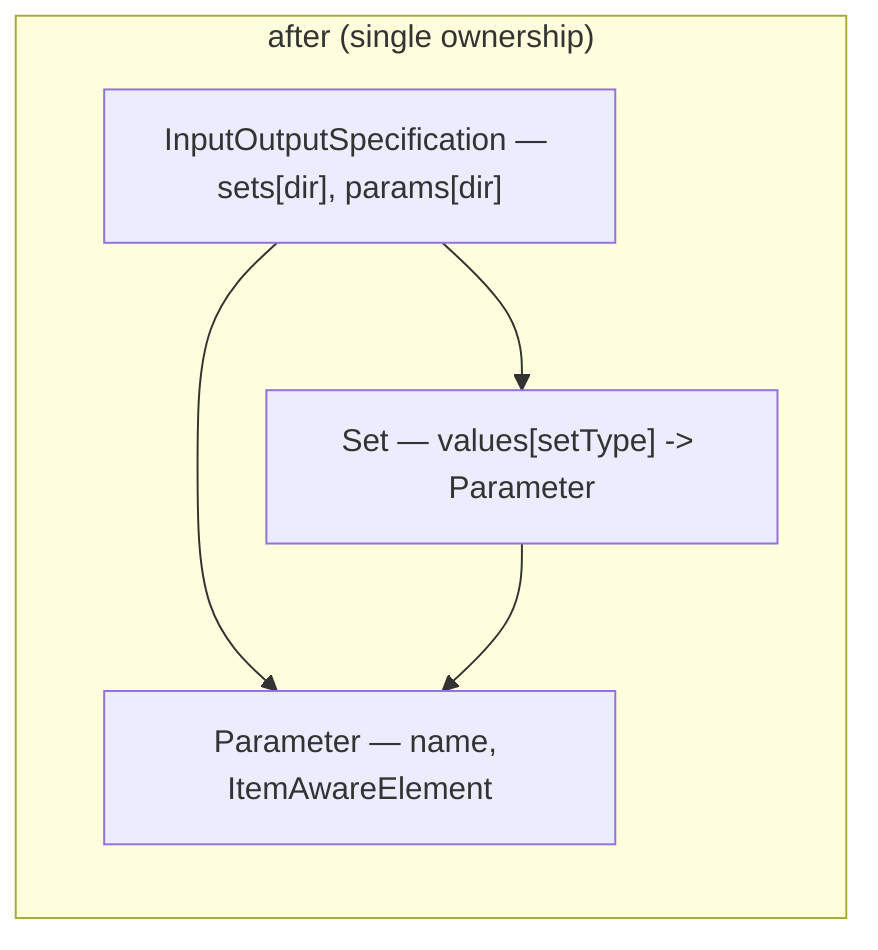

# SRD-008 — Упрочнение слоя модели данных

| Поле | Значение |
|---|---|
| Статус | Принято |
| Версия | v.1 |
| Дата | 2026-06-13 |
| Владелец | Руслан Габитов |
| Реализует | [ADR-011 v.1 Process Data Flow](../design/ADR-011-process-data-flow.md) |
| Уточняет | [ADR-001 v.5 Execution Model](../design/ADR-001-execution-model.md) |

> EN-оригинал — канонический: [SRD-008-data-model-hardening.md](SRD-008-data-model-hardening.md). Этот файл — его перевод (twin).

Этот SRD приземляет структурно-корректностную часть [ADR-011](../design/ADR-011-process-data-flow.md) §2.7 — первый из реализующих SRD'ов data-flow ADR. Он переводит I/O-граф к единоличному владению, чинит два дефекта §2.7 и даёт `Process` метод `Validate()`, вшитый в регистрацию (без freeze — snapshot уже является замороженной моделью). Он **не** трогает семантику выполнения (single-set evaluation — отдельный последующий SRD), service reader (отдельный последующий SRD), разделение value/notification (отложено до определения модели нотификаций) и унификацию event-options (свой отдельный SRD). См. §2.2.

## 1. Контекст и мотивация

### 1.1 Текущее состояние (сверено с кодом)

- **I/O-граф двусторонний и взаимно-ссылочный.** `Parameter` несёт обратную ссылку на каждый `Set`, которому принадлежит — `sets map[SetType][]*Set` (`io_spec_obj.go:45`) — поддерживаемую в синхроне с `Set.values map[SetType][]*Parameter` (`io_spec_obj.go:174`). `Set.AddParameter` вызывает `p.addSet(s, st)` (`io_spec_obj.go:290`), а `Set.RemoveParameter` — `p.removeSet(s, st)` (`io_spec_obj.go:324`); каждая мутация должна обновлять две структуры в двух типах. Два файла суммарно дают **885 строк** (`io_spec.go` 414 + `io_spec_obj.go` 471), значительная часть — двунаправленная бухгалтерия (`addSet`/`removeSet`/`Sets` на `Parameter`, `io_spec_obj.go:95-170`).
- **У `Parameter.Sets()` нет внешних потребителей.** Метод вызывается только внутри пакета data: `InputOutputSpecification.Validate` (`io_spec.go:187`) и `InputOutputSpecification.RemoveParameter` (`io_spec.go:278`), плюс тесты. Рантайм — `task.instantiateData` (`task.go:136,151`) — читает I/O **сверху вниз** через `IoSpec.Parameters(dir)` (`io_spec.go:109`), никогда снизу вверх через `Parameter.Sets()`. Так что обратная ссылка обслуживает лишь двух внутренних вызывающих.
- **Два дефекта.**
  - `Array.GetKeys` (`values/array.go:192-202`): `res := make([]any, len(a.elements))`, затем `res = append(res, i)` в цикле — `make`-с-длиной заранее заполняет `len` нулевых значений, а `append` расширяет за их пределы, давая срез **двойной длины с нулевой первой половиной**. `Array.GetKeysT` (`values/array_t.go:84-92`) содержит идентичный баг (`make([]int, len)` + `append`).
  - У `InputOutputSpecification.RemoveParameter` (`io_spec.go:248`) **value receiver** `(ios InputOutputSpecification)`, несогласованный с каждым родственным методом (`Parameters`, `AddParameter`, `AddSet`, `RemoveSet`, `Sets` — все pointer-receiver). Удаление сегодня сохраняется, потому что `ios.params` — это map (value receiver всё равно пишет в общий backing), но value receiver копирует всю структуру на каждом вызове и молча потерял бы любое будущее присваивание поля или пересоздание map — латентная хрупкость, а не активная потеря данных. Продакшн-вызывающих нет (только тесты).
- **`Process` свободно мутабелен и невалидируем.** `Process.Add` (`process.go:168`) и `Process.Remove` (`process.go:204`) публичны и без защиты; нет **никакого `Process.Validate()`** (только `processConfig.Validate` на build-конфиге, `process_options.go:24`), так что некорректный граф — flow, чей source/target-узел не в процессе, элемент с неверным типом — ловится поздно или вовсе не ловится. `Add` диспетчеризует по `e.EType()`, затем делает **непроверенные** type assertions `e.(flow.Node)` / `e.(*flow.SequenceFlow)` (`process.go:177,180`), которые паниковали бы на некорректном элементе вместо возврата ошибки. Выполнение уже изолировано от последующей мутации: `snapshot.New(p)` (`snapshot/snapshot.go:28`) копирует `p.Nodes()`/`p.Flows()` в **свежие maps** (`snapshot.go:43-44,52,88`), а экземпляр работает на per-instance `Clone()` (`snapshot.go:99`), так что живой `Process` никогда не читается во время выполнения. Поэтому пробел — **не в изоляции, а в отсутствии валидационного барьера на регистрации**: сломанный граф молча производит сломанный snapshot. У `Add`/`Remove` нет продакшн-вызывающих (построение модели идёт через внутренние `addNode`/`addFlow` конструкторов элементов); их зовут только тесты.

### 1.2 Зачем

ADR-011 §2.7 предписывает чистый фундамент слоя модели для концепции data-flow: единоличное владение I/O-графом, оба дефекта устранены, процесс валидируется на регистрации. Последующие data-flow SRD'ы (single-set evaluation, service reader) строятся на этой форме; выполнение структурного упрочнения первым удерживает их от построения на двустороннем графе и невалидируемом процессе.

## 2. Цели и охват

### 2.1 Цели (в охвате)

- **G1.** I/O-граф становится **единоличным**: `Set` владеет своими `Parameter`'ами; `Parameter` **не** держит обратной ссылки на Set'ы, которым принадлежит. Поле `Parameter.sets` и его методы `addSet`/`removeSet`/`Sets` удаляются; два внутренних потребителя становятся производными запросами по Set'ам.
- **G2.** `InputOutputSpecification.RemoveParameter` берёт **pointer receiver**.
- **G3.** `Array.GetKeys` и `Array.GetKeysT` возвращают набор индексов, а не срез двойной длины с нулевой половиной.
- **G4.** `Process` получает `Validate()` (корректность графа), вшитый в путь регистрации, так что `snapshot.New` валидирует перед построением и некорректный процесс отвергается с понятной ошибкой. Непроверенные type assertions в `Add` становятся comma-ok. *Freeze* не добавляется — snapshot уже является замороженной моделью (см. §1.1).
- **G5.** Без изменения поведения для корректных процессов: существующие тесты и все пять примеров проходят; data-path frame/task из SRD-007 не затронут (он читает `IoSpec.Parameters(dir)`).

### 2.2 Не-цели (отложено, у каждой назван дом)

- **Разделение value/notification** (ADR-011 §2.7) — отложено до определения модели нотификаций (conditional events); встроенная нотификация `Array`/`Variable` остаётся как есть (ничего не блокирует и сегодня мертва). Удалить её позже останется тривиально.
- **Унификация event-options** (ADR-011 §2.7 — 8 рантайм-проверяемых trigger-адаптеров → конструирование, проверяемое в compile-time) — свой отдельный будущий SRD; это конструирование *события*, а не структура data/process, и редизайн API сам по себе.
- **Семантика single-set I/O evaluation** (ADR-011 §2.2–§2.5) и **service data reader** (§2.6) — свои отдельные последующие SRD'ы.

## 3. Требования

### 3.1 Функциональные

| # | Требование |
|---|---|
| FR-1 | `Parameter` (`io_spec_obj.go:44`) убирает поле `sets map[SetType][]*Set` и методы `addSet`/`removeSet`/`Sets` (`io_spec_obj.go:95-170`). `Parameter` становится `{name, ItemAwareElement}`. |
| FR-2 | `Set.AddParameter` / `Set.RemoveParameter` (`io_spec_obj.go:253,303`) поддерживают **только** `Set.values`; вызовы `p.addSet` / `p.removeSet` удаляются. Поведение dedup/валидации (отклонение дублей имён, валидация типа набора) сохраняется. |
| FR-3 | `InputOutputSpecification.Validate` (`io_spec.go:187`) переписывается так, чтобы выводить принадлежность параметра к набору перебором собственных `Set`'ов IoSpec (по направлению), а не вызовом `Parameter.Sets()`. Результат валидации (каждый параметр принадлежит ≥1 набору и т.д.) не меняется. |
| FR-4 | `InputOutputSpecification.RemoveParameter` (`io_spec.go:248`) берёт **pointer receiver** `(ios *InputOutputSpecification)` — ради согласованности с родственными методами и устойчивости к будущему (удаление и так сохранялось благодаря семантике map; это надёжность, а не фикс потери данных). Он удаляет параметр из `ios.params[dir]` **и** из каждого `Set` этого направления через производный запрос сверху вниз (перебор `ios.sets[dir]`, вызов неэкспортируемого безошибочного `Set.removeParameter`), заменяя прежний обход `p.Sets(AllSets)` (`io_spec.go:278`). |
| FR-5 | `Array.GetKeys` (`values/array.go:192`) и `Array.GetKeysT` (`values/array_t.go:84`) строят срез индексов **присваиванием по индексу** (`res[i] = i`), возвращая ровно `len(elements)` ключей. |
| FR-6 | `Process` получает `Validate() error` — проверку корректности: `Source()` и `Target()` каждого `SequenceFlow` резолвятся в узел, присутствующий в процессе; нет nil-узла/flow; (расширяется очевидными структурными инвариантами). Не проверяет полноту BPMN-элементов (это существующая Start/End-проверка snapshot'а). |
| FR-7 | `snapshot.New` (`snapshot/snapshot.go:28`) вызывает `Process.Validate()` перед построением snapshot'а и возвращает его ошибку, так что регистрация некорректного процесса падает на регистрации с понятной ошибкой (существующая Start/End-проверка snapshot'а, `snapshot.go:81-85`, остаётся). **Никакого** `Freeze()` / frozen-state-гарда не добавляется — snapshot уже изолирует выполнение (свежие maps + per-instance `Clone()`), так что заморозка живого `Process` защищала бы лишь тест-онли `Add`/`Remove` от пути, недостижимого работающим экземпляром. |
| FR-8 | `Process.Add` (`process.go:168`) заменяет непроверенные `e.(flow.Node)` / `e.(*flow.SequenceFlow)` (`process.go:177,180`) на comma-ok assertions, возвращающие классифицированную ошибку при несовпадении вместо риска паники. |

### 3.2 Нефункциональные

| # | Требование |
|---|---|
| NFR-1 | Без изменения поведения для корректных процессов / корректных IoSpec'ов: существующие тесты data, activities, events, process, instance и thresher проходят; все пять примеров запускаются. |
| NFR-2 | Data-path frame/task из SRD-007 не тронут — `IoSpec.Parameters(dir)` сохраняет сигнатуру и семантику. |
| NFR-3 | `make ci` зелёный на каждом milestone; diff-coverage ≥95 % (цель 100 %) на затронутых файлах. |
| NFR-4 | Каждый новый/изменённый публичный символ несёт doc-comment; новый публичный API валидирует свои параметры самоидентифицирующимися ошибками (правила проекта). |

## 4. Дизайн и план реализации

### 4.1 Единоличный I/O-граф

`Set` — единоличный владелец принадлежности параметр→набор (`Set.values`).
`Parameter` — лист: несёт своё имя и item-aware-элемент, ничего о том, какие
наборы на него ссылаются. Два прежних запроса снизу вверх выводятся сверху вниз:

- **`IoSpec.Validate`** — вместо `for ss := range p.Sets(AllSets)` перебирать
  `ios.sets[dir]` и проверять принадлежность каждого параметра по этим наборам.
- **`IoSpec.RemoveParameter`** — вместо `p.Sets(AllSets)` с последующим
  поднаборным удалением перебирать `ios.sets[dir]` и звать неэкспортируемый
  безошибочный `Set.removeParameter(p)` на каждом (он убирает `p` везде, где тот
  упомянут, и no-op иначе), затем убрать `p` из `ios.params[dir]`; pointer
  receiver — ради согласованности с родственниками.

Если публичный запрос «в каких наборах этот параметр?» понадобится позже, он
**промоутится** как производный метод `IoSpec` тогда — а не несётся полем сейчас.

### 4.2 Дефект GetKeys / GetKeysT

Оба строят срез индексов присваиванием, повторяя уже-корректный паттерн в
других местах: `res := make([]…, len(a.elements)); for i := range a.elements { res[i] = i }`.

### 4.3 Валидация процесса на регистрации

- `Process.Validate() error` — id узла `Source()`/`Target()` каждого flow есть в
  `p.nodes`; нет nil-узла/flow; (очевидные структурные инварианты). Не дублирует
  BPMN Start/End-проверку полноты snapshot'а (`snapshot.go:81-85`).
- `Process.Add` — assertions `e.(flow.Node)` / `e.(*flow.SequenceFlow)`
  становятся comma-ok, возвращая классифицированную ошибку при несовпадении
  вместо паники.
- `snapshot.New(p)` (`snapshot/snapshot.go:28`) — звать `p.Validate()` и
  возвращать его ошибку **до** копирования графа, так что регистрация —
  единственный барьер, отвергающий некорректный процесс до появления сломанного
  snapshot'а.
- **Без freeze.** Snapshot копирует граф в свои maps (`snapshot.go:43-44,52,88`),
  а экземпляр работает на `Clone()` (`snapshot.go:99`); живой `Process` никогда
  не читается во время выполнения, так что флаг `frozen` защищал бы лишь
  тест-онли `Add`/`Remove` от несуществующего продакшн-пути.

### 4.4 Milestones (каждый = один коммит, CI-зелёный)

- **M1 — единоличный I/O-граф.** FR-1/2/3/4 (включая pointer-receiver-фикс
  `RemoveParameter`). Переписать `Parameter` (убрать поле + 3 метода), `Set`
  (убрать back-ref-вызовы), `IoSpec.Validate` и `IoSpec.RemoveParameter`
  (производные). Обновить `io_spec_test.go` под удалённый `Parameter.Sets()`.
- **M2 — дефект ключей коллекции.** FR-5: `GetKeys` + `GetKeysT`.
- **M3 — валидация процесса на регистрации.** FR-6/7/8: `Process.Validate()`,
  comma-ok assertions в `Add` и вызов `Validate()` из `snapshot.New` перед
  построением snapshot'а.

### 4.5 Тесты (по milestone; детали в §5)

`io_spec_test.go` (производная принадлежность, RemoveParameter реально удаляет,
dedup/валидация сохранены), `values_test.go` (длина GetKeys/GetKeysT),
`process_test.go` (Validate корректный/некорректный; comma-ok-несовпадение в Add),
`snapshot_test.go` (New зовёт Validate; некорректный процесс отвергается в New).

## 5. Проверка (Definition of Done)

| # | Проверка | Ожидание |
|---|---|---|
| V1 | У `Parameter` нет поля `sets` / `addSet`/`removeSet`/`Sets`; пакет собирается; `IoSpec.Parameters(dir)` не изменён (NFR-2). | зелено |
| V2 | `IoSpec.RemoveParameter` (pointer receiver) реально удаляет параметр из `params` и из каждого содержащего набора; повторный запрос подтверждает отсутствие (FR-4). | удалён |
| V3 | `IoSpec.Validate` выводит принадлежность из Set'ов и даёт те же вердикты, что и раньше, на корректных/некорректных спеках (FR-3). | паритет |
| V4 | `GetKeys`/`GetKeysT` возвращают ровно `len(elements)` последовательных ключей, без nil-головы (FR-5). | точная длина |
| V5 | `Process.Validate` пропускает корректный процесс и отвергает flow, чей source/target-узел отсутствует (FR-6). | зелено |
| V6 | `snapshot.New` отвергает некорректный процесс (flow на отсутствующий узел) ошибкой `Validate` до построения snapshot'а; корректный процесс снапшотится как прежде (FR-7). | валидация на регистрации |
| V7 | `Add` с несовпадающим типом элемента возвращает классифицированную ошибку, без паники (FR-8). | классифицированная ошибка |
| V8 | Регрессия: наборы тестов data / activities / events / process / instance / thresher проходят; все пять примеров (`basic-process`, `parallel-gateway`, `process-data`, `simple-timer`, `timer-event`) запускаются до exit 0 (NFR-1). | зелено |
| V9 | `make ci` зелёный; diff-coverage ≥95 % на затронутых файлах (NFR-3). | pass |

## 6. Риски и регрессии

- **Скрытая зависимость снизу вверх от `Parameter.Sets()`.** Митигировано
  обходом потребителей (только `IoSpec.Validate`/`RemoveParameter` + тесты); оба
  переписаны. V1/V3 их прикрывают; пропущенный внешний вызывающий не
  скомпилировался бы (метод удалён), всплыв немедленно.
- **`Validate` слишком строгий/слабый.** Слишком строгий отвергает легитимный
  процесс на регистрации; слишком слабый пропускает некорректный. Сужен до
  бесспорных инвариантов связности графа; V5 покрывает оба направления, а
  существующая Start/End-проверка snapshot'а оставлена как есть (не дублируется).
- **`Validate()` в `snapshot.New` отвергает ранее регистрировавшийся процесс.**
  Вшивание валидации в регистрацию — новый барьер: граф, прежде производивший
  (молча сломанный) snapshot, теперь падает быстро. Сужен до бесспорных
  инвариантов связности, так что отвергает лишь подлинно некорректные графы;
  V6/V8 (все пять примеров регистрируются и запускаются) подтверждают отсутствие
  ложных срабатываний.
- **Смена receiver'а `RemoveParameter` затрагивает call-site'ы.** Зовут только
  тесты; pointer receiver совместим по исходникам для pointer-значений (поле
  доступается через `*InputOutputSpecification` повсюду). V2 подтверждает, что
  теперь работает.

## 7. Сводка реализации

Приземлено на ветке `feat/data-model-hardening` тремя milestone-коммитами после
doc-коммита; `make ci` зелёный и diff-coverage 100% на затронутых файлах на
каждом milestone.

### 7.1 Milestones по коммитам

| Milestone | Коммит | Охват | Тесты |
|---|---|---|---|
| Doc | `aaaa5bc` | SRD-008 + правка ADR-011 §2.7 freeze→validate | — |
| M1 — единоличный I/O-граф | `f920b11` | убраны `Parameter.sets`/`addSet`/`removeSet`/`Sets`; добавлены `Set.hasParameter`/`removeParameter`; `IoSpec.Validate`/`RemoveParameter` производные; pointer receiver | `TestIOSpecRemoveParameterFromSets` + паритет `TestSet`/`TestIOSpec` |
| M2 — дефекты ключей коллекции | `3658acc` | `GetKeys`/`GetKeysT` присваивание по индексу | `values_test.go` проверки точного среза |
| M3 — валидация процесса | `7bba5e6` | `Process.Validate()`, comma-ok `Add`, `snapshot.New` валидирует перед построением | `TestProcessValidate`, `TestProcessAddTypeMismatch`, `TestSnapshotNewRejectsMalformed` |

### 7.2 Результаты проверки (§5)

- **V1–V4** (data) — `Parameter` — лист; `RemoveParameter` (pointer) удаляет из
  `params` и каждого содержащего набора; `Validate` выводит принадлежность с
  паритетом; `GetKeys`/`GetKeysT` возвращают ровно `len(elements)` ключей. Зелено.
- **V5–V7** (process) — `Validate` пропускает корректный граф и отвергает flow с
  отсутствующими концами; `Add` возвращает классифицированную ошибку (без паники)
  на элементе с несовпадающим типом. Зелено.
- **V8** — все пять примеров (`basic-process`, `parallel-gateway`,
  `process-data`, `simple-timer`, `timer-event`) запускаются до exit 0.
- **V9** — `make ci` зелёный; diff-coverage 100% (65/65 изменённых покрываемых строк).

### 7.3 Где реальность разошлась с черновиком §3

- **Value receiver у `RemoveParameter` не был активным багом потери данных.**
  Черновик формулировал это как «удаление молча теряется». На деле `ios.params`
  — это map, так что value receiver всё равно пишет в общий backing и удаление
  сохранялось (существующий `TestIOSpec` это упражнял). Pointer receiver
  сохранён ради согласованности с родственниками и устойчивости к будущему, а не
  как фикс потери данных; §1.1 / FR-4 исправлены под это. Найдено при реализации
  M1.
- **`IoSpec.RemoveParameter` использует неэкспортируемый `Set.removeParameter`, а
  не публичный `Set.RemoveParameter`.** Публичный метод ревалидирует свой
  аргумент типа набора и возвращает ошибку, недостижимую для уже-валидированного
  вызывающего — непокрываемая ветка. M1 ввёл безошибочный неэкспортируемый
  `Set.removeParameter` для производного удаления; §4.1 / FR-4 обновлены.
- **Flow ровно с одним концом вне процесса неконструируем.**
  `flow.SequenceFlow.BindTo` требует, чтобы оба конца разделяли контейнер, так
  что единственный достижимый отказ `Process.Validate` — flow, чьи концы *оба*
  вне процесса; M3-тест это отражает.

## 8. Ссылки

- [ADR-011 v.1 Process Data Flow](../design/ADR-011-process-data-flow.md) — §2.7,
  форма слоя модели, которую приземляет этот SRD (единоличный I/O-граф, два
  дефекта, `Process.Validate()` на регистрации); отложенные пункты §2.7
  (разделение notification, унификация event-options) и пункты для последующих
  SRD (evaluation, reader) названы в §2.2.
- [ADR-001 v.5 Execution Model](../design/ADR-001-execution-model.md) — жизненный
  цикл snapshot/instance, к которому крепится валидация на регистрации.
- [ADR-010 v.1 Process Data Model](../design/ADR-010-process-data-model.md) —
  data-path per-execution frame / `IoSpec.Parameters(dir)`, который этот SRD не
  должен потревожить.
- [SAD-001 v.1 §14.1](../design/SAD-001-vision-and-architecture.md) — охват
  conformance и реестр умышленных отклонений, который питает ADR-011.

## 9. Открытые вопросы

- Нет. Разделение notification и унификация event-options явно отложены (§2.2) с
  названными домами; подход производных запросов I/O-графа и точка-триггер
  валидации (`snapshot.New`, без freeze) решены выше. Точный список инвариантов
  `Validate()` сверх связности графа — деталь реализации M3, а не открытый
  концептуальный вопрос.

## История документа

| Версия | Дата | Автор | Изменение |
|---|---|---|---|
| v.1 | 2026-06-13 | Руслан Габитов | **Принято**, приземлено на `feat/data-model-hardening` (M1 `f920b11`, M2 `3658acc`, M3 `7bba5e6`); `make ci` зелёный, diff-coverage 100%. При реализации §1.1/FR-4/§4.1 исправлены (value-receiver — фикс согласованности, а не потери данных — `ios.params` это map; производное удаление использует неэкспортируемый `Set.removeParameter`) и §7 заполнена — см. §7.3. Приземляет структурно-корректностную часть ADR-011 v.1 §2.7: единоличный I/O-граф (убрать back-reference набора у `Parameter` + `addSet`/`removeSet`/`Sets`; `Set` владеет параметрами; `IoSpec.Validate`/`RemoveParameter` становятся производными запросами; `RemoveParameter` получает pointer receiver); дефект двойной длины `GetKeys`/`GetKeysT`; `Process.Validate()`, вшитый в `snapshot.New` (валидация на регистрации), с comma-ok assertions в `Add`. Без *freeze* процесса — snapshot уже является замороженной моделью (копия в свежие maps + per-instance `Clone()`), так что заморозка живого `Process` защищала бы лишь тест-онли мутаторы. Три milestone'а (I/O-граф → дефект ключей → валидация процесса). Явно откладывает разделение value/notification §2.7 (до определения модели нотификаций) и унификацию event-options §2.7 (свой SRD); семантика evaluation/reader §2.2–§2.6 — последующие SRD'ы. Реализует ADR-011 v.1; уточняет ADR-001 v.5. |
