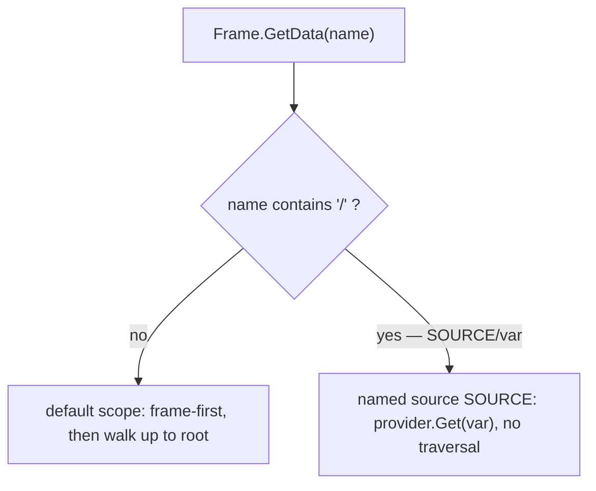

# SRD-010 — Addressable data access (named data sources)

| Field | Value |
|---|---|
| Status | Draft |
| Version | v.1 |
| Date | 2026-06-13 |
| Owner | Ruslan Gabitov |
| Implements | [ADR-010 v.2 Process Data Model](../design/ADR-010-process-data-model.md) |

This SRD lands [ADR-010 v.2](../design/ADR-010-process-data-model.md) §2.7: the data plane resolves reads against the **default scope** (plain names, walk-up) and **named data sources** (read-only pluggable providers, addressed by a path-qualified `SOURCE/var` with no traversal). `/` becomes the reserved path separator (prohibited in data names). The engine ships one provider — **`RUNTIME`** (the synthetic runtime variables) — and the mechanism is open to more. Two discovery helpers (`GetSources`, `List`) complete the read surface. The service reader (SRD-011) and condition/gateway resolution both read through this.

## 1. Background & motivation

### 1.1 Current state (verified against the code)

- **The data plane already has a reserved `RUNTIME` region — reachable only at its exact path.** `Scope` (`internal/scope/scope.go:26`) holds `scopes map[DataPath]map[string]data.Data`, an `rt RuntimeVarsSupplier` (`scope.go:28`) and its `rtPath` (`scope.go:30`). `Scope.GetData(from, name)` serves the runtime vars **only** when the lookup starts at the reserved path: `if p.rt != nil && from == p.rtPath { return p.rt.RuntimeVar(name) }` (`scope.go:88`); otherwise it walks `from`→root (`getData`, `scope.go:251`). `RuntimeVarsSegment = "RUNTIME"` (`runtimevars.go:11`), and the subtree is write-protected (`checkWritable`, `scope.go:315`).
- **`RuntimeVarsSupplier` resolves by name only — no enumeration.** Its sole method is `RuntimeVar(name string) (data.Data, error)` (`runtimevars.go`); `Instance.RuntimeVar` (`internal/instance/instance.go:495`) synthesizes `STARTED_AT`/`STATE`/`TRACKS_CNT` (`instance.go:37`). There is no way to list them.
- **Frame/env reads are plain-name only.** `Frame.GetData(name)` (`internal/scope/frame.go:172`) resolves frame-first then `f.plane.GetData(f.at, name)` — `f.at` is the node's container scope, never `rtPath`, so a plain `GetData("STARTED_AT")` never reaches a runtime var. `renv.RuntimeEnvironment` (`internal/renv/renv.go`) exposes `GetData`/`GetDataByID`, no path-qualified form, no discovery.
- **`/` is already the path separator but not reserved in names.** `DataPath` uses `PathSeparator = "/"` (`internal/scope/datapath.go:26`). Data names (`NewParameter` `io_spec_obj.go:80`, `NewProperty` `property.go:21`, `dataobjects.New` `data_object.go:36`) are not checked for `/`, so a name could collide with the separator.
- **No source abstraction or discovery.** There is one hard-wired supplier (`rt`), not a registry of named providers; nothing lists the available sources or a source's variables.

### 1.2 Why

ADR-010 v.2 §2.7 decides addressable data access: plain names read the default scope; `SOURCE/var` reads a named provider with no traversal; `/` is reserved; `RUNTIME` is the first provider; `GetSources`/`List` discover them. The engine has the pieces (the reserved `RUNTIME` region, the supplier) but no path-qualified resolution, no provider abstraction, no discovery, and no name reservation. This SRD adds them — the data-plane foundation the service reader (SRD-011) and conditions read through.

## 2. Goals & scope

### 2.1 Goals (in scope)

- **G1.** `/` is reserved: data names (`Parameter`, `Property`, `DataObject`) reject it at construction, with a self-identifying error.
- **G2.** A `SourceProvider` abstraction (resolve a variable by name + enumerate its names); the data plane holds **named sources** keyed by segment; `RUNTIME` is registered from the runtime-vars supplier (extended to enumerate). The mechanism admits more providers without changing callers.
- **G3.** **Path-qualified resolution.** `GetData("SOURCE/addr")` splits on the **first** `/`: it resolves `addr` (everything after, verbatim) at that source with **no parent traversal** — the address is the provider's own (a plain name for `RUNTIME`, or a dotted/JSONPath expression for a future JSON provider). A plain `GetData("var")` keeps the frame-first walk-up. A source never intersects the default scope (a process may keep its own `STATE`).
- **G4.** **Discovery.** `GetSources()` → the named sources (now `["RUNTIME"]`; the default scope is not listed); `List(path)` → the variable names at a source, `List("")` → the default scope's instance-variable names.
- **G5.** These reach the runtime through `renv.RuntimeEnvironment` (so SRD-011's reader and condition/gateway resolution use them); plain-name resolution and writes are unchanged.

### 2.2 Non-goals (deferred, each with a named home)

- **The public `service.DataReader` + polymorphic `Operation`** — SRD-011 (the service reader), which consumes this data-plane interface.
- **Concrete non-`RUNTIME` providers** (application/business data, JSON documents) — future; ADR-010 v.2 §2.7 fixes the mechanism, not specific providers.
- **Reserved-name *write* protection beyond the existing `rtPath` carve-out** — the `RUNTIME` subtree is already write-protected (`checkWritable`); no new write paths here.
- **Observe-from-outside / persistence of sources** — ADR-013 / the Persistence ADR.

## 3. Requirements

### 3.1 Functional

| # | Requirement |
|---|---|
| FR-1 | `NewParameter` (`io_spec_obj.go:80`), `NewProperty` (`property.go:21`), `dataobjects.New` (`data_object.go:36`) (and their `Must*` forms) reject a `name` containing `scope.PathSeparator` (`"/"`) with a classified, self-identifying error. |
| FR-2 | A `scope.SourceProvider` interface: `Get(addr string) (data.Data, error)` (where `addr` is the provider's own address, see FR-3) and `Names() []string`. `Scope` holds a registry of named sources (segment → provider). `RUNTIME` is registered from the runtime-vars supplier; `RuntimeVarsSupplier` gains `RuntimeVarNames() []string` (or a `SourceProvider`-shaped successor), and `Instance` enumerates `STARTED_AT`/`STATE`/`TRACKS_CNT`. `scope.New`'s supplier wiring is adapted accordingly. |
| FR-3 | `Frame.GetData(name)` (`frame.go:172`): split on the **first** `/` only. No `/` → the current frame-first walk-up over the default scope. `SOURCE/addr` → resolve at the named source `SOURCE` with **no walk-up**, passing `addr` (everything after the first `/`, **verbatim**) to `provider.Get(addr)`. The remainder is the **provider's own address space** — opaque to the data plane — so a provider may use a plain name, a dotted path, or a JSONPath expression (a JSON/business-data provider could resolve `BUSINESS/order.items[0].price`). `RUNTIME` treats `addr` as a flat variable name. `GetDataByID` is unchanged (id-based). |
| FR-4 | `Scope` and `Frame` gain `GetSources() []string` (the registered source segments) and `List(path string) ([]string, error)` (`path==""` → the default scope's instance-variable names; `path=="RUNTIME"` → the provider's `Names()`; unknown source → error). |
| FR-5 | `renv.RuntimeEnvironment` exposes the path-qualified `GetData` (already its method; behaviour extended via the frame) plus `GetSources()` / `List(path)`; `execEnv` (`internal/instance/execenv.go`) delegates to the frame. |
| FR-6 | Condition/gateway resolution (`data.Source` via `re`) uniformly resolves `SOURCE/var` (e.g. a gateway may read `RUNTIME/STATE`) — a consequence of routing through the same `GetData`. |

### 3.2 Non-functional

| # | Requirement |
|---|---|
| NFR-1 | Plain-name resolution and writes are unchanged: data / instance / scope / thresher tests pass; all five examples run. |
| NFR-2 | A source never intersects the default scope: a process property named `STATE` resolves to the user's value for `GetData("STATE")`, and `GetData("RUNTIME/STATE")` resolves the runtime variable. |
| NFR-3 | `make ci` green per milestone; diff-coverage ≥95 % (target 100 %) on touched files. |
| NFR-4 | Every new/changed public symbol carries a doc comment; new API validates inputs with self-identifying errors. |

## 4. Design & implementation plan

### 4.1 Sources and resolution

The default scope (container tree) is unchanged. A **named source** is a
`SourceProvider` registered under a segment; `RUNTIME` wraps the runtime-vars
supplier. A path-qualified name splits on the **first** `/`: the leading segment
selects the source, and everything after it is the **address the provider
interprets** (verbatim — a plain name, a dotted path, a JSONPath expression). The
data plane does not parse the address; it dispatches it. Resolution is at the
source with no walk-up, so user data and sources never collide.

### 4.2 Name reservation

`NewParameter`/`NewProperty`/`dataobjects.New` reject `/` in `name` (the lookups
split on it). A small shared check (e.g. `data` helper or inline) returns a
classified error naming the constructor and the offending name.

### 4.3 Discovery

`GetSources()` returns the registry's segments (now `["RUNTIME"]`). `List(path)`
returns variable names: `""` enumerates the default scope's instance variables
(walk the scope tree the execution sees), a source segment returns its
provider's `Names()`. A provider over an open address space (a future JSONPath
source) may return its enumerable top-level names or an empty list — `Names()` is
best-effort per provider; `RUNTIME` enumerates fully.

### 4.4 Milestones (each = one commit, CI-green)

- **M1 — reserve `/` in data names** (FR-1). The construction-time guard +
  tests. Independent and small.
- **M2 — source providers + path-qualified resolution** (FR-2/3). The
  `SourceProvider` interface, the `Scope` source registry, `RUNTIME` provider
  (supplier gains `Names`), `Frame.GetData` path parsing. Behaviour-preserving
  for plain names.
- **M3 — discovery + runtime surface** (FR-4/5/6). `GetSources`/`List` on
  `Scope`/`Frame`/`renv.RuntimeEnvironment` (`execEnv` delegation); regenerate
  the `mockrenv` mock; confirm conditions resolve `SOURCE/var`.

### 4.5 Tests (per milestone; details §5)

`io_spec`/`property`/`data_objects` tests (name with `/` rejected), `scope` tests
(path-qualified `GetData`; `RUNTIME/STATE` resolves; a default-scope `STATE`
shadows nothing; `GetSources`/`List`), `frame` tests (qualified vs plain),
`renv`/`execEnv` (discovery delegation), and the five examples as smoke.

## 5. Verification (Definition of Done)

| # | Check | Expectation |
|---|---|---|
| V1 | A `/`-containing name is rejected by `NewParameter`/`NewProperty`/`dataobjects.New` with a self-identifying error (FR-1). | rejected |
| V2 | `GetData("RUNTIME/STATE")` resolves the runtime variable with no walk-up; `GetData("STATE")` resolves a user property of that name (no intersection) (FR-2/3, NFR-2). | green |
| V3 | `GetSources()` → `["RUNTIME"]`; `List("RUNTIME")` → the runtime-var names; `List("")` → the default scope's instance-variable names; unknown source → error (FR-4). | green |
| V4 | `renv.RuntimeEnvironment` exposes path-qualified `GetData` + `GetSources`/`List`; `execEnv` delegates; mock regenerated (FR-5). | green |
| V5 | A gateway/condition resolves `RUNTIME/STATE` through `re` (FR-6). | green |
| V6 | Plain-name resolution + writes unchanged; data / instance / scope / thresher pass; all five examples run to exit 0 (NFR-1). | green |
| V7 | `make ci` green; diff-coverage ≥95 % on touched files (NFR-3). | pass |

## 6. Risks & regressions

- **Path parsing changing plain-name behaviour.** Only names containing `/`
  branch into source resolution; plain names keep the exact frame-first walk-up.
  V6 (suites + examples) is the backstop; FR-1 reserves `/` so no legitimate name
  reaches the split ambiguously.
- **Source/default-scope intersection.** Prevented by reserving `/` (a source
  address is unambiguous) and resolving qualified names *only* at the source
  (no walk). V2/NFR-2 assert both directions.
- **Conditions now resolving `SOURCE/var`.** A deliberate consequence (ADR-010
  v.2): gateways may read runtime/instance vars by path. Additive — plain-name
  condition resolution is unchanged (V6).
- **`RuntimeVarsSupplier` interface change.** Adding enumeration touches the
  supplier (Instance) and the mockable surface; the mock is regenerated (M3).

## 7. Implementation summary

*Post-landing placeholder — filled at the final audit with files, V-results, and milestone SHAs.*

## 8. References

- [ADR-010 v.2 Process Data Model](../design/ADR-010-process-data-model.md) — §2.7
  (addressable data access: default scope + named data sources, `GetSources`/`List`,
  `RUNTIME` provider, `/` reserved) this SRD lands.
- [SRD-007 v.1 Process Data Model](SRD-007-process-data-model.md) — the data plane
  (`Scope`/`Frame`), the reserved `RUNTIME` subtree and `RuntimeVarsSupplier` this
  SRD generalizes into a source-provider mechanism.
- [ADR-011 v.4 Process Data Flow](../design/ADR-011-process-data-flow.md) — §2.6
  the service reader (SRD-011) that consumes this access model; sideways reference.

## 9. Open questions

- None. The provider abstraction (`SourceProvider`: `Get`+`Names`), the
  path-qualified split (on the **first** `/`; the remainder is the provider's own
  verbatim address — JSONPath-capable), the `/` reservation in default-scope data
  names, and the discovery shape (`GetSources`/`List`, `List("")` = default scope)
  are decided above. Concrete non-`RUNTIME` providers are deferred (§2.2).

## Document History

| Version | Date | Author | Change |
|---|---|---|---|
| v.1 | 2026-06-13 | Ruslan Gabitov | Draft. Lands ADR-010 v.2 §2.7 (addressable data access): reserve `/` in default-scope data names; a `SourceProvider` abstraction + a data-plane source registry with `RUNTIME` (the runtime-vars supplier, gaining enumeration) as the first provider; path-qualified `GetData("SOURCE/addr")` that splits on the **first** `/` and dispatches the verbatim remainder to the provider (the provider owns its address space — a flat name for `RUNTIME`, JSONPath/dotted for a future JSON provider), resolving at the source with no traversal (plain names keep the walk-up); `GetSources()`/`List(path)` discovery; surfaced on `renv.RuntimeEnvironment` so the service reader (SRD-011) and condition/gateway resolution read through it. Runtime/instance variables thus need no special accessor — read by `RUNTIME/<var>`, non-intersecting with user data. Three milestones (reserve `/` → providers + path resolution → discovery + runtime surface). Defers the public service reader (SRD-011) and concrete non-RUNTIME providers. Implements ADR-010 v.2. |
