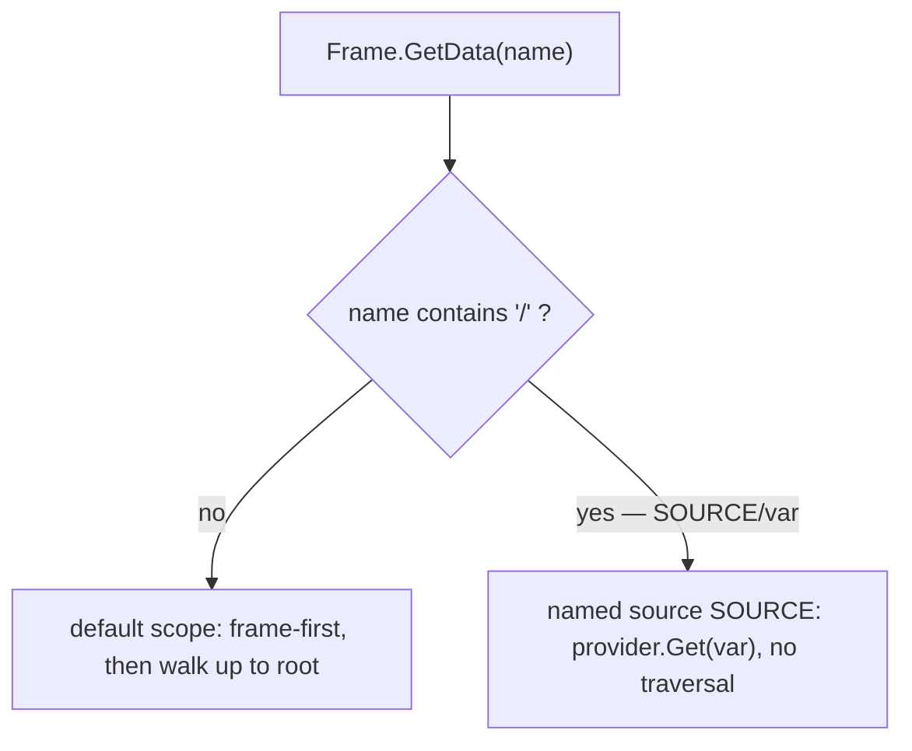

# SRD-010 — Адресуемый доступ к данным (именованные data sources)

| Поле | Значение |
|---|---|
| Статус | Принято |
| Версия | v.1 |
| Дата | 2026-06-13 |
| Владелец | Руслан Габитов |
| Реализует | [ADR-010 v.2 Process Data Model](../design/ADR-010-process-data-model.ru.md) |

Этот SRD приземляет [ADR-010 v.2](../design/ADR-010-process-data-model.ru.md) §2.7: data plane разрешает чтения как против **default scope** (плоские имена, обход вверх), так и против **именованных data sources** (read-only подключаемых провайдеров, адресуемых path-qualified-именем `SOURCE/var` без обхода). `/` становится зарезервированным разделителем пути (запрещён в именах данных). Движок поставляет один провайдер — **`RUNTIME`** (синтетические runtime-переменные) — и механизм открыт к расширению. Два хелпера обнаружения (`GetSources`, `List`) завершают read-поверхность. Сервис-reader (SRD-011) и резолвинг condition/gateway оба читают через это.

## 1. Контекст и мотивация

### 1.1 Текущее состояние (сверено с кодом)

- **У data plane уже есть зарезервированная область `RUNTIME` — достижимая только по её точному пути.** `Scope` (`internal/scope/scope.go:26`) держит `scopes map[DataPath]map[string]data.Data`, `rt RuntimeVarsSupplier` (`scope.go:28`) и его `rtPath` (`scope.go:30`). `Scope.GetData(from, name)` обслуживает runtime-переменные **только** когда поиск стартует с зарезервированного пути: `if p.rt != nil && from == p.rtPath { return p.rt.RuntimeVar(name) }` (`scope.go:88`); иначе идёт обход `from`→root (`getData`, `scope.go:251`). `RuntimeVarsSegment = "RUNTIME"` (`runtimevars.go:11`), и поддерево защищено от записи (`checkWritable`, `scope.go:315`).
- **`RuntimeVarsSupplier` разрешает только по имени — без перечисления.** Его единственный метод — `RuntimeVar(name string) (data.Data, error)` (`runtimevars.go`); `Instance.RuntimeVar` (`internal/instance/instance.go:495`) синтезирует `STARTED_AT`/`STATE`/`TRACKS_CNT` (`instance.go:37`). Перечислить их нечем.
- **Чтения из Frame/env — только по плоскому имени.** `Frame.GetData(name)` (`internal/scope/frame.go:172`) резолвит frame-first, затем `f.plane.GetData(f.at, name)` — `f.at` это container scope узла, никогда не `rtPath`, так что плоский `GetData("STARTED_AT")` никогда не достигнет runtime-переменной. `renv.RuntimeEnvironment` (`internal/renv/renv.go`) выставляет `GetData`/`GetDataByID`, без path-qualified-формы и без обнаружения.
- **`/` уже разделитель пути, но не зарезервирован в именах.** `DataPath` использует `PathSeparator = "/"` (`internal/scope/datapath.go:26`). Имена данных (`NewParameter` `io_spec_obj.go:80`, `NewProperty` `property.go:21`, `dataobjects.New` `data_object.go:36`) не проверяются на `/`, так что имя может столкнуться с разделителем.
- **Нет абстракции источника или обнаружения.** Есть один жёстко вшитый supplier (`rt`), а не реестр именованных провайдеров; ничто не перечисляет доступные источники или переменные источника.

### 1.2 Зачем

ADR-010 v.2 §2.7 решает адресуемый доступ к данным: плоские имена читают default scope; `SOURCE/var` читает именованный провайдер без обхода; `/` зарезервирован; `RUNTIME` — первый провайдер; `GetSources`/`List` их обнаруживают. У движка есть детали (зарезервированная область `RUNTIME`, supplier), но нет path-qualified-резолвинга, абстракции провайдера, обнаружения и резервирования имён. Этот SRD их добавляет — фундамент data plane, через который читают сервис-reader (SRD-011) и conditions.

## 2. Цели и охват

### 2.1 Цели (в охвате)

- **G1.** `/` зарезервирован: имена данных (`Parameter`, `Property`, `DataObject`) отвергают его при конструировании, с само-идентифицирующей ошибкой.
- **G2.** **Публичная** абстракция `data.SourceProvider` (разрешить переменную по адресу + перечислить её адреса), чтобы встраивающее приложение могло реализовать собственный источник — gobpm это библиотека, шов pluggability из ADR-010 v.2 §2.7 должен быть импортируемым. Data plane держит **именованные sources** по сегменту-ключу; `RUNTIME` регистрируется (внутренне) из runtime-vars supplier (расширенного перечислением). Механизм допускает новые провайдеры без изменения вызывающих.
- **G3.** **Path-qualified-резолвинг.** `GetData("SOURCE/addr")` разбивается по **первому** `/`: разрешает `addr` (всё после, дословно) в этом источнике **без обхода к родителю** — адрес это собственное пространство провайдера (плоское имя для `RUNTIME` или точечный/JSONPath для будущего JSON-провайдера). Плоский `GetData("var")` сохраняет frame-first обход вверх. Источник никогда не пересекается с default scope (процесс может держать свой `STATE`).
- **G4.** **Обнаружение.** `GetSources()` → именованные источники (сейчас `["RUNTIME"]`; default scope не перечисляется); `List(path)` → имена переменных источника, `List("")` → имена instance-переменных default scope.
- **G5.** Это доходит до рантайма через `renv.RuntimeEnvironment` (так что reader из SRD-011 и резолвинг condition/gateway их используют); резолвинг плоских имён и записи не меняются.

### 2.2 Не-цели (отложено, у каждой есть именованный дом)

- **Публичный `service.DataReader` + полиморфный `Operation`** — SRD-011 (сервис-reader), который потребляет этот интерфейс data plane.
- **Конкретные не-`RUNTIME` провайдеры** (данные приложения/бизнес-данные, JSON-документы) **и публичный API их регистрации** — будущее; ADR-010 v.2 §2.7 фиксирует механизм, а не конкретные провайдеры. Этот SRD публикует *контракт* `data.SourceProvider` (так что он реализуем уже сейчас), но регистрирует только `RUNTIME`, внутренне; поверхность engine/thresher для подключения провайдера приложением приземлится с первым конкретным внешним провайдером.
- **Защита от *записи* зарезервированных имён сверх существующего `rtPath`-исключения** — поддерево `RUNTIME` уже защищено от записи (`checkWritable`); новых путей записи здесь нет.
- **Наблюдение-снаружи / персистентность источников** — ADR-013 / Persistence ADR.

## 3. Требования

### 3.1 Функциональные

| # | Требование |
|---|---|
| FR-1 | `NewParameter` (`io_spec_obj.go:80`), `NewProperty` (`property.go:21`), `dataobjects.New` (`data_object.go:36`) (и их формы `Must*`) отвергают `name`, содержащее зарезервированный разделитель `data.PathSeparator` (`"/"`), классифицированной само-идентифицирующей ошибкой (`data.CheckName`). Разделитель каноничен в `data` и ре-экспортируется через `scope.PathSeparator` (`data` не может импортировать `scope` — `scope` уже импортирует `data`). |
| FR-2 | **Публичный** интерфейс `data.SourceProvider` (в `pkg/model/data`, рядом с `data.Source`): `Get(addr string) (data.Data, error)` (где `addr` — собственный адрес провайдера, см. FR-3) и `Names() []string` — публичный, чтобы встраивающее приложение могло реализовать провайдер. `Scope` держит реестр именованных источников (сегмент → `data.SourceProvider`); runtime-vars supplier адаптируется к провайдеру (`runtimeSource`, внутренний) и регистрируется под `RUNTIME`. `RuntimeVarsSupplier` получает `RuntimeVarNames() []string`, а `Instance` перечисляет `STARTED_AT`/`STATE`/`TRACKS_CNT`. Привязка supplier в `scope.New` адаптируется соответственно. (Внешняя *регистрация* провайдеров приложения отложена — см. §2.2.) |
| FR-3 | `Frame.GetData(name)` (`frame.go:172`): разбиение только по **первому** `/`. Нет `/` → текущий frame-first обход вверх по default scope. `SOURCE/addr` → разрешить в именованном источнике `SOURCE` **без обхода вверх**, передав `addr` (всё после первого `/`, **дословно**) в `provider.Get(addr)`. Остаток — **собственное адресное пространство провайдера** — непрозрачное для data plane — так что провайдер может использовать плоское имя, точечный путь или JSONPath-выражение (JSON/бизнес-провайдер мог бы разрешить `BUSINESS/order.items[0].price`). `RUNTIME` трактует `addr` как плоское имя переменной. `GetDataByID` без изменений (по id). |
| FR-4 | `Scope` и `Frame` получают `GetSources() []string` (зарегистрированные сегменты-источники) и `List(path string) ([]string, error)` (`path==""` → имена instance-переменных default scope; `path=="RUNTIME"` → `Names()` провайдера; неизвестный источник → ошибка). |
| FR-5 | `renv.RuntimeEnvironment` выставляет path-qualified `GetData` (уже его метод; поведение расширено через frame) плюс `GetSources()` / `List(path)`; `execEnv` (`internal/instance/execenv.go`) делегирует frame. |
| FR-6 | Резолвинг condition/gateway (`data.Source` через `re`) единообразно разрешает `SOURCE/var` (напр. gateway может прочитать `RUNTIME/STATE`) — следствие маршрутизации через тот же `GetData`. |

### 3.2 Нефункциональные

| # | Требование |
|---|---|
| NFR-1 | Резолвинг плоских имён и записи не меняются: тесты data / instance / scope / thresher проходят; все пять примеров запускаются. |
| NFR-2 | Источник никогда не пересекается с default scope: property процесса с именем `STATE` разрешается в значение пользователя при `GetData("STATE")`, а `GetData("RUNTIME/STATE")` разрешает runtime-переменную. |
| NFR-3 | `make ci` зелёный на каждом milestone; diff-coverage ≥95 % (цель 100 %) на затронутых файлах. |
| NFR-4 | Каждый новый/изменённый публичный символ снабжён doc-комментарием; новый API валидирует входы само-идентифицирующими ошибками. |

## 4. Дизайн и план реализации

### 4.1 Источники и резолвинг

Default scope (дерево контейнеров) не меняется. **Именованный source** — это
`data.SourceProvider`, зарегистрированный под сегментом; `RUNTIME` оборачивает
runtime-vars supplier (адаптер `runtimeSource`). Path-qualified-имя разбивается по
**первому** `/`: ведущий сегмент выбирает источник, а всё после него — **адрес,
который провайдер интерпретирует** (дословно — плоское имя, точечный путь,
JSONPath-выражение). Data plane не разбирает адрес; он его диспетчеризует.
Резолвинг — в источнике без обхода вверх, так что данные пользователя и источники
никогда не сталкиваются.

### 4.2 Резервирование имён

`NewParameter`/`NewProperty`/`dataobjects.New` отвергают `/` в `name` (поиски
разбиваются по нему). Небольшая общая проверка (хелпер в `data`) возвращает
классифицированную ошибку с именем конструктора и нарушающим именем.

### 4.3 Обнаружение

`GetSources()` возвращает сегменты реестра (сейчас `["RUNTIME"]`). `List(path)`
возвращает имена переменных: `""` перечисляет instance-переменные default scope
(обход дерева scope, которое видит исполнение), сегмент-источник возвращает
`Names()` своего провайдера. Провайдер над открытым адресным пространством
(будущий JSONPath-источник) может вернуть перечислимые верхнеуровневые имена или
пустой список — `Names()` best-effort для каждого провайдера; `RUNTIME`
перечисляет полностью.

### 4.4 Milestones (каждый = один коммит, CI-зелёный)

- **M1 — резервирование `/` в именах данных** (FR-1). Проверка при
  конструировании + тесты. Независимо и мало.
- **M2 — source-провайдеры + path-qualified-резолвинг** (FR-2/3). Публичный
  интерфейс `data.SourceProvider`, реестр источников `Scope`, провайдер
  `RUNTIME` (supplier получает `Names`), разбор пути в `Frame.GetData`.
  Сохраняет поведение для плоских имён.
- **M3 — обнаружение + runtime-поверхность** (FR-4/5/6). `GetSources`/`List` на
  `Scope`/`Frame`/`renv.RuntimeEnvironment` (делегирование `execEnv`);
  регенерация мока `mockrenv`; подтверждение, что conditions разрешают
  `SOURCE/var`.

### 4.5 Тесты (по milestone; детали §5)

Тесты `io_spec`/`property`/`data_objects` (имя с `/` отвергается), тесты `scope`
(path-qualified `GetData`; `RUNTIME/STATE` разрешается; `STATE` из default scope
ничего не затеняет; `GetSources`/`List`), тесты `frame` (qualified vs плоское),
`renv`/`execEnv` (делегирование обнаружения) и пять примеров как smoke.

## 5. Верификация (Definition of Done)

| # | Проверка | Ожидание |
|---|---|---|
| V1 | Имя с `/` отвергается `NewParameter`/`NewProperty`/`dataobjects.New` само-идентифицирующей ошибкой (FR-1). | отвергнуто |
| V2 | `GetData("RUNTIME/STATE")` разрешает runtime-переменную без обхода вверх; `GetData("STATE")` разрешает property пользователя с этим именем (без пересечения) (FR-2/3, NFR-2). | зелёный |
| V3 | `GetSources()` → `["RUNTIME"]`; `List("RUNTIME")` → имена runtime-переменных; `List("")` → имена instance-переменных default scope; неизвестный источник → ошибка (FR-4). | зелёный |
| V4 | `renv.RuntimeEnvironment` выставляет path-qualified `GetData` + `GetSources`/`List`; `execEnv` делегирует; мок регенерирован (FR-5). | зелёный |
| V5 | Gateway/condition разрешает `RUNTIME/STATE` через `re` (FR-6). | зелёный |
| V6 | Резолвинг плоских имён + записи без изменений; data / instance / scope / thresher проходят; все пять примеров завершаются с exit 0 (NFR-1). | зелёный |
| V7 | `make ci` зелёный; diff-coverage ≥95 % на затронутых файлах (NFR-3). | pass |

## 6. Риски и регрессии

- **Разбор пути меняет поведение плоских имён.** Только имена с `/` уходят в
  source-резолвинг; плоские имена сохраняют точный frame-first обход вверх.
  V6 (наборы тестов + примеры) — подстраховка; FR-1 резервирует `/`, так что ни
  одно легитимное имя не попадает в разбиение неоднозначно.
- **Пересечение source/default-scope.** Предотвращено резервированием `/`
  (адрес источника однозначен) и резолвингом qualified-имён *только* в источнике
  (без обхода). V2/NFR-2 утверждают обе стороны.
- **Conditions теперь разрешают `SOURCE/var`.** Намеренное следствие (ADR-010
  v.2): gateways могут читать runtime/instance-переменные по пути. Аддитивно —
  резолвинг condition по плоскому имени не меняется (V6).
- **Изменение интерфейса `RuntimeVarsSupplier`.** Добавление перечисления
  затрагивает supplier (Instance) и mockable-поверхность; мок регенерируется (M3).

## 7. Сводка реализации

Приземлено на `feat/service-data-reader` в трёх milestone-коммитах плюс
doc-поправка, всё `make ci`-зелёное со **100 %** diff-coverage на затронутых
файлах.

### 7.1 Milestones

| Milestone | Коммит | Охват |
|---|---|---|
| M1 — резервирование `/` | `2e1d738` | `data.PathSeparator` + `data.CheckName`; guard'ы в `NewParameter`/`NewProperty`/`dataobjects.New`; `scope.PathSeparator` ре-экспортирует канонический констант. |
| (doc) публичный шов | `189844f` | Поправка SRD: `SourceProvider` перенесён в публичный `pkg/model/data`; FR-1 выровнен на `data.PathSeparator`. |
| M2 — провайдеры + резолвинг | `b97e49b` | публичный `data.SourceProvider`; реестр `Scope.sources` + адаптер `runtimeSource` (`RUNTIME`); `Scope.GetSource`; разбиение по первому `/` в `Frame.GetData`; `RuntimeVarsSupplier.RuntimeVarNames`; `Instance.RuntimeVarNames`. |
| M3 — обнаружение + renv | `835d9a1` | `GetSources`/`List` на `Scope`/`Frame` (обход default scope через `namesFrom`); поверхность `renv.RuntimeEnvironment` + делегирование `execEnv`; регенерация `mockrenv`. |

### 7.2 Файлы

- `pkg/model/data/name.go` (новый) — `PathSeparator`, `CheckName`.
- `pkg/model/data/source.go` (новый) — публичный `SourceProvider`.
- `pkg/model/data/{io_spec_obj,property}.go`, `pkg/model/data_objects/data_object.go` — guard'ы имён.
- `internal/scope/{scope,frame,runtimevars}.go` — реестр, `GetSource`, разбор пути, обнаружение, адаптер.
- `internal/renv/renv.go` — поверхность интерфейса; `internal/instance/{execenv,instance}.go` — делегирование + перечисление.

### 7.3 Результаты верификации

| Проверка | Результат |
|---|---|
| V1 отвержение имён с `/` | ✅ `TestCheckName` + reject-кейсы конструкторов |
| V2 `RUNTIME/STATE` vs default scope | ✅ `TestFrameSourceResolution` (вкл. одноимённое непересечение, NFR-2) |
| V3 `GetSources`/`List` | ✅ `TestDiscovery`, `TestFrameDiscovery` |
| V4 renv-поверхность + мок | ✅ `TestExecEnvDataSurface`; `mockrenv` регенерирован |
| V5 gateway читает `RUNTIME/STATE` | ✅ `TestExecEnvDataSurface` (через `Find`) |
| V6 наборы тестов + 5 примеров exit 0 | ✅ `make ci` зелёный; все примеры отработали |
| V7 `make ci` + diff-coverage | ✅ 100 % изменённых строк (min 95 %) |

### 7.4 Отклонения от плана §4

- Хелпер `splitSource` отброшен в пользу инлайна `strings.Cut` в
  `Frame.GetData` (предпочтение линтера; «before = вся строка при промахе» у
  `Cut` безвредно, так как читается только `ok`).
- `namesFrom` собирает scope-предков по префиксу пути, а не обходом `DropTail`
  — тот же набор имён, и это избегает недостижимой защитной ветки (100 %
  покрываемо).

## 8. Ссылки

- [ADR-010 v.2 Process Data Model](../design/ADR-010-process-data-model.ru.md) — §2.7
  (адресуемый доступ к данным: default scope + именованные data sources,
  `GetSources`/`List`, провайдер `RUNTIME`, `/` зарезервирован), который этот SRD
  приземляет.
- [SRD-007 v.1 Process Data Model](SRD-007-process-data-model.ru.md) — data plane
  (`Scope`/`Frame`), зарезервированное поддерево `RUNTIME` и `RuntimeVarsSupplier`,
  которые этот SRD обобщает в механизм source-провайдеров.
- [ADR-011 v.4 Process Data Flow](../design/ADR-011-process-data-flow.ru.md) — §2.6
  сервис-reader (SRD-011), потребляющий эту модель доступа; боковая ссылка.

## 9. Открытые вопросы

- Нет. Публичная абстракция провайдера (`data.SourceProvider`: `Get`+`Names`),
  path-qualified-разбиение (по **первому** `/`; остаток — собственный дословный
  адрес провайдера — JSONPath-способный), резервирование `/` в именах данных
  default scope и форма обнаружения (`GetSources`/`List`, `List("")` = default
  scope) решены выше. Конкретные не-`RUNTIME` провайдеры отложены (§2.2).

## История документа

| Версия | Дата | Автор | Изменение |
|---|---|---|---|
| v.1 | 2026-06-13 | Руслан Габитов | Принято (приземлено). Приземляет ADR-010 v.2 §2.7 (адресуемый доступ к данным): резервирование `/` в именах данных default scope; **публичная** абстракция `data.SourceProvider` (в `pkg/model/data`, чтобы встраивающее приложение могло реализовать свой источник) + реестр источников data plane с `RUNTIME` (runtime-vars supplier, получающий перечисление) как первым провайдером; path-qualified `GetData("SOURCE/addr")`, разбивающийся по **первому** `/` и диспетчеризующий дословный остаток провайдеру (провайдер владеет своим адресным пространством — плоское имя для `RUNTIME`, JSONPath/точечное для будущего JSON-провайдера), резолвинг в источнике без обхода (плоские имена сохраняют обход вверх); обнаружение `GetSources()`/`List(path)`; выставлено на `renv.RuntimeEnvironment`, так что сервис-reader (SRD-011) и резолвинг condition/gateway читают через это. Runtime/instance-переменные тем самым не нуждаются в специальном аксессоре — читаются по `RUNTIME/<var>`, не пересекаясь с данными пользователя. Три milestone (резервирование `/` → провайдеры + резолвинг пути → обнаружение + runtime-поверхность). Откладывает публичный сервис-reader (SRD-011) и конкретные не-RUNTIME провайдеры. Реализует ADR-010 v.2. |
