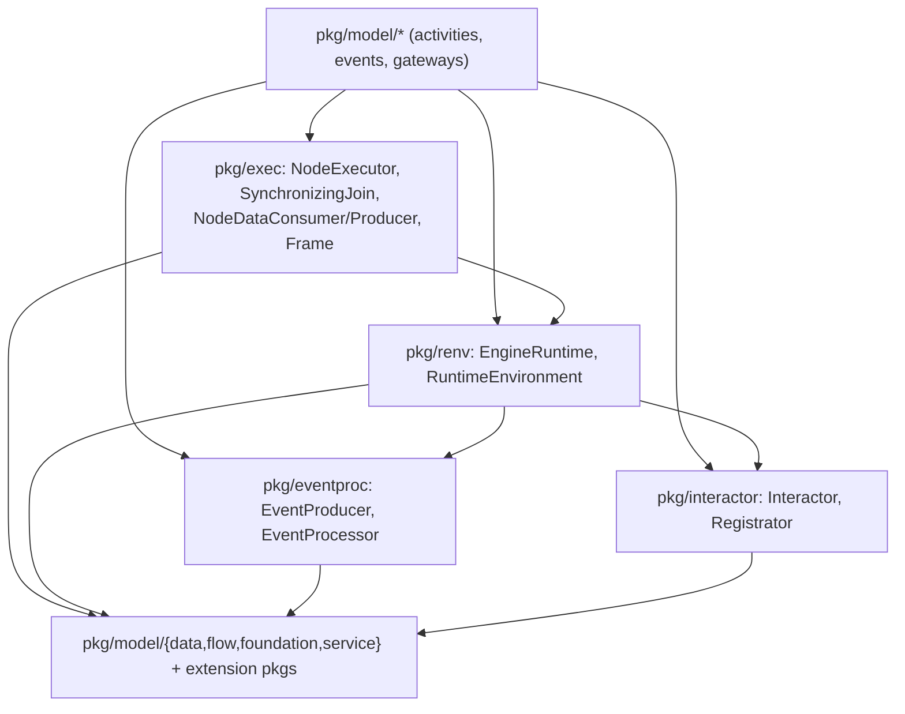

# SRD-012 — Execution layering: relocate the execution contracts to public packages

| Field | Value |
|---|---|
| Status | Draft |
| Version | v.1 |
| Date | 2026-06-14 |
| Owner | Ruslan Gabitov |
| Implements | [ADR-012 v.1 Execution Layering](../design/ADR-012-execution-layering.md) |

This SRD lands [ADR-012 v.1](../design/ADR-012-execution-layering.md): make `pkg/model` import **zero** `internal/*` by moving the contracts the model implements/consumes into **public** packages, while the implementations stay in `internal/*`. Dispatch is unchanged (closed node set — no registry). A CI depguard rule `pkg/model ↛ internal` makes the boundary permanent. This is an encapsulation refactor: **no behaviour changes.**

## 1. Background & motivation

### 1.1 Current state (verified against the code)

`pkg/model` element types implement the runtime's execution interfaces directly against internal types, so eight non-test model files import five `internal/*` packages:

- **The node-executor contracts** — `internal/exec.NodeExecutor` (`exec.go:11`: `Exec(ctx, re renv.RuntimeEnvironment) ([]*flow.SequenceFlow, error)`) and `SynchronizingJoin` (`exec.go:25`: `NodeExecutor` + `Arrive(...)`). `internal/exec` imports `internal/renv`.
- **The per-execution environment** — `internal/renv.RuntimeEnvironment` (`renv.go:22`) embeds public `engrenv.EngineRuntime` + `data.Source` and adds `InstanceID`/`EventProducer`/`RenderRegistrator`/`GetData`/`GetDataByID`/`GetSources`/`List`/`Put`. Its doc comment says it stays internal **because** it exposes `eventproc.EventProducer` and `interactor.Registrator` (`renv.go:18-21`).
- **The data-binding surface** — `internal/scope.NodeDataConsumer` (`roles.go:31`: `LoadData(ctx, *Frame)`) / `NodeDataProducer` (`roles.go:42`: `UploadData(ctx, *Frame)`), taking the **concrete** `*scope.Frame` (`frame.go:25`). The model calls a narrow slice of `Frame`: `InstantiateInputs` (`frame.go:97`), `InstantiateOutputs` (`frame.go:103`), `LoadProperties` (`frame.go:111`), `Inputs`/`Outputs` (`frame.go:140/145`), `GetDataByID` (`frame.go:219`).
- **The event producer** — `internal/eventproc.EventProducer` (`eventproc.go:28`: `RegisterEvent`/`UnregisterEvent`/`PropagateEvent`). The model uses **only** `EventProducer` (`end.go:136`, `event.go:504`) — not `EventProcessor`/`EventWaiter`/`EventHub`.
- **The interaction registrator** — `internal/interactor.Interactor` (`interactor.go:15`) + `Registrator` (`interactor.go:27`), used by `user_task.go` (implements `Interactor` `:218`; calls `re.RenderRegistrator().Register` `:184`). The whole `internal/interactor` package imports **only** public `pkg/model/*`.

Model files importing `internal/*` (the worklist): `activities/{task,service_task,user_task}.go`, `events/{event,end,start}.go`, `gateways/{exclusive,parallel}.go`.

### 1.2 Why this is a defect (audit 2.1)

`pkg/model` is the **public modeling API**, yet it imports `internal/*` and exposes internal, user-unconstructable types in exported method signatures (`Exec(ctx, renv.RuntimeEnvironment)`, `LoadData(ctx, *scope.Frame)`). Go's own `internal` rule doesn't catch it (both live under the module root), so the coupling accreted silently — ADR-003 §4.4 prescribed a depguard direction rule that was never added. It compiles and has no cycle, but the public surface leaks machinery and the model can't be used (or compiled) without the runtime. ADR-012 decides the fix; this SRD lands it.

## 2. Goals & scope

### 2.1 Goals (in scope)

- **G1.** `pkg/model` imports **zero** `internal/*` (enforced by depguard), and no exported model signature carries an internal type.
- **G2.** The five contracts move to public homes; `internal/*` keeps the implementations, which keep satisfying the public interfaces.
- **G3.** Dispatch is unchanged — the track type-asserts to the (now public) interfaces and calls them; no registry, no behaviour change.
- **G4.** A CI depguard rule fails any future `pkg/model → internal` import.

### 2.2 Non-goals (deferred, each with a named home)

- **An executor registry / visitor / user-defined node kinds** — explicitly out of scope (ADR-012 §1.4); closed node set.
- **Redesigning data-flow, eventing, or lifecycle semantics** — relocation only; ADR-010/011 semantics untouched.
- **Splitting the `Instance` god-object** (audit 2.3) — sibling refactor.
- **Unifying the executor env and the data-binding `Frame`** — kept as two contracts (§4.2); instantiation methods don't belong on the executor's env.

## 3. Requirements

### 3.1 Functional

| # | Requirement |
|---|---|
| FR-1 | New public package **`pkg/exec`** holds `NodeExecutor`, `SynchronizingJoin`, `NodeDataConsumer`, `NodeDataProducer`, and a new **`Frame` interface** (the narrow set the model calls: `InstantiateInputs([]*data.Parameter) error`, `InstantiateOutputs([]*data.Parameter) error`, `LoadProperties([]*data.Property) error`, `Inputs() []*data.Parameter`, `Outputs() []*data.Parameter`, `GetDataByID(string) (data.Data, error)` — final set verified against call sites at landing). `NodeDataConsumer.LoadData`/`NodeDataProducer.UploadData` take the `Frame` **interface**, not `*scope.Frame`. `internal/exec` and `internal/scope/roles.go` are retired/relocated. |
| FR-2 | `internal/renv.RuntimeEnvironment` is promoted to **`pkg/renv.RuntimeEnvironment`**, embedding `EngineRuntime` (already in `pkg/renv`) + `service.DataReader` (the read half, SRD-011) + `data.Source`, and adding `Put`/`InstanceID`/`EventProducer`/`RenderRegistrator`. `internal/renv` is retired. |
| FR-3 | New public package **`pkg/eventproc`** holds `EventProducer` (+ the `EventProcessor` its `RegisterEvent` signature references). `EventHub`/`EventWaiter`/`EventWaiterState` and the eventhub implementation **stay internal**. |
| FR-4 | `internal/interactor` is moved wholesale to **`pkg/interactor`** (`Interactor`, `Registrator`, `RenderController`) — it already imports only public `pkg/model/*`. |
| FR-5 | The eight `pkg/model` files re-point their imports from `internal/*` to `pkg/exec`/`pkg/renv`/`pkg/eventproc`/`pkg/interactor`. After this, `grep -rl "gobpm/internal" pkg/model` (non-test) is empty, and every exported model signature carries only public types. |
| FR-6 | The internal implementations keep satisfying the public interfaces, unchanged in behaviour: `internal/instance.execEnv`/`Instance` (`pkg/renv.RuntimeEnvironment` + `pkg/eventproc.EventProducer`), `internal/scope.Frame` (`pkg/exec.Frame`), `internal/eventproc/eventhub.EventHub`, the injected `Registrator`. The track's dispatch (`track.go:230/434/444/474/646/661`) re-points to the public interface names only — same type-assert-and-call. |
| FR-7 | A depguard rule **`model-no-internal`** in `.golangci.yml` denies `pkg/model/** → github.com/dr-dobermann/gobpm/internal`. |

### 3.2 Non-functional

| # | Requirement |
|---|---|
| NFR-1 | **No behaviour change.** Existing `internal/instance` / `pkg/model` / `pkg/thresher` tests pass with only import-path edits; all `var _ Contract = (*Type)(nil)` assertions hold against the relocated interfaces; the five examples run to exit 0. |
| NFR-2 | No import cycles: the public homes import only leaves (`pkg/model/{data,flow,foundation,service}`, the extension packages); `pkg/exec → pkg/renv` is one-directional. |
| NFR-3 | `make ci` green per milestone; diff-coverage ≥95 % on touched files (mostly N/A — relocated interfaces carry no statements and moved implementations keep their existing tests). |
| NFR-4 | Doc comments on every relocated exported symbol are preserved/updated; a model-only build (importing `pkg/model` without the runtime) compiles. |

## 4. Design & implementation plan

### 4.1 Public-package layout

The arrows are all one-directional and leaf-ward; no package imports `pkg/model/{activities,events,gateways}`, so the graph stays acyclic (the same shape as today, with the contracts lifted into public space). `internal/{instance,scope,eventproc/eventhub}` import these public packages and provide the implementations — the dependency now runs runtime → public-contracts → leaves, never model → internal.

### 4.2 Two contracts, not one (env vs Frame)

`Exec` receives the **environment** (`pkg/renv.RuntimeEnvironment`: read + `Put` + services + identity), built per-execution by the track wrapping the frame. `LoadData`/`UploadData` receive the **`Frame`** and call **instantiation** methods (`InstantiateInputs/Outputs`, `LoadProperties`) that have no place on the executor's env. These are two genuinely distinct surfaces over the same underlying frame (the ADR-010 consumer/producer/execute protocol), so they stay two interfaces; the env embeds `service.DataReader` so the read half is named once.

### 4.3 Dispatch is unchanged

The track keeps constructing the concrete `*scope.Frame` and the `execEnv`, and dispatches by asserting the node to the public `pkg/exec.NodeExecutor`/`SynchronizingJoin`/`NodeDataConsumer`/`NodeDataProducer` and calling it (`track.go:230/434/474/646/661`). Only the package qualifier changes; the concrete `*scope.Frame` satisfies the public `pkg/exec.Frame` interface where one is expected.

### 4.4 Milestones (each = one commit, `make ci` green; a contract is published-and-re-pointed in one move so the tree always compiles)

- **M1 — publish the leaf contracts.** Move `internal/interactor` → `pkg/interactor`; carve `EventProducer`(+`EventProcessor`) into `pkg/eventproc`. Re-point internal importers (`internal/renv`, `instance.go`, `eventhub.go`, `thresher.go`) and the model files that use only these (`user_task.go`, `end.go`, `event.go`). Pure relocation.
- **M2 — publish the per-execution env.** Promote `RuntimeEnvironment` → `pkg/renv` (embed `service.DataReader` + the public eventproc/interactor types). Re-point `internal/exec`, `internal/instance/execenv.go`, and the model executors. Retire `internal/renv`.
- **M3 — publish the executor + data-binding contracts.** Move `NodeExecutor`/`SynchronizingJoin` and the `Frame` interface + `NodeDataConsumer/Producer` into `pkg/exec` (re-typing the data-binding to the `Frame` interface). Re-point `track.go` and `internal/scope` (Frame implements the interface).
- **M4 — re-point the remaining model files.** Finish the eight-file sweep so `grep -rl gobpm/internal pkg/model` (non-test) is empty. (M1–M3 already re-point most as they move; M4 mops up any residual.)
- **M5 — enforce + prove.** Add the `model-no-internal` depguard rule; add a model-only build/test importing `pkg/model` without the runtime. `make ci` green = boundary enforced.

### 4.5 Tests (per milestone)

Relocation is behaviour-preserving, so the test work is mostly **import-path edits** to the existing suites that referenced the moved contracts (instance, scope, eventproc, model). New assertions: `var _ pkg-iface = (*impl)(nil)` for each relocated interface against its internal implementation (compile-time proof the impls still satisfy the public contracts); and a **model-only build check** (M5) — a tiny test/build target importing `pkg/model/...` that fails if it transitively pulls `internal/*`. The five examples are the behaviour backstop (NFR-1).

## 5. Verification (Definition of Done)

| # | Check | Expectation |
|---|---|---|
| V1 | `grep -rl "gobpm/internal" pkg/model` excluding `_test.go` returns nothing (FR-5). | empty |
| V2 | `pkg/exec`/`pkg/renv`/`pkg/eventproc`/`pkg/interactor` hold the relocated contracts; `internal/exec` and `internal/renv` retired; EventHub/Waiter still internal (FR-1/2/3/4). | green |
| V3 | Every relocated interface has a `var _ iface = (*internalImpl)(nil)` assertion that compiles (execEnv→RuntimeEnvironment, Instance→EventProducer, scope.Frame→exec.Frame) (FR-6). | green |
| V4 | The track dispatches via the public interfaces unchanged; no exported model signature carries an internal type (FR-5/6). | green |
| V5 | `.golangci.yml` has `model-no-internal`; `make ci` green (FR-7). | pass |
| V6 | Behaviour unchanged: `internal/instance` / `pkg/model` / `pkg/thresher` suites pass; all five examples exit 0 (NFR-1). | green |
| V7 | A model-only build importing `pkg/model` without the runtime compiles (NFR-4); no import cycles (NFR-2). | green |

## 6. Risks & regressions

- **Concrete→interface for `Frame` (the one non-mechanical move).** `NodeDataConsumer/Producer` go from `*scope.Frame` to a `Frame` interface; the concrete `*scope.Frame` must satisfy it (a `var _` assertion in `internal/scope` guards this). If a model node calls a `Frame` method omitted from the interface, it won't compile — caught at M3, fixed by widening the interface to the verified call set.
- **Broad, mechanical import churn.** Many files change import lines across M1–M4; the risk is a missed re-point leaving a dangling `internal` import — caught by the depguard rule (M5) and the compiler at each milestone.
- **`var _` assertions drifting.** If an impl stops satisfying a relocated interface, the assertion fails to compile — a wanted signal, not a silent break.
- **Test files still importing old paths.** depguard ignores `_test.go`, but the compiler does not — test imports are updated alongside each milestone.

## 7. Implementation summary

*Post-landing placeholder — filled at the final audit with files, V-results, and milestone SHAs.*

## 8. References

- [ADR-012 v.1 Execution Layering](../design/ADR-012-execution-layering.md) — the decision this lands (model = public contracts, no registry, depguard).
- [ADR-002 v.1 Extension Architecture](../design/ADR-002-extension-architecture.md) — the public/internal split (§3.3), `EngineRuntime`/`RuntimeEnvironment` (§4.3), and §4.7 versioning the relocated contracts join.
- [ADR-003 v.1 Module Layout](../design/ADR-003-module-layout.md) — §4.4 import-direction rules; this SRD adds the missing `pkg/model ↛ internal` depguard rule.
- [ADR-011 v.5 Process Data Flow](../design/ADR-011-process-data-flow.md) — §2.6 deferred placement of the public reader/node-executor contracts here; `service.DataReader` (SRD-011) is the read half the env embeds.
- [SRD-011 v.1 Go-operation service reader](SRD-011-go-operation-service-reader.md) — published `service.DataReader` (the structural read peer); sideways reference.

## 9. Open questions

- None. The public-package layout (`pkg/exec` consolidating node-execution + data-binding; `pkg/renv` env promotion embedding `service.DataReader`; top-level `pkg/eventproc`/`pkg/interactor`), the two-contracts decision (env vs `Frame`, not unified), the unchanged dispatch, and the five-milestone staging are decided above. The exact `Frame`-interface method set is verified against call sites at M3 (widen to whatever the model calls); commit granularity within a milestone is the milestone-plan gate's.

## Document History

| Version | Date | Author | Change |
|---|---|---|---|
| v.1 | 2026-06-14 | Ruslan Gabitov | Draft. Lands ADR-012 v.1: relocate the five execution contracts the model touches to public packages — `pkg/exec` (`NodeExecutor`/`SynchronizingJoin`/`NodeDataConsumer`/`NodeDataProducer`/`Frame` interface), `pkg/renv.RuntimeEnvironment` (promoted, embeds `service.DataReader`), `pkg/eventproc.EventProducer`(+`EventProcessor`), `pkg/interactor` (moved wholesale) — while `internal/*` keeps the implementations (execEnv/Instance, scope.Frame, eventhub) satisfying the now-public interfaces. `pkg/model` imports zero `internal/*`; dispatch unchanged (closed node set, no registry); a `model-no-internal` depguard rule enforces the boundary. Env and `Frame` kept as two contracts. Encapsulation refactor — no behaviour change. Five milestones (publish leaves → env → executor+data-binding → re-point model → depguard+model-only build). Implements ADR-012 v.1. |
