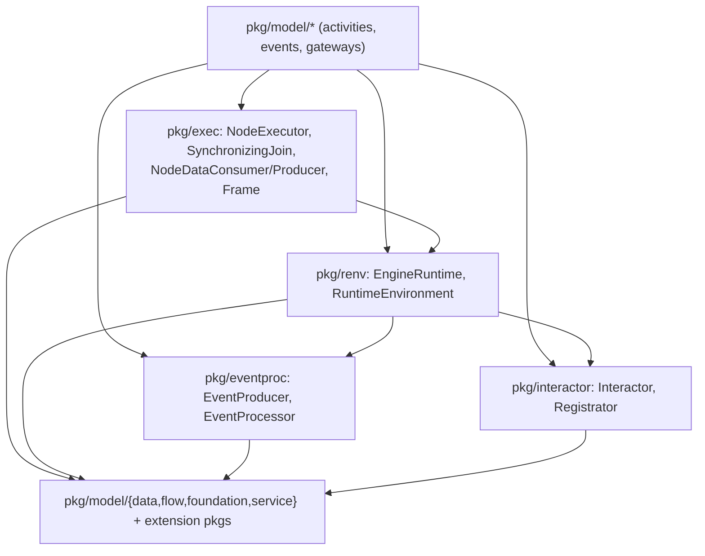

# SRD-012 — Слоистость исполнения: вынос execution-контрактов в публичные пакеты

| Поле | Значение |
|---|---|
| Статус | Принято |
| Версия | v.1 |
| Дата | 2026-06-14 |
| Владелец | Руслан Габитов |
| Реализует | [ADR-012 v.1 Execution Layering](../design/ADR-012-execution-layering.ru.md) |

Этот SRD приземляет [ADR-012 v.1](../design/ADR-012-execution-layering.ru.md): сделать так, чтобы `pkg/model` импортировал **ноль** `internal/*`, перенеся контракты, которые модель реализует/потребляет, в **публичные** пакеты, а реализации оставив в `internal/*`. Диспетчеризация не меняется (закрытый набор узлов — без реестра). CI-правило depguard `pkg/model ↛ internal` делает границу постоянной. Это рефакторинг инкапсуляции: **поведение не меняется.**

## 1. Контекст и мотивация

### 1.1 Текущее состояние (сверено с кодом)

Типы элементов `pkg/model` реализуют execution-интерфейсы рантайма напрямую против внутренних типов, поэтому восемь не-тестовых файлов модели импортируют пять пакетов `internal/*`:

- **Контракты node-executor** — `internal/exec.NodeExecutor` (`exec.go:11`: `Exec(ctx, re renv.RuntimeEnvironment) ([]*flow.SequenceFlow, error)`) и `SynchronizingJoin` (`exec.go:25`: `NodeExecutor` + `Arrive(...)`). `internal/exec` импортирует `internal/renv`.
- **Per-execution-окружение** — `internal/renv.RuntimeEnvironment` (`renv.go:22`) встраивает публичный `engrenv.EngineRuntime` + `data.Source` и добавляет `InstanceID`/`EventProducer`/`RenderRegistrator`/`GetData`/`GetDataByID`/`GetSources`/`List`/`Put`. Doc-комментарий говорит, что он остаётся внутренним **потому что** выставляет `eventproc.EventProducer` и `interactor.Registrator` (`renv.go:18-21`).
- **Поверхность data-binding** — `internal/scope.NodeDataConsumer` (`roles.go:31`: `LoadData(ctx, *Frame)`) / `NodeDataProducer` (`roles.go:42`: `UploadData(ctx, *Frame)`), принимающие **конкретный** `*scope.Frame` (`frame.go:25`). Модель вызывает узкий срез `Frame`: `InstantiateInputs` (`frame.go:97`), `InstantiateOutputs` (`frame.go:103`), `LoadProperties` (`frame.go:111`), `Inputs`/`Outputs` (`frame.go:140/145`), `GetDataByID` (`frame.go:219`).
- **Event-producer** — `internal/eventproc.EventProducer` (`eventproc.go:28`: `RegisterEvent`/`UnregisterEvent`/`PropagateEvent`). Модель использует **только** `EventProducer` (`end.go:136`, `event.go:504`) — не `EventProcessor`/`EventWaiter`/`EventHub`.
- **Interaction-registrator** — `internal/interactor.Interactor` (`interactor.go:15`) + `Registrator` (`interactor.go:27`), используется `user_task.go` (реализует `Interactor` `:218`; вызывает `re.RenderRegistrator().Register` `:184`). Весь пакет `internal/interactor` импортирует **только** публичный `pkg/model/*`.

Файлы модели, импортирующие `internal/*` (worklist): `activities/{task,service_task,user_task}.go`, `events/{event,end,start}.go`, `gateways/{exclusive,parallel}.go`.

### 1.2 Почему это дефект (аудит 2.1)

`pkg/model` — **публичный modeling-API**, но он импортирует `internal/*` и выставляет внутренние, неконструируемые пользователем типы в экспортируемых сигнатурах (`Exec(ctx, renv.RuntimeEnvironment)`, `LoadData(ctx, *scope.Frame)`). Собственное правило `internal` в Go это не ловит (оба под корнем модуля), так что связанность накопилась незаметно — ADR-003 §4.4 предписал правило направления depguard, которое так и не добавили. Оно компилируется и без цикла, но публичная поверхность протекает машинерией, и модель нельзя использовать (или компилировать) без рантайма. ADR-012 решает фикс; этот SRD его приземляет.

## 2. Цели и охват

### 2.1 Цели (в охвате)

- **G1.** `pkg/model` импортирует **ноль** `internal/*` (enforced depguard'ом), и ни одна экспортируемая сигнатура модели не несёт внутренний тип.
- **G2.** Пять контрактов переезжают в публичные дома; `internal/*` хранит реализации, которые продолжают удовлетворять публичным интерфейсам.
- **G3.** Диспетчеризация не меняется — трек type-assert'ит к (теперь публичным) интерфейсам и вызывает их; без реестра, без изменения поведения.
- **G4.** CI-правило depguard валит любой будущий импорт `pkg/model → internal`.

### 2.2 Не-цели (отложено, у каждой именованный дом)

- **Реестр исполнителей / visitor / пользовательские виды узлов** — явно вне охвата (ADR-012 §1.4); закрытый набор узлов.
- **Передизайн семантики data-flow, событий или жизненного цикла** — только перенос; семантика ADR-010/011 не тронута.
- **Расщепление god-object'а `Instance`** (аудит 2.3) — sibling-рефакторинг.
- **Объединение executor-env и data-binding `Frame`** — оставлены как два контракта (§4.2); методы инстанцирования не место на env исполнителя.

## 3. Требования

### 3.1 Функциональные

| # | Требование |
|---|---|
| FR-1 | Новый публичный пакет **`pkg/exec`** держит `NodeExecutor`, `SynchronizingJoin`, `NodeDataConsumer`, `NodeDataProducer` и новый **интерфейс `Frame`** (узкий набор, который зовёт модель: `InstantiateInputs([]*data.Parameter) error`, `InstantiateOutputs([]*data.Parameter) error`, `LoadProperties([]*data.Property) error`, `Inputs() []*data.Parameter`, `Outputs() []*data.Parameter`, `GetDataByID(string) (data.Data, error)` — финальный набор сверяется с call-sites при приземлении). `NodeDataConsumer.LoadData`/`NodeDataProducer.UploadData` принимают **интерфейс** `Frame`, а не `*scope.Frame`. `internal/exec` и `internal/scope/roles.go` упразднены/перенесены. |
| FR-2 | `internal/renv.RuntimeEnvironment` повышается до **`pkg/renv.RuntimeEnvironment`**, встраивая `EngineRuntime` (уже в `pkg/renv`) + `service.DataReader` (read-половина, SRD-011) + `data.Source`, и добавляя `Put`/`InstanceID`/`EventProducer`/`RenderRegistrator`. `internal/renv` упразднён. |
| FR-3 | Новый публичный пакет **`pkg/eventproc`** держит `EventProducer` (+ `EventProcessor`, на который ссылается сигнатура `RegisterEvent`). `EventHub`/`EventWaiter`/`EventWaiterState` и реализация eventhub **остаются внутренними**. |
| FR-4 | `internal/interactor` целиком переезжает в **`pkg/interactor`** (`Interactor`, `Registrator`, `RenderController`) — он уже импортирует только публичный `pkg/model/*`. |
| FR-5 | Восемь файлов `pkg/model` переключают импорты с `internal/*` на `pkg/exec`/`pkg/renv`/`pkg/eventproc`/`pkg/interactor`. После этого `grep -rl "gobpm/internal" pkg/model` (не-тест) пуст, и каждая экспортируемая сигнатура модели несёт только публичные типы. |
| FR-6 | Внутренние реализации продолжают удовлетворять публичным интерфейсам без изменения поведения: `internal/instance.execEnv`/`Instance` (`pkg/renv.RuntimeEnvironment` + `pkg/eventproc.EventProducer`), `internal/scope.Frame` (`pkg/exec.Frame`), `internal/eventproc/eventhub.EventHub`, инжектируемый `Registrator`. Диспетчеризация трека (`track.go:230/434/444/474/646/661`) переключается только на публичные имена интерфейсов — тот же type-assert-и-вызов. |
| FR-7 | Правило depguard **`model-no-internal`** в `.golangci.yml` запрещает `pkg/model/** → github.com/dr-dobermann/gobpm/internal`. |

### 3.2 Нефункциональные

| # | Требование |
|---|---|
| NFR-1 | **Поведение не меняется.** Существующие тесты `internal/instance` / `pkg/model` / `pkg/thresher` проходят лишь с правками путей импорта; все ассерты `var _ Contract = (*Type)(nil)` держатся против перенесённых интерфейсов; пять примеров завершаются с exit 0. |
| NFR-2 | Нет import-циклов: публичные дома импортируют только листья (`pkg/model/{data,flow,foundation,service}`, extension-пакеты); `pkg/exec → pkg/renv` однонаправленно. |
| NFR-3 | `make ci` зелёный на каждом milestone; diff-coverage ≥95 % на затронутых файлах (в основном N/A — перенесённые интерфейсы не несут statement'ов, перенесённые реализации хранят свои тесты). |
| NFR-4 | Doc-комментарии на каждом перенесённом экспортируемом символе сохранены/обновлены; model-only-сборка (импорт `pkg/model` без рантайма) компилируется. |

## 4. Дизайн и план реализации

### 4.1 Раскладка публичных пакетов

Все стрелки однонаправленные и в сторону листьев; ни один пакет не импортирует `pkg/model/{activities,events,gateways}`, так что граф остаётся ацикличным (та же форма, что сейчас, с контрактами, поднятыми в публичное пространство). `internal/{instance,scope,eventproc/eventhub}` импортируют эти публичные пакеты и дают реализации — зависимость теперь идёт runtime → публичные-контракты → листья, никогда model → internal.

### 4.2 Два контракта, не один (env vs Frame)

`Exec` получает **окружение** (`pkg/renv.RuntimeEnvironment`: чтение + `Put` + сервисы + identity), строящееся per-execution треком вокруг frame. `LoadData`/`UploadData` получают **`Frame`** и зовут методы **инстанцирования** (`InstantiateInputs/Outputs`, `LoadProperties`), которым нет места на env исполнителя. Это две действительно различные поверхности над одним и тем же frame (протокол consumer/producer/execute из ADR-010), так что они остаются двумя интерфейсами; env встраивает `service.DataReader`, чтобы read-половина именовалась один раз.

### 4.3 Диспетчеризация не меняется

Трек по-прежнему конструирует конкретный `*scope.Frame` и `execEnv` и диспетчеризует, ассертя узел к публичным `pkg/exec.NodeExecutor`/`SynchronizingJoin`/`NodeDataConsumer`/`NodeDataProducer` и вызывая (`track.go:230/434/474/646/661`). Меняется только квалификатор пакета; конкретный `*scope.Frame` удовлетворяет публичному интерфейсу `pkg/exec.Frame` там, где он ожидается.

### 4.4 Milestones (каждый = один коммит, `make ci` зелёный; контракт публикуется-и-переключается за один ход, так что дерево всегда компилируется)

- **M1 — публикуем листовые контракты.** Переносим `internal/interactor` → `pkg/interactor`; вырезаем `EventProducer`(+`EventProcessor`) в `pkg/eventproc`. Переключаем внутренних импортёров и файлы модели, использующие только их. Чистый перенос.
- **M2 — публикуем per-execution-env.** Повышаем `RuntimeEnvironment` → `pkg/renv` (встраивая `service.DataReader` + публичные eventproc/interactor). Переключаем `internal/exec`, `internal/instance/execenv.go` и исполнителей модели. Упраздняем `internal/renv`.
- **M3 — публикуем executor + data-binding-контракты.** Переносим `NodeExecutor`/`SynchronizingJoin` и интерфейс `Frame` + `NodeDataConsumer/Producer` в `pkg/exec` (перетипизируя data-binding на интерфейс `Frame`). Переключаем `track.go` и `internal/scope` (Frame реализует интерфейс).
- **M4 — переключаем оставшиеся файлы модели.** Завершаем проход по восьми файлам, чтобы `grep -rl gobpm/internal pkg/model` (не-тест) был пуст. (M1–M3 уже переключают большинство по ходу; M4 добирает остаток.)
- **M5 — enforce + доказательство.** Добавляем правило depguard `model-no-internal`; добавляем model-only-сборку/тест. `make ci` зелёный = граница enforced.

### 4.5 Тесты (по milestone)

Перенос сохраняет поведение, так что тестовая работа — в основном **правки путей импорта** в существующих наборах, ссылавшихся на перенесённые контракты. Новые ассерты: `var _ pkg-iface = (*impl)(nil)` для каждого перенесённого интерфейса против его внутренней реализации (compile-time-доказательство, что реализации всё ещё удовлетворяют публичным контрактам); и **model-only-проверка** — крошечный target, падающий, если `pkg/model/...` транзитивно тянет `internal/*`. Пять примеров — поведенческая подстраховка (NFR-1).

## 5. Верификация (Definition of Done)

| # | Проверка | Ожидание |
|---|---|---|
| V1 | `grep -rl "gobpm/internal" pkg/model` без `_test.go` пуст (FR-5). | пусто |
| V2 | `pkg/exec`/`pkg/renv`/`pkg/eventproc`/`pkg/interactor` держат перенесённые контракты; `internal/exec` и `internal/renv` упразднены; EventHub/Waiter всё ещё внутренние (FR-1/2/3/4). | зелёный |
| V3 | У каждого перенесённого интерфейса есть ассерт `var _ iface = (*internalImpl)(nil)`, который компилируется (execEnv→RuntimeEnvironment, Instance→EventProducer, scope.Frame→exec.Frame) (FR-6). | зелёный |
| V4 | Трек диспетчеризует через публичные интерфейсы без изменений; ни одна экспортируемая сигнатура модели не несёт внутренний тип (FR-5/6). | зелёный |
| V5 | В `.golangci.yml` есть `model-no-internal`; `make ci` зелёный (FR-7). | pass |
| V6 | Поведение не меняется: наборы `internal/instance` / `pkg/model` / `pkg/thresher` проходят; все пять примеров exit 0 (NFR-1). | зелёный |
| V7 | Model-only-сборка `pkg/model` без рантайма компилируется (NFR-4); нет import-циклов (NFR-2). | зелёный |

## 6. Риски и регрессии

- **Конкретное→интерфейс для `Frame` (единственный не-механический ход).** `NodeDataConsumer/Producer` переходят с `*scope.Frame` на интерфейс `Frame`; конкретный `*scope.Frame` должен ему удовлетворять (ассерт `var _` в `internal/scope` это охраняет). Если узел модели зовёт метод `Frame`, пропущенный в интерфейсе, — не скомпилируется; ловится на M3, чинится расширением интерфейса до проверенного набора вызовов.
- **Широкий механический churn импортов.** Многие файлы меняют строки импорта на M1–M4; риск — пропущенное переключение, оставляющее висячий импорт `internal`; ловится depguard'ом (M5) и компилятором на каждом milestone.
- **Дрейф ассертов `var _`.** Если реализация перестаёт удовлетворять перенесённому интерфейсу, ассерт не компилируется — желаемый сигнал, не тихая поломка.
- **Тестовые файлы, всё ещё импортирующие старые пути.** depguard игнорирует `_test.go`, но компилятор — нет; импорты в тестах обновляются вместе с каждым milestone.

## 7. Сводка реализации

Приземлено на `feat/srd-012-execution-layering` в пяти milestone-коммитах, всё `make ci`-зелёное; сохраняет поведение (5 примеров завершаются с exit 0 неизменно).

### 7.1 Milestones

| Milestone | Коммит | Охват |
|---|---|---|
| M1a | `9dac9ff` | `internal/interactor` → `pkg/interactor` (перенос всего пакета). |
| M1b | `e9b5c73` | `EventProducer`/`EventProcessor` → `pkg/eventproc` (вырезка; `internal/eventproc` ре-экспортирует их как type-алиасы, так что его `EventHub`/`EventWaiter` и внутренние потребители не тронуты; переключается только `event.go` модели). |
| M2 | `53ddfe5` | `RuntimeEnvironment` повышен до `pkg/renv` (встраивает `service.DataReader`); `internal/renv` упразднён. |
| M3 | `c74a78b` | `NodeExecutor`/`SynchronizingJoin` + data-binding `NodeDataConsumer`/`NodeDataProducer` + новый интерфейс `Frame` → `pkg/exec` (конкретный `*scope.Frame` → интерфейс); `internal/exec` упразднён; **завершил перенос модели**. |
| M4 | `f7f6f35` | Правило depguard `model-no-internal` (проверено, что срабатывает на одноразовом нарушении). |

Планировавшийся в SRD M4 «добор» схлопнулся — M3 завершил переключение, так что финальный milestone — только правило depguard.

### 7.2 Файлы

- Новые публичные: `pkg/exec/{exec,frame}.go`, `pkg/renv/runtimeenvironment.go`, `pkg/eventproc/eventproc.go`, `pkg/interactor/interactor.go`.
- Упразднены: `internal/exec/`, `internal/renv/`, `internal/scope/roles.go`.
- Переключены: `internal/instance/{track,execenv}.go`, `internal/eventproc/eventproc.go` (алиасы), `internal/scope/exec_assert.go` (новый — `var _ exec.Frame`), 8 файлов элементов `pkg/model`, `.golangci.yml`, `.mockery.yaml`.

### 7.3 Результаты верификации

| Проверка | Результат |
|---|---|
| V1 `grep gobpm/internal pkg/model` (не-тест) пуст | ✅ + `go list -deps` не показывает транзитивного internal |
| V2 контракты в публичных домах; `internal/exec`+`internal/renv` упразднены; EventHub/Waiter внутренние | ✅ |
| V3 ассерты удовлетворения компилируются (`execEnv`→`RuntimeEnvironment`, `scope.Frame`→`exec.Frame`) | ✅ |
| V4 диспетчеризация без изменений; нет внутренних типов в экспортируемых сигнатурах модели | ✅ |
| V5 depguard `model-no-internal` добавлен; срабатывает на нарушении; `make ci` зелёный | ✅ |
| V6 наборы `internal/instance`/`pkg/model`/`pkg/thresher` проходят; 5 примеров exit 0 | ✅ |
| V7 model-only-доказательство (нет транзитивного internal); нет циклов | ✅ |

### 7.4 Отклонения от плана §4

- **M1b использовал type-алиасы** в `internal/eventproc` (ре-экспорт публичных
  `EventProducer`/`EventProcessor`) вместо переключения каждого внутреннего
  потребителя — тот же layering-итог (модель импортирует публичный пакет),
  гораздо меньше churn; внутренние потребители остаются на `internal/eventproc`.
- **M3 завершил FR-5**, так что планировавшееся переключение M4 оказалось пустым,
  и финальный milestone — только depguard.
- Тестовому стабу (`failNode` в `executenode_test.go`) понадобилось обновить
  сигнатуру `LoadData`/`UploadData` на `exec.Frame` — иначе он тихо переставал
  удовлетворять роли (тест failure-stages это поймал).

## 8. Ссылки

- [ADR-012 v.1 Execution Layering](../design/ADR-012-execution-layering.ru.md) — решение, которое этот SRD приземляет (модель = публичные контракты, без реестра, depguard).
- [ADR-002 v.1 Extension Architecture](../design/ADR-002-extension-architecture.ru.md) — public/internal-split (§3.3), `EngineRuntime`/`RuntimeEnvironment` (§4.3) и §4.7-версионирование, к которому присоединяются перенесённые контракты.
- [ADR-003 v.1 Module Layout](../design/ADR-003-module-layout.md) — §4.4 правила направления импортов; этот SRD добавляет недостающее правило depguard `pkg/model ↛ internal`.
- [ADR-011 v.5 Process Data Flow](../design/ADR-011-process-data-flow.ru.md) — §2.6 отложил размещение публичных reader/node-executor-контрактов сюда; `service.DataReader` (SRD-011) — read-половина, которую встраивает env.
- [SRD-011 v.1 Go-operation service reader](SRD-011-go-operation-service-reader.ru.md) — опубликовал `service.DataReader` (структурный read-peer); боковая ссылка.

## 9. Открытые вопросы

- Нет. Раскладка публичных пакетов (`pkg/exec`, объединяющий node-execution + data-binding; повышение env в `pkg/renv` со встраиванием `service.DataReader`; верхнеуровневые `pkg/eventproc`/`pkg/interactor`), решение о двух контрактах (env vs `Frame`, не объединены), неизменная диспетчеризация и пяти-milestone-стейджинг решены выше. Точный набор методов интерфейса `Frame` сверяется с call-sites на M3; гранулярность коммитов внутри milestone — забота гейта плана milestone'ов.

## История документа

| Версия | Дата | Автор | Изменение |
|---|---|---|---|
| v.1 | 2026-06-15 | Руслан Габитов | Принято (приземлено, 5 milestone'ов M1a/M1b/M2/M3/M4, make ci зелёный, 5 примеров exit 0). Приземляет ADR-012 v.1: перенос пяти execution-контрактов, которые трогает модель, в публичные пакеты — `pkg/exec` (`NodeExecutor`/`SynchronizingJoin`/`NodeDataConsumer`/`NodeDataProducer`/интерфейс `Frame`), `pkg/renv.RuntimeEnvironment` (повышен, встраивает `service.DataReader`), `pkg/eventproc.EventProducer`(+`EventProcessor`), `pkg/interactor` (перенесён целиком) — а `internal/*` хранит реализации (execEnv/Instance, scope.Frame, eventhub), удовлетворяющие теперь-публичным интерфейсам. `pkg/model` импортирует ноль `internal/*`; диспетчеризация без изменений (закрытый набор узлов, без реестра); правило depguard `model-no-internal` enforce'ит границу. Env и `Frame` оставлены как два контракта. Рефакторинг инкапсуляции — без изменения поведения. Пять milestone'ов (листья → env → executor+data-binding → переключение модели → depguard+model-only). Реализует ADR-012 v.1. |
