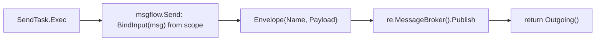
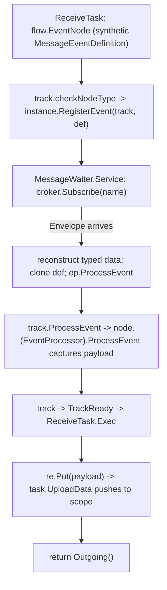

# SRD-013 — SendTask & ReceiveTask: broker-backed message handling (tasks)

| Field | Value |
|---|---|
| Status | Draft |
| Version | v.1 |
| Date | 2026-06-15 |
| Owner | Ruslan Gabitov |
| Implements | [ADR-014 v.1 Message Handling](../design/ADR-014-message-handling.md) |

This SRD lands the **task half** of [ADR-014 v.1](../design/ADR-014-message-handling.md): the `SendTask` and `ReceiveTask` executors. A `SendTask` binds its `Message` from scope and **publishes** it to the `MessageBroker`; a `ReceiveTask` registers a new **`MessageWaiter`** that subscribes to the broker and, on arrival, binds the payload into scope and completes. Phase-1 correlation is **match-by-message-name**. The **throw/catch message events** that share ADR-014's producer/consumer seam are a **separate follow-up SRD**; so are correlation-key derivation and message-triggered instantiation (ADR-014 §2.6–§2.8).

## 1. Background & motivation

### 1.1 Current state (verified against the code)

- **`SendTask`/`ReceiveTask` are field-only stubs** — `pkg/model/activities/send_task.go:8`, `receive_task.go:8`. They hold a `Message`, a vestigial `service.Operation`, an `Implementation` string (and `ReceiveTask.Instantiate`), embed `task`, and implement **no executor** (`grep` for `func (st *SendTask)` / `(rt *ReceiveTask)` → none). The `Operation` field has **zero readers** (`grep .Operation` → only `errs.OperationFailed` and the unrelated `MessageEventDefinition.Operation()`); it is safe to remove (ADR-014 §2.8).
- **The executor pattern is public (SRD-012).** `pkg/exec.NodeExecutor.Exec(ctx, re renv.RuntimeEnvironment) ([]*flow.SequenceFlow, error)`; the reference is `ServiceTask.Exec` (`service_task.go:75`) which binds via `service.BindInput`, `re.Put`s the result, returns `st.Outgoing()`. The embedded `task` already implements `exec.NodeDataConsumer.LoadData`/`NodeDataProducer.UploadData` (`task.go:84/219`) and the output-association push (`updateOutputs`, `task.go:268`) — so a task inherits full data binding once it gains `Exec`.
- **The broker exists, name-match is already its behaviour.** `pkg/messaging.MessageBroker` — `Publish(ctx, Envelope) error`, `Subscribe(ctx, name, correlationKey string) (<-chan Envelope, error)`; `Envelope{Payload any; Name string; CorrelationKey string}`. `membroker` buffers undelivered envelopes (subscribe-before-publish per ADR-006 §2.4) and matches name + (empty-or-equal key). An executor reaches it via `re.MessageBroker()` (`pkg/renv.EngineRuntime.MessageBroker()`).
- **`service.BindInput`** (`pkg/model/service/operation.go:252`) reads a `*bpmncommon.Message`'s item from scope by id (Ready-checked) and returns the bound item — the exact send-side bind-from-scope, reusable.
- **The MessageWaiter is the missing keystone.** `internal/eventproc/eventhub/waiters/waiters.go:47` `CreateWaiter` switches on `eDef.Type()` with **only** a `flow.TriggerTimer` case; `TriggerMessage` falls through to `ObjectNotFound`. The reference is `TimerWaiter` (`timer.go`): constructed with `(hub, ep, eDef, id, rt renv.EngineRuntime)`; `Service(ctx)` spawns a goroutine; on fire it snapshots processors under lock, releases, calls `ep.ProcessEvent(ctx, eDef)` unlocked, then `hub.RemoveWaiter`. Waiters are registered by `EventHub.RegisterEvent` (`eventhub.go:101`, which calls `w.Service`).
- **The track's event wait/resume loop is in place.** `track.checkNodeType` (`track.go:279`) registers a `flow.EventNode`'s definitions via `instance.RegisterEvent(track, def)` and parks the track in `TrackWaitForEvent`; `track.ProcessEvent` (`track.go:674`) resumes it on fire — it casts the **current node** to `eventproc.EventProcessor` (`track.go:693`) and calls `node.ProcessEvent`, then unregisters and returns the track to `TrackReady`, after which `Exec` runs. **No real model node implements `eventproc.EventProcessor` today** (the cast is latent, exercised only by mocked timer tests) — `ReceiveTask` will be the first.
- **Output binding reuse.** A node that `re.Put`s a Ready datum has it pushed to scope by the inherited `task.UploadData` through output associations (`oa.UpdateSource`, `association.go:123`) — the same way `ServiceTask` commits its result. No new association API is needed.

### 1.2 Why

ADR-014 decided message handling: messages travel the broker, the EventHub stays the internal wait machine, and a `MessageWaiter` bridges them. The pieces exist (broker, executor pattern, wait/resume loop, data binding) but `SendTask`/`ReceiveTask` are unrunnable and no `MessageWaiter` exists — so a gobpm process cannot send or receive a message. This SRD lands the task executors and the waiter, giving the engine its first cross-participant capability.

## 2. Goals & scope

### 2.1 Goals (in scope)

- **G1.** Drop the vestigial `service.Operation` field from `SendTask`/`ReceiveTask` (ADR-014 §2.8).
- **G2.** A `SendTask` is an `exec.NodeExecutor` that binds its `Message` from scope and **publishes** an `Envelope` to `re.MessageBroker()`, then completes (synchronous to its lifecycle, no reply-wait).
- **G3.** A `MessageWaiter` (peer of `TimerWaiter`) subscribes the broker for a message name and fires the event on arrival; the `TriggerMessage` case is wired into the waiter registry. It cleans up its goroutine + subscription on `Stop`/ctx (no leak).
- **G4.** A `ReceiveTask` is a `flow.EventNode` + `eventproc.EventProcessor` + `exec.NodeExecutor`: it registers a `MessageWaiter`, parks the track, captures the arrived payload on fire, and on resume binds it into scope (reusing `task.UploadData`) and completes.
- **G5.** Phase-1 correlation = **match-by-message-name** (the broker's default); the `Envelope` carries the message item's value, and the consumer reconstructs a typed datum for the message's `ItemDefinition`.
- **G6.** The shared producer choreography lands as a helper in a new public `pkg/model/msgflow` package; a runnable send→receive example demonstrates it.

### 2.2 Non-goals (deferred, each with a named home)

- **Throw/catch message events** + the `MessageProducer`/`MessageConsumer` **interface declarations** — the **next SRD** (the message-events landing). The interfaces gain their second implementor there; SRD-013 ships the *shared choreography helper(s)* the events will also call, but not the (single-implementor, non-polymorphic) interfaces. This also closes `catch_upload_test.go`'s WS-C3 TODO there.
- **Correlation-key derivation** (CorrelationSubscription → key) — a follow-up Correlation SRD (ADR-014 §2.6/§2.8); the `Envelope.CorrelationKey` field already carries a key.
- **Message-triggered instantiation** (`ReceiveTask.Instantiate` / start message event spawning an instance) — deferred with the thresher message-routing work (ADR-014 §2.7); the `Instantiate` field stays but is not acted on.
- **EventHub `WaitGroup` sole-ownership shutdown** (ADR-006 §2.5) — ADR-006's own implementing SRD; SRD-013 only guarantees the `MessageWaiter` cleans up *itself* on `Stop`/ctx.
- **Service-operation-backed send** — the dropped `Operation` field; re-introduced only when needed (ADR-014 §2.8).

## 3. Requirements

### 3.1 Functional

| # | Requirement |
|---|---|
| FR-1 | Remove the `service.Operation` field from `SendTask` and `ReceiveTask` (and the now-unused `service` import). No code references it (§1.1). |
| FR-2 | New public package **`pkg/model/msgflow`**: a `Send(ctx, re renv.RuntimeEnvironment, msg *bpmncommon.Message) error` helper — bind `msg` from scope (`service.BindInput`), build a `messaging.Envelope{Name: msg.Name(), Payload: <item value>}`, `re.MessageBroker().Publish`. It imports only public packages (`pkg/messaging`, `pkg/renv`, `pkg/model/{bpmncommon,service,data}`); no cycle. |
| FR-3 | `SendTask` gains `NewSendTask(name, msg, opts…)`, `Exec(ctx, re) ([]*flow.SequenceFlow, error)` (calls `msgflow.Send`, returns `Outgoing()`), `Clone()`, `TaskType()→flow.SendTask`, and `var _ exec.NodeExecutor = (*SendTask)(nil)`. |
| FR-4 | New **`MessageWaiter`** (`internal/eventproc/eventhub/waiters/message.go`) mirroring `TimerWaiter`: constructed `(hub, ep, eDef, id, rt renv.EngineRuntime)`; `Service(ctx)` subscribes `rt.MessageBroker().Subscribe(ctx, name, "")` and runs a goroutine; on the first matching `Envelope` it reconstructs a typed `data.Data` for the message's `ItemDefinition`, clones the event definition carrying it, and fires `ep.ProcessEvent` (TimerWaiter's lock discipline), then `hub.RemoveWaiter`; `Stop()`/ctx terminate the goroutine and release the subscription. `waiters.go`'s `CreateWaiter` gains `case flow.TriggerMessage`. |
| FR-5 | `ReceiveTask` implements `flow.EventNode` (synthesizing a `MessageEventDefinition` from its `Message` so `checkNodeType` registers it and parks the track), `eventproc.EventProcessor` (`ProcessEvent` captures the arrived payload into a per-execution field), and `exec.NodeExecutor` (`Exec` `re.Put`s the captured payload as a Ready datum for the message item, returns `Outgoing()`; the inherited `task.UploadData` pushes it to scope). Constructor `NewReceiveTask`, `Clone`, `TaskType()→flow.ReceiveTask`, interface assertions. |
| FR-6 | Phase-1 correlation: the broker matches on **message name** (empty correlation key). The producer sets `Envelope.Name = msg.Name()` and `Payload` = the bound item's value; the `MessageWaiter` reconstructs a typed datum from `Payload` using the message's `ItemDefinition`. |
| FR-7 | A runnable example (`examples/message-send-receive` or equivalent) starts a process with a `SendTask` and a `ReceiveTask` (and the broker) and shows the message flowing end to end, exit 0. |

### 3.2 Non-functional

| # | Requirement |
|---|---|
| NFR-1 | The `MessageWaiter`'s goroutine and broker subscription are released on `Stop()` and ctx-cancel — no goroutine/subscription leak (verified by a waiter test). Existing `internal/instance` / `eventhub` / model / thresher suites pass. |
| NFR-2 | No payload values in logs — log message name, key, item ids, states only (ADR-010/011/014 masking). |
| NFR-3 | `make ci` green per milestone; diff-coverage ≥95 % (target 100 %) on touched files. |
| NFR-4 | `pkg/model/msgflow` imports no `internal/*` (depguard); every new exported symbol carries a doc comment; new constructors validate inputs with self-identifying errors. |

## 4. Design & implementation plan

### 4.1 Send: bind → publish

`SendTask` mirrors `ServiceTask`: it never waits (a request/reply is a send node then a receive node — the diagram shows the wait). `msgflow.Send` is the shared producer choreography the throw message event will also call (next SRD).

### 4.2 Receive: wait (via MessageWaiter) → capture → bind

`ReceiveTask` plugs into the **existing** wait/resume loop by being a `flow.EventNode` (so `checkNodeType` registers its synthetic `MessageEventDefinition` and parks the track) and an `eventproc.EventProcessor` (so `track.ProcessEvent`'s node cast at `track.go:693` resolves — `ReceiveTask` is the first real node to implement it). No new track path. The payload travels broker → `MessageWaiter` (reconstructs typed data) → cloned event definition → `ProcessEvent` (captures) → `Exec` (`re.Put`) → inherited `task.UploadData` → scope.

### 4.3 The Envelope payload contract (phase-1)

The broker's `Payload any` meets the typed data plane at the waiter: the producer puts the **value** (`item.Structure().Get(ctx)`); the `MessageWaiter` reconstructs a typed `data.Data` for the message's `ItemDefinition` (it has the def via the `MessageEventDefinition`), so the consumer side sees properly-typed data. The `any` opacity is confined to the broker hop.

### 4.4 Milestones (each = one commit, `make ci` green)

- **M1 — drop `Operation`; add `msgflow.Send`.** Remove the vestigial field from both tasks; add `pkg/model/msgflow` with the `Send` helper. Pure additions/removals; nothing references the field.
- **M2 — `SendTask` publishes.** `NewSendTask`, `Exec`, `Clone`, `TaskType`, assertion; unit test against an in-memory broker (publish observed).
- **M3 — `MessageWaiter`.** `waiters/message.go` + the `TriggerMessage` case; waiter unit test mirroring `timer_test.go` (mock `EventProcessor` + in-mem broker; assert fire + cleanup, no leak).
- **M4 — `ReceiveTask` waits + binds.** `flow.EventNode` + `eventproc.EventProcessor` + `Exec`; implement the node-level `ProcessEvent` (first real one — verify the timer path still works). Integration test: publish then receive, payload reaches scope.
- **M5 — example + DoD.** A send→receive example; smoke it (exit 0); coverage gate.

### 4.5 Tests

`pkg/model/msgflow` (Send against a fake/in-mem broker), `SendTask.Exec` (publishes the bound payload), `MessageWaiter` (fires on envelope, cleans up — mirrors `timer_test.go`), `ReceiveTask` end-to-end (RegisterEvent → waiter → ProcessEvent → Exec → scope-bound), and the example as smoke. Cover the node-level `ProcessEvent` path (latent until now).

## 5. Verification (Definition of Done)

| # | Check | Expectation |
|---|---|---|
| V1 | `SendTask`/`ReceiveTask` have no `Operation` field; no dangling refs; `service` import dropped where unused (FR-1). | green |
| V2 | `SendTask.Exec` binds its message from scope and publishes an `Envelope` to the broker; returns its outgoing flows (FR-2/3). | green |
| V3 | `MessageWaiter` subscribes the broker, fires `ProcessEvent` on a matching envelope, and releases its goroutine + subscription on `Stop`/ctx (FR-4, NFR-1); `TriggerMessage` is wired. | green |
| V4 | `ReceiveTask` registers a waiter, parks the track, captures the payload on fire, and binds it into scope on resume (FR-5); the node-level `ProcessEvent` cast resolves. | green |
| V5 | Phase-1 name-match: a published message with the receiver's name is delivered; the payload is typed per the message item (FR-6). | green |
| V6 | A send→receive example runs to exit 0; existing suites pass (FR-7, NFR-1). | green |
| V7 | `make ci` green; diff-coverage ≥95 % on touched files; `msgflow` imports no internal (NFR-3/4). | pass |

## 6. Risks & regressions

- **First real node-level `ProcessEvent`.** The `track.go:693` cast was latent (mock-only). `ReceiveTask` is the first real implementor — M4 verifies the timer path is unaffected and the cast resolves. If a non-EventProcessor catch node ever reaches that path it errors loudly (existing behaviour).
- **Waiter subscription/goroutine leak.** A `MessageWaiter` that doesn't release its broker subscription + goroutine on `Stop`/ctx leaks (the §2.5 concern, scoped to per-waiter here). NFR-1's test guards it; the full hub `WaitGroup` ownership is ADR-006's SRD.
- **Payload typing across the broker `any` hop.** A malformed/mistyped payload surfaces when the waiter reconstructs the typed datum — handled with a classified error, not a silent mis-bind (§4.3).
- **`MessageEventDefinition` cloner.** The payload-carrying fire needs the def to satisfy `flow.EventDefCloner` (`CloneEventDefinition`); verified at M3/M4 (the def currently has `CloneEvent` — confirm the contract or adapt).

## 7. Implementation summary

*Post-landing placeholder — filled at the final audit with files, V-results, and milestone SHAs.*

## 8. References

- [ADR-014 v.1 Message Handling](../design/ADR-014-message-handling.md) — the decision this lands (broker for send, MessageWaiter for receive, the producer/consumer seam, phase-1 name-match); §2.8 deferrals (Operation field, instantiation, correlation derivation); throw/catch message events share the seam (next SRD).
- [ADR-006 v.1 Events & Subscriptions](../design/ADR-006-events-and-subscriptions.md) — §2.4 delivery (subscribe-before-publish, broker-buffered) and §2.5 waiter lifecycle the `MessageWaiter` obeys; the hub `WaitGroup` ownership is ADR-006's own SRD.
- [ADR-012 v.1 Execution Layering](../design/ADR-012-execution-layering.md) — the public `pkg/exec`/`pkg/renv` contracts the executors implement.
- [SRD-012 v.1 Execution layering](SRD-012-execution-layering.md) — published those contracts; `msgflow` and the executors build on them (sideways).
- [SRD-011 v.1 Go-operation service reader](SRD-011-go-operation-service-reader.md) — `service.BindInput`, reused by the send-side bind (sideways).

## 9. Open questions

- None. The task scope (send=publish / receive=MessageWaiter-subscribe), `ReceiveTask` as a `flow.EventNode`+`EventProcessor` reusing the wait/resume loop (first real node `ProcessEvent`), per-waiter cleanup (hub `WaitGroup` deferred to ADR-006's SRD), the phase-1 name-match + value-payload contract, and **landing the shared producer choreography as a `msgflow` helper while deferring the `MessageProducer`/`MessageConsumer` interfaces to the message-events SRD** (second implementor) are decided above. Throw/catch message events, correlation-key derivation, and instantiation are deferred (§2.2).

## Document History

| Version | Date | Author | Change |
|---|---|---|---|
| v.1 | 2026-06-15 | Ruslan Gabitov | Draft. Lands the **task half** of ADR-014 v.1: drop the vestigial `service.Operation` from `SendTask`/`ReceiveTask`; `SendTask` binds its message from scope (`service.BindInput`) and publishes an `Envelope` to `re.MessageBroker()` via a new `pkg/model/msgflow.Send` helper, then completes; a new `MessageWaiter` (peer of `TimerWaiter`, `TriggerMessage` wired) subscribes the broker and fires `ProcessEvent` on arrival, cleaning up its goroutine+subscription on Stop/ctx; `ReceiveTask` becomes a `flow.EventNode` + `eventproc.EventProcessor` + `exec.NodeExecutor` that parks the track, captures the arrived payload (reconstructed typed per the message item), and binds it to scope on resume via the inherited `task.UploadData` — the first real node-level `ProcessEvent`. Phase-1 correlation = match-by-message-name; `Envelope` carries the item value. Five milestones + a send→receive example. Deferred to follow-up SRDs: throw/catch message events + the `MessageProducer`/`MessageConsumer` interface declarations (second implementor; closes the WS-C3 catch-binding TODO), correlation-key derivation, message-triggered instantiation, and the EventHub `WaitGroup` shutdown (ADR-006's SRD). Implements ADR-014 v.1 (task half). |
