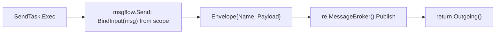
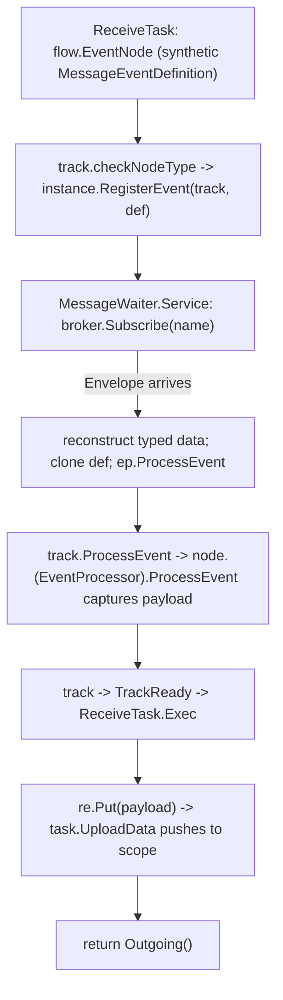

# SRD-013 — SendTask и ReceiveTask: обработка сообщений через брокер (задачи)

| Поле | Значение |
|---|---|
| Статус | Принято |
| Версия | v.1 |
| Дата | 2026-06-15 |
| Владелец | Руслан Габитов |
| Реализует | [ADR-014 v.1 Message Handling](../design/ADR-014-message-handling.md) |

Этот SRD приземляет **task-половину** [ADR-014 v.1](../design/ADR-014-message-handling.md): исполнители `SendTask` и `ReceiveTask`. `SendTask` биндит свой `Message` из scope и **публикует** его в `MessageBroker`; `ReceiveTask` регистрирует новый **`MessageWaiter`**, который подписывается на брокер и по приходу биндит payload в scope и завершается. Корреляция фазы 1 — **match-by-message-name**. **Throw/catch message events**, разделяющие producer/consumer-шов ADR-014, — это **отдельный последующий SRD**; равно как и вывод correlation-key и message-triggered инстанцирование (ADR-014 §2.6–§2.8).

## 1. Контекст и мотивация

### 1.1 Текущее состояние (сверено с кодом)

- **`SendTask`/`ReceiveTask` — заглушки, только поля** — `pkg/model/activities/send_task.go:8`, `receive_task.go:8`. Они держат `Message`, рудиментарный `service.Operation`, строку `Implementation` (и `ReceiveTask.Instantiate`), встраивают `task` и **не реализуют исполнителя** (`grep` по `func (st *SendTask)` / `(rt *ReceiveTask)` → пусто). У поля `Operation` **ноль читателей** (`grep .Operation` → только `errs.OperationFailed` и несвязанный `MessageEventDefinition.Operation()`); его безопасно убрать (ADR-014 §2.8).
- **Паттерн исполнителя публичен (SRD-012).** `pkg/exec.NodeExecutor.Exec(ctx, re renv.RuntimeEnvironment) ([]*flow.SequenceFlow, error)`; референс — `ServiceTask.Exec` (`service_task.go:75`), который биндит через `service.BindInput`, делает `re.Put` результата и возвращает `st.Outgoing()`. Встроенный `task` уже реализует `exec.NodeDataConsumer.LoadData`/`NodeDataProducer.UploadData` (`task.go:84/219`) и output-association push (`updateOutputs`, `task.go:268`) — так что задача наследует полный data-binding, как только получает `Exec`.
- **Брокер существует, name-match — уже его поведение.** `pkg/messaging.MessageBroker` — `Publish(ctx, Envelope) error`, `Subscribe(ctx, name, correlationKey string) (<-chan Envelope, error)`; `Envelope{Payload any; Name string; CorrelationKey string}`. `membroker` буферизует недоставленные envelope'ы (subscribe-before-publish по ADR-006 §2.4) и матчит по имени + (пустой-или-равный ключ). Исполнитель достаёт его через `re.MessageBroker()` (`pkg/renv.EngineRuntime.MessageBroker()`).
- **`service.BindInput`** (`pkg/model/service/operation.go:252`) читает item'а `*bpmncommon.Message` из scope по id (с Ready-проверкой) и возвращает связанный item — это ровно тот send-side bind-from-scope, который переиспользуется.
- **MessageWaiter — недостающий замковый камень.** `internal/eventproc/eventhub/waiters/waiters.go:47` `CreateWaiter` свитчит по `eDef.Type()` **только** с кейсом `flow.TriggerTimer`; `TriggerMessage` проваливается в `ObjectNotFound`. Референс — `TimerWaiter` (`timer.go`): конструируется с `(hub, ep, eDef, id, rt renv.EngineRuntime)`; `Service(ctx)` поднимает горутину; при срабатывании снимает снапшот процессоров под локом, отпускает, вызывает `ep.ProcessEvent(ctx, eDef)` вне лока, затем `hub.RemoveWaiter`. Waiter'ы регистрируются через `EventHub.RegisterEvent` (`eventhub.go:101`, который зовёт `w.Service`).
- **Цикл ожидания/возобновления события у трека на месте.** `track.checkNodeType` (`track.go:279`) регистрирует определения `flow.EventNode` через `instance.RegisterEvent(track, def)` и паркует трек в `TrackWaitForEvent`; `track.ProcessEvent` (`track.go:674`) возобновляет его при срабатывании — приводит **текущий узел** к `eventproc.EventProcessor` (`track.go:693`) и вызывает `node.ProcessEvent`, затем снимает регистрацию и возвращает трек в `TrackReady`, после чего исполняется `Exec`. **Ни один реальный модельный узел сегодня не реализует `eventproc.EventProcessor`** (приведение латентно, упражняется лишь mock'нутыми timer-тестами) — `ReceiveTask` станет первым.
- **Переиспользование output-binding'а.** Узел, который делает `re.Put` Ready-данного, получает его проталкивание в scope унаследованным `task.UploadData` через output-ассоциации (`oa.UpdateSource`, `association.go:123`) — тем же путём, что `ServiceTask` коммитит свой результат. Новый association-API не нужен.

### 1.2 Почему

ADR-014 решил обработку сообщений: сообщения ходят через брокер, EventHub остаётся внутренней машиной ожидания, а `MessageWaiter` их мостит. Части существуют (брокер, паттерн исполнителя, цикл ожидания/возобновления, data-binding), но `SendTask`/`ReceiveTask` неисполнимы и `MessageWaiter` нет — поэтому процесс gobpm не может отправить или принять сообщение. Этот SRD приземляет task-исполнителей и waiter'а, давая движку его первую cross-participant-способность.

## 2. Цели и охват

### 2.1 Цели (в охвате)

- **G1.** Убрать рудиментарное поле `service.Operation` у `SendTask`/`ReceiveTask` (ADR-014 §2.8).
- **G2.** `SendTask` — это `exec.NodeExecutor`, который биндит свой `Message` из scope и **публикует** `Envelope` в `re.MessageBroker()`, затем завершается (синхронно своему жизненному циклу, без ожидания ответа).
- **G3.** `MessageWaiter` (равноправный `TimerWaiter`) подписывает брокер на имя сообщения и срабатывает по приходу; кейс `TriggerMessage` подключён в реестр waiter'ов. Он чистит свою горутину + подписку по `Stop`/ctx (без утечки).
- **G4.** `ReceiveTask` — это `flow.EventNode` + `eventproc.EventProcessor` + `exec.NodeExecutor`: он регистрирует `MessageWaiter`, паркует трек, захватывает пришедший payload при срабатывании, а при возобновлении биндит его в scope (переиспользуя `task.UploadData`) и завершается.
- **G5.** Корреляция фазы 1 = **match-by-message-name** (дефолт брокера); `Envelope` несёт значение item'а сообщения, а consumer реконструирует типизированное данное для `ItemDefinition` сообщения.
- **G6.** Разделяемая producer-хореография приземляется хелпером в новом публичном пакете `pkg/model/msgflow`; исполнимый send→receive пример её демонстрирует.

### 2.2 Не-цели (отложено, у каждой именованный дом)

- **Throw/catch message events** + **объявления интерфейсов** `MessageProducer`/`MessageConsumer` — **следующий SRD** (приземление message-events). Интерфейсы получают там своего второго реализатора; SRD-013 поставляет *разделяемый(е) хореографический(е) хелпер(ы)*, которые события тоже будут звать, но не сами (одно-реализаторные, не-полиморфные) интерфейсы. Это также закрывает там WS-C3 TODO из `catch_upload_test.go`.
- **Вывод correlation-key** (CorrelationSubscription → ключ) — последующий Correlation SRD (ADR-014 §2.6/§2.8); поле `Envelope.CorrelationKey` уже несёт ключ.
- **Message-triggered инстанцирование** (`ReceiveTask.Instantiate` / start message event, порождающий инстанс) — отложено вместе с message-routing-работой thresher'а (ADR-014 §2.7); поле `Instantiate` остаётся, но не обрабатывается.
- **EventHub `WaitGroup`-shutdown с единоличным владением** (ADR-006 §2.5) — собственный реализующий SRD ADR-006; SRD-013 гарантирует лишь, что `MessageWaiter` чистит *сам себя* по `Stop`/ctx.
- **Send на базе service-operation** — убранное поле `Operation`; вновь вводится только при необходимости (ADR-014 §2.8).

## 3. Требования

### 3.1 Функциональные

| # | Требование |
|---|---|
| FR-1 | Убрать поле `service.Operation` из `SendTask` и `ReceiveTask` (и теперь неиспользуемый импорт `service`). Код на него не ссылается (§1.1). |
| FR-2 | Новый публичный пакет **`pkg/model/msgflow`**: хелпер `Send(ctx, re renv.RuntimeEnvironment, msg *bpmncommon.Message) error` — биндит `msg` из scope (`service.BindInput`), строит `messaging.Envelope{Name: msg.Name(), Payload: <item value>}`, вызывает `re.MessageBroker().Publish`. Он импортирует только публичные пакеты (`pkg/messaging`, `pkg/renv`, `pkg/model/{bpmncommon,service,data}`); без цикла. |
| FR-3 | `SendTask` получает `NewSendTask(name, msg, opts…)`, `Exec(ctx, re) ([]*flow.SequenceFlow, error)` (зовёт `msgflow.Send`, возвращает `Outgoing()`), `Clone()`, `TaskType()→flow.SendTask` и `var _ exec.NodeExecutor = (*SendTask)(nil)`. |
| FR-4 | Новый **`MessageWaiter`** (`internal/eventproc/eventhub/waiters/message.go`), зеркалящий `TimerWaiter`: конструируется `(hub, ep, eDef, id, rt renv.EngineRuntime)`; `Service(ctx)` подписывается `rt.MessageBroker().Subscribe(ctx, name, "")` и крутит горутину; на первом подходящем `Envelope` реконструирует типизированное `data.Data` для `ItemDefinition` сообщения, клонирует event-определение, несущее его, и срабатывает `ep.ProcessEvent` (lock-дисциплина TimerWaiter), затем `hub.RemoveWaiter`; `Stop()`/ctx завершают горутину и отпускают подписку. `CreateWaiter` в `waiters.go` получает `case flow.TriggerMessage`. |
| FR-5 | `ReceiveTask` реализует `flow.EventNode` (синтезируя `MessageEventDefinition` из своего `Message`, чтобы `checkNodeType` его зарегистрировал и запарковал трек), `eventproc.EventProcessor` (`ProcessEvent` захватывает пришедший payload в поле per-execution) и `exec.NodeExecutor` (`Exec` делает `re.Put` захваченного payload'а как Ready-данного для item'а сообщения, возвращает `Outgoing()`; унаследованный `task.UploadData` проталкивает его в scope). Конструктор `NewReceiveTask`, `Clone`, `TaskType()→flow.ReceiveTask`, interface-ассерты. |
| FR-6 | Корреляция фазы 1: брокер матчит по **имени сообщения** (пустой correlation-key). Producer ставит `Envelope.Name = msg.Name()` и `Payload` = значение связанного item'а; `MessageWaiter` реконструирует типизированное данное из `Payload`, используя `ItemDefinition` сообщения. |
| FR-7 | Исполнимый пример (`examples/message-send-receive` или эквивалент) запускает процесс с `SendTask` и `ReceiveTask` (и брокером) и показывает сообщение, проходящее end-to-end, exit 0. |

### 3.2 Нефункциональные

| # | Требование |
|---|---|
| NFR-1 | Горутина и broker-подписка `MessageWaiter` отпускаются по `Stop()` и ctx-cancel — без утечки горутины/подписки (проверено waiter-тестом). Существующие наборы `internal/instance` / `eventhub` / model / thresher проходят. |
| NFR-2 | Никаких значений payload в логах — логировать только имя сообщения, ключ, id item'ов, состояния (маскирование ADR-010/011/014). |
| NFR-3 | `make ci` зелёный на каждом milestone; diff-coverage ≥95 % (цель 100 %) на затронутых файлах. |
| NFR-4 | `pkg/model/msgflow` не импортирует `internal/*` (depguard); каждый новый экспортируемый символ несёт doc-комментарий; новые конструкторы валидируют входы само-идентифицирующими ошибками. |

## 4. Дизайн и план реализации

### 4.1 Send: bind → publish

`SendTask` зеркалит `ServiceTask`: он никогда не ждёт (request/reply — это send-узел, затем receive-узел — диаграмма показывает ожидание). `msgflow.Send` — это разделяемая producer-хореография, которую будет звать и throw message event (следующий SRD).

### 4.2 Receive: ожидание (через MessageWaiter) → захват → bind

`ReceiveTask` встраивается в **существующий** цикл ожидания/возобновления, будучи `flow.EventNode` (чтобы `checkNodeType` зарегистрировал его синтетический `MessageEventDefinition` и запарковал трек) и `eventproc.EventProcessor` (чтобы приведение узла в `track.ProcessEvent` на `track.go:693` разрешилось — `ReceiveTask` первый реальный узел, его реализующий). Нового track-пути нет. Payload идёт брокер → `MessageWaiter` (реконструирует типизированное данное) → клонированное event-определение → `ProcessEvent` (захват) → `Exec` (`re.Put`) → унаследованный `task.UploadData` → scope.

### 4.3 Контракт payload'а Envelope (фаза 1)

`Payload any` брокера встречает типизированный data-plane у waiter'а: producer кладёт **значение** (`item.Structure().Get(ctx)`); `MessageWaiter` реконструирует типизированное `data.Data` для `ItemDefinition` сообщения (определение у него есть через `MessageEventDefinition`), так что consumer-сторона видит корректно типизированные данные. Непрозрачность `any` ограничена брокер-хопом.

### 4.4 Milestones (каждый = один коммит, `make ci` зелёный)

- **M1 — убрать `Operation`; добавить `msgflow.Send`.** Удалить рудиментарное поле из обеих задач; добавить `pkg/model/msgflow` с хелпером `Send`. Чистые добавления/удаления; на поле ничего не ссылается.
- **M2 — `SendTask` публикует.** `NewSendTask`, `Exec`, `Clone`, `TaskType`, ассерт; юнит-тест против in-memory-брокера (publish наблюдается).
- **M3 — `MessageWaiter`.** `waiters/message.go` + кейс `TriggerMessage`; юнит-тест waiter'а, зеркалящий `timer_test.go` (mock `EventProcessor` + in-mem-брокер; проверка срабатывания + очистки, без утечки).
- **M4 — `ReceiveTask` ждёт + биндит.** `flow.EventNode` + `eventproc.EventProcessor` + `Exec`; реализовать node-level `ProcessEvent` (первый реальный — проверить, что timer-путь всё ещё работает). Интеграционный тест: publish, затем receive, payload достигает scope.
- **M5 — пример + DoD.** Пример send→receive; smoke (exit 0); coverage-гейт.

### 4.5 Тесты

`pkg/model/msgflow` (Send против fake/in-mem-брокера), `SendTask.Exec` (публикует связанный payload), `MessageWaiter` (срабатывает на envelope, чистится — зеркалит `timer_test.go`), `ReceiveTask` end-to-end (RegisterEvent → waiter → ProcessEvent → Exec → bound в scope) и пример как smoke. Покрыть node-level-путь `ProcessEvent` (латентный до сих пор).

## 5. Верификация (Definition of Done)

| # | Проверка | Ожидание |
|---|---|---|
| V1 | У `SendTask`/`ReceiveTask` нет поля `Operation`; нет висячих ссылок; импорт `service` убран там, где не используется (FR-1). | зелёный |
| V2 | `SendTask.Exec` биндит своё сообщение из scope и публикует `Envelope` в брокер; возвращает свои исходящие потоки (FR-2/3). | зелёный |
| V3 | `MessageWaiter` подписывает брокер, срабатывает `ProcessEvent` на подходящем envelope и отпускает свою горутину + подписку по `Stop`/ctx (FR-4, NFR-1); `TriggerMessage` подключён. | зелёный |
| V4 | `ReceiveTask` регистрирует waiter, паркует трек, захватывает payload при срабатывании и биндит его в scope при возобновлении (FR-5); node-level-приведение `ProcessEvent` разрешается. | зелёный |
| V5 | Name-match фазы 1: опубликованное сообщение с именем получателя доставлено; payload типизирован по item'у сообщения (FR-6). | зелёный |
| V6 | Пример send→receive отрабатывает до exit 0; существующие наборы проходят (FR-7, NFR-1). | зелёный |
| V7 | `make ci` зелёный; diff-coverage ≥95 % на затронутых файлах; `msgflow` не импортирует internal (NFR-3/4). | pass |

## 6. Риски и регрессии

- **Первый реальный node-level `ProcessEvent`.** Приведение на `track.go:693` было латентным (только mock). `ReceiveTask` — первый реальный реализатор — M4 проверяет, что timer-путь не затронут и приведение разрешается. Если не-EventProcessor catch-узел когда-либо дойдёт до этого пути, он громко ошибётся (существующее поведение).
- **Утечка подписки/горутины waiter'а.** `MessageWaiter`, не отпускающий свою broker-подписку + горутину по `Stop`/ctx, течёт (вопрос §2.5, здесь ограниченный per-waiter). Тест NFR-1 это охраняет; полное `WaitGroup`-владение хабом — SRD ADR-006.
- **Типизация payload'а через `any`-хоп брокера.** Некорректный/неправильно типизированный payload всплывает, когда waiter реконструирует типизированное данное — обрабатывается классифицированной ошибкой, не тихим mis-bind'ом (§4.3).
- **Cloner `MessageEventDefinition`.** Несущее payload срабатывание требует, чтобы определение удовлетворяло `flow.EventDefCloner` (`CloneEventDefinition`); проверяется на M3/M4 (у определения сейчас есть `CloneEvent` — подтвердить контракт или адаптировать).

## 7. Сводка реализации

Приземлено на `feat/srd-013-message-handling` в пяти milestone'ах (каждый — один коммит,
`make ci` зелёный). Аудит `/check-srd`: PASS; все V1–V7 выполнены.

### 7.1 Milestones

| M | Коммит | Охват | Тесты |
|---|---|---|---|
| doc | `66c2a79` | SRD-013 (этот документ) | — |
| M1 | `a0c1454` | убрать рудиментарный `Operation` из обеих задач; новый `pkg/model/msgflow` с `Send` (bind → `Envelope` → `re.MessageBroker().Publish`) | `msgflow` `Send` 100% |
| M2 | `99294d6` | исполнитель `SendTask` (`NewSendTask`/`Exec`/`Clone`/`TaskType`/аксессоры + `exec.NodeExecutor`) | `send_task.go` 100% |
| M3 | `81b39a8` | `MessageWaiter` (равноправный `TimerWaiter`) + подключённый `TriggerMessage`; payload реконструируется и передаётся через `CloneEvent`; per-waiter-очистка; обновляет устаревший eventhub limitation-тест | `message.go` в среднем 98.6% (2 недостижимые защитные ветки) |
| M4 | `106bb05` | `ReceiveTask` = `flow.EventNode` + `eventproc.EventProcessor` + `exec.NodeExecutor` (первый реальный node-level `ProcessEvent`); биндит payload через унаследованный `task.UploadData` | `receive_task.go` 97.6% |
| M5 | `f3a3be0` | исполнимый `examples/message-send-receive` (свой модуль) + интеграционный тест instance; **фикс регистрации события mid-flow** в `internal/instance/track.go` (всплыл на smoke) | `track.go` 100% изменённых строк; `message_flow_test.go` (V4 end-to-end + негативный) |

### 7.2 Ключевые файлы

- `pkg/model/msgflow/{msgflow,send}.go` — публичная producer-хореография (`Send`).
- `pkg/model/activities/{send_task,receive_task}.go` — два исполнителя.
- `internal/eventproc/eventhub/waiters/message.go` + `waiters.go` — `MessageWaiter` и его подключение в реестр.
- `internal/instance/track.go` — переупорядочивание `checkNodeType` (wait-before-register) и mid-flow-регистрация в `checkFlows`.
- `examples/message-send-receive/` — исполнимое демо.

### 7.3 Результаты V

V1–V7 все зелёные: `Operation` убран (V1); `SendTask.Exec` публикует (V2); `MessageWaiter` срабатывает + чистится, `TriggerMessage` подключён (V3); `ReceiveTask` паркует/захватывает/биндит, node `ProcessEvent` разрешается (V4); name-match-доставка с типизированным payload'ом (V5); пример завершается с exit 0 и набор зелёный (V6); `make ci` зелёный, diff-coverage 97.0 % (минимум 95), `msgflow` не импортирует internal (V7).

### 7.4 Заметное отклонение от драфта

Риск §6 «промежуточные event-узлы» проявился конкретно: `ReceiveTask` mid-flow, до которого доходит токен, никогда не регистрировал своё событие, потому что `checkNodeType` отрабатывал только для начального узла трека (`newTrack`). M5 добавляет регистрацию на token-advance (`checkFlows`) и переупорядочивает `checkNodeType`, объявляя `TrackWaitForEvent` до регистрации (так что broker-буферизованное сообщение, доставленное синхронно на subscribe, принимается). Start-узлы (без входящих) не изменены — они всё ещё пред-регистрируются через `createTracks`. Вопрос cloner'а `MessageEventDefinition` (§6) разрешён использованием его конкретного метода `CloneEvent` (интерфейс `EventDefCloner` в кодовой базе не используется).

## 8. Ссылки

- [ADR-014 v.1 Message Handling](../design/ADR-014-message-handling.md) — решение, которое этот SRD приземляет (брокер для send, MessageWaiter для receive, producer/consumer-шов, name-match фазы 1); отложенное в §2.8 (поле Operation, инстанцирование, вывод корреляции); throw/catch message events разделяют шов (следующий SRD).
- [ADR-006 v.1 Events & Subscriptions](../design/ADR-006-events-and-subscriptions.md) — §2.4 доставка (subscribe-before-publish, broker-буферизация) и §2.5 жизненный цикл waiter'а, которому подчиняется `MessageWaiter`; `WaitGroup`-владение хабом — собственный SRD ADR-006.
- [ADR-012 v.1 Execution Layering](../design/ADR-012-execution-layering.ru.md) — публичные контракты `pkg/exec`/`pkg/renv`, которые реализуют исполнители.
- [SRD-012 v.1 Execution layering](SRD-012-execution-layering.ru.md) — опубликовал эти контракты; `msgflow` и исполнители строятся на них (боковая ссылка).
- [SRD-011 v.1 Go-operation service reader](SRD-011-go-operation-service-reader.ru.md) — `service.BindInput`, переиспользуется send-стороной для bind (боковая ссылка).

## 9. Открытые вопросы

- Нет. Охват задач (send=publish / receive=MessageWaiter-subscribe), `ReceiveTask` как `flow.EventNode`+`EventProcessor`, переиспользующий цикл ожидания/возобновления (первый реальный node `ProcessEvent`), per-waiter-очистка (`WaitGroup` хаба отложен до SRD ADR-006), контракт name-match фазы 1 + value-payload, и **приземление разделяемой producer-хореографии хелпером `msgflow` с отсрочкой интерфейсов `MessageProducer`/`MessageConsumer` до message-events SRD** (второй реализатор) решены выше. Throw/catch message events, вывод correlation-key и инстанцирование отложены (§2.2).

## История документа

| Версия | Дата | Автор | Изменение |
|---|---|---|---|
| v.1 | 2026-06-15 | Руслан Габитов | Драфт. Приземляет **task-половину** ADR-014 v.1: убирает рудиментарный `service.Operation` из `SendTask`/`ReceiveTask`; `SendTask` биндит своё сообщение из scope (`service.BindInput`) и публикует `Envelope` в `re.MessageBroker()` через новый хелпер `pkg/model/msgflow.Send`, затем завершается; новый `MessageWaiter` (равноправный `TimerWaiter`, подключён `TriggerMessage`) подписывает брокер и срабатывает `ProcessEvent` по приходу, чистя свою горутину+подписку по Stop/ctx; `ReceiveTask` становится `flow.EventNode` + `eventproc.EventProcessor` + `exec.NodeExecutor`, который паркует трек, захватывает пришедший payload (реконструированный типизированно по item'у сообщения) и биндит его в scope при возобновлении через унаследованный `task.UploadData` — первый реальный node-level `ProcessEvent`. Корреляция фазы 1 = match-by-message-name; `Envelope` несёт значение item'а. Пять milestone'ов + пример send→receive. Отложено в последующие SRD: throw/catch message events + объявления интерфейсов `MessageProducer`/`MessageConsumer` (второй реализатор; закрывает WS-C3 catch-binding TODO), вывод correlation-key, message-triggered инстанцирование и EventHub `WaitGroup`-shutdown (SRD ADR-006). Реализует ADR-014 v.1 (task-половина). |
