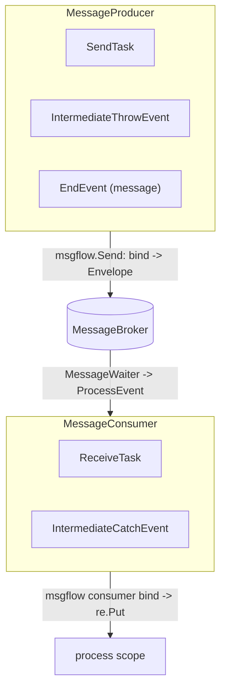
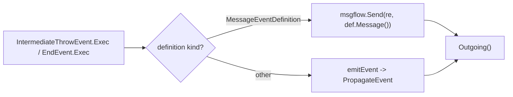
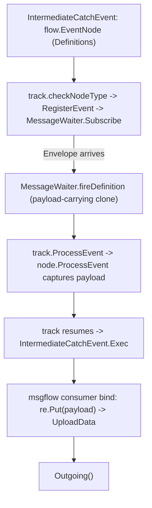

# SRD-014 — Throw & catch message events (message events)

| Field | Value |
|---|---|
| Status | Accepted |
| Version | v.1 |
| Date | 2026-06-15 |
| Owner | Ruslan Gabitov |
| Implements | [ADR-014 v.1 Message Handling](../design/ADR-014-message-handling.md) |

This SRD lands the **event half** of [ADR-014 v.1](../design/ADR-014-message-handling.md), the follow-up to [SRD-013 v.1](SRD-013-send-receive-tasks.md) (the task half). It adds the BPMN **message events** as the event-shaped peers of the message tasks: a new **`IntermediateThrowEvent`** that publishes its message to the broker, a new **`IntermediateCatchEvent`** that waits on the broker and binds the arrived payload, and routes an **`EndEvent`** message throw to the broker. It promotes the producer/consumer contracts ADR-014 §2.2 decided — **`MessageProducer`** / **`MessageConsumer`** — into `pkg/model/msgflow`, now that each direction has a second implementor, and closes the **WS-C3** catch-binding gap (a catch event had no `ProcessEvent` and bound only static outputs).

## 1. Background & motivation

### 1.1 Current state (verified against the code)

- **The task half is landed (SRD-013).** `pkg/model/msgflow.Send(ctx, re, msg)` binds a `*bpmncommon.Message` from scope (`service.BindInput`) and publishes a `messaging.Envelope{Name, Payload}` to `re.MessageBroker()` (`pkg/model/msgflow/send.go:19`). `SendTask.Exec` calls it (`send_task.go:102`). `ReceiveTask` is a `flow.EventNode` + `eventproc.EventProcessor` + `exec.NodeExecutor`: it exposes a `MessageEventDefinition` from `Definitions()` (`receive_task.go:126`), captures the fired payload in `ProcessEvent` (`receive_task.go:139`), and binds it in `Exec` via `re.Put` (`receive_task.go:153`). `msgflow` exposes only `Send` — there is **no consumer-side helper and no seam interface yet** (the interfaces were deferred to this SRD).
- **The waiter is node-agnostic.** `internal/eventproc/eventhub/waiters/message.go` `NewMessageWaiter` keys off the message name (`name: msg.Name()`), accepts any `eventproc.EventProcessor` and any `*events.MessageEventDefinition`, and `CreateWaiter` dispatches purely on `eDef.Type() == flow.TriggerMessage` (`waiters.go:51`). On a matching `Envelope` it reconstructs a Ready datum and fires a payload-carrying cloned definition (`message.go` `fireDefinition`). **A catch event reuses this waiter unchanged** — it only needs `Definitions()` + `ProcessEvent`.
- **Throw events never reach the broker.** `throwEvent.emitEvent` (`pkg/model/events/event.go:502`) resolves the definition and calls `eProd.PropagateEvent(...)` (`event.go:538`) — the internal event bus, never `msgflow`/`MessageBroker`. `EndEvent` (`end.go:30`, embeds `throwEvent`) can carry a `MessageEventDefinition` (`endTriggers` includes `flow.TriggerMessage`, `end.go:19`); its `Exec` loops definitions and calls `emitEvent(re, re.EventProducer(), ed)` (`end.go:128`) for all of them, message included. The cloner branch in `emitEvent` casts to `flow.EventDefCloner` (`event.go:528`) whose method is `CloneEventDefinition` (`flow/events.go:70`), but `MessageEventDefinition` implements `CloneEvent` (`message.go:104`), not that interface — so the message-payload clone branch is **dead**, another reason a message throw should go through `msgflow.Send`, not `PropagateEvent`.
- **No intermediate event node types exist.** `grep` for `IntermediateThrowEvent` / `IntermediateCatchEvent` → none; there is no `intermediate*.go` in `pkg/model/events/`. The only throw event is `EndEvent`; the only catch event is `StartEvent` (`start.go:29`, embeds `catchEvent`). `BoundaryEvent` is an interface only (`flow/events.go:74`), no concrete type.
- **WS-C3 — the catch-binding gap.** `catchEvent` (`event.go:195`) implements `UploadData` (`event.go:246`) which fills output associations from the **static** dataOutputs in the frame, not from any arrived payload. `catchEvent` does **not** implement `eventproc.EventProcessor` (no `ProcessEvent` anywhere in `pkg/model/events`). `catch_upload_test.go:17` documents this: "Output ASSOCIATIONS have no binding API yet (message-correlation work, **WS-C3**), so the association push is an empty loop." So a fired message would be dropped at the node-cast in `track.ProcessEvent` (`track.go` casts to `eventproc.EventProcessor`).
- **The seam home is `msgflow`, cycle-free.** `pkg/model/events` does not import `model/msgflow` or `model/activities`; `model/msgflow` imports neither; `model/activities` already imports both. So `MessageProducer`/`MessageConsumer` in `msgflow` are importable by tasks and events with no cycle (the `msgflow` package doc already anticipates the throw event reusing it).
- **`MessageEventDefinition.operation`** (`message.go:15`) is carried but every caller passes `nil` (`receive_task.go:70`, all tests); it is the service-backed-send alternative entry point (ADR-014 §2.8), inert in phase-1.

### 1.2 Why

ADR-014 decided message handling as a directional producer/consumer seam shared by the message **task** and the message **event**. SRD-013 landed the tasks and deferred the events and the seam interfaces (a seam with one implementor per direction is premature). The events are the missing half: BPMN models a mid-flow message wait/throw as an intermediate event at least as often as a `Receive`/`Send` task, and `EndEvent` message throws currently go to the internal bus instead of the broker. Landing the events gives each direction its second implementor, so the seam interfaces and the shared choreography land where they belong, and the catch payload-binding gap (WS-C3) closes for every catch event.

## 2. Goals & scope

### 2.1 Goals (in scope)

- **G1.** Promote the producer/consumer seam into `pkg/model/msgflow`: `MessageProducer` and `MessageConsumer` interfaces plus the shared choreography (the existing `Send`, a new consumer `Bind`/`Receive`). `SendTask`/`ReceiveTask` implement them (no behaviour change).
- **G2.** New **`IntermediateThrowEvent`** node — a `MessageProducer` whose `Exec` publishes its message definition(s) to the broker via the shared choreography and emits its outgoing flows. Non-message definitions on the same node keep the existing `PropagateEvent` path.
- **G3.** Route an **`EndEvent`** message throw to the broker (the same producer choreography) instead of `PropagateEvent`; non-message end definitions are unchanged.
- **G4.** New **`IntermediateCatchEvent`** node — a `MessageConsumer` + `flow.EventNode` + `eventproc.EventProcessor` + `exec.NodeExecutor`: it registers its `MessageEventDefinition` (parks via the existing `MessageWaiter`), captures the fired payload in `ProcessEvent`, and on resume binds it into scope and emits its outgoing flows (the event-shaped peer of `ReceiveTask`).
- **G5.** Close **WS-C3**: give the catch side runtime payload binding (`ProcessEvent` capture → bind), so a fired message reaches scope instead of being dropped; the static-output path remains for definitions without a payload.
- **G6.** A runnable example: an intermediate throw event → an intermediate catch event over the broker; and the suite proves the round-trip.

### 2.2 Non-goals (deferred, each with a named home)

- **Message start event / message-triggered instantiation** — ADR-014 §2.7; routing a broker message to a *definition* to spawn an instance is a thresher-level concern. `StartEvent` message-catch stays as today (no runtime-payload binding); phase-1 catch payloads are for intermediate (mid-flow) events inside a running instance.
- **Boundary message events** — there is no concrete `BoundaryEvent` type; interrupting/non-interrupting boundary catch is its own node-implementation work.
- **Correlation-key derivation** — ADR-014 §2.6/§2.8; phase-1 routes by message name.
- **Service-operation-backed throw/catch** — the inert `MessageEventDefinition.operation` field (ADR-014 §2.8); kept, not wired.
- **Non-message intermediate triggers as a goal** — the new intermediate event types host any event definition, so a timer intermediate event works through the same `flow.EventNode`/waiter path as a consequence, but only the message trigger is a tested deliverable here.

## 3. Requirements

### 3.1 Functional

| # | Requirement |
|---|---|
| FR-1 | `pkg/model/msgflow` gains `MessageProducer` (exposes the message to send) and `MessageConsumer` (exposes the expected message) interfaces, and a consumer-side choreography helper that binds an arrived message item into scope (peer of `Send`). The producer helper drives a `MessageProducer`; the consumer helper drives a `MessageConsumer`. No `internal/*` import (depguard). |
| FR-2 | `SendTask` implements `MessageProducer`; `ReceiveTask` implements `MessageConsumer`. Their executors route through the shared choreography. No behaviour change (SRD-013 tests stay green). |
| FR-3 | New `IntermediateThrowEvent` (`pkg/model/events`): constructed with one or more event definitions; `exec.NodeExecutor`. For each `MessageEventDefinition` it publishes via the shared producer choreography (`msgflow` → `re.MessageBroker()`); other definition kinds keep `emitEvent`/`PropagateEvent`. Returns its outgoing flows. Implements `MessageProducer` for its message definition. |
| FR-4 | `EndEvent.Exec` publishes a `MessageEventDefinition` through the shared producer choreography instead of `PropagateEvent`; non-message definitions unchanged. |
| FR-5 | New `IntermediateCatchEvent` (`pkg/model/events`): `flow.EventNode` (`Definitions()` returns its definition(s); `EventClass()` = Intermediate), `eventproc.EventProcessor` (captures the fired payload), `exec.NodeExecutor` (on resume binds the captured payload into scope via the consumer choreography, then emits outgoing flows). Registers/parks through the existing `checkNodeType`/`MessageWaiter` path; implements `MessageConsumer`. |
| FR-6 | Close WS-C3: the catch side binds the **runtime** payload carried by the fired definition (not only static dataOutputs). A definition fired without a payload leaves the static-output path intact (no regression for payload-less triggers). Update `catch_upload_test.go`'s WS-C3 note to reflect the binding now exists for intermediate catch. |
| FR-7 | A runnable example (`examples/message-intermediate-events` or equivalent, its own module) wires an `IntermediateThrowEvent` and an `IntermediateCatchEvent` over the broker and shows the payload crossing; exits 0. |

### 3.2 Non-functional

| # | Requirement |
|---|---|
| NFR-1 | No payload values in logs (names, keys, item ids, states only — ADR-010/011/014). |
| NFR-2 | `make ci` green per milestone; diff-coverage ≥95 % (target 100 %) on touched files; existing `internal/instance` / `eventhub` / `events` / `activities` / `thresher` suites pass. |
| NFR-3 | `pkg/model/msgflow` and `pkg/model/events` import no `internal/*` (depguard); every new exported symbol carries a doc comment; new constructors validate inputs with self-identifying errors (reject nil message / empty name). |
| NFR-4 | No new node-type registry or dispatch special-casing: the new events plug into the existing interface-based track dispatch (`flow.EventNode` + `exec.NodeExecutor` + `eventproc.EventProcessor`), exactly as `ReceiveTask` did. |

## 4. Design & implementation plan

### 4.1 The seam (pkg/model/msgflow)

`MessageProducer` exposes the message to send; the producer choreography (`Send`) binds it from scope and publishes. `MessageConsumer` exposes the expected message (for waiter registration) and receives the fired payload; the consumer choreography binds it into scope. The choreography lives once per direction in `msgflow`; the activity adapts it to "complete the task" and the event to "fire the token". This is ADR-014 §2.2 with both implementors present.

### 4.2 Throw: publish to the broker

A throw event splits per definition kind: a message definition goes to the broker (the dead `flow.EventDefCloner` clone path is bypassed); every other kind keeps the existing internal propagation. `EndEvent` reuses the same split.

### 4.3 Catch: wait → capture → bind (the WS-C3 closure)

The intermediate catch event is the event-shaped `ReceiveTask`: same registration, same waiter, same `ProcessEvent`-capture / `Exec`-bind split. The payload-binding (capture + bind) is the WS-C3 closure; for a payload-less fired definition the capture is empty and the existing static `UploadData` path is untouched. Whether the capture/bind lives on the `catchEvent` base (shared by Start/Intermediate) or only on `IntermediateCatchEvent` is settled at M2/M3 — the base is preferred so the contract is one place, with `StartEvent` behaviour preserved (no runtime payload until instantiation lands).

### 4.4 Milestones (each = one commit, `make ci` green)

- **M1 — seam in `msgflow`.** Add `MessageProducer`/`MessageConsumer` + the consumer choreography helper; make `SendTask`/`ReceiveTask` implement the interfaces and route through the shared helpers. No behaviour change; existing tests stay green.
- **M2 — catch payload binding (WS-C3).** Give the catch side `ProcessEvent` + runtime payload binding (on the `catchEvent` base, `StartEvent` behaviour preserved); update the WS-C3 note/test.
- **M3 — `IntermediateCatchEvent`.** New node type (consumer) reusing M1/M2; constructor, `Definitions`/`EventClass`/`ProcessEvent`/`Exec`/`Clone`, interface assertions; unit + integration (throughput via the real waiter) tests.
- **M4 — `IntermediateThrowEvent` + `EndEvent` message throw.** New throw node (producer) + route `EndEvent` message defs to the broker; per-kind split; tests (publish observed; non-message kinds still `PropagateEvent`).
- **M5 — example + DoD.** A throw→catch intermediate-event example (own module); smoke to exit 0; coverage gate.

### 4.5 Tests

`msgflow` seam (producer/consumer helpers drive a fake node + in-mem broker); `SendTask`/`ReceiveTask` unchanged green; `catchEvent` payload binding (runtime payload reaches scope; payload-less leaves static path); `IntermediateCatchEvent` end-to-end (register → waiter → ProcessEvent → Exec → scope, real eventhub+broker, mirroring `internal/instance/message_flow_test.go`); `IntermediateThrowEvent`/`EndEvent` publish to the broker and keep `PropagateEvent` for non-message kinds; the example as smoke.

## 5. Verification (Definition of Done)

| # | Check | Expectation |
|---|---|---|
| V1 | `MessageProducer`/`MessageConsumer` + the consumer helper exist in `msgflow`; `SendTask`/`ReceiveTask` implement them; SRD-013 tests green (FR-1/2). | green |
| V2 | `IntermediateThrowEvent.Exec` publishes a message definition to the broker and emits outgoing flows; non-message kinds still `PropagateEvent` (FR-3). | green |
| V3 | `EndEvent` message throw reaches the broker; non-message end definitions unchanged (FR-4). | green |
| V4 | `IntermediateCatchEvent` registers, parks, captures the payload on fire, binds it into scope on resume, emits outgoing flows (FR-5). | green |
| V5 | WS-C3 closed: a fired message payload reaches scope through the catch event; a payload-less trigger keeps the static-output path (FR-6). | green |
| V6 | A throw→catch intermediate-event example runs to exit 0; existing suites pass (FR-7, NFR-2). | green |
| V7 | `make ci` green; diff-coverage ≥95 % on touched files; `msgflow`/`events` import no internal (NFR-2/3). | pass |

## 6. Risks & regressions

- **EndEvent-with-message registered as a waiter.** `checkNodeType` registers any `flow.EventNode` with non-empty `Definitions()`; a throw `EndEvent`/`IntermediateThrowEvent` must **not** park waiting for the message it emits. The throw events must either not expose throw definitions through the catch-registration path or be classified as producers — resolved by keeping throw `Exec` purely emitting and ensuring `checkNodeType` only parks consumers (verify the `EventNode`/`Definitions` interaction at M3/M4; this is the §D3 trap from the ground-truth sweep).
- **`catchEvent` base change touches `StartEvent`.** Adding `ProcessEvent`/binding on the base must preserve `StartEvent` behaviour (no runtime payload until instantiation lands). Covered by M2 tests + the existing start-event suite.
- **Dead cloner path.** `MessageEventDefinition.CloneEvent` ≠ `flow.EventDefCloner.CloneEventDefinition`; the message throw routes through `msgflow.Send` (value payload), not the dead in-process clone — no reliance on the broken cast.
- **Seam shape.** The interfaces must be driven by the shared helpers (not dead markers); the helper takes the interface so the contract is exercised, not merely asserted.

## 7. Implementation summary

Landed on `feat/srd-014-message-events` in five milestones (each one commit,
`make ci` green). `/check-srd` audit: PASS; all V1–V7 met. ADR-014 is fully
implemented (task half SRD-013 + event half SRD-014) and flips to Accepted.

### 7.1 Milestones

| M | Commit | Scope | Tests |
|---|---|---|---|
| doc | `d07e5a5` | SRD-014 (this doc) | — |
| M1 | `e9395f4` | `MessageProducer`/`MessageConsumer` seam + shared choreography (`Publish`/`CaptureItem`/`Bind`) in `pkg/model/msgflow`; `SendTask`/`ReceiveTask` adopt them (no behaviour change) | `seam.go` 100% |
| M2 | `22b80b2` | catch-side payload capture on the `catchEvent` base (`ProcessEvent`); `StartEvent` preserved | `ProcessEvent` 100% |
| M3 | `0cd04f0` | `IntermediateCatchEvent` + payload-aware `UploadData` (WS-C3 bind); **folded-in fix**: `t.steps` race between the run goroutine's `checkFlows` and a waiter goroutine's `record` (guarded by `t.m`) | events units + instance integration; -race clean |
| M4 | `292d6cf` | `IntermediateThrowEvent` + `EndEvent` message-throw to the broker (shared `emitDefinition`); throw-not-parked (`checkNodeType` registers only `eventproc.EventProcessor` nodes) | events units; -race clean |
| M5 | `9034951` | runnable `examples/message-intermediate-events` (own module) | smoke exit 0 |

### 7.2 Key files

- `pkg/model/msgflow/seam.go` — `MessageProducer`/`MessageConsumer` + `Publish`/`CaptureItem`/`Bind`.
- `pkg/model/events/event.go` — `catchEvent.ProcessEvent` + payload-aware `UploadData` + `addMessagePayloadOutput`; `throwEvent.emitDefinition`.
- `pkg/model/events/intermediate_catch.go` / `intermediate_throw.go` — the two new node types.
- `pkg/model/events/end.go` — `EndEvent` message-throw via `emitDefinition`.
- `internal/instance/track.go` — `checkNodeType` EventProcessor gate (throw-not-parked) + `t.steps` lock fix.
- `examples/message-intermediate-events/` — throw→catch demo.

### 7.3 V-results

V1–V7 all green: the seam + helpers exist and the tasks adopt them, SRD-013 tests green (V1); `IntermediateThrowEvent.Exec` publishes a message and propagates non-message kinds (V2); `EndEvent` message-throw reaches the broker, non-message unchanged (V3); `IntermediateCatchEvent` registers/parks/captures/binds (V4); WS-C3 closed — fired payload reaches scope, payload-less keeps the static path (V5); the throw→catch example exits 0 and the suite is green (V6); `make ci` green, diff-coverage 98.0 % (min 95), `events`/`msgflow` import no internal (V7).

### 7.4 Notable deltas vs the draft

- **Throw-not-parked (§6 trap, confirmed).** A throw event is a `flow.EventNode` with `Definitions()`, so `checkNodeType` would have registered it as a waiter. Resolved cleanly: `checkNodeType` registers only nodes that are also `eventproc.EventProcessor` — catch events implement it, throw events don't.
- **Track-step race (folded in per the user's call).** The smoke-equivalent integration test surfaced a pre-existing race: `t.steps` was read by a waiter goroutine (`ProcessEvent→updateState→record`) while the run goroutine appended it in `checkFlows`. It also affected the merged SRD-013 `ReceiveTask`. Guarded `t.steps` with `t.m`; confirmed gone under 160+ `-race` runs. (A standalone FIX was the alternative; the user chose to fold it into M3.)
- **No new options-config boilerplate.** Both intermediate event types use lean def-taking constructors rather than mirroring the full `startConfig` options machinery.

## 8. References

- [ADR-014 v.1 Message Handling](../design/ADR-014-message-handling.md) — the decision this completes: §2.2 the producer/consumer seam (now both implementors present), §2.3/2.4 the task shapes the events mirror, §2.5 the `MessageWaiter`, §2.6 phase-1 name-match, §2.7 instantiation deferred, §2.8 the inert `operation` field. On landing, ADR-014 is fully implemented and flips to Accepted.
- [SRD-013 v.1 SendTask & ReceiveTask](SRD-013-send-receive-tasks.md) — the task half this builds on (`msgflow.Send`, the `MessageWaiter`, the `ProcessEvent`/`Exec` capture-bind pattern); the seam interfaces it deferred land here.
- [ADR-006 v.1 Events & Subscriptions](../design/ADR-006-events-and-subscriptions.md) — delivery (§2.4) and waiter lifecycle (§2.5) the catch path obeys.
- [ADR-012 v.1 Execution Layering](../design/ADR-012-execution-layering.md) — the public `pkg/exec`/`pkg/renv`/`pkg/eventproc` contracts the events implement.

## 9. Open questions

- None. Scope is "create the intermediate throw/catch message event node types" (decided): `IntermediateThrowEvent` (producer) + `IntermediateCatchEvent` (consumer) as the second implementors that justify the `MessageProducer`/`MessageConsumer` seam, plus routing `EndEvent` message throws to the broker and closing WS-C3 on the catch side. Message start event/instantiation, boundary message events, correlation-key derivation, and service-operation-backed messaging are deferred (§2.2 non-goals). Whether the catch capture/bind lives on the `catchEvent` base or only on `IntermediateCatchEvent` is an implementation detail settled at M2/M3 (base preferred, `StartEvent` preserved).

## Document History

| Version | Date | Author | Change |
|---|---|---|---|
| v.1 | 2026-06-15 | Ruslan Gabitov | Draft. Lands the **event half** of ADR-014 v.1 (follow-up to SRD-013): new `IntermediateThrowEvent` (a `MessageProducer` publishing to the broker via the shared `msgflow` choreography) and `IntermediateCatchEvent` (a `MessageConsumer` + `flow.EventNode` + `eventproc.EventProcessor` that waits on the `MessageWaiter`, captures the fired payload, and binds it into scope — the event-shaped `ReceiveTask`); routes `EndEvent` message throws to the broker instead of `PropagateEvent`; promotes the `MessageProducer`/`MessageConsumer` seam interfaces + a consumer choreography helper into `pkg/model/msgflow` now that each direction has a second implementor (`SendTask`/`ReceiveTask` adopt them with no behaviour change); and closes the WS-C3 catch-binding gap (a catch event gains runtime payload binding, static path preserved for payload-less triggers). Five milestones + a throw→catch intermediate-event example. Deferred: message start event/instantiation, boundary message events, correlation-key derivation, service-operation-backed messaging (§2.2). Implements ADR-014 v.1 (event half); ADR-014 flips to Accepted on landing. |
