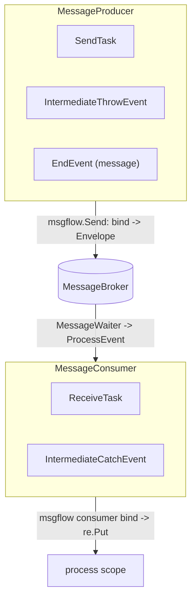
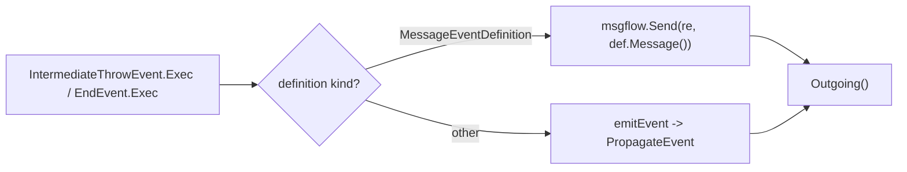
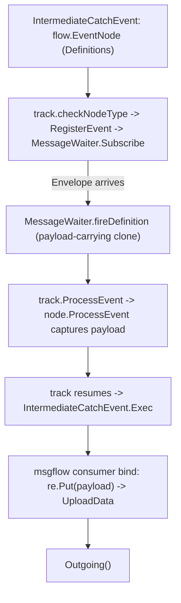

# SRD-014 — Throw- и catch-события сообщений (message events)

| Поле | Значение |
|---|---|
| Статус | Принято |
| Версия | v.1 |
| Дата | 2026-06-15 |
| Владелец | Руслан Габитов |
| Реализует | [ADR-014 v.1 Message Handling](../design/ADR-014-message-handling.ru.md) |

Этот SRD приземляет **event-половину** [ADR-014 v.1](../design/ADR-014-message-handling.ru.md), продолжение [SRD-013 v.1](SRD-013-send-receive-tasks.ru.md) (task-половины). Он добавляет BPMN **message events** как event-образных собратьев message-задач: новый **`IntermediateThrowEvent`**, который публикует своё сообщение в брокер, новый **`IntermediateCatchEvent`**, который ждёт на брокере и биндит пришедший payload, и направляет throw сообщения **`EndEvent`** в брокер. Он продвигает контракты producer/consumer, решённые ADR-014 §2.2 — **`MessageProducer`** / **`MessageConsumer`** — в `pkg/model/msgflow`, теперь, когда у каждого направления есть второй реализатор, и закрывает разрыв catch-binding'а **WS-C3** (у catch-события не было `ProcessEvent` и оно биндило только статические outputs).

## 1. Background & motivation

### 1.1 Current state (verified against the code)

- **Task-половина приземлена (SRD-013).** `pkg/model/msgflow.Send(ctx, re, msg)` биндит `*bpmncommon.Message` из scope (`service.BindInput`) и публикует `messaging.Envelope{Name, Payload}` в `re.MessageBroker()` (`pkg/model/msgflow/send.go:19`). `SendTask.Exec` его зовёт (`send_task.go:102`). `ReceiveTask` — это `flow.EventNode` + `eventproc.EventProcessor` + `exec.NodeExecutor`: он выставляет `MessageEventDefinition` из `Definitions()` (`receive_task.go:126`), захватывает сработавший payload в `ProcessEvent` (`receive_task.go:139`) и биндит его в `Exec` через `re.Put` (`receive_task.go:153`). `msgflow` выставляет только `Send` — **consumer-стороннего хелпера и seam-интерфейса пока нет** (интерфейсы были отложены до этого SRD).
- **Waiter узел-агностичен.** `internal/eventproc/eventhub/waiters/message.go` `NewMessageWaiter` ключуется по имени сообщения (`name: msg.Name()`), принимает любой `eventproc.EventProcessor` и любой `*events.MessageEventDefinition`, а `CreateWaiter` диспетчеризует чисто по `eDef.Type() == flow.TriggerMessage` (`waiters.go:51`). На подходящем `Envelope` он реконструирует Ready-данное и срабатывает несущим payload клоном определения (`message.go` `fireDefinition`). **Catch-событие переиспользует этот waiter без изменений** — ему нужны лишь `Definitions()` + `ProcessEvent`.
- **Throw-события никогда не доходят до брокера.** `throwEvent.emitEvent` (`pkg/model/events/event.go:502`) резолвит определение и зовёт `eProd.PropagateEvent(...)` (`event.go:538`) — внутреннюю шину событий, никогда `msgflow`/`MessageBroker`. `EndEvent` (`end.go:30`, встраивает `throwEvent`) может нести `MessageEventDefinition` (`endTriggers` включает `flow.TriggerMessage`, `end.go:19`); его `Exec` проходит по определениям и зовёт `emitEvent(re, re.EventProducer(), ed)` (`end.go:128`) для всех них, включая message. Ветка клонера в `emitEvent` приводит к `flow.EventDefCloner` (`event.go:528`), чей метод — `CloneEventDefinition` (`flow/events.go:70`), но `MessageEventDefinition` реализует `CloneEvent` (`message.go:104`), а не этот интерфейс — так что ветка клона message-payload **мертва**, ещё одна причина, почему throw сообщения должен идти через `msgflow.Send`, а не `PropagateEvent`.
- **Типов промежуточных event-узлов не существует.** `grep` по `IntermediateThrowEvent` / `IntermediateCatchEvent` → ничего; в `pkg/model/events/` нет `intermediate*.go`. Единственное throw-событие — `EndEvent`; единственное catch-событие — `StartEvent` (`start.go:29`, встраивает `catchEvent`). `BoundaryEvent` — только интерфейс (`flow/events.go:74`), без конкретного типа.
- **WS-C3 — разрыв catch-binding'а.** `catchEvent` (`event.go:195`) реализует `UploadData` (`event.go:246`), который заполняет output-ассоциации из **статических** dataOutputs во frame, а не из какого-либо пришедшего payload'а. `catchEvent` **не** реализует `eventproc.EventProcessor` (нигде в `pkg/model/events` нет `ProcessEvent`). `catch_upload_test.go:17` это документирует: "Output ASSOCIATIONS have no binding API yet (message-correlation work, **WS-C3**), so the association push is an empty loop." Так что сработавшее сообщение было бы отброшено на node-cast в `track.ProcessEvent` (`track.go` приводит к `eventproc.EventProcessor`).
- **Дом seam'а — `msgflow`, без цикла.** `pkg/model/events` не импортирует `model/msgflow` или `model/activities`; `model/msgflow` не импортирует ни того, ни другого; `model/activities` уже импортирует оба. Так что `MessageProducer`/`MessageConsumer` в `msgflow` импортируемы задачами и событиями без цикла (package doc `msgflow` уже предвидит переиспользование throw-событием).
- **`MessageEventDefinition.operation`** (`message.go:15`) переносится, но каждый вызывающий передаёт `nil` (`receive_task.go:70`, все тесты); это альтернативная точка входа для service-backed-send (ADR-014 §2.8), инертная в фазе 1.

### 1.2 Why

ADR-014 решил обработку сообщений как направленный producer/consumer-шов, разделяемый message-**задачей** и message-**событием**. SRD-013 приземлил задачи и отложил события и seam-интерфейсы (шов с одним реализатором на направление преждевременен). События — недостающая половина: BPMN моделирует mid-flow message wait/throw как промежуточное событие по меньшей мере так же часто, как `Receive`/`Send`-задачу, а throw сообщения `EndEvent` сейчас идут на внутреннюю шину вместо брокера. Приземление событий даёт каждому направлению его второго реализатора, так что seam-интерфейсы и разделяемая хореография приземляются туда, где им место, а разрыв catch payload-binding'а (WS-C3) закрывается для каждого catch-события.

## 2. Goals & scope

### 2.1 Goals (in scope)

- **G1.** Продвинуть producer/consumer-шов в `pkg/model/msgflow`: интерфейсы `MessageProducer` и `MessageConsumer` плюс разделяемая хореография (существующий `Send`, новый consumer-side `Bind`/`Receive`). `SendTask`/`ReceiveTask` их реализуют (без изменения поведения).
- **G2.** Новый узел **`IntermediateThrowEvent`** — `MessageProducer`, чей `Exec` публикует своё определение(я) сообщения в брокер через разделяемую хореографию и эмитит свои исходящие потоки. Не-message определения на том же узле сохраняют существующий путь `PropagateEvent`.
- **G3.** Направить throw сообщения **`EndEvent`** в брокер (та же producer-хореография) вместо `PropagateEvent`; не-message end-определения не меняются.
- **G4.** Новый узел **`IntermediateCatchEvent`** — `MessageConsumer` + `flow.EventNode` + `eventproc.EventProcessor` + `exec.NodeExecutor`: он регистрирует свой `MessageEventDefinition` (паркуется через существующий `MessageWaiter`), захватывает сработавший payload в `ProcessEvent`, а при возобновлении биндит его в scope и эмитит свои исходящие потоки (event-образный собрат `ReceiveTask`).
- **G5.** Закрыть **WS-C3**: дать catch-стороне runtime-биндинг payload'а (`ProcessEvent` capture → bind), так что сработавшее сообщение достигает scope вместо отбрасывания; статический-output путь остаётся для определений без payload'а.
- **G6.** Исполнимый пример: промежуточное throw-событие → промежуточное catch-событие через брокер; и набор доказывает round-trip.

### 2.2 Non-goals (deferred, each with a named home)

- **Message start event / message-triggered инстанцирование** — ADR-014 §2.7; маршрутизация broker-сообщения к *определению* для порождения инстанса — это thresher-уровневая забота. `StartEvent` message-catch остаётся как сегодня (без runtime-payload-биндинга); catch payload'ы фазы 1 — для промежуточных (mid-flow) событий внутри запущенного инстанса.
- **Boundary message events** — конкретного типа `BoundaryEvent` нет; прерывающий/непрерывающий boundary catch — это своя node-implementation-работа.
- **Вывод correlation-key** — ADR-014 §2.6/§2.8; фаза 1 маршрутизирует по имени сообщения.
- **Throw/catch на базе service-operation** — инертное поле `MessageEventDefinition.operation` (ADR-014 §2.8); сохранено, не подключено.
- **Не-message промежуточные триггеры как цель** — новые типы промежуточных событий хостят любое event-определение, так что timer-промежуточное событие работает через тот же путь `flow.EventNode`/waiter как следствие, но только message-триггер — тестируемый deliverable здесь.

## 3. Requirements

### 3.1 Functional

| # | Requirement |
|---|---|
| FR-1 | `pkg/model/msgflow` получает интерфейсы `MessageProducer` (выставляет сообщение к отправке) и `MessageConsumer` (выставляет ожидаемое сообщение) и consumer-сторонний хелпер хореографии, который биндит пришедший item сообщения в scope (собрат `Send`). Producer-хелпер драйвит `MessageProducer`; consumer-хелпер драйвит `MessageConsumer`. Без импорта `internal/*` (depguard). |
| FR-2 | `SendTask` реализует `MessageProducer`; `ReceiveTask` реализует `MessageConsumer`. Их исполнители маршрутизируют через разделяемую хореографию. Без изменения поведения (тесты SRD-013 остаются зелёными). |
| FR-3 | Новый `IntermediateThrowEvent` (`pkg/model/events`): конструируется с одним или несколькими event-определениями; `exec.NodeExecutor`. Для каждого `MessageEventDefinition` он публикует через разделяемую producer-хореографию (`msgflow` → `re.MessageBroker()`); другие виды определений сохраняют `emitEvent`/`PropagateEvent`. Возвращает свои исходящие потоки. Реализует `MessageProducer` для своего message-определения. |
| FR-4 | `EndEvent.Exec` публикует `MessageEventDefinition` через разделяемую producer-хореографию вместо `PropagateEvent`; не-message определения не меняются. |
| FR-5 | Новый `IntermediateCatchEvent` (`pkg/model/events`): `flow.EventNode` (`Definitions()` возвращает своё определение(я); `EventClass()` = Intermediate), `eventproc.EventProcessor` (захватывает сработавший payload), `exec.NodeExecutor` (при возобновлении биндит захваченный payload в scope через consumer-хореографию, затем эмитит исходящие потоки). Регистрируется/паркуется через существующий путь `checkNodeType`/`MessageWaiter`; реализует `MessageConsumer`. |
| FR-6 | Закрыть WS-C3: catch-сторона биндит **runtime**-payload, несённый сработавшим определением (не только статические dataOutputs). Определение, сработавшее без payload'а, оставляет статический-output путь нетронутым (без регрессии для payload-less триггеров). Обновить WS-C3-заметку в `catch_upload_test.go`, отразив, что биндинг теперь существует для промежуточного catch. |
| FR-7 | Исполнимый пример (`examples/message-intermediate-events` или эквивалент, свой модуль) связывает `IntermediateThrowEvent` и `IntermediateCatchEvent` через брокер и показывает payload, пересекающий брокер; завершается с exit 0. |

### 3.2 Non-functional

| # | Requirement |
|---|---|
| NFR-1 | Никаких значений payload в логах (только имена, ключи, id item'ов, состояния — ADR-010/011/014). |
| NFR-2 | `make ci` зелёный на каждом milestone; diff-coverage ≥95 % (цель 100 %) на затронутых файлах; существующие наборы `internal/instance` / `eventhub` / `events` / `activities` / `thresher` проходят. |
| NFR-3 | `pkg/model/msgflow` и `pkg/model/events` не импортируют `internal/*` (depguard); каждый новый экспортируемый символ несёт doc-комментарий; новые конструкторы валидируют входы само-идентифицирующими ошибками (отвергают nil-сообщение / пустое имя). |
| NFR-4 | Никакого нового реестра типов узлов или спец-кейсинга диспетчеризации: новые события включаются в существующую интерфейс-базированную track-диспетчеризацию (`flow.EventNode` + `exec.NodeExecutor` + `eventproc.EventProcessor`), ровно как сделал `ReceiveTask`. |

## 4. Design & implementation plan

### 4.1 The seam (pkg/model/msgflow)

`MessageProducer` выставляет сообщение к отправке; producer-хореография (`Send`) биндит его из scope и публикует. `MessageConsumer` выставляет ожидаемое сообщение (для регистрации waiter'а) и принимает сработавший payload; consumer-хореография биндит его в scope. Хореография живёт по одному разу на направление в `msgflow`; activity адаптирует её к "завершить задачу", а событие — к "выстрелить токен". Это ADR-014 §2.2 с обоими реализаторами на месте.

### 4.2 Throw: publish to the broker

Throw-событие разделяется по виду определения: message-определение идёт в брокер (мёртвый clone-путь `flow.EventDefCloner` обходится); любой другой вид сохраняет существующую внутреннюю пропагацию. `EndEvent` переиспользует то же разделение.

### 4.3 Catch: wait → capture → bind (the WS-C3 closure)

Промежуточное catch-событие — это event-образный `ReceiveTask`: та же регистрация, тот же waiter, то же разделение `ProcessEvent`-capture / `Exec`-bind. Payload-биндинг (capture + bind) — это закрытие WS-C3; для payload-less сработавшего определения capture пуст, а существующий статический путь `UploadData` не тронут. Живёт ли capture/bind на базе `catchEvent` (разделяемой Start/Intermediate) или только на `IntermediateCatchEvent` — решается на M2/M3 — база предпочтительна, чтобы контракт был в одном месте, с сохранённым поведением `StartEvent` (без runtime-payload'а, пока не приземлится инстанцирование).

### 4.4 Milestones (each = one commit, `make ci` green)

- **M1 — seam в `msgflow`.** Добавить `MessageProducer`/`MessageConsumer` + consumer-хелпер хореографии; заставить `SendTask`/`ReceiveTask` реализовать интерфейсы и маршрутизировать через разделяемые хелперы. Без изменения поведения; существующие тесты остаются зелёными.
- **M2 — catch payload binding (WS-C3).** Дать catch-стороне `ProcessEvent` + runtime payload-биндинг (на базе `catchEvent`, поведение `StartEvent` сохранено); обновить WS-C3-заметку/тест.
- **M3 — `IntermediateCatchEvent`.** Новый тип узла (consumer), переиспользующий M1/M2; конструктор, `Definitions`/`EventClass`/`ProcessEvent`/`Exec`/`Clone`, interface-ассерты; юнит + интеграция (проток через реальный waiter) тесты.
- **M4 — `IntermediateThrowEvent` + throw сообщения `EndEvent`.** Новый throw-узел (producer) + направить message-определения `EndEvent` в брокер; разделение по виду; тесты (publish наблюдается; не-message виды всё ещё `PropagateEvent`).
- **M5 — example + DoD.** Пример промежуточного события throw→catch (свой модуль); smoke до exit 0; coverage-гейт.

### 4.5 Tests

`msgflow`-seam (producer/consumer-хелперы драйвят fake-узел + in-mem-брокер); `SendTask`/`ReceiveTask` без изменений зелёные; payload-биндинг `catchEvent` (runtime-payload достигает scope; payload-less оставляет статический путь); `IntermediateCatchEvent` end-to-end (register → waiter → ProcessEvent → Exec → scope, реальный eventhub+брокер, зеркаля `internal/instance/message_flow_test.go`); `IntermediateThrowEvent`/`EndEvent` публикуют в брокер и сохраняют `PropagateEvent` для не-message видов; пример как smoke.

## 5. Verification (Definition of Done)

| # | Check | Expectation |
|---|---|---|
| V1 | `MessageProducer`/`MessageConsumer` + consumer-хелпер существуют в `msgflow`; `SendTask`/`ReceiveTask` их реализуют; тесты SRD-013 зелёные (FR-1/2). | green |
| V2 | `IntermediateThrowEvent.Exec` публикует message-определение в брокер и эмитит исходящие потоки; не-message виды всё ещё `PropagateEvent` (FR-3). | green |
| V3 | Throw сообщения `EndEvent` достигает брокера; не-message end-определения не меняются (FR-4). | green |
| V4 | `IntermediateCatchEvent` регистрируется, паркуется, захватывает payload при срабатывании, биндит его в scope при возобновлении, эмитит исходящие потоки (FR-5). | green |
| V5 | WS-C3 закрыт: сработавший payload сообщения достигает scope через catch-событие; payload-less триггер сохраняет статический-output путь (FR-6). | green |
| V6 | Пример промежуточного события throw→catch отрабатывает до exit 0; существующие наборы проходят (FR-7, NFR-2). | green |
| V7 | `make ci` зелёный; diff-coverage ≥95 % на затронутых файлах; `msgflow`/`events` не импортируют internal (NFR-2/3). | pass |

## 6. Risks & regressions

- **EndEvent-с-message зарегистрирован как waiter.** `checkNodeType` регистрирует любой `flow.EventNode` с непустым `Definitions()`; throw `EndEvent`/`IntermediateThrowEvent` **не** должен парковаться в ожидании сообщения, которое сам эмитит. Throw-события должны либо не выставлять throw-определения через путь catch-регистрации, либо классифицироваться как producers — решено сохранением throw `Exec` чисто эмитящим и обеспечением того, что `checkNodeType` паркует только consumers (проверить взаимодействие `EventNode`/`Definitions` на M3/M4; это ловушка §D3 из ground-truth sweep).
- **Изменение базы `catchEvent` трогает `StartEvent`.** Добавление `ProcessEvent`/биндинга на базе должно сохранить поведение `StartEvent` (без runtime-payload'а, пока не приземлится инстанцирование). Покрыто тестами M2 + существующий start-event-набор.
- **Мёртвый clone-путь.** `MessageEventDefinition.CloneEvent` ≠ `flow.EventDefCloner.CloneEventDefinition`; throw сообщения маршрутизируется через `msgflow.Send` (value-payload), не через мёртвый in-process-клон — нет опоры на сломанное приведение.
- **Форма seam'а.** Интерфейсы должны драйвиться разделяемыми хелперами (не мёртвыми маркерами); хелпер берёт интерфейс, так что контракт упражняется, а не просто ассертится.

## 7. Implementation summary

Приземлено на `feat/srd-014-message-events` в пяти milestone'ах (каждый — один коммит,
`make ci` зелёный). Аудит `/check-srd`: PASS; все V1–V7 выполнены. ADR-014 полностью
реализован (task-половина SRD-013 + event-половина SRD-014) и флипается в Accepted.

### 7.1 Milestones

| M | Commit | Scope | Tests |
|---|---|---|---|
| doc | `d07e5a5` | SRD-014 (этот документ) | — |
| M1 | `e9395f4` | seam `MessageProducer`/`MessageConsumer` + разделяемая хореография (`Publish`/`CaptureItem`/`Bind`) в `pkg/model/msgflow`; `SendTask`/`ReceiveTask` их перенимают (без изменения поведения) | `seam.go` 100% |
| M2 | `22b80b2` | catch-сторонний payload-capture на базе `catchEvent` (`ProcessEvent`); `StartEvent` сохранён | `ProcessEvent` 100% |
| M3 | `0cd04f0` | `IntermediateCatchEvent` + payload-aware `UploadData` (WS-C3 bind); **встроенный фикс**: гонка `t.steps` между `checkFlows` run-горутины и `record` waiter-горутины (защищена `t.m`) | events units + instance integration; -race clean |
| M4 | `292d6cf` | `IntermediateThrowEvent` + throw сообщения `EndEvent` в брокер (разделяемый `emitDefinition`); throw-не-паркуется (`checkNodeType` регистрирует только узлы `eventproc.EventProcessor`) | events units; -race clean |
| M5 | `9034951` | исполнимый `examples/message-intermediate-events` (свой модуль) | smoke exit 0 |

### 7.2 Key files

- `pkg/model/msgflow/seam.go` — `MessageProducer`/`MessageConsumer` + `Publish`/`CaptureItem`/`Bind`.
- `pkg/model/events/event.go` — `catchEvent.ProcessEvent` + payload-aware `UploadData` + `addMessagePayloadOutput`; `throwEvent.emitDefinition`.
- `pkg/model/events/intermediate_catch.go` / `intermediate_throw.go` — два новых типа узлов.
- `pkg/model/events/end.go` — throw сообщения `EndEvent` через `emitDefinition`.
- `internal/instance/track.go` — гейт EventProcessor в `checkNodeType` (throw-не-паркуется) + фикс лока `t.steps`.
- `examples/message-intermediate-events/` — демо throw→catch.

### 7.3 V-results

V1–V7 все зелёные: seam + хелперы существуют и задачи их перенимают, тесты SRD-013 зелёные (V1); `IntermediateThrowEvent.Exec` публикует сообщение и пропагирует не-message виды (V2); throw сообщения `EndEvent` достигает брокера, не-message не изменён (V3); `IntermediateCatchEvent` регистрируется/паркуется/захватывает/биндит (V4); WS-C3 закрыт — сработавший payload достигает scope, payload-less сохраняет статический путь (V5); пример throw→catch завершается с exit 0 и набор зелёный (V6); `make ci` зелёный, diff-coverage 98.0 % (минимум 95), `events`/`msgflow` не импортируют internal (V7).

### 7.4 Notable deltas vs the draft

- **Throw-не-паркуется (ловушка §6, подтверждена).** Throw-событие — это `flow.EventNode` с `Definitions()`, так что `checkNodeType` зарегистрировал бы его как waiter. Решено чисто: `checkNodeType` регистрирует только узлы, которые также являются `eventproc.EventProcessor` — catch-события его реализуют, throw-события нет.
- **Гонка track-step (встроена по решению пользователя).** Smoke-эквивалентный интеграционный тест вскрыл pre-existing-гонку: `t.steps` читался waiter-горутиной (`ProcessEvent→updateState→record`), пока run-горутина дописывала его в `checkFlows`. Это также затрагивало смерженный `ReceiveTask` SRD-013. Защитил `t.steps` через `t.m`; подтверждено устранение под 160+ `-race`-прогонами. (Альтернативой был отдельный FIX; пользователь выбрал встроить это в M3.)
- **Без нового options-config boilerplate.** Оба типа промежуточных событий используют лёгкие def-принимающие конструкторы, не зеркаля полную options-машинерию `startConfig`.

## 8. References

- [ADR-014 v.1 Message Handling](../design/ADR-014-message-handling.ru.md) — решение, которое это завершает: §2.2 producer/consumer-шов (теперь оба реализатора на месте), §2.3/2.4 формы задач, которые события зеркалят, §2.5 `MessageWaiter`, §2.6 name-match фазы 1, §2.7 инстанцирование отложено, §2.8 инертное поле `operation`. По приземлении ADR-014 полностью реализован и флипается в Accepted.
- [SRD-013 v.1 SendTask & ReceiveTask](SRD-013-send-receive-tasks.ru.md) — task-половина, на которой это строится (`msgflow.Send`, `MessageWaiter`, паттерн capture-bind `ProcessEvent`/`Exec`); отложенные им seam-интерфейсы приземляются здесь.
- [ADR-006 v.1 Events & Subscriptions](../design/ADR-006-events-and-subscriptions.md) — доставка (§2.4) и жизненный цикл waiter'а (§2.5), которым подчиняется catch-путь.
- [ADR-012 v.1 Execution Layering](../design/ADR-012-execution-layering.ru.md) — публичные контракты `pkg/exec`/`pkg/renv`/`pkg/eventproc`, которые реализуют события.

## 9. Open questions

- Нет. Охват — "создать типы узлов промежуточных throw/catch message events" (решено): `IntermediateThrowEvent` (producer) + `IntermediateCatchEvent` (consumer) как вторые реализаторы, оправдывающие seam `MessageProducer`/`MessageConsumer`, плюс маршрутизация throw сообщений `EndEvent` в брокер и закрытие WS-C3 на catch-стороне. Message start event/инстанцирование, boundary message events, вывод correlation-key и messaging на базе service-operation отложены (§2.2 non-goals). Живёт ли catch capture/bind на базе `catchEvent` или только на `IntermediateCatchEvent` — деталь реализации, решаемая на M2/M3 (база предпочтительна, `StartEvent` сохранён).

## Document History

| Version | Date | Author | Change |
|---|---|---|---|
| v.1 | 2026-06-15 | Ruslan Gabitov | Draft. Приземляет **event-половину** ADR-014 v.1 (продолжение SRD-013): новые `IntermediateThrowEvent` (`MessageProducer`, публикующий в брокер через разделяемую хореографию `msgflow`) и `IntermediateCatchEvent` (`MessageConsumer` + `flow.EventNode` + `eventproc.EventProcessor`, который ждёт на `MessageWaiter`, захватывает сработавший payload и биндит его в scope — event-образный `ReceiveTask`); направляет throw сообщений `EndEvent` в брокер вместо `PropagateEvent`; продвигает seam-интерфейсы `MessageProducer`/`MessageConsumer` + consumer-хелпер хореографии в `pkg/model/msgflow`, теперь, когда у каждого направления есть второй реализатор (`SendTask`/`ReceiveTask` их перенимают без изменения поведения); и закрывает разрыв catch-binding'а WS-C3 (catch-событие получает runtime payload-биндинг, статический путь сохранён для payload-less триггеров). Пять milestone'ов + пример промежуточного события throw→catch. Отложено: message start event/инстанцирование, boundary message events, вывод correlation-key, messaging на базе service-operation (§2.2). Реализует ADR-014 v.1 (event-половина); ADR-014 флипается в Accepted по приземлении. |
