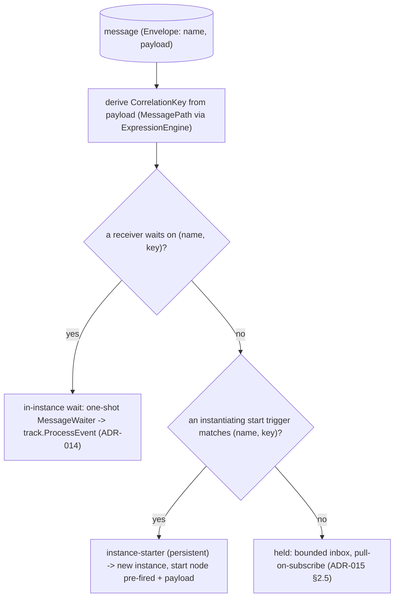
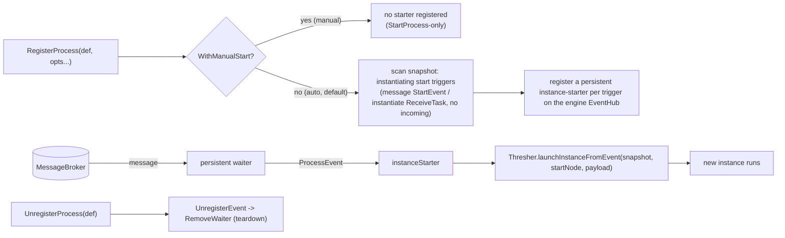
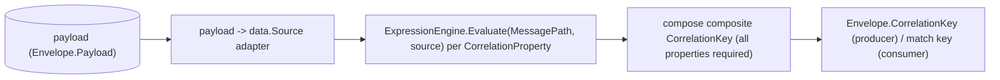

# SRD-015 — Key-based correlation & event-triggered instantiation

| Field | Value |
|---|---|
| Status | Draft |
| Version | v.1 |
| Date | 2026-06-16 |
| Owner | Ruslan Gabitov |
| Implements | [ADR-015 v.1 Event-triggered instantiation](../design/ADR-015-event-triggered-instantiation.md) + [ADR-016 v.1 Message correlation](../design/ADR-016-message-correlation.md) |

This SRD lands **event-triggered instantiation ([ADR-015 v.1](../design/ADR-015-event-triggered-instantiation.md))** — a message creates a process instance — and **key-based correlation ([ADR-016 v.1](../design/ADR-016-message-correlation.md), phase-2a/2b)** — a message routes to the right instance, or a new one, by a key derived from its payload. It builds on the message tasks/events of ADR-014 (SRD-013/014) and uses the BPMN §8.4.2 correlation model and §13.2/§13.5.1/§13.3.3 instantiation semantics. Conversation-token threading (ADR-016 §2.4, phase-2c), context-based/predicate correlation (ADR-016 §2.5), the event-based-gateway start, `Conversation`, and durability stay deferred.

## 1. Background & motivation

### 1.1 Current state (verified against the code)

- **Messaging is in-instance only, routed by name.** `pkg/model/msgflow.Send` publishes an `Envelope{Name, Payload}` with `CorrelationKey` left empty (`send.go:49`); `membroker` matches on name + (empty-or-equal key) (`membroker/membroker.go:40`); a `MessageWaiter` subscribes with an **empty key** (`waiters/message.go:176`). Every receiver runs inside an **already-started** instance.
- **No event-triggered instantiation.** `Thresher.RegisterProcess` only builds + stores a snapshot (`thresher.go:364`); the only instance-creation path is `Thresher.StartProcess → launchInstance → instance.New + Run` (`thresher.go:394,422`). There is **no `UnregisterProcess`** (`thresher.go` — none). A message that should *spawn* a process has no target.
- **`createTracks` eagerly parks a message start event.** `instance.createTracks` seeds an initial track for every no-incoming, non-gateway, non-boundary node (`instance.go:472`) — including a message `StartEvent` (no incoming) and an `instantiate` `ReceiveTask`. Reached as an `EventNode`+`EventProcessor`, `track.checkNodeType` registers a waiter and parks it (`track.go:283`) — an instance existing before its trigger (ADR-015 §1).
- **The `MessageWaiter` is one-shot.** It reads a single envelope and self-removes (`waiters/message.go:209,245-250`); its `fireDefinition` (`message.go:260`) reconstructs the payload as a typed Ready datum — reusable. An instantiating subscription must instead be **persistent** (every message spawns another instance; ADR-015 §2.2).
- **The correlation model already exists as pure data.** `pkg/model/bpmncommon/correlation.go` defines `CorrelationKey` (`:71`), `CorrelationProperty` (`:83`), `CorrelationPropertyRetrievalExpression{MessagePath, MessageRef}` (`:111`), `CorrelationSubscription` (`:51`), `CorrelationPropertyBinding` (`:104`) — no behaviour, no constructors. `process.Process.CorrelationSubscriptions` holds them (`process/process.go:37`). **Missing:** builders, a way to attach a key to a message trigger, and the runtime **derivation** logic.
- **Expressions evaluate over a `data.Source`.** `EngineRuntime.ExpressionEngine().Evaluate(ctx, expr, src)` (`expression/expression.go:21`) — but there is **no "evaluate over a raw payload" path**; a `MessagePath` must run against the message payload, so a payload→`data.Source` adapter is new.
- **`ReceiveTask.Instantiate` exists but is unset.** The field + getter exist (`activities/receive_task.go:42,103`), always false; there is **no `WithInstantiate` option**.
- **The engine EventHub is engine-level and node-agnostic.** The Thresher owns one `eventhub.New(&t.cfg)` (`thresher.go:149`); `Thresher.RegisterEvent` delegates to it (`thresher.go:290`); the `MessageWaiter` fires any `eventproc.EventProcessor`. So a definition-level starter is just a different `EventProcessor` on the same hub.

### 1.2 Why

ADR-015 decided the model; without it gobpm cannot start a process from a message, and cannot run more than one instance per message name (name-match can't tell "payment for order 42" from "payment for order 99"). Long-running business processes need both: a message *spawns* an instance, and subsequent messages *correlate* to the right running one. The pieces exist (correlation structs, broker key field, node-agnostic waiter, expression engine); this SRD wires them.

## 2. Goals & scope

### 2.1 Goals (in scope)

- **G1.** A **persistent** engine-level message subscription (peer of the one-shot in-instance waiter) that fires an `eventproc.EventProcessor` for *every* matching message without self-removing.
- **G2.** A Thresher-hosted **start-subscription manager**: at `RegisterProcess` it registers an **instance-starter** (an `EventProcessor`) per instantiating start trigger; a new `UnregisterProcess` tears them down.
- **G3.** **Event-triggered instantiation** for the **message start event** and the **instantiate `ReceiveTask`** (no incoming flow): on a matching message the starter creates a **new instance**, born with the start node already fired and the payload bound, and runs it. `createTracks` stops seeding instantiating start triggers; a `WithInstantiate` option sets `ReceiveTask.instantiate`.
- **G4.** **Key-based correlation**: a `CorrelationKey` derived from the message payload via its `CorrelationProperty` / `CorrelationPropertyRetrievalExpression.MessagePath`; the producer sets `Envelope.CorrelationKey`; the resolution routes a message to the **existing** correlated instance if one waits, otherwise to a **new** one (instantiation is the no-match branch). Builders for the correlation structs + a process-level key declaration (Conversation-less — see §4.5).
- **G5.** A runnable example: process **A** sends a message that **starts / routes to** process **B** by correlation key (the inter-instance demo).

### 2.2 Non-goals (deferred, per ADR-015 §2.6)

- **Context-based / predicate correlation** (`CorrelationSubscription` `dataPath` over process context, dynamic re-targeting) — later SRD.
- **Event-based-gateway start** (the node type isn't implemented).
- **`Conversation`** — out of conformance scope; keys are declared without it (§4.5).
- **Durable subscriptions / persistence** across restart; **broker-quality** TTL / dead-letter / ordering (broker / ADR-008). The held-message buffer stays bounded + pull-on-subscribe (ADR-015 §2.5).
- **Composite multi-message conversation-token threading** beyond a single derived key (key init-on-first + match-on-arrival is in; the full back-and-forth token is later).

## 3. Requirements

### 3.1 Functional

| # | Requirement |
|---|---|
| FR-1 | The **existing** message waiter gains a **constructor flag** (single-shot vs persistent — e.g. `singleShot bool`); **no new waiter type**. The waiter **never removes itself** — the **EventHub is the sole remover** (ADR-006 v.1 §2.5). After a waiter fires it reports completion to the hub (a terminal state the hub reaps, or a hub callback — **not** a `RemoveWaiter` call from the waiter); the hub then **removes** it if **single-shot** (the in-instance receiver — net behaviour unchanged: gone after one fire) and **retains** it if **persistent** (the instance-starter — fires on every matching envelope, stays until `UnregisterProcess → UnregisterEvent`, `Stop`, or ctx). This **corrects the current waiter self-removal** (`waiters/message.go:250`) to the ADR-006 hub-owned model. `fireDefinition` is shared by both modes. |
| FR-2 | `Thresher` gains a start-subscription manager: `RegisterProcess` scans the snapshot for instantiating start triggers (a `StartEvent` carrying a `MessageEventDefinition` with no incoming flow; a `ReceiveTask` with `instantiate=true` and no incoming flow) and registers a persistent instance-starter (`EventProcessor`) per trigger on the engine EventHub; `UnregisterProcess` removes them. |
| FR-3 | The instance-starter's `ProcessEvent` creates a **new instance** via a born-from-event path: the start node is treated as already fired, the payload is bound as its output, and the initial track starts on the start node's outgoing flow(s). `createTracks` no longer seeds instantiating start triggers (they instantiate via the starter, not as eager parked tracks). A `none` start event keeps the `StartProcess` path. |
| FR-4 | `ReceiveTask` gains a `WithInstantiate` option setting `instantiate=true`; a no-incoming instantiate `ReceiveTask` participates in FR-2/FR-3 like a message start event. |
| FR-5 | Key derivation: given a `CorrelationKey`'s `CorrelationProperty` set and a message payload, compose the composite key by evaluating each property's `CorrelationPropertyRetrievalExpression.MessagePath` (whose `MessageRef` matches the message) over a payload-backed `data.Source`, via the `ExpressionEngine`. A key is valid only when **all** its properties resolve. `msgflow.Send` sets `Envelope.CorrelationKey` from the producer's correlation declaration. |
| FR-6 | Resolution: an incoming message derives its key and routes to the **existing** instance whose receiver waits on that `(name, key)` if one exists; otherwise, if an instantiating start trigger matches, a **new** instance is created; otherwise it is held (bounded, pull-on-subscribe — ADR-015 §2.5). Subsequent start triggers sharing the key join the existing instance (no duplicate). |
| FR-7 | Builders/options for the correlation structs and a **process-level** `CorrelationKey` declaration that a message start event / receiver references (Conversation-less, §4.5); no `internal/*` import from `pkg/model`. |
| FR-8 | A runnable example (own module): process A publishes a message that instantiates/routes to process B by correlation key; exits 0, proving inter-instance correlation. |
| FR-9 | `Thresher.RegisterProcess` accepts options; `WithManualStart()` registers a process **manual-start**: no persistent instance-starter is registered for it (no message spawns an instance — opt-out of auto-instantiation, for testing / back-pressure, ADR-015 §2.2 engine note). Such a process is instantiated **only** via `StartProcess`, and inside that instance its instantiating start nodes are **not** skipped by `createTracks` — they are seeded as ordinary in-instance catches (the intermediate-node rule). Default (no option) is unchanged: auto-instantiation as FR-2/FR-3. The skip in FR-3 is therefore **mode-driven** (auto skips instantiating starts; manual seeds them). |

### 3.2 Non-functional

| # | Requirement |
|---|---|
| NFR-1 | No payload **values** in logs — message name, key (or its hash), item ids, states only (ADR-010/011/014; ADR-015 §5 sensitive-keys). |
| NFR-2 | **Bounded** held-message buffer (no-OOM, ADR-015 §2.5); the persistent starter subscription must not leak goroutines/subscriptions — torn down at `UnregisterProcess` and engine shutdown. -race clean. |
| NFR-3 | `make ci` green per milestone; diff-coverage ≥95 % (target 100 %) on touched files; existing thresher / instance / eventhub / model suites pass. |
| NFR-4 | `pkg/model` imports no `internal/*` (depguard); new exported symbols documented; new constructors/options validate inputs with self-identifying errors. The instance-starter lives in the Thresher (a focused collaborator), **never on `Instance`** (ADR-015 §2.2). |

## 4. Design & implementation plan

### 4.1 One resolution path, two event-processor kinds

The in-instance receiver (one-shot waiter → track) is ADR-014/SRD-013-014. This SRD adds the instance-starter (persistent waiter → new instance) and the key derivation feeding both.

### 4.2 One waiter, a single-shot/persistent flag — the hub owns removal

The existing `messageWaiter` gets a **constructor flag** (single-shot vs
persistent) — no new type — and **never calls `RemoveWaiter`** (correcting the
current `waiters/message.go:250` self-removal). The **EventHub is the sole
lifecycle owner** (ADR-006 v.1 §2.5): after a waiter fires, it reports
completion to the hub (a terminal state the hub reaps, or a hub callback), and
the **hub** removes it when **single-shot** and **keeps** it when **persistent**.

- **Single-shot** (the in-instance receiver): net behaviour unchanged — removed
  by the hub after one fire; today it self-removed, now the hub removes it.
- **Persistent** (the instance-starter): loops the subscription, fires for every
  matching message, is never reaped on fire; the hub drops it only at
  `UnregisterProcess → UnregisterEvent`, `Stop`, or ctx.

It subscribes for `(name, derived-key)` (or `(name, "")` and filters by key).
`fireDefinition` is shared. The hub holds or drops the waiter purely per the
flag; the waiter is removal-passive. **Removal is unified across every waiter**
(not just the message one): a new `EventHub.WaiterFired(eDefID)` is the single
removal entry point — a waiter reports its fire and the hub removes it **iff**
the waiter is in a terminal state (`WSEnded`/`WSFailed`), keeping a still-running
one (a persistent message waiter, or a timer mid-cycle). The **timer waiter is
migrated in the same milestone** from its own `RemoveWaiter` self-call to
`WaiterFired`, so no waiter self-removes — fully realizing ADR-006 v.1 §2.5 for
the whole waiter family, not a message-only slice.

### 4.3 The instance-starter & start-subscription manager (Thresher)

A focused collaborator owned by the `Thresher` (a struct field, built in `New`), wired into `RegisterProcess`/`UnregisterProcess`. The starter implements `eventproc.EventProcessor`; its `ProcessEvent` calls a new `launchInstanceFromEvent` (sibling of `launchInstance`). Never touches `Instance`. The scan runs only in **auto** mode (the default); a `WithManualStart`-registered process registers **no** starter (FR-9, ADR-015 §2.2 engine note) — its lifecycle stays `StartProcess`-only. Because `RegisterProcess` may be called before `Run` (the hub starts in `Run`), starters are registered on the hub at the later of `RegisterProcess`/`Run`, and torn down at `UnregisterProcess`.

### 4.4 Born-from-event instantiation (mode-driven `createTracks` skip)

`createTracks` gains a predicate to **skip** a no-incoming node that is an instantiating start trigger **so long as the instance is born from an event (auto mode)**: such a node does not auto-park because the starter pre-fires it. A new instance-creation entry (`instance.NewFromEvent`, or a parameter to `New`) builds the instance with that start node **already fired**: its payload is bound as its output (reuse the `catchEvent` dataOutput path / `msgflow.Bind`), and the initial track starts on the start node's **outgoing** flow(s) — analogous to fork seeding (`instance.go:396`) — bypassing `track.checkNodeType` parking. In **manual** mode (FR-9) the skip does **not** apply: the instantiating start node is seeded as an ordinary in-instance catch (`StartEvent` embeds `catchEvent`, so `track.checkNodeType` parks it and registers a single-shot waiter — `event.go:212`), and the instance waits for its message after an explicit `StartProcess`. A `none` start event is unaffected in either mode (still `StartProcess`).

### 4.5 Key derivation & Conversation-less key declaration

- **Derivation** — a runtime helper takes a `CorrelationKey` (its `CorrelationProperty`s, each with a `CorrelationPropertyRetrievalExpression` selected by `MessageRef`) and a payload, and composes the composite key string via the `ExpressionEngine` over a payload-backed `data.Source` (new adapter, mirroring how `fireDefinition` reconstructs the payload as a typed datum). The producer (`msgflow.Send`) sets `Envelope.CorrelationKey`; the consumer/starter derives the same key to match.
- **Where keys live (engine note — owned by [ADR-016 v.1 §2.6](../design/ADR-016-message-correlation.md)).** In BPMN, `CorrelationKey`s belong to a `Conversation` (§8.4.2); gobpm keeps `Conversation` out of scope and declares keys at the **process level** instead (the structs already hang off the process), preserving the standard's *key/property/retrieval* object model verbatim — only the *container* is replaced. A message start event / receiver references the key it correlates on.

### 4.6 Milestones (each = one commit, `make ci` green)

- **M1 — single-shot/persistent waiter flag (hub-owned removal, unified).** Add the constructor flag to the existing message waiter and **move removal from the waiter to the EventHub** via a new `EventHub.WaiterFired(eDefID)` (the hub removes a waiter only when it reports a terminal state — single-shot after one fire, never a persistent one — ADR-006 v.1 §2.5) + `NewMessageWaiter`/`CreateWaiter` wiring. **Unify all waiters now**: migrate the timer waiter off its `RemoveWaiter` self-call to `WaiterFired` too, so no waiter self-removes. Unit tests (single-shot removed by the hub as before; persistent fires repeatedly, retained; timer still removed after its last cycle, now via the hub; `WaiterFired` reaps terminal / keeps running).
- **M2 — instance-starter + manager + registration option.** `EventHub` gains a persistent registration path (`RegisterPersistentEvent` + `waiters.CreatePersistentWaiter`); Thresher collaborator scans at `RegisterProcess` (auto mode only), registers persistent starters at the later of `RegisterProcess`/`Run`, `UnregisterProcess` tears down. `RegisterProcess(p, ...RegisterOption)` + `WithManualStart()` (FR-9) suppresses the scan. Tests (registration wires/teardowns subscriptions; manual-start registers none). The actual launch (`launchInstanceFromEvent`) is a one-commit placeholder filled in M3.
- **M3 — born-from-event instantiation + mode-driven `createTracks` skip.** `instance.NewFromEvent` + `Thresher.launchInstanceFromEvent`; a message start event spawns an instance that runs from the start node with the payload. `createTracks` skips instantiating starts **for born-from-event (auto) instances** and seeds them as catches otherwise (FR-9). Instance integration tests (auto: publish → new instance completes, payload in scope; manual: `StartProcess` → instance waits at the start node, then publish → completes).
- **M4 — instantiate `ReceiveTask`.** `WithInstantiate` option; a no-incoming instantiate receiver instantiates like a message start event. Tests.
- **M5a — correlation key derivation & producer.** Correlation builders (`NewCorrelationKey`/`Property`/`RetrievalExpression`); `msgflow.DeriveKey` + a payload→`data.Source` adapter (composite key from a payload, all properties required). Tests (composite-key derivation; partial key invalid; `MessageRef` selection). (`msgflow.Send` wiring lands with the producer declaration in M5b.)
- **M5b — keyed resolution.** membroker specificity-routing (exact key before wildcard); the starter derives the key + atomic per-key create-or-route (no duplicate); keyed in-instance receivers (key threaded from the born message); process-level `CorrelationKey` declaration; `msgflow.Send` sets `Envelope.CorrelationKey`. Tests (two instances disambiguated by key; subsequent start joins existing; routes-to-existing).
- **M6 — example + DoD.** Inter-instance "A starts/routes to B by key" example (own module); smoke exit 0; coverage gate.

### 4.7 Tests

Persistent waiter (multi-fire, no self-remove, teardown); start-subscription manager (register/unregister; `WithManualStart` registers no starter); born-from-event instantiation (instance + thresher level — publish a message-start message, assert a new instance is created and completes with the payload bound, mirroring `internal/instance/message_flow_test.go` + `pkg/thresher/thresher_process_test.go`); manual-start mode (a `WithManualStart` process is not auto-instantiated by a published message, and a `StartProcess`-launched instance waits at its message-start node then completes on delivery); instantiate `ReceiveTask`; key derivation (composite key from a payload; partial key invalid); resolution (existing-vs-new; two parallel instances correlated by distinct keys; subsequent start joins existing); the example as smoke.

## 5. Verification (Definition of Done)

| # | Check | Expectation |
|---|---|---|
| V1 | Persistent waiter fires repeatedly without self-removing; one-shot in-instance waiter unchanged; clean teardown, -race (FR-1, NFR-2). | green |
| V2 | `RegisterProcess` (auto, default) registers instance-starters for instantiating start triggers; `UnregisterProcess` removes them; `createTracks` no longer parks them in a born-from-event instance. `WithManualStart` registers no starter and the start node is seeded as a catch in a `StartProcess`-launched instance (FR-2/3/9). | green |
| V3 | A published message-start message creates a new instance, born with the start node fired and the payload bound; it runs to completion (FR-3). | green |
| V4 | An instantiate `ReceiveTask` (WithInstantiate, no incoming) instantiates on a matching message (FR-4). | green |
| V5 | A composite `CorrelationKey` is derived from the payload (all properties required); `Envelope.CorrelationKey` is set by the producer (FR-5/7). | green |
| V6 | Resolution: a message routes to the existing correlated instance when one waits, else instantiates; two parallel instances are disambiguated by key; a subsequent start sharing the key joins the existing instance (FR-6). | green |
| V7 | Inter-instance example (A → B by key) runs to exit 0; existing suites pass (FR-8, NFR-3). | green |
| V8 | `make ci` green; diff-coverage ≥95 % on touched files; `pkg/model` imports no internal; held buffer bounded; no goroutine/subscription leak (NFR-2/3/4). | pass |

## 6. Risks & regressions

- **Born-from-event seeding bypasses `checkNodeType`.** The start node must not also be parked; the `createTracks` skip + the born-from-event track seeding must be consistent, or an instance both spawns and waits. Covered by V2/V3; mirror the §6 trap discipline from SRD-014.
- **Persistent subscription lifecycle / leak.** A never-self-removing waiter must be torn down at `UnregisterProcess` and shutdown; otherwise goroutine/subscription leak. NFR-2 + a leak test.
- **Payload→`Source` adapter fidelity.** A `MessagePath` evaluating over a reconstructed payload must see the same shape the producer bound; mismatch → wrong/empty key (silent mis-route). Test the round-trip (producer key == consumer-derived key).
- **Resolution race (new-vs-existing).** Two messages for the same not-yet-existing key could each try to instantiate (duplicate instances). The starter must make "create-or-route" atomic per key (single-flight). Covered by the subsequent-start-joins-existing test; guard like the SRD-014 track-step race.
- **`createTracks` change touches all processes.** Skipping instantiating starts must not affect none-start or non-message start events; existing thresher/instance suites guard it.
- **Conversation-less key declaration** is an engine choice (§4.5); if it later proves limiting, the Conversation container is the standard escape hatch (deferred).

## 7. Implementation summary

*Post-landing placeholder — filled at the final audit with files, V-results, and milestone SHAs.*

## 8. References

- [ADR-015 v.1 Event-triggered instantiation](../design/ADR-015-event-triggered-instantiation.md) — the instantiation decision this implements; §2.2 instance-starter, §2.4 entry points, §2.6 deferrals.
- [ADR-016 v.1 Message correlation](../design/ADR-016-message-correlation.md) — the correlation decision this implements (phase-2a key derivation done; phase-2b key-based instantiation-resolution); §2.2 key-based, §2.3 resolution model, §2.6 Conversation-less key declaration, §2.7 no-target/bounded, §2.8 phasing.
- [ADR-014 v.1 Message Handling](../design/ADR-014-message-handling.md) — the message tasks/events + the node-agnostic `MessageWaiter` + `Envelope.CorrelationKey` this builds on.
- [ADR-006 v.1 Events & Subscriptions](../design/ADR-006-events-and-subscriptions.md) — §2.5 the EventHub is the **sole owner** of waiter removal (no self-removal); SRD-015 adopts it for the message waiter (single-shot removed by the hub, persistent retained) and corrects the current `message.go:250` self-removal.
- [ADR-002 v.1 Extension Architecture](../design/ADR-002-extension-architecture.md) — the `MessageBroker` boundary the starter subscribes on; bounded-in-memory defaults.
- [ADR-001 v.5 Execution Model](../design/ADR-001-execution-model.md) — instances/tracks/lifecycle the instantiation path feeds.
- [SRD-013 v.1](SRD-013-send-receive-tasks.md) / [SRD-014 v.1](SRD-014-message-events.md) — the message tasks/events + `msgflow` seam + `MessageWaiter` reused here (sideways).
- BPMN 2.0 **§8.4.2** (correlation), **§13.2 / §13.5.1** (instantiating start), **§13.3.3** (Receive Task) — `docs/bpmn-spec/`.

## 9. Open questions

None. Scope is ADR-015 phase-2: event-triggered instantiation (message start event + instantiate `ReceiveTask`) via a Thresher-hosted instance-starter on a **persistent** engine subscription, born-from-event seeding with `createTracks` skipping instantiating starts; and **key-based** correlation (composite key derived from the payload via `CorrelationPropertyRetrievalExpression.MessagePath`, `Envelope.CorrelationKey`, existing-vs-new resolution). Correlation keys are declared at the **process level** (Conversation out of scope — §4.5 engine note, standard object model preserved). Context-based/predicate correlation, event-based-gateway start, `Conversation`, durability, and broker-quality guarantees are deferred (§2.2).

## Document History

| Version | Date | Author | Change |
|---|---|---|---|
| v.1 | 2026-06-16 | Ruslan Gabitov | Draft. Implements ADR-015 v.1 phase-2: **event-triggered instantiation** (message start event + instantiate `ReceiveTask`) via a Thresher-hosted **instance-starter** on the existing message waiter given a **single-shot/persistent constructor flag**, with **removal owned by the EventHub** (ADR-006 v.1 §2.5 — the waiter never self-removes; the hub removes single-shot waiters after they fire and retains persistent ones, correcting the current `message.go:250` self-removal); `RegisterProcess` registers starters, `UnregisterProcess` tears them down; `createTracks` stops seeding instantiating start triggers; a born-from-event `instance.NewFromEvent` seeds the new instance with the start node pre-fired and the payload bound. **Key-based correlation**: a composite `CorrelationKey` derived from the message payload via `CorrelationPropertyRetrievalExpression.MessagePath` over a payload-backed `data.Source` (new adapter) through the `ExpressionEngine`; `msgflow.Send` sets `Envelope.CorrelationKey`; resolution routes a message to the existing correlated instance or instantiates a new one (subsequent start sharing the key joins the existing instance). The correlation structs already exist in `bpmncommon`; this adds builders, a process-level key declaration (Conversation-less engine note — standard object model preserved), and the runtime derivation. Six milestones + an inter-instance "A starts/routes to B by key" example. Deferred: context-based/predicate correlation, event-based-gateway start, `Conversation`, durability, broker-quality guarantees. Implements ADR-015 v.1. |
