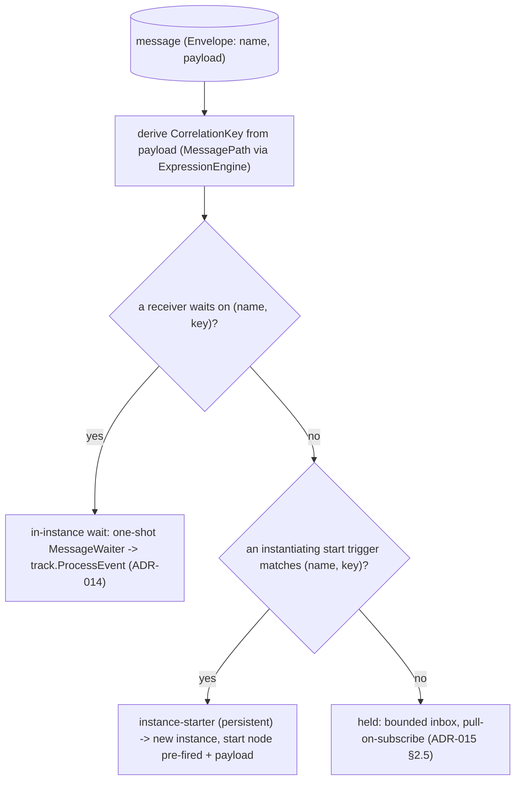
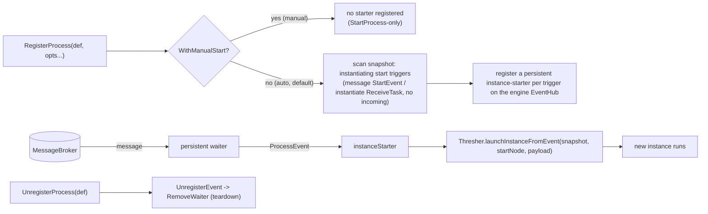
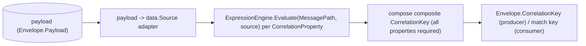

# SRD-015 — Корреляция по ключу и инстанцирование по событию

| Поле | Значение |
|---|---|
| Статус | Принято |
| Версия | v.1 |
| Дата | 2026-06-16 |
| Владелец | Ruslan Gabitov |
| Реализует | [ADR-015 v.1 Инстанцирование по событию](../design/ADR-015-event-triggered-instantiation.ru.md) + [ADR-016 v.1 Корреляция сообщений](../design/ADR-016-message-correlation.ru.md) |

Этот SRD внедряет **инстанцирование по событию ([ADR-015 v.1](../design/ADR-015-event-triggered-instantiation.ru.md))** — сообщение создаёт экземпляр процесса — и **корреляцию по ключу ([ADR-016 v.1](../design/ADR-016-message-correlation.ru.md), фаза-2a/2b)** — сообщение маршрутизируется в нужный экземпляр или в новый по ключу, выведенному из его payload. Он строится на задачах/событиях-сообщениях из ADR-014 (SRD-013/014) и использует модель корреляции BPMN §8.4.2 и семантику инстанцирования §13.2/§13.5.1/§13.3.3. Conversation-token threading (ADR-016 §2.4, фаза-2c), context-based/predicate-корреляция (ADR-016 §2.5), старт через event-based-gateway, `Conversation` и долговечность остаются отложенными.

## 1. Предпосылки и мотивация

### 1.1 Текущее состояние (проверено по коду)

- **Сообщения только внутри экземпляра, маршрутизация по имени.** `pkg/model/msgflow.Send` публикует `Envelope{Name, Payload}` с пустым `CorrelationKey` (`send.go:49`); `membroker` сопоставляет по имени + (пустой-или-равный ключ) (`membroker/membroker.go:40`); `MessageWaiter` подписывается с **пустым ключом** (`waiters/message.go:176`). Каждый получатель работает внутри **уже запущенного** экземпляра.
- **Нет инстанцирования по событию.** `Thresher.RegisterProcess` только строит + сохраняет снапшот (`thresher.go:364`); единственный путь создания экземпляра — `Thresher.StartProcess → launchInstance → instance.New + Run` (`thresher.go:394,422`). **Нет `UnregisterProcess`** (`thresher.go` — отсутствует). Сообщению, которое должно *породить* процесс, некуда деться.
- **`createTracks` преждевременно паркует стартовое событие-сообщение.** `instance.createTracks` засевает начальную дорожку для каждого узла без входящего потока, не-шлюза, не-граничного (`instance.go:472`) — включая `StartEvent`-сообщение (без входящего) и `instantiate` `ReceiveTask`. Достигнутый как `EventNode`+`EventProcessor`, `track.checkNodeType` регистрирует waiter и паркует его (`track.go:283`) — экземпляр существует раньше своего триггера (ADR-015 §1).
- **`MessageWaiter` одноразовый.** Он читает один envelope и самоудаляется (`waiters/message.go:209,245-250`); его `fireDefinition` (`message.go:260`) реконструирует payload как типизированный Ready-datum — переиспользуемо. Инстанцирующая подписка должна быть вместо этого **persistent** (каждое сообщение порождает ещё один экземпляр; ADR-015 §2.2).
- **Модель корреляции уже существует как чистые данные.** `pkg/model/bpmncommon/correlation.go` определяет `CorrelationKey` (`:71`), `CorrelationProperty` (`:83`), `CorrelationPropertyRetrievalExpression{MessagePath, MessageRef}` (`:111`), `CorrelationSubscription` (`:51`), `CorrelationPropertyBinding` (`:104`) — без поведения, без конструкторов. `process.Process.CorrelationSubscriptions` держит их (`process/process.go:37`). **Отсутствует:** билдеры, способ привязать ключ к триггеру-сообщению и runtime-логика **вывода** (derivation).
- **Выражения вычисляются над `data.Source`.** `EngineRuntime.ExpressionEngine().Evaluate(ctx, expr, src)` (`expression/expression.go:21`) — но **нет пути «вычислить над сырым payload»**; `MessagePath` должен выполняться над payload сообщения, поэтому адаптер payload→`data.Source` — новый.
- **`ReceiveTask.Instantiate` существует, но не устанавливается.** Поле + геттер существуют (`activities/receive_task.go:42,103`), всегда false; **нет опции `WithInstantiate`**.
- **EventHub движка работает на уровне движка и не привязан к узлу.** Thresher владеет одним `eventhub.New(&t.cfg)` (`thresher.go:149`); `Thresher.RegisterEvent` делегирует ему (`thresher.go:290`); `MessageWaiter` срабатывает на любой `eventproc.EventProcessor`. Так что стартер уровня определения — это просто другой `EventProcessor` на том же хабе.

### 1.2 Зачем

ADR-015 решил модель; без неё gobpm не может запустить процесс из сообщения и не может выполнять более одного экземпляра на имя сообщения (сопоставление по имени не отличит «оплата заказа 42» от «оплата заказа 99»). Долгоживущим бизнес-процессам нужны оба: сообщение *порождает* экземпляр, и последующие сообщения *коррелируют* в нужный работающий. Части существуют (структуры корреляции, поле ключа у брокера, не привязанный к узлу waiter, движок выражений); этот SRD их соединяет.

## 2. Цели и scope

### 2.1 Цели (в scope)

- **G1.** **Persistent**-подписка на сообщения уровня движка (аналог одноразового waiter внутри экземпляра), которая срабатывает на `eventproc.EventProcessor` для *каждого* подходящего сообщения без самоудаления.
- **G2.** Менеджер стартовых подписок, хостящийся в Thresher: при `RegisterProcess` он регистрирует **стартер экземпляров** (`EventProcessor`) на каждый инстанцирующий стартовый триггер; новый `UnregisterProcess` сносит их.
- **G3.** **Инстанцирование по событию** для **стартового события-сообщения** и **инстанцирующего `ReceiveTask`** (без входящего потока): по подходящему сообщению стартер создаёт **новый экземпляр**, рождённый с уже сработавшим стартовым узлом и связанным payload, и запускает его. `createTracks` перестаёт засевать инстанцирующие стартовые триггеры; опция `WithInstantiate` устанавливает `ReceiveTask.instantiate`.
- **G4.** **Корреляция по ключу**: `CorrelationKey`, выведенный из payload сообщения через его `CorrelationProperty` / `CorrelationPropertyRetrievalExpression.MessagePath`; продюсер устанавливает `Envelope.CorrelationKey`; разрешение маршрутизирует сообщение в **существующий** коррелированный экземпляр, если он ждёт, иначе в **новый** (инстанцирование — это ветка «нет совпадения»). Билдеры для структур корреляции + объявление ключа на уровне процесса (Conversation-less — см. §4.5).
- **G5.** Запускаемый пример: процесс **A** отправляет сообщение, которое **стартует / маршрутизируется в** процесс **B** по корреляционному ключу (межэкземплярное демо).

### 2.2 Не-цели (отложено, по ADR-015 §2.6)

- **Context-based / predicate-корреляция** (`CorrelationSubscription` `dataPath` над контекстом процесса, динамическое перенацеливание) — поздний SRD.
- **Старт через event-based-gateway** (тип узла не реализован).
- **`Conversation`** — вне scope конформности; ключи объявляются без него (§4.5).
- **Долговечные подписки / персистентность** между перезапусками; **качество брокера** TTL / dead-letter / упорядочивание (брокер / ADR-008). Буфер придержанных сообщений остаётся ограниченным + pull-on-subscribe (ADR-015 §2.5).
- **Composite multi-message conversation-token threading** сверх одного выведенного ключа (key init-on-first + match-on-arrival — внутри; полный туда-обратно токен — позже).

## 3. Требования

### 3.1 Функциональные

| # | Требование |
|---|---|
| FR-1 | **Существующий** message waiter получает **флаг конструктора** (single-shot vs persistent — например, `singleShot bool`); **без нового типа waiter**. Waiter **никогда не удаляет себя сам** — **EventHub единственный, кто удаляет** (ADR-006 v.1 §2.5). После срабатывания waiter сообщает о завершении хабу (терминальное состояние, которое хаб пожинает, либо колбэк хаба — **не** вызов `RemoveWaiter` из waiter); хаб затем **удаляет** его, если он **single-shot** (получатель внутри экземпляра — итоговое поведение не изменилось: исчезает после одного срабатывания) и **удерживает**, если он **persistent** (стартер экземпляров — срабатывает на каждый подходящий envelope, остаётся до `UnregisterProcess → UnregisterEvent`, `Stop` или ctx). Это **исправляет текущее самоудаление waiter** (`waiters/message.go:250`) на модель ADR-006, где владеет хаб. `fireDefinition` общий для обоих режимов. |
| FR-2 | `Thresher` получает менеджер стартовых подписок: `RegisterProcess` сканирует снапшот на инстанцирующие стартовые триггеры (`StartEvent`, несущий `MessageEventDefinition` без входящего потока; `ReceiveTask` с `instantiate=true` без входящего потока) и регистрирует persistent-стартер экземпляров (`EventProcessor`) на каждый триггер на EventHub движка; `UnregisterProcess` удаляет их. |
| FR-3 | `ProcessEvent` стартера экземпляров создаёт **новый экземпляр** через путь born-from-event: стартовый узел считается уже сработавшим, payload связывается как его выход, а начальная дорожка стартует на исходящем потоке(ах) стартового узла. `createTracks` больше не засевает инстанцирующие стартовые триггеры (они инстанцируются через стартер, а не как преждевременно припаркованные дорожки). Стартовое событие *none* сохраняет путь `StartProcess`. |
| FR-4 | `ReceiveTask` получает опцию `WithInstantiate`, устанавливающую `instantiate=true`; инстанцирующий `ReceiveTask` без входящего потока участвует в FR-2/FR-3 как стартовое событие-сообщение. |
| FR-5 | Вывод ключа: дан набор `CorrelationProperty` у `CorrelationKey` и payload сообщения — составить композитный ключ, вычислив `CorrelationPropertyRetrievalExpression.MessagePath` каждого свойства (чей `MessageRef` совпадает с сообщением) над payload-backed `data.Source` через `ExpressionEngine`. Ключ валиден только когда **все** его свойства разрешаются. `msgflow.Send` устанавливает `Envelope.CorrelationKey` из объявления корреляции продюсера. |
| FR-6 | Разрешение (фаза-2b): входящее сообщение выводит свой ключ; стартер делает **create-or-route-or-join** по ключу — невиданный ключ создаёт **новый** экземпляр, виденный ключ **присоединяет** к существующему (последующий старт с тем же ключом **не** дублирует), а сообщение без выводимого ключа инстанцирует как раньше; немаршрутизируемое сообщение придерживается (ограниченно, pull-on-subscribe — ADR-015 §2.5). **Отложено в фазу-2c** (ADR-016 §2.4/§2.8): маршрутизация *последующего* сообщения в keyed in-instance-получателя *конкретного работающего* экземпляра (conversation-token threading) — in-instance-получатели в этом SRD всё ещё подписываются по имени. |
| FR-7 | Билдеры/опции для структур корреляции и объявление `CorrelationKey` **на уровне процесса**, на которое ссылается стартовое событие-сообщение / получатель (Conversation-less, §4.5); никакого импорта `internal/*` из `pkg/model`. |
| FR-8 | Запускаемый пример (собственный модуль): процесс A публикует сообщение, которое инстанцирует/маршрутизирует в процесс B по корреляционному ключу; завершается с кодом 0, доказывая межэкземплярную корреляцию. |
| FR-9 | `Thresher.RegisterProcess` принимает опции; `WithManualStart()` регистрирует процесс как **manual-start**: для него не регистрируется persistent-стартер экземпляров (никакое сообщение не порождает экземпляр — отказ от авто-инстанцирования, для тестов / обратного давления, примечание движка ADR-015 §2.2). Такой процесс инстанцируется **только** через `StartProcess`, и внутри этого экземпляра его инстанцирующие стартовые узлы **не** пропускаются `createTracks` — они засеваются как обычные ловящие узлы внутри экземпляра (правило промежуточного узла). По умолчанию (без опции) не изменилось: авто-инстанцирование как FR-2/FR-3. Пропуск в FR-3 поэтому **управляется режимом** (auto пропускает инстанцирующие старты; manual засевает их). |

### 3.2 Нефункциональные

| # | Требование |
|---|---|
| NFR-1 | Никаких **значений** payload в логах — только имя сообщения, ключ (или его хэш), id элементов, состояния (ADR-010/011/014; ADR-015 §5 чувствительные ключи). |
| NFR-2 | **Ограниченный** буфер придержанных сообщений (no-OOM, ADR-015 §2.5); persistent-подписка стартера не должна течь горутинами/подписками — сносится при `UnregisterProcess` и остановке движка. Чисто под -race. |
| NFR-3 | `make ci` зелёный на каждой вехе; diff-coverage ≥95 % (цель 100 %) на затронутых файлах; существующие наборы thresher / instance / eventhub / model проходят. |
| NFR-4 | `pkg/model` не импортирует `internal/*` (depguard); новые экспортируемые символы документированы; новые конструкторы/опции валидируют вход с само-идентифицирующими ошибками. Стартер экземпляров живёт в Thresher (сфокусированный коллаборатор), **никогда на `Instance`** (ADR-015 §2.2). |

## 4. Дизайн и план реализации

### 4.1 Один путь разрешения, два вида event-processor

Получатель внутри экземпляра (одноразовый waiter → track) — это ADR-014/SRD-013-014. Этот SRD добавляет стартер экземпляров (persistent waiter → новый экземпляр) и вывод ключа, питающий оба.

### 4.2 Один waiter, флаг single-shot/persistent — удалением владеет хаб

Существующий `messageWaiter` получает **флаг конструктора** (single-shot vs persistent) — без нового типа — и **никогда не вызывает `RemoveWaiter`** (исправляя текущее самоудаление `waiters/message.go:250`). **EventHub — единственный владелец жизненного цикла** (ADR-006 v.1 §2.5): после срабатывания waiter сообщает хабу о завершении (терминальное состояние, которое хаб пожинает, либо колбэк хаба), и **хаб** удаляет его, когда он **single-shot**, и **сохраняет**, когда **persistent**.

- **Single-shot** (получатель внутри экземпляра): итоговое поведение не изменилось — удаляется хабом после одного срабатывания; сегодня он самоудалялся, теперь удаляет хаб.
- **Persistent** (стартер экземпляров): зацикливает подписку, срабатывает на каждое подходящее сообщение, никогда не пожинается при срабатывании; хаб роняет его только при `UnregisterProcess → UnregisterEvent`, `Stop` или ctx.

Он подписывается на `(name, derived-key)` (или `(name, "")` и фильтрует по ключу). `fireDefinition` общий. Хаб держит или роняет waiter чисто по флагу; waiter пассивен к удалению. **Удаление унифицировано по всем waiter** (не только message-): новый `EventHub.WaiterFired(eDefID)` — единая точка входа удаления — waiter сообщает о срабатывании, и хаб удаляет его **только если** waiter в терминальном состоянии (`WSEnded`/`WSFailed`), сохраняя всё ещё работающий (persistent message waiter или таймер в середине цикла). **Timer waiter мигрирован в той же вехе** со своего собственного вызова `RemoveWaiter` на `WaiterFired`, так что ни один waiter не самоудаляется — полностью реализуя ADR-006 v.1 §2.5 для всего семейства waiter, а не message-only среза.

### 4.3 Стартер экземпляров и менеджер стартовых подписок (Thresher)

Сфокусированный коллаборатор, которым владеет `Thresher` (поле структуры, строится в `New`), подключённый в `RegisterProcess`/`UnregisterProcess`. Стартер реализует `eventproc.EventProcessor`; его `ProcessEvent` вызывает новый `launchInstanceFromEvent` (брат `launchInstance`). Никогда не касается `Instance`. Скан выполняется только в режиме **auto** (по умолчанию); процесс, зарегистрированный с `WithManualStart`, регистрирует **нет** стартера (FR-9, примечание движка ADR-015 §2.2) — его жизненный цикл остаётся `StartProcess`-only. Поскольку `RegisterProcess` может вызываться до `Run` (хаб стартует в `Run`), стартеры регистрируются на хабе в более поздний из моментов `RegisterProcess`/`Run` и сносятся при `UnregisterProcess`.

### 4.4 Инстанцирование born-from-event (пропуск `createTracks`, управляемый режимом)

`createTracks` получает предикат для **пропуска** узла без входящего потока, который является инстанцирующим стартовым триггером, **пока экземпляр рождается из события (режим auto)**: такой узел не паркуется автоматически, потому что стартер пред-зажигает его. Новый вход создания экземпляра (`instance.NewFromEvent` или параметр к `New`) строит экземпляр с этим стартовым узлом **уже сработавшим**: его payload связывается как его выход (переиспользуя путь dataOutput у `catchEvent` / `msgflow.Bind`), а начальная дорожка стартует на **исходящем** потоке(ах) стартового узла — аналогично посеву fork (`instance.go:396`) — обходя парковку `track.checkNodeType`. В режиме **manual** (FR-9) пропуск **не** применяется: инстанцирующий стартовый узел засевается как обычный ловящий узел внутри экземпляра (`StartEvent` встраивает `catchEvent`, так что `track.checkNodeType` паркует его и регистрирует одноразовый waiter — `event.go:212`), и экземпляр ждёт своего сообщения после явного `StartProcess`. Стартовое событие *none* не затронуто ни в одном режиме (всё ещё `StartProcess`).

### 4.5 Вывод ключа и Conversation-less объявление ключа

- **Вывод (derivation)** — runtime-хелпер берёт `CorrelationKey` (его `CorrelationProperty`s, каждое с `CorrelationPropertyRetrievalExpression`, выбранным по `MessageRef`) и payload, и составляет строку композитного ключа через `ExpressionEngine` над payload-backed `data.Source` (новый адаптер, зеркалящий то, как `fireDefinition` реконструирует payload как типизированный datum). Продюсер (`msgflow.Send`) устанавливает `Envelope.CorrelationKey`; консьюмер/стартер выводит тот же ключ для совпадения.
- **Где живут ключи (примечание движка — владеет [ADR-016 v.1 §2.6](../design/ADR-016-message-correlation.ru.md)).** В BPMN `CorrelationKey`s принадлежат `Conversation` (§8.4.2); gobpm держит `Conversation` вне scope и объявляет ключи на **уровне процесса** вместо этого (структуры уже висят на процессе), сохраняя дословно объектную модель стандарта *key/property/retrieval* — заменяется только *контейнер*. Стартовое событие-сообщение / получатель ссылается на ключ, по которому коррелирует.

### 4.6 Вехи (каждая = один коммит, `make ci` зелёный)

- **M1 — флаг single-shot/persistent у waiter (удаление у хаба, унифицировано).** Добавить флаг конструктора существующему message waiter и **перенести удаление с waiter на EventHub** через новый `EventHub.WaiterFired(eDefID)` (хаб удаляет waiter только когда тот сообщает терминальное состояние — single-shot после одного срабатывания, никогда persistent — ADR-006 v.1 §2.5) + проводка `NewMessageWaiter`/`CreateWaiter`. **Унифицировать все waiter сейчас**: мигрировать timer waiter с его вызова `RemoveWaiter` тоже на `WaiterFired`, чтобы ни один waiter не самоудалялся. Unit-тесты (single-shot удаляется хабом как раньше; persistent срабатывает многократно, удерживается; timer всё ещё удаляется после последнего цикла, теперь через хаб; `WaiterFired` пожинает терминальный / держит работающий).
- **M2 — стартер экземпляров + менеджер + опция регистрации.** `EventHub` получает persistent-путь регистрации (`RegisterPersistentEvent` + `waiters.CreatePersistentWaiter`); коллаборатор Thresher сканирует при `RegisterProcess` (только режим auto), регистрирует persistent-стартеры в более поздний из `RegisterProcess`/`Run`, `UnregisterProcess` сносит. `RegisterProcess(p, ...RegisterOption)` + `WithManualStart()` (FR-9) подавляет скан. Тесты (регистрация проводит/сносит подписки; manual-start не регистрирует ни одной). Сам запуск (`launchInstanceFromEvent`) — одно-коммитный плейсхолдер, заполняемый в M3.
- **M3 — инстанцирование born-from-event + пропуск `createTracks`, управляемый режимом.** `instance.NewFromEvent` + `Thresher.launchInstanceFromEvent`; стартовое событие-сообщение порождает экземпляр, который работает от стартового узла с payload. `createTracks` пропускает инстанцирующие старты **для born-from-event (auto)-экземпляров** и засевает их как ловящие иначе (FR-9). Интеграционные тесты экземпляра (auto: publish → новый экземпляр завершается, payload в scope; manual: `StartProcess` → экземпляр ждёт на стартовом узле, затем publish → завершается).
- **M4 — инстанцирующий `ReceiveTask`.** Опция `WithInstantiate`; получатель без входящего потока с instantiate инстанцирует как стартовое событие-сообщение. Тесты.
- **M5a — вывод корреляционного ключа и продюсер.** Билдеры корреляции (`NewCorrelationKey`/`Property`/`RetrievalExpression`); `msgflow.DeriveKey` + адаптер payload→`data.Source` (композитный ключ из payload, все свойства обязательны). Тесты (вывод композитного ключа; частичный ключ невалиден; выбор `MessageRef`). (Проводка `msgflow.Send` приходит с объявлением продюсера в M5b.)
- **M5b-consumer — разрешение инстанцирования по ключу** (ADR-016 v.1 §2.3, фаза-2b). `WithCorrelationKey` на стартовом триггере-сообщении; стартер выводит входящий ключ из payload, и менеджер делает **атомарный create-or-route-or-join** по ключу (пустой ключ → инстанцировать как раньше; непустой невиданный → инстанцировать + записать; виденный → join, без дубликата). Тесты (различные ключи → различные экземпляры; тот же ключ → один; нет ключа → каждый инстанцирует).
- **M5b-producer — продюсер устанавливает ключ.** `WithCorrelationKey` на `SendTask`; `msgflow.Send` выводит + устанавливает `Envelope.CorrelationKey`. Тест (ключ продюсера == ключ, выведенный стартером, round-trip).
- **(отложено — ADR-016 v.1 §2.4/§2.8 фаза-2c)** keyed in-instance-получатели + specificity-маршрутизация membroker (маршрутизация последующего сообщения в конкретный работающий экземпляр) — conversation-token threading, follow-up SRD.
- **M6 — пример + DoD.** Межэкземплярный пример «A стартует/маршрутизирует в B по ключу» (собственный модуль); smoke exit 0; coverage-гейт.

### 4.7 Тесты

Persistent waiter (multi-fire, без самоудаления, teardown); менеджер стартовых подписок (register/unregister; `WithManualStart` не регистрирует стартер); инстанцирование born-from-event (уровень instance + thresher — опубликовать сообщение для старта-сообщения, проверить, что новый экземпляр создан и завершается со связанным payload, зеркаля `internal/instance/message_flow_test.go` + `pkg/thresher/thresher_process_test.go`); режим manual-start (процесс с `WithManualStart` не инстанцируется автоматически опубликованным сообщением, а запущенный через `StartProcess` экземпляр ждёт на своём узле старта-сообщения, затем завершается по доставке); инстанцирующий `ReceiveTask`; вывод ключа (композитный ключ из payload; частичный ключ невалиден); разрешение (существующий-vs-новый; два параллельных экземпляра, коррелированных по различным ключам; последующий старт присоединяется к существующему); пример как smoke.

## 5. Проверка (Definition of Done)

| # | Проверка | Ожидание |
|---|---|---|
| V1 | Persistent waiter срабатывает многократно без самоудаления; одноразовый in-instance-waiter не изменился; чистый teardown, -race (FR-1, NFR-2). | зелёный |
| V2 | `RegisterProcess` (auto, по умолчанию) регистрирует стартеры экземпляров для инстанцирующих стартовых триггеров; `UnregisterProcess` удаляет их; `createTracks` больше не паркует их в born-from-event-экземпляре. `WithManualStart` не регистрирует стартер, и стартовый узел засевается как ловящий в запущенном через `StartProcess` экземпляре (FR-2/3/9). | зелёный |
| V3 | Опубликованное сообщение для старта-сообщения создаёт новый экземпляр, рождённый со сработавшим стартовым узлом и связанным payload; он выполняется до завершения (FR-3). | зелёный |
| V4 | Инстанцирующий `ReceiveTask` (WithInstantiate, без входящего) инстанцирует по подходящему сообщению (FR-4). | зелёный |
| V5 | Композитный `CorrelationKey` выводится из payload (все свойства обязательны); `Envelope.CorrelationKey` устанавливается продюсером (FR-5/7). | зелёный |
| V6 | Разрешение (фаза-2b): два параллельных экземпляра различаются по различным ключам; последующий старт с тем же ключом присоединяется к существующему экземпляру (без дубликата); сообщение без ключа инстанцирует каждый раз (FR-6). Маршрутизация последующего сообщения в keyed-получателя конкретного работающего экземпляра — фаза-2c (отложено). | зелёный |
| V7 | Межэкземплярный пример (A → B по ключу) выполняется до exit 0; существующие наборы проходят (FR-8, NFR-3). | зелёный |
| V8 | `make ci` зелёный; diff-coverage ≥95 % на затронутых файлах; `pkg/model` не импортирует internal; буфер придержанных ограничен; нет утечки горутин/подписок (NFR-2/3/4). | pass |

## 6. Риски и регрессии

- **Посев born-from-event обходит `checkNodeType`.** Стартовый узел не должен ещё и парковаться; пропуск `createTracks` + посев дорожки born-from-event должны быть согласованы, иначе экземпляр и порождается, и ждёт. Покрыто V2/V3; зеркаль дисциплину ловушек §6 из SRD-014.
- **Жизненный цикл / утечка persistent-подписки.** Никогда не самоудаляющийся waiter должен сноситься при `UnregisterProcess` и остановке; иначе утечка горутин/подписок. NFR-2 + тест на утечку.
- **Точность адаптера payload→`Source`.** `MessagePath`, вычисляющий над реконструированным payload, должен видеть ту же форму, что связал продюсер; рассогласование → неверный/пустой ключ (тихий mis-route). Тестировать round-trip (ключ продюсера == ключ, выведенный консьюмером).
- **Гонка разрешения (новый-vs-существующий).** Два сообщения для одного ещё-не-существующего ключа могли бы каждое попытаться инстанцировать (дубликаты экземпляров). Стартер должен сделать «create-or-route» атомарным по ключу (single-flight). Покрыто тестом subsequent-start-joins-existing; guard как у гонки track-step из SRD-014.
- **Изменение `createTracks` затрагивает все процессы.** Пропуск инстанцирующих стартов не должен влиять на none-start или не-message стартовые события; существующие наборы thresher/instance охраняют это.
- **Conversation-less объявление ключа** — выбор движка (§4.5); если позже окажется ограничивающим, контейнер Conversation — стандартный аварийный выход (отложено).

## 7. Итог реализации

Внедрено на `feat/srd-015-message-correlation-instantiation`, один коммит на веху, каждый `make ci` зелёный (build · `-race` · diff-coverage ≥95% · vuln).

### 7.1 Вехи по коммитам

| Веха | Коммит | Scope |
|---|---|---|
| M1 — hub-owned `WaiterFired` (унифицировано) | `e49d27f` | флаг `singleShot` у message waiter; `EventHub.WaiterFired`; timer waiter мигрирован с самоудаления |
| manual-start mode (doc) | `e72a4d7` | поправка ADR-015/SRD-015: примечание движка `WithManualStart` (FR-9) |
| M2 — стартер экземпляров + менеджер | `05de56a` | `RegisterPersistentEvent` + `CreatePersistentWaiter`; `scanInstantiatingStarts`; `RegisterProcess(…RegisterOption)` + `WithManualStart`; `UnregisterProcess`; удалён мёртвый `internal/runner` |
| M3 — инстанцирование born-from-event | `1462886` | `instance.NewFromEvent` (вариативная опция born-from-event); пропуск `createTracks(bornStart)`; реальный `launchInstanceFromEvent` |
| M4 — инстанцирующий `ReceiveTask` | `8c713d3` | `WithInstantiate`; скан матчит инстанцирующие ReceiveTask; валидация снапшота принимает инстанцирующий ReceiveTask как точку инстанцирования |
| M5a — вывод корреляционного ключа | `8e0d9e6` | `NewCorrelationKey/Property/RetrievalExpression`; `msgflow.DeriveKey` + адаптер payload→`data.Source` |
| ADR-016 carve (doc) | `1d2ec63` | концепция корреляции вынесена из ADR-015 → ADR-016; ADR-015 переименован в «Инстанцирование по событию» |
| M5b-consumer — разрешение по ключу | `b509eaf` | `events.WithCorrelationKey`; стартер выводит ключ; `resolveAndLaunch` create-or-route-or-join по ключу |
| M5b-producer — ключ продюсера | `b79ae08` | `activities.WithCorrelationKey` на `SendTask`; `Send` штампует `Envelope.CorrelationKey` |
| M6 — пример | `e2d6a52` | `examples/inter-instance-correlation/` (разбит по концернам); smoke exit 0 |
| linked-docs sync | `2f127fd` | README capability + examples; SAD-001 §16 каталог ADR (009–016) + §10 пункт о создании экземпляров |

### 7.2 Результаты V

| Проверка | Результат |
|---|---|
| V1 persistent waiter / teardown / -race | 🟢 |
| V2 register-unregister стартера; manual-start не регистрирует | 🟢 |
| V3 born-from-event-экземпляр завершается, payload связан | 🟢 |
| V4 инстанцирующий `ReceiveTask` | 🟢 |
| V5 композитный ключ выведен; продюсер устанавливает `Envelope.CorrelationKey` | 🟢 |
| V6 различение по ключу + join (фаза-2b); keyed-receiver-маршрутизация = фаза-2c (отложено) | 🟢 (фаза-2b) |
| V7 пример выходит с 0; наборы проходят | 🟢 |
| V8 `make ci` зелёный; diff-coverage ≥95%; нет импорта `internal`; ограниченный буфер | 🟢 |

### 7.3 Отметки vs черновик §4

- **Раскол ADR (на лету).** Черновик §4 предполагал один ADR (ADR-015) и для
  инстанцирования, и для корреляции; корреляция была вынесена в соседний
  **ADR-016**, пока оба были ещё в Draft, так что отложенные части
  (conversation-token threading, context-based-корреляция) обрели концептуальный
  дом, а scope-поэтапность SRD (2a/2b/2c) стала ADR-решённой, а не ad-hoc.
- **Раскол M5.** «M5 — keyed resolution» из §4.6 был разбит на **M5a** (чистый
  вывод), **M5b-consumer** (разрешение в стартере), **M5b-producer** (Send
  устанавливает ключ) — каждый независимо тестируемый.
- **Born-from-event через опцию `New`, а не извлечение `build`.** `New` сохраняет
  своё тело и получает опцию born-from-event (`NewFromEvent` оборачивает его);
  это избегает переноса защитной обработки ошибок `New` в diff (артефакт
  diff-coverage), держа недостижимые guard вне набора изменённых строк.
- **`internal/runner` удалён.** Спекулятивный интерфейс с одной реализацией без
  полиморфного потребителя; убран, чтобы `RegisterOption` жил нативно в
  `thresher` (без алиаса из-за цикла импорта).

## 8. Ссылки

- [ADR-015 v.1 Инстанцирование по событию](../design/ADR-015-event-triggered-instantiation.ru.md) — решение об инстанцировании, которое это реализует; §2.2 стартер экземпляров, §2.4 точки входа, §2.6 отложенное.
- [ADR-016 v.1 Корреляция сообщений](../design/ADR-016-message-correlation.ru.md) — решение о корреляции, которое это реализует (фаза-2a вывод ключа готов; фаза-2b разрешение инстанцирования по ключу); §2.2 key-based, §2.3 модель разрешения, §2.6 Conversation-less объявление ключа, §2.7 no-target/ограниченно, §2.8 поэтапность.
- [ADR-014 v.1 Обработка сообщений](../design/ADR-014-message-handling.ru.md) — задачи/события-сообщения + не привязанный к узлу `MessageWaiter` + `Envelope.CorrelationKey`, на которых это строится.
- [ADR-006 v.1 События и подписки](../design/ADR-006-events-and-subscriptions.md) — §2.5 EventHub — **единственный владелец** удаления waiter (без самоудаления); SRD-015 принимает это для message waiter (single-shot удаляется хабом, persistent удерживается) и исправляет текущее самоудаление `message.go:250`.
- [ADR-002 v.1 Архитектура расширений](../design/ADR-002-extension-architecture.ru.md) — граница `MessageBroker`, на которую подписывается стартер; bounded-in-memory значения по умолчанию.
- [ADR-001 v.5 Модель исполнения](../design/ADR-001-execution-model.ru.md) — экземпляры/дорожки/жизненный цикл, в который вливается путь инстанцирования.
- [SRD-013 v.1](SRD-013-send-receive-tasks.ru.md) / [SRD-014 v.1](SRD-014-message-events.ru.md) — задачи/события-сообщения + шов `msgflow` + `MessageWaiter`, переиспользуемые здесь (вбок).
- BPMN 2.0 **§8.4.2** (корреляция), **§13.2 / §13.5.1** (инстанцирующий старт), **§13.3.3** (Receive Task) — `docs/bpmn-spec/`.

## 9. Открытые вопросы

Нет. Scope — это ADR-015 фаза-2: инстанцирование по событию (стартовое событие-сообщение + инстанцирующий `ReceiveTask`) через стартер экземпляров, хостящийся в Thresher, на **persistent**-подписке движка, посев born-from-event с пропуском инстанцирующих стартов в `createTracks`; и **key-based**-корреляция (композитный ключ, выведенный из payload через `CorrelationPropertyRetrievalExpression.MessagePath`, `Envelope.CorrelationKey`, разрешение существующий-vs-новый). Корреляционные ключи объявляются на **уровне процесса** (Conversation вне scope — §4.5 примечание движка, объектная модель стандарта сохранена). Context-based/predicate-корреляция, старт через event-based-gateway, `Conversation`, долговечность и гарантии качества брокера отложены (§2.2).

## История документа

| Версия | Дата | Автор | Изменение |
|---|---|---|---|
| v.1 (Принято) | 2026-06-16 | Ruslan Gabitov | **Принято** при внедрении — все шесть вех (M1–M6) на `feat/srd-015-message-correlation-instantiation`, каждая с зелёным `make ci` (build · -race · diff-coverage ≥95% · vuln); межэкземплярный пример smoke-выполняется до exit 0. `/check-srd` PASS (одна поправка перед flip: FR-6/V6 ограничены фазой-2b — keyed-receiver-маршрутизация — это отложенная фаза-2c). §7 итог реализации заполнен (SHA вех, результаты V). |
| v.1 | 2026-06-16 | Ruslan Gabitov | Draft. Реализует ADR-015 v.1 фаза-2: **инстанцирование по событию** (стартовое событие-сообщение + инстанцирующий `ReceiveTask`) через стартер экземпляров, хостящийся в Thresher, на существующем message waiter, которому дан **флаг конструктора single-shot/persistent**, с **удалением, принадлежащим EventHub** (ADR-006 v.1 §2.5 — waiter никогда не самоудаляется; хаб удаляет single-shot waiter после срабатывания и удерживает persistent, исправляя текущее самоудаление `message.go:250`); `RegisterProcess` регистрирует стартеры, `UnregisterProcess` сносит их; `createTracks` перестаёт засевать инстанцирующие стартовые триггеры; born-from-event `instance.NewFromEvent` засевает новый экземпляр с пред-зажжённым стартовым узлом и связанным payload. **Key-based-корреляция**: композитный `CorrelationKey`, выведенный из payload сообщения через `CorrelationPropertyRetrievalExpression.MessagePath` над payload-backed `data.Source` (новый адаптер) через `ExpressionEngine`; `msgflow.Send` устанавливает `Envelope.CorrelationKey`; разрешение маршрутизирует сообщение в существующий коррелированный экземпляр или инстанцирует новый (последующий старт с тем же ключом присоединяется к существующему). Структуры корреляции уже существуют в `bpmncommon`; это добавляет билдеры, объявление ключа на уровне процесса (Conversation-less примечание движка — объектная модель стандарта сохранена) и runtime-вывод. Шесть вех + межэкземплярный пример «A стартует/маршрутизирует в B по ключу». Отложено: context-based/predicate-корреляция, старт через event-based-gateway, `Conversation`, долговечность, гарантии качества брокера. Реализует ADR-015 v.1. |
