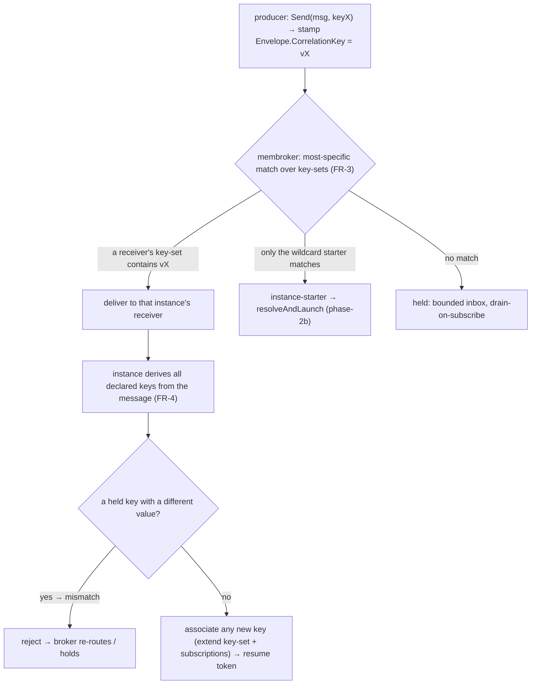

# SRD-017 — Conversation-token threading (multi-key correlation routing)

| Field | Value |
|---|---|
| Status | Draft |
| Version | v.1 |
| Date | 2026-06-17 |
| Owner | Ruslan Gabitov |
| Implements | [ADR-016 v.1 Message correlation §2.4/§2.8](../design/ADR-016-message-correlation.md) |

This SRD lands **phase-2c** of the correlation model ([ADR-016 v.1 §2.4/§2.8](../design/ADR-016-message-correlation.md)) **in full**: a follow-up message routes to the **specific running instance** whose conversation it belongs to, an instance is identified by **one or more correlation keys** (a key-set that grows by **lazy secondary-key initialization**), and a key whose value conflicts with the conversation's **does not route** (mismatch). It builds directly on phase-2b ([SRD-015 v.1](SRD-015-message-correlation-instantiation.md)) — the derived correlation key and the instance-starter — and on the message tasks/events of ADR-014 (SRD-013/014). The only correlation parts left for later are **context-based / predicate correlation** (ADR-016 §2.5, phase-3) and the **`Conversation`** object (out of conformance scope).

## 1. Background & motivation

### 1.1 Current state (verified against the code, branch `feat/srd-015-message-correlation-instantiation`)

- **In-instance receivers subscribe by name with an EMPTY key.** A parked catch event / `ReceiveTask` registers a `messageWaiter` which subscribes `mw.rt.MessageBroker().Subscribe(ctx, mw.name, "")` (`internal/eventproc/eventhub/waiters/message.go:185`) — the correlation-key argument is always `""`. So **every** instance waiting on a message name receives **any** message of that name, regardless of conversation. The waiter's `singleShot` flag (`message.go:41`) and `NewMessageWaiter(eh, ep, eDefI, id, rt, singleShot)` (`message.go:50`) exist (SRD-015).
- **`membroker` matches name + empty-or-equal key, delivers to the FIRST match, with a SCALAR key per subscription.** `subscription.matches` is `s.name == e.Name && (s.key == "" || s.key == e.CorrelationKey)` (`pkg/messaging/membroker/membroker.go:40`) — `s.key` is a single string; `Publish` delivers to the **first** matching subscription (`membroker.go:74`), buffers when none matches (bounded `DefaultMaxInbox = 1024`, `:18`; eviction `:121`), and **drains the buffer to a new subscriber on `Subscribe`** (`membroker.go:101`). There is **no specificity** (registration order wins) and **no key-set** (one key per subscription).
- **The phase-2b starter resolves by key but the running instance does not carry it.** `Thresher.resolveAndLaunch(ctx, s, startNode, eDef, key)` (`pkg/thresher/thresher.go:530`) does create-or-route-or-join against `seenKeys` (`:111`), namespaced `nsKey := s.ProcessID + "\x1f" + key` (`:543`); `instanceStarter.deriveKey` (`pkg/thresher/instance_starter.go:58`) derives the incoming key via `msgflow.DeriveKey`. The resolution lives **only at the starter** — once an instance exists, **nothing tells its in-instance receivers what key(s) to wait on**.
- **`Instance` has NO correlation/conversation key field.** The `Instance` struct (`internal/instance/instance.go:78`) holds tracks, scope, snapshot, state — **no key**. `NewFromEvent(s, parentRoot, er, ep, rr, startNodeID, eDef)` (`instance.go:245`) binds the event payload into the **data plane** (`bindEventPayload`, `:274`), not as a field. The derived key the starter computed is **discarded** after instantiation.
- **A track registers an in-instance waiter through the instance → hub.** `track.checkNodeType` (`internal/instance/track.go:283`) registers a waiter for a catch node via `t.instance.RegisterEvent(t, d)` (`track.go:310`), delegating to `inst.parentEventProducer.RegisterEvent(proc, eDef)` (`instance.go:675`); the EventHub's `RegisterEvent` builds a **single-shot** waiter (`internal/eventproc/eventhub/eventhub.go:101` → `waiters.CreateWaiter`), `RegisterPersistentEvent` (`:125` → `CreatePersistentWaiter`) the persistent starter, removal unified under `WaiterFired` (`:348`). **No key is threaded** down this path to `Subscribe`.
- **Key derivation already exists and is per-message.** `msgflow.DeriveKey(ctx, eng, key, msg, payload) (string, bool, error)` (`pkg/model/msgflow/correlation.go:52`) composes a key from a payload; its `retrievalExprFor` selects the `CorrelationPropertyRetrievalExpression` whose `MessageRef` matches the message in flight. `CorrelationProperty{Name, Type, Expressions []CorrelationPropertyRetrievalExpression}` (`pkg/model/bpmncommon/correlation.go:87`), `CorrelationPropertyRetrievalExpression{MessagePath, MessageRef}` (`:114`), `CorrelationKey{Name, Properties}` (`:75`), builders `NewCorrelationKey`/`…Property`/`…RetrievalExpression` (`:125`/`:159`/`:194`). `process.Process.CorrelationSubscriptions` holds the process's keys (`process/process.go:37`).
- **The producer already stamps one key.** `msgflow.Send(ctx, re, msg, key)` (`pkg/model/msgflow/send.go:21`) derives and sets `Envelope.CorrelationKey` (`send.go:71`); `Envelope` is `{Payload, Name, CorrelationKey}` (`pkg/messaging/messagebroker.go:12`, key field `:19`) — a **single** key string. A follow-up message already carries one key on the wire; the gap is the **consumer/routing** side and **multi-key** association.

### 1.2 Why

Phase-2b makes the **instantiation** decision correct (two parallel instances disambiguated by key; a duplicate start joins the existing one). But a **follow-up** message still routes by **name only** — it reaches whichever same-named receiver the broker matches first, not the instance the conversation belongs to. Worse, a real conversation is rarely identified by a single immutable value: a process started by `orderId` may need to also answer to a `trackingNumber` the carrier assigns later, or an orchestrator may correlate with two participants on two different keys at once. BPMN §8.4.2 specifies exactly this — a conversation is a **joint token** of one *or more* keys, the first message initializes a key, subsequent messages match an initialized key (mismatch = no route) or **lazily initialize a secondary key**. ADR-016 §2.4/§2.8 decided that model; this SRD implements it: the running instance carries a **key-set**, its receivers match on `(name, key ∈ set)`, the broker prefers a keyed receiver over the wildcard starter, and the instance learns new keys from the messages it accepts.

## 2. Goals & scope

### 2.1 Goals (in scope)

- **G1.** A running `Instance` carries a **mutable key-set** (each declared `CorrelationKey` → its established value). The set is **initialized** by the first key-bearing event (born-from-event, or first keyed `SendTask`) and **grows by lazy association** as the instance accepts messages carrying not-yet-known declared keys.
- **G2.** **Keyed in-instance receivers**: a parked catch event / `ReceiveTask` subscribes on the instance's **current key-set** (matches a message carrying *any* of those keys), instead of `(name, "")`.
- **G3.** **Most-specific delivery in `membroker`** over **key-sets**: for a keyed envelope, a subscription whose key-set contains the message key is delivered to in preference to an empty-key (wildcard) subscription — a keyed receiver beats the wildcard starter (ADR-016 §2.3); delivery is point-to-point. A subscription's key-set can be **extended at runtime** (lazy association).
- **G4.** **Conversation-token semantics** (ADR-016 §2.4 / BPMN §8.4.2): on accepting a message, the instance **derives all declared keys** present in it; a key already held with a **different** value → **mismatch, no route**; a declared key **not yet held** → **lazily associated** (the conversation becomes reachable by it). Layered routing: a follow-up matches on **any** held key.
- **G5.** A runnable example: a conversation **reachable by a second, later-learned key** (e.g. started by `orderId`, then a message introduces and routes by `trackingNumber`), plus two concurrent conversations proving isolation; exits 0.

### 2.2 Non-goals (deferred)

- **Context-based / predicate correlation** (ADR-016 §2.5, phase-3) — deriving a receiver's key from process **context** (a `CorrelationSubscription` `dataPath` over instance data) rather than from a message. Out of scope; this SRD is message-derived keys only.
- **`Conversation` as a first-class object** — out of conformance scope (ADR-016 §2.6); keys stay process-level.
- **Same-name correlation-resume** — a follow-up whose message **name** equals an instantiating start-trigger's name (so the wildcard starter could steal it before a receiver parks). SRD-017 documents **distinct names as a precondition** (FR-6); lifting it needs a starter re-hold of seen-key messages — a separate later concern (it is orthogonal to multi-key).
- **Broker-quality** TTL / dead-letter / ordering of held messages — broker/ADR-008; the bounded inbox + pull-on-subscribe (SRD-015 / ADR-015 §2.5) is unchanged.

## 3. Requirements

### 3.1 Functional

| # | Requirement |
|---|---|
| FR-1 | `Instance` carries a **key-set**: a map from a declared `CorrelationKey` (identity) to its established value (the composite string `msgflow.DeriveKey` produces). **Initialization** seeds the first entry: (a) **born-from-event** — `resolveAndLaunch` passes the derived key through `launchInstanceFromEvent` → `NewFromEvent` so the new instance holds it; (b) **first keyed send** — when `msgflow.Send` derives a non-empty key, the instance records it if that key is not yet held, via a **`renv` runtime seam** (`pkg/model` must not import `internal/instance`; depguard, NFR-4). Forked tracks run on concurrent goroutines (`instance.go:405`), so the key-set is **guarded by a mutex** on the instance (read at receiver-park, written on born-from-event/send/associate). A process that declares no correlation runs with an empty set (FR-2 fallback). |
| FR-2 | A parked in-instance message receiver (intermediate catch message event / non-instantiating `ReceiveTask`) subscribes on the instance's **current key-set** — it matches a message carrying **any** held key — instead of `(name, "")`. The key-set is threaded from the instance through the `RegisterEvent` path to the `messageWaiter`'s subscription. An empty set → `(name, "")` fallback (today's behaviour). When the instance **lazily associates** a new key (FR-4) while a receiver is parked, that receiver's subscription is **extended** to include it (FR-3). |
| FR-3 | `membroker` subscriptions hold a **key-set** (not a scalar) and `Publish` delivers a keyed envelope **most-specifically**: among matching subscriptions, one whose set **contains** `e.CorrelationKey` (non-empty) is preferred over one with an empty set (wildcard); delivery is to **exactly one** subscription (point-to-point), buffering/eviction/drain-on-`Subscribe` otherwise unchanged. A subscription exposes a way to **add a key** at runtime (lazy association) and to be matched by the extended set thereafter. Empty-key messages are unchanged. (Point-to-point most-specific here vs. broadcast-to-all for a future **signal** is why delivery policy lives in the broker; the broadcast mode is out of scope.) |
| FR-4 | On **accepting** a delivered message, the instance applies the conversation-token rules (BPMN §8.4.2): it **derives every declared `CorrelationKey` present** in the message (via each key's `CorrelationPropertyRetrievalExpression` whose `MessageRef` matches; a key whose properties don't all resolve is simply absent). For each derived key — **already held with a different value → mismatch**: the message **does not route** to this instance (it is rejected back to the broker for another candidate or the held buffer); **not yet held → lazily associated** (added to the key-set, FR-1; the instance's active subscriptions extended, FR-2/FR-3). A message all of whose derived keys match (or are new) is accepted and resumes the token. |
| FR-5 | Routing outcome: a follow-up carrying any held key routes to the conversation that holds it; two concurrent conversations with disjoint keys never cross-talk; a conversation started by key-A and later sent/receiving a message that also carries key-B becomes reachable by **either** A or B (layered); a message whose key matches no keyed receiver and no existing instance instantiates (phase-2b, unchanged). |
| FR-6 | **Precondition:** an in-instance receiver's message **name** differs from any instantiating start-trigger's name, so a follow-up is never contended by the wildcard starter (the normal case — e.g. "place-order" start vs "payment-received"/"shipment" follow-ups). Same-name correlation-resume is deferred (§2.2). |
| FR-7 | A runnable example (own module, or extending the SRD-015 inter-instance demo): a conversation reachable by a **second, later-learned key** + a concurrent isolated conversation; exits 0, proving multi-key layered routing and isolation. |

### 3.2 Non-functional

| # | Requirement |
|---|---|
| NFR-1 | No payload **values** in logs — message name, key (or its hash), item ids, states only (ADR-010/011/014; ADR-015 §5 sensitive-keys). A lazy-association and a mismatch are observable as a debug log (key hash, not value). |
| NFR-2 | The instance key-set is **guarded by a mutex** (forked tracks run concurrently, `instance.go:405`); broker key-set extension is guarded by the broker's existing mutex. Keyed in-instance subscriptions are **single-shot** (hub-removed on fire — SRD-015 `WaiterFired`) and torn down with the instance; **bounded** held buffer unchanged; no goroutine/subscription leak. -race clean. |
| NFR-3 | `make ci` green per milestone; diff-coverage ≥95 % (target 100 %) on touched files; existing `membroker` / thresher / instance / eventhub / model suites pass. |
| NFR-4 | Specificity & key-set matching live in **`membroker`** (delivery-policy owner; one home for a future signal broadcast); conversation semantics (derive / associate / mismatch) live in the **engine** (instance), where the expression engine + process data are. `pkg/model` imports no `internal/*` (depguard) — the first-keyed-send key-record uses a `renv` seam. New exported symbols documented; new params validate inputs with self-identifying errors. |

## 4. Design & implementation plan

### 4.1 Matching model — hybrid: stamp-route + receiver-derive/associate

The central decision. BPMN §8.4.2 matching is inherently **consumer-side** (extract keys *from* the incoming message, compare to the conversation, lazily associate). But making the broker run expressions on every delivery would be heavy and would pull conversation semantics into the transport. The chosen model **splits the two concerns**:

- **Routing (broker, fast):** the producer **stamps one routing key** (`Envelope.CorrelationKey`, unchanged) — an *already-established* conversation key it is addressing. The broker routes most-specifically on that key against subscription **key-sets** (FR-3). This is O(match) and reuses phase-2b's stamp.
- **Association & validation (engine, rich):** when the message lands at an instance, the receiver **derives all declared keys** from it and applies the §8.4.2 rules (FR-4) — associate new keys, reject on mismatch. This is where the expression engine and process data already live.

Why this is faithful and sufficient: lazy association in §8.4.2 only ever happens for a message that **already matched the conversation via an initialized key** *and* carries a secondary key — i.e. it must route in via a known key first, then a new key is learned. A message carrying **only** an unknown key has nothing linking it to the conversation (correctly a new conversation or no-target). So "stamp the known key, derive the rest on arrival" covers exactly the standard's cases, while the broker stays transport + specificity.



**Rejected alternatives:**
- **Pure receiver-derive (broker name-only).** Broker delivers every same-named message to all candidates; each derives + accepts/rejects. Simplest broker, but O(candidates) per message with a NAK-retry loop, and it loses the cheap keyed specificity (the broker can't prefer a keyed receiver over the wildcard starter without keys). Rejected for cost and for breaking phase-2b's key routing.
- **Pure producer-stamp (multi-key on the wire).** Carry *all* of a message's keys in the envelope so the broker matches multi-key. Bloats the envelope, forces the producer to know every key the receiver cares about, and still can't do mismatch/association semantics in the broker. Rejected.

### 4.2 Instance key-set (FR-1)

`Instance` gains an unexported `convKeys map[ /*CorrelationKey identity*/ string]string` (declared-key → value) plus initializer, an `AssociateKey` (set-if-absent, returns whether it was new), and an accessor returning the current value snapshot.

- **Born-from-event:** `resolveAndLaunch` holds the derived key; pass it (with the `CorrelationKey` identity it satisfied) into `launchInstanceFromEvent` → `NewFromEvent` (as `keyName, keyValue`), which seeds `convKeys` **before `createTracks`** — not merely before `Run`. `createTracks` parks an in-instance receiver reached directly off the born start *during construction* (`newTrack`→`checkNodeType`), so the key must already be present or that receiver subscribes wildcard.
- **First keyed send:** `msgflow.Send` derives a non-empty key; because `msgflow` (in `pkg/model`) must not import `internal/instance`, this goes through a **seam on the `renv` runtime interface** — e.g. `AssociateConversationKey(keyName, value string)` that `execEnv`/the instance implements — recording the key if absent.
- **Concurrency:** forked tracks run on concurrent goroutines (`instance.go:405`), so a send or a receiver-association may touch the key-set off the main loop. `convKeys` is therefore guarded by an instance mutex (`convMu`); `AssociateKey` is set-if-absent under the lock, the accessor snapshots the values under the lock (NFR-2).

### 4.3 Keyed in-instance receivers (FR-2)

**Per-instance receiver isolation (foundation).** The EventHub keys waiters by `eDef.ID()` and merges a second registration of the same id via `AddEventProcessor` (`eventhub.go:173`). But `Event.clone()` (`event.go:161`) shared event-definition objects **by reference** across per-instance node clones, so two instances waiting on the same catch shared **one** waiter — a single point-to-point message woke both (a latent broadcast bug, masked until phase-2c's concurrent receivers). Fix (scoped to messages): `MessageEventDefinition.CloneForInstance()` returns a copy with a **fresh id** (message/operation shared by reference); `Event.clone()` applies it to every definition implementing the optional `CloneForInstance` interface. Now each instance's message receiver registers a **distinct** waiter → its own subscription → point-to-point delivery to the right instance. The fire-path `CloneEvent` still preserves the (now per-instance) id, so a fired event matches its waiter; `Send` correlates by **name**, so fresh ids don't affect routing. The hub stays instance-agnostic — it just sees unique ids. (Non-message event types stay shared by reference — their broadcast bug is pre-existing and deferred to a separate FIX.)

**Key delivery (declared-filter).** The `messageWaiter` subscribes with the keys its `EventProcessor` declares: the `track` exposes `CorrelationKeys() []string` (its instance's `convKeys` values); the waiter collects them at subscribe and calls `Subscribe(ctx, name, keys...)`. This is the subscriber parameterizing its own filter — the waiter imports nothing from `instance`, just an optional capability. The instance-**starter** stays a wildcard `(name, "")` persistent subscription (its processor doesn't declare keys); only **in-instance** (single-shot) receivers are keyed. Empty set → `(name, "")` fallback. When a key is associated later (FR-4) while a receiver is parked, the instance extends that subscription's key-set via the broker (FR-3).

### 4.4 `membroker` key-set subscriptions + most-specific delivery + extend (FR-3)

```
subscription.keys: a set of strings (empty set = wildcard)
matches(e): s.name == e.Name && (keys is empty || e.CorrelationKey ∈ keys)
Publish(e) two-pass:
  1) deliver to the first sub with non-empty keys && e.CorrelationKey ∈ keys
  2) else deliver to the first wildcard sub (empty keys)
  3) else buffer (bounded inbox, unchanged)
Subscribe(name, keys...) → returns a handle; handle.AddKey(k) extends the set (lazy association)
buffer-drain on Subscribe / AddKey applies the same preference
```

`matches` generalizes the scalar to a set (the empty set keeps today's wildcard). The new surface is the **key-set** and a runtime **`AddKey`** on the subscription handle. Delivery stays exactly-one. This is the seam a later **signal** broadcast (deliver-to-all) plugs into.

### 4.5 Conversation-token rules on delivery (FR-4) — derive, associate, mismatch

When a receiver is fired, **before** the node processes the message,
`track.ProcessEvent` calls `Instance.validateAndAssociate(ctx, eDef)`, which runs
**two passes** over the process's declared `CorrelationKey`s (each derived with
`msgflow.DeriveKey` over the payload, its `MessageRef`-matched retrieval
expression; a key whose properties don't all resolve is absent and skipped):

1. **Mismatch pass.** If any derived key is **already held** with a **different**
   value → return `mismatch=true` and associate nothing — the message isn't for
   this conversation (BPMN §8.4.2: an already-initialized key must equal).
2. **Associate pass** (only if no mismatch). For each derived key **not yet
   held** → `associateConversationKey` it and `extendReceivers` (FR-3) so the
   conversation becomes reachable by it; a held-same-value key is a no-op.

On `mismatch=true`, `track.ProcessEvent` returns the `eventproc.ErrRejected`
sentinel **without** advancing the token. The single-shot message waiter treats
`ErrRejected` specially: it does **not** terminate — it stays subscribed and
keeps waiting for a message that belongs to this conversation; the contradictory
message is **dropped** (logged at debug, key hash only — NFR-1), not re-routed
(re-routing a contradictory message is loop-prone and out of scope). No mismatch
→ the node processes and the token advances (the M4a behaviour).

The reject path is the rare fallback (a message that routed in on key-A but
conflicts on key-B); the common path is "same value or a new key."

### 4.6 Milestones (each = one commit, `make ci` green)

- **M1 — `membroker` key-set subscriptions + most-specific delivery + `AddKey` (FR-3).** Generalize `subscription` to a key-set, two-pass `Publish`, runtime `AddKey`, drain preference. Standalone, unit-testable with hand-built subscriptions (keyed beats wildcard; point-to-point; no-key unchanged; buffered keyed drains; `AddKey` makes a sub match a new key). No engine wiring.
- **M2 — instance key-set + initialization (FR-1).** `Instance.convKeys` + `AssociateKey` + accessor; `NewFromEvent` gains the seed key; `resolveAndLaunch`/`launchInstanceFromEvent` pass it; first keyed `Send` records via the `renv` seam. Tests (born-from-event seeds; first send records; concurrent mutation race-clean; empty stays empty).
- **M3 — keyed in-instance receivers (FR-2).** Thread the key-set through `RegisterEvent` → `registerWaiter` → `NewMessageWaiter` → subscription; empty-set fallback. Tests (keyed instance subscribes on its set; keyless subscribes wildcard).
- **M4 — conversation-token rules on delivery (FR-4) + subscription extension.** Receiver derives all declared keys, associates new ones (extends subscriptions), rejects on mismatch. Tests (lazy secondary-key association makes the conversation reachable by the new key; mismatch rejects and re-routes/holds; same-value no-op).
- **M5 — layered-routing integration + example + DoD (FR-5/FR-7).** Two concurrent conversations with disjoint keys (isolation); a conversation reachable by a second learned key; the multi-key example; coverage gate.

### 4.7 Tests

`membroker` (key-set match, keyed-beats-wildcard, point-to-point, no-key path, buffered-keyed-drains, `AddKey` extends + drains); instance key-set (born-from-event seed, first-send record, association set-if-absent, mutex-guarded under -race, empty fallback); keyed receiver subscribe (keyed vs keyless); conversation-token rules (lazy association reachability, mismatch reject + re-route, same-value no-op); layered routing integration (route by either of two keys; two conversations isolated; unseen key still instantiates per phase-2b); the multi-key example as smoke. Mirror the race/teardown discipline from SRD-015 §6 (single-flight, no subscription leak).

## 5. Verification (Definition of Done)

| # | Check | Expectation |
|---|---|---|
| V1 | `membroker` delivers a keyed envelope to a sub whose key-set contains the key over a co-matching wildcard; point-to-point; no-key message unchanged; a buffered keyed message drains to a later keyed/`AddKey`-extended subscriber (FR-3, NFR-2). | green |
| V2 | A born-from-event instance seeds its key-set from the starter's derived key; a `StartProcess` instance records the key of its first keyed `Send`; concurrent mutation is mutex-guarded (race-clean); no key → empty (FR-1). | green |
| V3 | A parked receiver in a keyed instance subscribes on the instance's key-set; in a keyless instance it subscribes wildcard (FR-2). | green |
| V4 | On accepting a message, the instance associates a not-yet-held declared key (the conversation becomes reachable by it, active subscriptions extended) and **rejects** a message carrying a held key with a different value (no route) (FR-4). | green |
| V5 | Two concurrent conversations with disjoint keys never cross-talk; a conversation started by key-A and later carrying key-B routes by **either**; an unseen-key message still instantiates (FR-5). | green |
| V6 | The multi-key example (conversation reachable by a second, later-learned key + a concurrent isolated conversation) runs to exit 0; existing suites pass (FR-7, NFR-3). | green |
| V7 | `make ci` green; diff-coverage ≥95 % on touched files; specificity/key-set matching in `membroker`, conversation semantics in the engine; `pkg/model` imports no `internal`; no goroutine/subscription leak (NFR-2/3/4). | pass |

## 6. Risks & regressions

- **`membroker` scalar → key-set touches all delivery.** The empty-set wildcard must behave exactly as today's empty-string key; only the keyed-vs-wildcard contention changes. Covered by V1 + the existing membroker suite; keep the predicate semantics, change scalar→set.
- **Lazy-association / subscription-extension race.** A key associated while a receiver is parked must extend that receiver's live subscription atomically (broker mutex) and apply to the buffer drain, else a follow-up on the new key is missed. NFR-2 + a test: associate, then publish on the new key, assert delivery.
- **Mismatch reject → re-route loop.** A rejected message must not bounce forever; the broker re-attempts other matching subs once and otherwise holds (bounded). Test: a message conflicting on a second key is not consumed by the wrong instance and reaches the right one (or is held), no spin.
- **Concurrent key-set access.** Forked tracks run on separate goroutines (`instance.go:405`), so a send/associate may race a receiver-park read; `convKeys` is mutex-guarded (`convMu`) and exercised under `-race`.
- **Held follow-up vs not-yet-parked receiver.** Covered by the bounded inbox + drain-on-`Subscribe`/`AddKey`, *given the FR-6 distinct-name precondition* (the wildcard starter never consumes a follow-up). Same-name is deferred (§2.2).
- **Producer must stamp the routing key.** Routing relies on the producer stamping an already-known key; a message arriving with an empty key falls to wildcard/instantiation. gobpm sends stamp via `SendTask.WithCorrelationKey`; external publishers must set `Envelope.CorrelationKey`. Documented as the integration contract (NFR-1 logs the absence at debug).

## 7. Implementation summary

> ⚠️ TODO: fill AFTER landing — milestone SHAs, V-results, and any deltas vs the §4 draft.

## 8. References

- [ADR-016 v.1 Message correlation](../design/ADR-016-message-correlation.md) — the decision this implements **in full**; §2.3 resolution + specificity (keyed receiver beats wildcard starter), §2.4 conversation-token threading (lazy secondary-key init + multi-key layered routing), §2.8 phasing (phase-2c).
- [ADR-015 v.1 Event-triggered instantiation](../design/ADR-015-event-triggered-instantiation.md) — the instance-starter and born-from-event seeding this extends with the conversation key-set; §2.2.
- [ADR-014 v.1 Message Handling](../design/ADR-014-message-handling.md) — the message tasks/events, the node-agnostic `MessageWaiter`, and `Envelope.CorrelationKey` this routes on.
- [ADR-006 v.1 Events & Subscriptions](../design/ADR-006-events-and-subscriptions.md) — §2.5 hub-owned waiter removal; keyed in-instance receivers stay single-shot (`WaiterFired`).
- [ADR-002 v.1 Extension Architecture](../design/ADR-002-extension-architecture.md) — `membroker` is the in-memory `MessageBroker` whose delivery policy and subscription model this extends.
- [ADR-001 v.5 Execution Model](../design/ADR-001-execution-model.md) — instances/tracks/lifecycle the conversation key-set attaches to.
- [SRD-015 v.1](SRD-015-message-correlation-instantiation.md) — phase-2a/2b: key derivation + key-based instantiation-resolution this continues (sideways).
- [SRD-013 v.1](SRD-013-send-receive-tasks.md) / [SRD-014 v.1](SRD-014-message-events.md) — the message tasks/events + `msgflow` seam reused here (sideways).
- BPMN 2.0 **§8.4.2** (correlation; key-based — initialization, matching, subsequent-message rules incl. lazy secondary-key init and mismatch = no route; joint Conversation token) — `docs/bpmn-spec/semantics/correlation.md`.

## 9. Open questions

None. Scope is ADR-016 phase-2c **in full**: a running instance carries a **mutable key-set** (seeded born-from-event or by the first keyed send, grown by lazy association), its in-instance receivers subscribe on that set, `membroker` delivers most-specifically over key-sets (a keyed receiver beats the wildcard starter) with runtime key-set extension, and the instance applies the §8.4.2 conversation-token rules on delivery (derive all declared keys, associate new, reject on mismatch). Matching is the **hybrid** model — producer stamps the routing key, the engine derives/associates/validates. Context-based / predicate correlation (§2.5) and the `Conversation` object are phase-3; same-name correlation-resume and broker-quality guarantees remain out of scope (§2.2).

## Document History

| Version | Date | Author | Change |
|---|---|---|---|
| v.1 | 2026-06-17 | Ruslan Gabitov | Draft. Implements ADR-016 v.1 §2.4/§2.8 **phase-2c in full** (multi-key): a running `Instance` carries a **mutable key-set** (seeded born-from-event via `resolveAndLaunch`→`NewFromEvent`, or from the first keyed `SendTask` through a `renv` seam, grown by **lazy secondary-key association**); in-instance receivers subscribe on the key-set instead of `(name, "")`; `membroker` subscriptions hold a **key-set** with **most-specific** two-pass delivery (a keyed receiver beats the wildcard starter) and a runtime **`AddKey`** for lazy association; on delivery the instance applies the BPMN §8.4.2 conversation-token rules — derive every declared key, **associate** new ones, **reject on mismatch** (already-held key, different value → no route). **Matching model = hybrid**: the producer stamps one routing key (`Envelope.CorrelationKey`, unchanged), the engine derives/associates/validates — keeping the broker as transport + specificity (the seam a future signal broadcast plugs into) and conversation semantics in the engine. Five milestones + a multi-key example (a conversation reachable by a second, later-learned key + isolation). Precondition: follow-up message names differ from start-trigger names (same-name resume deferred). Deferred: context-based correlation (§2.5, phase-3), `Conversation` object. Implements ADR-016 v.1; extends ADR-015 v.1; builds on SRD-015 v.1. |
