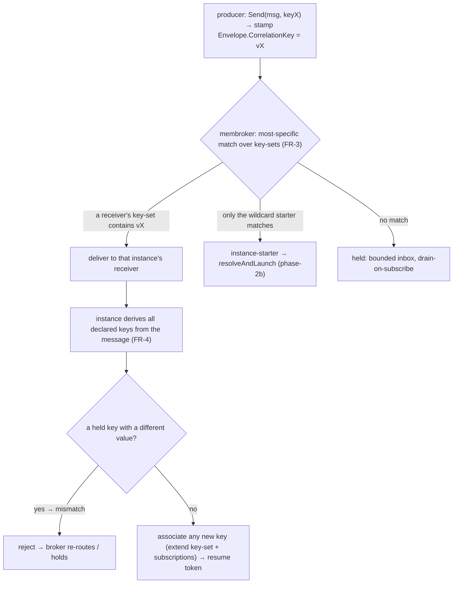

# SRD-017 — Conversation-token threading (маршрутизация по нескольким ключам)

| Поле | Значение |
|---|---|
| Статус | Принято |
| Версия | v.1 |
| Дата | 2026-06-17 |
| Владелец | Ruslan Gabitov |
| Реализует | [ADR-016 v.1 Корреляция сообщений §2.4/§2.8](../design/ADR-016-message-correlation.ru.md) |

Этот SRD внедряет **фазу-2c** модели корреляции ([ADR-016 v.1 §2.4/§2.8](../design/ADR-016-message-correlation.ru.md)) **полностью**: последующее сообщение маршрутизируется в **конкретный работающий экземпляр**, чьей беседе оно принадлежит; экземпляр идентифицируется **одним или несколькими корреляционными ключами** (набор ключей, растущий через **ленивую инициализацию вторичного ключа**); а ключ, чьё значение конфликтует со значением беседы, **не маршрутизируется** (mismatch). Он строится прямо на фазе-2b ([SRD-015 v.1](SRD-015-message-correlation-instantiation.ru.md)) — выведенный корреляционный ключ и стартер экземпляров — и на задачах/событиях-сообщениях из ADR-014 (SRD-013/014). Единственные части корреляции, оставленные на потом, — **context-based / predicate-корреляция** (ADR-016 §2.5, фаза-3) и объект **`Conversation`** (вне scope конформности).

## 1. Предпосылки и мотивация

### 1.1 Текущее состояние (проверено по коду, ветка `feat/srd-015-message-correlation-instantiation`)

- **In-instance-получатели подписываются по имени с ПУСТЫМ ключом.** Припаркованное ловящее событие / `ReceiveTask` регистрирует `messageWaiter`, который подписывается `mw.rt.MessageBroker().Subscribe(ctx, mw.name, "")` (`internal/eventproc/eventhub/waiters/message.go:185`) — аргумент корреляционного ключа всегда `""`. Так что **каждый** экземпляр, ждущий имя сообщения, получает **любое** сообщение с этим именем, независимо от беседы. Флаг `singleShot` у waiter (`message.go:41`) и `NewMessageWaiter(eh, ep, eDefI, id, rt, singleShot)` (`message.go:50`) существуют (SRD-015).
- **`membroker` матчит имя + пустой-или-равный ключ, доставляет ПЕРВОМУ совпадению, СКАЛЯРНЫЙ ключ на подписку.** `subscription.matches` — это `s.name == e.Name && (s.key == "" || s.key == e.CorrelationKey)` (`pkg/messaging/membroker/membroker.go:40`) — `s.key` одна строка; `Publish` доставляет **первой** совпавшей подписке (`membroker.go:74`), буферизует при отсутствии совпадения (ограниченно, `DefaultMaxInbox = 1024`, `:18`; вытеснение `:121`) и **сливает буфер новому подписчику на `Subscribe`** (`membroker.go:101`). Нет **specificity** (выигрывает порядок регистрации) и нет **набора ключей** (один ключ на подписку).
- **Стартер фазы-2b разрешает по ключу, но работающий экземпляр его не несёт.** `Thresher.resolveAndLaunch(ctx, s, startNode, eDef, key)` (`pkg/thresher/thresher.go:530`) делает create-or-route-or-join по `seenKeys` (`:111`), с namespace `nsKey := s.ProcessID + "\x1f" + key` (`:543`); `instanceStarter.deriveKey` (`pkg/thresher/instance_starter.go:58`) выводит входящий ключ через `msgflow.DeriveKey`. Разрешение живёт **только в стартере** — как только экземпляр существует, **ничто не говорит его in-instance-получателям, какой(ие) ключ(и) ждать**.
- **У `Instance` НЕТ поля корреляционного/беседного ключа.** Структура `Instance` (`internal/instance/instance.go:78`) держит дорожки, scope, снапшот, состояние — **без ключа**. `NewFromEvent(s, parentRoot, er, ep, rr, startNodeID, eDef)` (`instance.go:245`) связывает payload события в **data plane** (`bindEventPayload`, `:274`), не как поле. Выведенный стартером ключ **отбрасывается** после инстанцирования.
- **Дорожка регистрирует in-instance-waiter через instance → hub.** `track.checkNodeType` (`internal/instance/track.go:283`) регистрирует waiter для ловящего узла через `t.instance.RegisterEvent(t, d)` (`track.go:310`), делегируя `inst.parentEventProducer.RegisterEvent(proc, eDef)` (`instance.go:675`); `RegisterEvent` хаба строит **single-shot** waiter (`internal/eventproc/eventhub/eventhub.go:101` → `waiters.CreateWaiter`), `RegisterPersistentEvent` (`:125` → `CreatePersistentWaiter`) — persistent-стартер, удаление унифицировано через `WaiterFired` (`:348`). **Ключ не протягивается** по этому пути в `Subscribe`.
- **Вывод ключа уже существует и работает per-message.** `msgflow.DeriveKey(ctx, eng, key, msg, payload) (string, bool, error)` (`pkg/model/msgflow/correlation.go:52`) составляет ключ из payload; его `retrievalExprFor` выбирает `CorrelationPropertyRetrievalExpression`, чей `MessageRef` совпадает с сообщением в полёте. `CorrelationProperty{Name, Type, Expressions []CorrelationPropertyRetrievalExpression}` (`pkg/model/bpmncommon/correlation.go:87`), `CorrelationPropertyRetrievalExpression{MessagePath, MessageRef}` (`:114`), `CorrelationKey{Name, Properties}` (`:75`), билдеры `NewCorrelationKey`/`…Property`/`…RetrievalExpression` (`:125`/`:159`/`:194`). `process.Process.CorrelationSubscriptions` держит ключи процесса (`process/process.go:37`).
- **Продюсер уже штампует один ключ.** `msgflow.Send(ctx, re, msg, key)` (`pkg/model/msgflow/send.go:21`) выводит и устанавливает `Envelope.CorrelationKey` (`send.go:71`); `Envelope` — это `{Payload, Name, CorrelationKey}` (`pkg/messaging/messagebroker.go:12`, поле ключа `:19`) — **одна** строка ключа. Последующее сообщение уже несёт один ключ на проводе; пробел — это **сторона консьюмера/маршрутизации** и **multi-key**-ассоциация.

### 1.2 Зачем

Фаза-2b делает корректным решение об **инстанцировании** (два параллельных экземпляра различаются по ключу; дублирующий старт присоединяется к существующему). Но **последующее** сообщение всё ещё маршрутизируется **только по имени** — оно достигает того получателя с тем же именем, которого брокер сматчил первым, а не экземпляра, чьей беседе оно принадлежит. Хуже того, реальная беседа редко идентифицируется одним неизменным значением: процесс, стартованный по `orderId`, может потребоваться отвечать и на `trackingNumber`, назначаемый перевозчиком позже, или оркестратор может коррелировать с двумя участниками по двум разным ключам одновременно. BPMN §8.4.2 описывает ровно это — беседа — это **совместный токен** из одного *или более* ключей, первое сообщение инициализирует ключ, последующие сообщения матчат инициализированный ключ (mismatch = нет маршрута) либо **лениво инициализируют вторичный ключ**. ADR-016 §2.4/§2.8 решил эту модель; этот SRD её внедряет: работающий экземпляр несёт **набор ключей**, его получатели матчат по `(name, key ∈ set)`, брокер предпочитает keyed-получателя wildcard-стартеру, а экземпляр узнаёт новые ключи из сообщений, которые он принимает.

## 2. Цели и scope

### 2.1 Цели (в scope)

- **G1.** Работающий `Instance` несёт **мутируемый набор ключей** (каждый объявленный `CorrelationKey` → его установленное значение). Набор **инициализируется** первым событием с ключом (born-from-event либо первый keyed `SendTask`) и **растёт ленивой ассоциацией** по мере того, как экземпляр принимает сообщения, несущие ещё-неизвестные объявленные ключи.
- **G2.** **Keyed in-instance-получатели**: припаркованное ловящее событие / `ReceiveTask` подписывается на **текущий набор ключей** экземпляра (матчит сообщение, несущее *любой* из этих ключей), вместо `(name, "")`.
- **G3.** **Most-specific-доставка в `membroker`** над **наборами ключей**: для keyed-envelope подписка, чей набор содержит ключ сообщения, доставляется в предпочтение пустоключевой (wildcard) подписке — keyed-получатель побеждает wildcard-стартер (ADR-016 §2.3); доставка point-to-point. Набор ключей подписки можно **расширить в рантайме** (ленивая ассоциация).
- **G4.** **Семантика conversation-token** (ADR-016 §2.4 / BPMN §8.4.2): при приёме сообщения экземпляр **выводит все объявленные ключи**, присутствующие в нём; ключ, уже удерживаемый с **другим** значением → **mismatch, нет маршрута**; объявленный ключ, **ещё не удерживаемый** → **лениво ассоциируется** (беседа становится достижимой по нему). Layered-маршрутизация: последующее сообщение матчит по **любому** удерживаемому ключу.
- **G5.** Запускаемый пример: беседа, **достижимая по второму, позже-узнанному ключу** (например, стартована по `orderId`, затем сообщение вводит и маршрутизирует по `trackingNumber`), плюс две параллельные беседы, доказывающие изоляцию; завершается с кодом 0.

### 2.2 Не-цели (отложено)

- **Context-based / predicate-корреляция** (ADR-016 §2.5, фаза-3) — вывод ключа получателя из **контекста** процесса (`CorrelationSubscription` `dataPath` над данными экземпляра), а не из сообщения. Вне scope; этот SRD — только ключи, выведенные из сообщений.
- **`Conversation` как первоклассный объект** — вне scope конформности (ADR-016 §2.6); ключи остаются на уровне процесса.
- **Same-name correlation-resume** — последующее сообщение, чьё **имя** совпадает с именем инстанцирующего стартового триггера (так что wildcard-стартер мог бы перехватить его до того, как получатель припаркуется). SRD-017 документирует **различие имён как предусловие** (FR-6); снятие требует re-hold стартером seen-key сообщений — отдельная позднейшая забота (она ортогональна multi-key).
- **Качество брокера** TTL / dead-letter / упорядочивание придержанных сообщений — брокер/ADR-008; ограниченный inbox + pull-on-subscribe (SRD-015 / ADR-015 §2.5) не изменён.

## 3. Требования

### 3.1 Функциональные

| # | Требование |
|---|---|
| FR-1 | `Instance` несёт **набор ключей**: отображение объявленного `CorrelationKey` (идентичность) в его установленное значение (композитную строку, которую производит `msgflow.DeriveKey`). **Инициализация** засевает первую запись: (a) **born-from-event** — `resolveAndLaunch` передаёт выведенный ключ через `launchInstanceFromEvent` → `NewFromEvent`, так что новый экземпляр держит его; (b) **первый keyed send** — когда `msgflow.Send` выводит непустой ключ, экземпляр записывает его, если этот ключ ещё не удерживается, через **`renv` runtime-шов** (`pkg/model` не должен импортировать `internal/instance`; depguard, NFR-4). Форкнутые дорожки работают на конкурентных горутинах (`instance.go:405`), поэтому набор ключей **защищён мьютексом** на экземпляре (читается при парковке получателя, пишется на born-from-event/send/associate). Процесс, не объявляющий корреляции, работает с пустым набором (fallback FR-2). |
| FR-2 | Припаркованный in-instance message-получатель (промежуточное ловящее событие-сообщение / не-инстанцирующий `ReceiveTask`) подписывается на **текущий набор ключей** экземпляра — он матчит сообщение, несущее **любой** удерживаемый ключ — вместо `(name, "")`. Набор ключей протягивается от экземпляра через путь `RegisterEvent` в подписку `messageWaiter`. Пустой набор → fallback `(name, "")` (сегодняшнее поведение). Когда экземпляр **лениво ассоциирует** новый ключ (FR-4), пока получатель припаркован, подписка этого получателя **расширяется** им (FR-3). |
| FR-3 | Подписки `membroker` держат **набор ключей** (не скаляр), и `Publish` доставляет keyed-envelope **most-specifically**: среди совпавших подписок предпочитается та, чей набор **содержит** `e.CorrelationKey` (непустой), а не та с пустым набором (wildcard); доставка **ровно одной** подписке (point-to-point), буферизация/вытеснение/drain-on-`Subscribe` иначе не изменены. Подписка предоставляет способ **добавить ключ** в рантайме (ленивая ассоциация) и впредь матчиться расширенным набором. Сообщения без ключа не изменены. (Point-to-point most-specific здесь vs. broadcast-to-all для будущего **signal** — поэтому политика доставки живёт в брокере; broadcast-режим вне scope.) |
| FR-4 | При **приёме** доставленного сообщения экземпляр применяет правила conversation-token (BPMN §8.4.2): он **выводит каждый объявленный `CorrelationKey`, присутствующий** в сообщении (через `CorrelationPropertyRetrievalExpression` каждого ключа, чей `MessageRef` совпадает; ключ, чьи свойства не все разрешаются, просто отсутствует). Для каждого выведенного ключа — **уже удерживаемый с другим значением → mismatch**: сообщение **не маршрутизируется** в этот экземпляр (отвергается обратно брокеру для другого кандидата или придержанного буфера); **ещё не удерживаемый → лениво ассоциируется** (добавляется в набор, FR-1; активные подписки экземпляра расширяются, FR-2/FR-3). Сообщение, все выведенные ключи которого совпадают (или новые), принимается и возобновляет токен. |
| FR-5 | Результат маршрутизации: последующее сообщение, несущее любой удерживаемый ключ, маршрутизируется в беседу, которая его держит; две параллельные беседы с непересекающимися ключами никогда не пересекаются; беседа, стартованная по key-A и позже отправившая/принявшая сообщение, несущее также key-B, становится достижимой по **любому** из A или B (layered); сообщение, чей ключ не матчит ни keyed-получателя, ни существующий экземпляр, инстанцирует (фаза-2b, не изменено). |
| FR-6 | **Предусловие:** имя сообщения in-instance-получателя **отличается** от имени любого инстанцирующего стартового триггера, так что последующее сообщение никогда не оспаривается wildcard-стартером (нормальный случай — например, старт "place-order" vs follow-up "payment-received"/"shipment"). Same-name correlation-resume отложен (§2.2). |
| FR-7 | Запускаемый пример (собственный модуль либо расширение межэкземплярного демо SRD-015): беседа, достижимая по **второму, позже-узнанному ключу** + параллельная изолированная беседа; завершается с кодом 0, доказывая multi-key layered-маршрутизацию и изоляцию. |

### 3.2 Нефункциональные

| # | Требование |
|---|---|
| NFR-1 | Никаких **значений** payload в логах — только имя сообщения, ключ (или его хэш), id элементов, состояния (ADR-010/011/014; ADR-015 §5 чувствительные ключи). Ленивая ассоциация и mismatch наблюдаемы как debug-лог (хэш ключа, не значение). |
| NFR-2 | Набор ключей экземпляра **защищён мьютексом** (форкнутые дорожки работают конкурентно, `instance.go:405`); расширение набора ключей брокера защищено существующим мьютексом брокера. Keyed in-instance-подписки **single-shot** (удаляются хабом при срабатывании — SRD-015 `WaiterFired`) и сносятся вместе с экземпляром; **ограниченный** придержанный буфер не изменён; нет утечки горутин/подписок. Чисто под -race. |
| NFR-3 | `make ci` зелёный на каждой вехе; diff-coverage ≥95 % (цель 100 %) на затронутых файлах; существующие наборы `membroker` / thresher / instance / eventhub / model проходят. |
| NFR-4 | Specificity и матчинг по набору ключей живут в **`membroker`** (владелец политики доставки; единый дом для будущего signal-broadcast); семантика беседы (derive / associate / mismatch) живёт в **движке** (экземпляр), где движок выражений + данные процесса. `pkg/model` не импортирует `internal/*` (depguard) — запись ключа при первом keyed-send использует `renv`-шов. Новые экспортируемые символы документированы; новые параметры валидируют вход само-идентифицирующими ошибками. |

## 4. Дизайн и план реализации

### 4.1 Модель матчинга — гибрид: stamp-route + receiver-derive/associate

Центральное решение. Матчинг BPMN §8.4.2 по своей природе **на стороне консьюмера** (извлекать ключи *из* входящего сообщения, сравнивать с беседой, лениво ассоциировать). Но заставлять брокер выполнять выражения на каждой доставке было бы тяжело и втянуло бы семантику беседы в транспорт. Выбранная модель **разделяет две заботы**:

- **Маршрутизация (брокер, быстро):** продюсер **штампует один маршрутный ключ** (`Envelope.CorrelationKey`, не изменён) — *уже установленный* ключ беседы, к которой он адресуется. Брокер маршрутизирует most-specifically по этому ключу против **наборов ключей** подписок (FR-3). Это O(match) и переиспользует штамп фазы-2b.
- **Ассоциация и валидация (движок, богато):** когда сообщение приземляется в экземпляр, получатель **выводит все объявленные ключи** из него и применяет правила §8.4.2 (FR-4) — ассоциирует новые ключи, отвергает при mismatch. Это там, где уже живут движок выражений и данные процесса.

Почему это верно и достаточно: ленивая ассоциация в §8.4.2 случается только для сообщения, которое **уже совпало с беседой по инициализированному ключу** *и* несёт вторичный ключ — то есть оно должно сначала смаршрутизироваться по известному ключу, затем узнаётся новый. Сообщение, несущее **только** неизвестный ключ, не имеет ничего, связывающего его с беседой (корректно — новая беседа или no-target). Так что «штампуй известный ключ, выводи остальное по прибытии» покрывает ровно случаи стандарта, при этом брокер остаётся транспортом + specificity.



**Отклонённые альтернативы:**
- **Чистый receiver-derive (брокер только по имени).** Брокер доставляет каждое сообщение с тем же именем всем кандидатам; каждый выводит + принимает/отвергает. Простейший брокер, но O(кандидатов) на сообщение с NAK-retry-петлёй, и теряется дешёвая keyed-specificity (брокер не может предпочесть keyed-получателя wildcard-стартеру без ключей). Отклонено за стоимость и за слом key-маршрутизации фазы-2b.
- **Чистый producer-stamp (multi-key на проводе).** Нести *все* ключи сообщения в envelope, чтобы брокер матчил multi-key. Раздувает envelope, заставляет продюсера знать каждый ключ, который волнует получателя, и всё равно не может делать семантику mismatch/ассоциации в брокере. Отклонено.

### 4.2 Набор ключей экземпляра (FR-1)

`Instance` получает неэкспортируемый `convKeys map[ /*CorrelationKey identity*/ string]string` (объявленный ключ → значение) плюс инициализатор, `AssociateKey` (set-if-absent, возвращает, был ли он новым) и аксессор, возвращающий снимок текущих значений.

- **Born-from-event:** `resolveAndLaunch` держит выведенный ключ; передаёт его (с идентичностью `CorrelationKey`, которую он удовлетворил) в `launchInstanceFromEvent` → `NewFromEvent` (как `keyName, keyValue`), который засевает `convKeys` **до `createTracks`** — не просто до `Run`. `createTracks` паркует in-instance-получателя, достигаемого прямо с born-старта, *во время конструирования* (`newTrack`→`checkNodeType`), так что ключ должен уже присутствовать, иначе тот получатель подпишется wildcard.
- **Первый keyed send:** `msgflow.Send` выводит непустой ключ; поскольку `msgflow` (в `pkg/model`) не должен импортировать `internal/instance`, это идёт через **шов на `renv` runtime-интерфейсе** — например, `AssociateConversationKey(keyName, value string)`, который реализует `execEnv`/экземпляр — записывая ключ, если отсутствует.
- **Конкурентность:** форкнутые дорожки работают на конкурентных горутинах (`instance.go:405`), так что send или ассоциация-получателем могут затронуть набор ключей вне главного цикла. Поэтому `convKeys` защищён мьютексом экземпляра (`convMu`); `AssociateKey` — set-if-absent под локом, аксессор снимает значения под локом (NFR-2).

### 4.3 Keyed in-instance-получатели (FR-2)

**Изоляция получателей per-instance (фундамент).** EventHub ключует waiter по `eDef.ID()` и сливает вторую регистрацию того же id через `AddEventProcessor` (`eventhub.go:173`). Но `Event.clone()` (`event.go:161`) делил объекты event-definition **по ссылке** между per-instance-клонами узлов, так что два экземпляра, ждущие один ловящий узел, делили **один** waiter — одно point-to-point сообщение будило оба (латентный broadcast-баг, замаскированный до конкурентных получателей фазы-2c). Исправление (ограничено сообщениями): `MessageEventDefinition.CloneForInstance()` возвращает копию со **свежим id** (message/operation делятся по ссылке); `Event.clone()` применяет его к каждому definition, реализующему опциональный интерфейс `CloneForInstance`. Теперь message-получатель каждого экземпляра регистрирует **отдельный** waiter → собственную подписку → point-to-point доставку в правильный экземпляр. Fire-path `CloneEvent` всё ещё сохраняет (теперь per-instance) id, так что сработавшее событие матчит свой waiter; `Send` коррелирует по **имени**, так что свежие id не влияют на маршрутизацию. Хаб остаётся instance-agnostic — он просто видит уникальные id. (Не-message типы событий остаются делимыми по ссылке — их broadcast-баг пре-существующий и отложен в отдельный FIX.)

**Доставка ключей (declared-filter).** `messageWaiter` подписывается ключами, которые объявляет его `EventProcessor`: `track` предоставляет `CorrelationKeys() []string` (значения `convKeys` своего экземпляра); waiter собирает их при подписке и вызывает `Subscribe(ctx, name, keys...)`. Это подписчик, параметризующий собственный фильтр — waiter не импортирует ничего из `instance`, лишь опциональную возможность. Стартер экземпляров остаётся wildcard `(name, "")` persistent-подпиской (его процессор не объявляет ключей); только **in-instance** (single-shot) получатели keyed. Пустой набор → fallback `(name, "")`. Когда ключ ассоциируется позже (FR-4), пока получатель припаркован, экземпляр расширяет набор ключей этой подписки через брокер (FR-3).

### 4.4 `membroker`: подписки с набором ключей + most-specific-доставка + extend (FR-3)

```
subscription.keys: a set of strings (empty set = wildcard)
matches(e): s.name == e.Name && (keys is empty || e.CorrelationKey ∈ keys)
Publish(e) two-pass:
  1) deliver to the first sub with non-empty keys && e.CorrelationKey ∈ keys
  2) else deliver to the first wildcard sub (empty keys)
  3) else buffer (bounded inbox, unchanged)
Subscribe(name, keys...) → returns a handle; handle.AddKey(k) extends the set (lazy association)
buffer-drain on Subscribe / AddKey applies the same preference
```

`matches` обобщает скаляр до набора (пустой набор сохраняет сегодняшний wildcard). Новая поверхность — это **набор ключей** и runtime-**`AddKey`** на дескрипторе подписки. Доставка остаётся ровно-одной. Это шов, в который позже подключается **signal**-broadcast (deliver-to-all).

### 4.5 Правила conversation-token при доставке (FR-4) — derive, associate, mismatch

Когда получатель срабатывает, **до** того как узел обработает сообщение, `track.ProcessEvent` вызывает `Instance.validateAndAssociate(ctx, eDef)`, который делает **два прохода** по объявленным `CorrelationKey` процесса (каждый выводится через `msgflow.DeriveKey` над payload, его `MessageRef`-совпавшим retrieval-выражением; ключ, чьи свойства не все разрешаются, отсутствует и пропускается):

1. **Проход mismatch.** Если любой выведенный ключ **уже удерживается** с **другим** значением → вернуть `mismatch=true` и не ассоциировать ничего — сообщение не для этой беседы (BPMN §8.4.2: уже-инициализированный ключ должен совпадать).
2. **Проход associate** (только если нет mismatch). Для каждого выведенного ключа **ещё не удерживаемого** → `associateConversationKey` его и `extendReceivers` (FR-3), так что беседа становится достижимой по нему; ключ с тем же значением — no-op.

При `mismatch=true` `track.ProcessEvent` возвращает sentinel `eventproc.ErrRejected` **без** продвижения токена. Single-shot message-waiter обрабатывает `ErrRejected` особо: он **не** завершается — остаётся подписанным и продолжает ждать сообщение, принадлежащее этой беседе; противоречивое сообщение **отбрасывается** (логируется на debug, только хэш ключа — NFR-1), не перемаршрутизируется (перемаршрутизация противоречивого сообщения склонна к петлям и вне scope). Нет mismatch → узел обрабатывает и токен продвигается (поведение M4a).

Путь reject — редкий fallback (сообщение, смаршрутизированное по key-A, но конфликтующее по key-B); общий путь — «то же значение или новый ключ».

### 4.6 Вехи (каждая = один коммит, `make ci` зелёный)

- **M1 — `membroker`: подписки с набором ключей + most-specific-доставка + `AddKey` (FR-3).** Обобщить `subscription` до набора ключей, two-pass `Publish`, runtime `AddKey`, предпочтение при drain. Standalone, unit-тестируемо на собранных вручную подписках (keyed побеждает wildcard; point-to-point; без ключа не изменено; буферизованный keyed сливается; `AddKey` заставляет подписку матчить новый ключ). Без проводки в движок.
- **M2 — набор ключей экземпляра + инициализация (FR-1).** `Instance.convKeys` + `AssociateKey` + аксессор; `NewFromEvent` получает seed-ключ; `resolveAndLaunch`/`launchInstanceFromEvent` передают его; первый keyed `Send` записывает через `renv`-шов. Тесты (born-from-event засевает; первый send записывает; конкурентная мутация race-clean; пусто остаётся пусто).
- **M3 — keyed in-instance-получатели (FR-2).** Протянуть набор ключей через `RegisterEvent` → `registerWaiter` → `NewMessageWaiter` → подписку; fallback пустого набора. Тесты (keyed-экземпляр подписывается на свой набор; keyless подписывается wildcard).
- **M4 — правила conversation-token при доставке (FR-4) + расширение подписки.** Получатель выводит все объявленные ключи, ассоциирует новые (расширяет подписки), отвергает при mismatch. Тесты (ленивая ассоциация вторичного ключа делает беседу достижимой по новому ключу; mismatch отвергает и re-routes/holds; то же значение no-op).
- **M5 — интеграция layered-маршрутизации + пример + DoD (FR-5/FR-7).** Две параллельные беседы с непересекающимися ключами (изоляция); беседа, достижимая по второму узнанному ключу; multi-key-пример; coverage-гейт.

### 4.7 Тесты

`membroker` (key-set match, keyed-beats-wildcard, point-to-point, no-key path, buffered-keyed-drains, `AddKey` extends + drains); набор ключей экземпляра (born-from-event seed, first-send record, association set-if-absent, mutex-guarded под -race, empty fallback); keyed-получатель subscribe (keyed vs keyless); правила conversation-token (lazy association reachability, mismatch reject + re-route, same-value no-op); интеграция layered-маршрутизации (маршрут по любому из двух ключей; две беседы изолированы; невиданный ключ всё ещё инстанцирует по фазе-2b); multi-key-пример как smoke. Зеркаль дисциплину race/teardown из SRD-015 §6 (single-flight, нет утечки подписок).

## 5. Проверка (Definition of Done)

| # | Проверка | Ожидание |
|---|---|---|
| V1 | `membroker` доставляет keyed-envelope подписке, чей набор содержит ключ, поверх со-совпадающего wildcard; point-to-point; сообщение без ключа не изменено; буферизованное keyed-сообщение сливается позднему keyed/`AddKey`-расширенному подписчику (FR-3, NFR-2). | зелёный |
| V2 | Born-from-event-экземпляр засевает свой набор ключей из выведенного стартером ключа; `StartProcess`-экземпляр записывает ключ своего первого keyed `Send`; конкурентная мутация mutex-guarded (race-clean); нет ключа → пусто (FR-1). | зелёный |
| V3 | Припаркованный получатель в keyed-экземпляре подписывается на набор ключей экземпляра; в keyless-экземпляре подписывается wildcard (FR-2). | зелёный |
| V4 | При приёме сообщения экземпляр ассоциирует ещё-неудерживаемый объявленный ключ (беседа становится достижимой по нему, активные подписки расширены) и **отвергает** сообщение, несущее удерживаемый ключ с другим значением (нет маршрута) (FR-4). | зелёный |
| V5 | Две параллельные беседы с непересекающимися ключами никогда не пересекаются; беседа, стартованная по key-A и позже несущая key-B, маршрутизируется по **любому**; невиданный ключ всё ещё инстанцирует (FR-5). | зелёный |
| V6 | Multi-key-пример (беседа, достижимая по второму, позже-узнанному ключу + параллельная изолированная беседа) выполняется до exit 0; существующие наборы проходят (FR-7, NFR-3). | зелёный |
| V7 | `make ci` зелёный; diff-coverage ≥95 % на затронутых файлах; specificity/матчинг по набору ключей в `membroker`, семантика беседы в движке; `pkg/model` не импортирует `internal`; нет утечки горутин/подписок (NFR-2/3/4). | pass |

## 6. Риски и регрессии

- **Скаляр → набор ключей в `membroker` затрагивает всю доставку.** Wildcard с пустым набором должен вести себя ровно как сегодняшний пустой строковый ключ; меняется только состязание keyed-vs-wildcard. Покрыто V1 + существующий набор membroker; сохранить семантику предиката, поменять скаляр→набор.
- **Гонка ленивой ассоциации / расширения подписки.** Ключ, ассоциированный пока получатель припаркован, должен атомарно расширить живую подписку этого получателя (мьютекс брокера) и применить к drain буфера, иначе follow-up по новому ключу пропущен. NFR-2 + тест: ассоциировать, затем опубликовать по новому ключу, проверить доставку.
- **Mismatch reject → re-route-петля.** Отвергнутое сообщение не должно отскакивать вечно; брокер один раз пытается другие совпавшие подписки, иначе придерживает (ограниченно). Тест: сообщение, конфликтующее по второму ключу, не потребляется неправильным экземпляром и достигает правильного (или придержано), без спина.
- **Конкурентный доступ к набору ключей.** Форкнутые дорожки работают на отдельных горутинах (`instance.go:405`), так что send/associate могут гоняться с чтением при парковке получателя; `convKeys` mutex-guarded (`convMu`) и проверяется под `-race`.
- **Придержанный follow-up vs ещё-неприпаркованный получатель.** Покрыто ограниченным inbox + drain-on-`Subscribe`/`AddKey`, *при предусловии различия имён FR-6* (wildcard-стартер никогда не потребляет follow-up). Same-name отложен (§2.2).
- **Продюсер должен штамповать маршрутный ключ.** Маршрутизация полагается на штамповку продюсером уже-известного ключа; сообщение, прибывшее с пустым ключом, падает в wildcard/инстанцирование. gobpm штампует send через `SendTask.WithCorrelationKey`; внешние публикаторы должны устанавливать `Envelope.CorrelationKey`. Задокументировано как интеграционный контракт (NFR-1 логирует отсутствие на debug).

## 7. Итог реализации

Внедрено на `feat/srd-017-conversation-token-threading`, один коммит на веху, каждый `make ci` зелёный (build · `-race` · diff-coverage ≥95% · vuln).

### 7.1 Вехи по коммитам

| Веха | Коммит | Scope |
|---|---|---|
| M1 — membroker набор ключей + most-specific | `1890da3` | набор ключей `subscription`; two-pass `Publish` (keyed побеждает wildcard, point-to-point); runtime `AddKey`; дескриптор `messaging.Subscription`; `Subscribe(name, keys...)` |
| M2 — набор ключей беседы экземпляра | `414cb83` | `Instance.convKeys` + `AssociateConversationKey` (set-if-absent, mutex-guarded); шов через `msgflow` `conversationKeyRecorder` (первый keyed send) |
| M3a — per-instance идентичность message-eDef | `efcfae3` | `MessageEventDefinition.CloneForInstance` (свежий id); `Event.clone` применяет его — отдельный waiter на экземпляр (чинит message broadcast-баг) |
| M3b — keyed in-instance-получатели | `37d2ec1` | `track.CorrelationKeys` (declared filter) + `messageWaiter.subscriptionKeys` → `Subscribe` keyed; `conversationKeyValues` |
| M4a — ленивая ассоциация при приёме | `37afe0b` | снапшот несёт `CorrelationKeys`; `track.ProcessEvent` → `deriveAndAssociate`; расширение припаркованных получателей через `EventHub.AddEventKey` → `messageWaiter.AddKey` |
| M4b — mismatch-guard | `cf25d79` | `validateAndAssociate` two-pass; `eventproc.ErrRejected`; single-shot waiter продолжает ждать + отбрасывает противоречивое сообщение |
| M5 — интеграция маршрутизации + пример | `240443c` | `TestConversationRouting`; `examples/conversation-routing`; исправление порядка посева (seed до `createTracks`) |

(Плюс `aa8ccce` doc, `ac01445` chore: untrack бинарника примера SRD-015.)

### 7.2 Результаты V

| Проверка | Результат |
|---|---|
| V1 membroker keyed/point-to-point/no-key/drain | 🟢 |
| V2 посев набора ключей экземпляра (born / first send), mutex-guarded | 🟢 |
| V3 keyed-получатель подписывается на набор; keyless → wildcard | 🟢 |
| V4 ленивая ассоциация нового ключа; mismatch отвергнут | 🟢 |
| V5 две беседы изолированы; follow-up маршрутизируется к источнику | 🟢 |
| V6 `examples/conversation-routing` выходит с 0 | 🟢 |
| V7 `make ci` зелёный; diff-coverage ≥95% (96.6%); нет импорта internal; нет утечки | 🟢 |

### 7.3 Отметки vs черновик §4

- **Исправление порядка посева (M5).** §4.2 сначала указывал, что born-from-event-ключ засевается «до `Run`». Интеграционный тест M5 выявил, что `createTracks` паркует in-instance-получателя, достигаемого прямо с born-старта, *во время конструирования* (`newTrack`→`checkNodeType`), так что ключ пришлось засевать **до `createTracks`** — перенесено внутрь `NewFromEvent` (`keyName/keyValue`-параметры → опция `withConversationKey`). §4.2 поправлен.
- **Mismatch = drop + keep-waiting, не re-route (M4b).** §4.5 сначала набросал брокер, повторно пытающийся доставку; внедрённая модель держит single-shot-получателя подписанным (через `ErrRejected`) и отбрасывает противоречивое сообщение (логируется) — re-route склонен к петлям и вне scope. §4.5 поправлен.
- **Extend-parked через структурный `AddEventKey` (M4a).** Достигли возможности EventHub структурным утверждением на `parentEventProducer`, а не методом публичного интерфейса `EventProducer` — без изменения интерфейса, без churn моков.
- **Не-message broadcast-баг отложен.** Идентичность per-instance из M3a ограничена message-definition; тот же латентный баг для timer/signal ловящих событий пре-существующий и оставлен на собственный FIX.

## 8. Ссылки

- [ADR-016 v.1 Корреляция сообщений](../design/ADR-016-message-correlation.ru.md) — решение, которое это реализует **полностью**; §2.3 разрешение + specificity (keyed-получатель побеждает wildcard-стартер), §2.4 conversation-token threading (ленивая инициализация вторичного ключа + multi-key layered-маршрутизация), §2.8 поэтапность (фаза-2c).
- [ADR-015 v.1 Инстанцирование по событию](../design/ADR-015-event-triggered-instantiation.ru.md) — стартер экземпляров и посев born-from-event, которые это расширяет набором ключей беседы; §2.2.
- [ADR-014 v.1 Обработка сообщений](../design/ADR-014-message-handling.ru.md) — задачи/события-сообщения, не привязанный к узлу `MessageWaiter` и `Envelope.CorrelationKey`, по которому это маршрутизирует.
- [ADR-006 v.1 События и подписки](../design/ADR-006-events-and-subscriptions.md) — §2.5 удаление waiter принадлежит хабу; keyed in-instance-получатели остаются single-shot (`WaiterFired`).
- [ADR-002 v.1 Архитектура расширений](../design/ADR-002-extension-architecture.ru.md) — `membroker` — это in-memory `MessageBroker`, чью политику доставки и модель подписки это расширяет.
- [ADR-001 v.5 Модель исполнения](../design/ADR-001-execution-model.ru.md) — экземпляры/дорожки/жизненный цикл, к которым крепится набор ключей беседы.
- [SRD-015 v.1](SRD-015-message-correlation-instantiation.ru.md) — фаза-2a/2b: вывод ключа + разрешение инстанцирования по ключу, которое это продолжает (вбок).
- [SRD-013 v.1](SRD-013-send-receive-tasks.ru.md) / [SRD-014 v.1](SRD-014-message-events.ru.md) — задачи/события-сообщения + шов `msgflow`, переиспользуемые здесь (вбок).
- BPMN 2.0 **§8.4.2** (корреляция; key-based — инициализация, матчинг, правила последующих сообщений вкл. ленивую инициализацию вторичного ключа и mismatch = нет маршрута; совместный Conversation-токен) — `docs/bpmn-spec/semantics/correlation.md`.

## 9. Открытые вопросы

Нет. Scope — это ADR-016 фаза-2c **полностью**: работающий экземпляр несёт **мутируемый набор ключей** (засеянный born-from-event или первым keyed send, растущий ленивой ассоциацией), его in-instance-получатели подписываются на этот набор, `membroker` доставляет most-specifically над наборами ключей (keyed-получатель побеждает wildcard-стартер) с runtime-расширением набора, и экземпляр применяет правила conversation-token §8.4.2 при доставке (выводит все объявленные ключи, ассоциирует новые, отвергает при mismatch). Матчинг — это **гибридная** модель: продюсер штампует маршрутный ключ, движок выводит/ассоциирует/валидирует. Context-based / predicate-корреляция (§2.5) и объект `Conversation` — фаза-3; same-name correlation-resume и гарантии качества брокера остаются вне scope (§2.2).

## История документа

| Версия | Дата | Автор | Изменение |
|---|---|---|---|
| v.1 (Принято) | 2026-06-17 | Ruslan Gabitov | **Принято** при внедрении — семь вех (M1–M5, расщепление M3/M4) на `feat/srd-017-conversation-token-threading`, каждая с зелёным `make ci` (build · -race · diff-coverage ≥95% (96.6%) · vuln); `examples/conversation-routing` smoke-выполняется до exit 0. `/check-srd` PASS (все FR подключены, тесты §6 присутствуют, cross-doc-пины вверх/вбок без нисходящей ссылки). §7 итог реализации заполнен (SHA вех, результаты V, дельты §4.2/§4.5). |
| v.1 | 2026-06-17 | Ruslan Gabitov | Draft. Реализует ADR-016 v.1 §2.4/§2.8 **фаза-2c полностью** (multi-key): работающий `Instance` несёт **мутируемый набор ключей** (засеянный born-from-event через `resolveAndLaunch`→`NewFromEvent`, либо из первого keyed `SendTask` через `renv`-шов, растущий **ленивой ассоциацией вторичного ключа**); in-instance-получатели подписываются на набор ключей вместо `(name, "")`; подписки `membroker` держат **набор ключей** с **most-specific** two-pass-доставкой (keyed-получатель побеждает wildcard-стартер) и runtime-**`AddKey`** для ленивой ассоциации; при доставке экземпляр применяет правила conversation-token BPMN §8.4.2 — выводит каждый объявленный ключ, **ассоциирует** новые, **отвергает при mismatch** (удерживаемый ключ, другое значение → нет маршрута). **Модель матчинга = гибрид**: продюсер штампует один маршрутный ключ (`Envelope.CorrelationKey`, не изменён), движок выводит/ассоциирует/валидирует — оставляя брокер транспортом + specificity (шов, в который подключается будущий signal-broadcast) и семантику беседы в движке. Пять вех + multi-key-пример (беседа, достижимая по второму, позже-узнанному ключу + изоляция). Предусловие: имена follow-up-сообщений отличаются от имён стартовых триггеров (same-name resume отложен). Отложено: context-based-корреляция (§2.5, фаза-3), объект `Conversation`. Реализует ADR-016 v.1; расширяет ADR-015 v.1; строится на SRD-015 v.1. |
