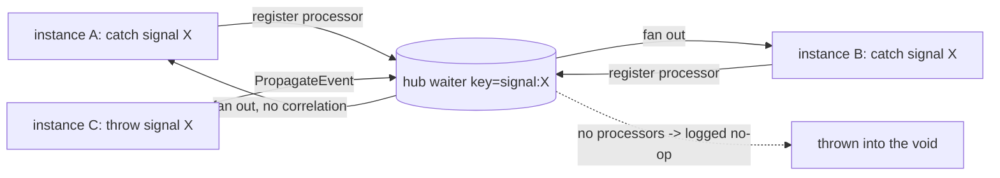

# SRD-020 — Signal events: name-indexed broadcast catch & throw

| Field | Value |
|---|---|
| Status | Draft |
| Version | v.1 |
| Date | 2026-06-18 |
| Owner | Ruslan Gabitov |
| Implements | [ADR-006 v.1 Events & Subscriptions](../design/ADR-006-events-and-subscriptions.md) §2.1, §2.4 |

This SRD lands the first runtime slice of the **events workstream** opened by
[ADR-006 v.1](../design/ADR-006-events-and-subscriptions.md): **signal events** —
the *publication / broadcast* trigger (§2.1) — for **intermediate catch** and
**throw** (intermediate-throw + signal end event). It also closes the dormant
**§2.4 no-waiter gap** (propagating to no listener becomes a logged no-op, not an
error) that has been waiting for signals. Signal **start** (instantiating) and
signal **boundary** events are deferred to the instantiation and boundary
workstreams respectively.

## 1. Background & motivation

### 1.1 Current state (verified against the code)

- **Signals are modelled but not executable.** `SignalEventDefinition`
  (`pkg/model/events/signal.go:59-112`) exists with `Type() → flow.TriggerSignal`
  (`:110-112`) and a `Signal()` accessor over a named `Signal`
  (`signal.go:14-51`, `Name()` at `:49`); the intermediate-catch trigger
  whitelist **already admits** signals
  (`pkg/model/events/intermediate_catch.go:18-23`, `flow.TriggerSignal` at `:21`).
  But there is **no signal waiter**: the waiter-builder switch
  (`internal/eventproc/eventhub/waiters/waiters.go:53-70`) has cases only for
  `TriggerTimer` and `TriggerMessage`; a signal falls through to the `default`
  error ("couldn't find builder for event definition of type …", `:64-70`). So a
  process with a signal catch/throw fails at registration today.
- **The hub is point-to-point, keyed by `eDef.ID()`.** The registry is
  `waiters map[string]eventproc.EventWaiter` (`eventhub.go:48`); `registerWaiter`
  keys by `eDef.ID()` — *find-or-build*, and if a waiter already exists for the
  key it **adds the processor to it** (`eventhub.go:194-228`). A waiter fans out
  to **all** its registered `EventProcessor`s when it fires (the message waiter
  loops them — `waiters/message.go:307-322`). `PropagateEvent` looks up **one**
  waiter by `eDef.ID()` (`eventhub.go:376`) and delivers to it.
- **Propagating to no waiter is an ERROR (the §2.4 gap).** `PropagateEvent`
  returns `ObjectNotFound` when `eDef.ID()` is absent from the registry
  (`eventhub.go:379-385`). For a **signal broadcast with no live catcher** this is
  *wrong* — a signal thrown into the void is simply not caught (§10.5.1), a normal
  condition, not a failure (ADR-006 §2.4).
- **Delivery runs on the waiter goroutine, track-synchronized.** A fired event
  reaches the waiting track via `track.ProcessEvent`
  (`internal/instance/track.go:723-778`), which runs **on the waiter goroutine**
  (comment `:743`), guards `TrackWaitForEvent` (`:730`), delivers to the node, then
  `unregisterEvent` + `TrackReady` (`:769-775`). Registration is `track.checkNodeType`
  → `RegisterEvent(t, d)` per definition when the token reaches the node
  (`track.go:301-340`, register at `:328`). The throw side: a throw event's
  `Execute` propagates via the instance's `EventProducer.PropagateEvent`
  (`internal/instance/instance.go:987-1002`) → `Thresher.PropagateEvent`
  (`thresher.go:400-419`) → `EventHub.PropagateEvent`. This is the proven path
  message/timer already use; **signals reuse it** (ADR-006 §2.1's single-loop
  inbound edge stays conception, as it is for message/timer today).

### 1.2 Problem

The signal trigger — BPMN's broadcast publication strategy (§10.5.1) — has a model
but no runtime. A process cannot throw or catch a signal, and the hub's
point-to-point, error-on-no-waiter behaviour is the wrong shape for broadcast. This
SRD makes signals executable and turns the §2.4 contract into reality.

## 2. Decision

- **Signal waiters are keyed by signal NAME, not `eDef.ID()`.** A single hub
  waiter represents one signal name; every track catching that name registers as a
  **processor** on it. The existing find-or-add-processor `registerWaiter` then
  gives **broadcast for free**: a throw of name `X` fires every processor on the
  `X` waiter — i.e. every catching track across every instance in reach
  (ADR-006 §2.1 broadcast; §10.5.1). No `CloneForInstance` for signals (unlike
  message/timer, *sharing one waiter is exactly the desired broadcast*, because the
  waiter holds one processor per catching track).
- **A passive `signalWaiter`.** Unlike message (broker subscription) / timer
  (ticker), a signal has **no external source** — it is fired only by an in-process
  throw via `PropagateEvent`. So the signal waiter spawns **no service goroutine**;
  its `Service` is a no-op that marks it running and its `Done()` is already closed.
  It obeys §2.5 ownership (the hub creates/removes it; it never self-removes) and
  fans `Process` out to all its processors with **no correlation filter** (signals
  have no correlation, §10.5.1).
- **No-waiter ⇒ logged no-op (closes §2.4).** `PropagateEvent` to an absent key is
  a debug-logged no-op, not an error — correct for a signal broadcast with no live
  catcher, harmless for any other kind.
- **Catch is single-shot; the name waiter persists until empty.** An intermediate
  catch consumes the signal once: on fire the track `unregisterEvent`s (removes its
  processor); when the last processor leaves, the hub removes the name waiter (the
  existing empty-waiter cleanup, `eventhub.go:397-398`). A later throw of the same
  name with no current catcher is a no-op.
- **Throw broadcasts by name.** Intermediate-throw and signal **end** events
  propagate their `SignalEventDefinition`; the hub keys by name and fans out. Reach
  is **engine-wide** (every instance registered in the `Thresher`), **including the
  throwing instance's own catchers** — the single-process in-memory conformance
  target (§2.4).



## 3. Functional requirements

- **FR-1 — signal catch waiter.** A `signalWaiter` (`eventproc.EventWaiter`) is
  built for a `SignalEventDefinition`; `waiters.CreateWaiter` gains a
  `flow.TriggerSignal` case. It is **passive** (no service goroutine): `Service`
  marks it `WSRunned` and leaves `Done()` closed; `Stop` marks it stopped; it never
  removes itself (§2.5).
- **FR-2 — name keying.** Signal waiters register and propagate under a
  **name-derived key** (the signal name), not `eDef.ID()`. A hub helper resolves
  the registry key per event kind (signal → name; others → `eDef.ID()`), used
  consistently by `registerWaiter`, `PropagateEvent`, and removal. Two instances
  catching the same signal name share one waiter as two processors.
- **FR-3 — broadcast fan-out.** `signalWaiter.Process(eDef)` delivers to **every**
  registered `EventProcessor` (each catching track), with no correlation filter; a
  per-processor delivery error is logged and does not abort the rest of the
  broadcast. Each delivered track resumes via the existing `track.ProcessEvent`
  path.
- **FR-4 — no-waiter no-op (closes §2.4).** `EventHub.PropagateEvent` with no
  registered waiter for the (name/ID) key is a **debug-logged no-op returning
  `nil`**, replacing the current `ObjectNotFound` error (`eventhub.go:379-385`).
- **FR-5 — single-shot catch.** An intermediate signal catch is consumed once: on
  fire the track unregisters its processor (existing `track.ProcessEvent`
  `unregisterEvent`); the name waiter is removed when its last processor leaves
  (existing empty-waiter cleanup).
- **FR-6 — signal throw.** Intermediate-throw and **signal end** events propagate a
  `SignalEventDefinition` through the existing throw path
  (`instance.PropagateEvent` → `Thresher.PropagateEvent` → `EventHub`); no new throw
  plumbing — the hub's name keying does the broadcast.
- **FR-7 — deferrals (documented, not built).** Signal **start** events
  (instantiating — extends ADR-015) and signal **boundary** events (boundary
  workstream) are out of scope; the catch path here is the intermediate **in-flow**
  waiter only (ADR-006 §2.3 row 1).

## 4. Non-functional requirements

- **NFR-1 — BPMN broadcast semantics.** One throw of name `X` reaches **all**
  current catchers of `X` in reach (§10.5.1); zero catchers is a no-op, never an
  error or a buffered late-delivery (§2.4 — the hub is not a store).
- **NFR-2 — §2.5 ownership.** The signal waiter is hub-owned: created on first
  catch, removed when empty or on `Shutdown`; it never self-removes; it drains
  cleanly (its `Done()` is closed, so `EventHub.Shutdown`'s wait is immediate).
- **NFR-3 — no new locks / single-mutator preserved.** Registration/propagation
  stay under the hub's existing `m sync.RWMutex`; delivery reuses the track's
  existing `t.m`/state synchronization (ADR-001). No change to the instance loop.
- **NFR-4 — coverage.** Touched files finish ≥80% (target 100%) diff-coverage;
  `make ci` green (incl. `-race` — broadcast crosses instances/goroutines).

## 5. Path analysis (alternatives)

- **Name-keyed shared waiter (chosen) vs a parallel `map[name][]subscriber`
  index.** Chosen: key signal waiters by name in the **existing** registry, so the
  find-or-add-processor + fan-out + §2.5 ownership + empty-cleanup machinery is
  reused unchanged — broadcast falls out of the multi-processor waiter that already
  exists. Rejected the parallel index: it duplicates ownership/shutdown logic the
  hub already has, and splits propagation into two code paths.
- **Passive waiter (chosen) vs a service goroutine that waits on a channel.**
  Chosen: a signal has no external source (it is fired by an in-process throw), so a
  goroutine would block on nothing and only complicate the §2.5 drain. A passive
  waiter (closed `Done()`) is the honest shape. Rejected the goroutine: needless
  concurrency + a drain edge with no benefit.
- **No `CloneForInstance` for signals (chosen) vs per-instance clone like
  message/timer.** Chosen: message/timer clone to a fresh per-instance ID so
  concurrent instances do **not** share a waiter (point-to-point — sharing was the
  FIX-004 broadcast bug). For signals the opposite is correct: catchers across
  instances **should** all fire on one throw, so they **should** share the
  name-keyed waiter as distinct processors. Rejected cloning: it would fragment the
  broadcast into per-instance waiters a single throw can't reach.
- **No-waiter no-op (chosen) vs keep the error / buffer the signal.** Chosen:
  logged no-op (ADR-006 §2.4) — a signal with no catcher is normal BPMN. Rejected
  the error (wrong for broadcast) and buffering (the hub is not a store; signals are
  not replayed — §2.4).
- **Reach = engine-wide incl. self-instance (chosen) vs per-instance only.**
  Chosen: a thrown signal reaches every catcher in the engine, including the
  thrower's own instance (§10.5.1 "within and across Processes"). The single-process
  in-memory model is the conformance target (§2.4). Cross-engine reach is the
  persistence/distribution ADR's, not here.

## 6. API & key shapes

```go
// internal/eventproc/eventhub/waiters — new passive waiter:
//   NewSignalWaiter(eh, ep, eDef, rt) (eventproc.EventWaiter, error)
//   keyed by the signal name; Process fans out to all EventProcessors (no
//   correlation); Service is a no-op (no goroutine); Done() is closed.
// waiters.CreateWaiter gains:
//   case flow.TriggerSignal: w, err = NewSignalWaiter(eh, ep, eDef, rt)

// internal/eventproc/eventhub/eventhub.go — name-vs-id keying + §2.4 no-op:
//   func waiterKey(eDef flow.EventDefinition) string // signal -> name; else eDef.ID()
//   registerWaiter / PropagateEvent / removal use waiterKey(eDef).
//   PropagateEvent: absent key -> debug log + return nil (was ObjectNotFound).
```

No new public `pkg/` surface: signals are authored with the existing
`events.NewSignalEventDefinition` + intermediate catch/throw + end-event builders;
this SRD wires their **runtime**.

## 7. Test plan

- **`TestSignalCatchThrow`** — one instance: a track waits on an intermediate
  signal catch; another track (or a second flow) throws the same signal name; the
  catch fires and the process completes (FR-1, FR-3, FR-6).
- **`TestSignalBroadcast`** (`-race`) — two concurrent instances each catch signal
  `X`; a throw of `X` (from a third) fires **both** — both reach their downstream
  node (FR-2, FR-3, NFR-1). This is the broadcast canary (the inverse of FIX-004's
  no-cross-instance rule, which holds for message/timer).
- **`TestSignalThrownIntoVoid`** — throwing a signal with no registered catcher is
  a no-op (no error), and a later catch of the same name is **not** retro-delivered
  (FR-4, NFR-1; the §2.4 no-buffer contract).
- **`TestSignalSingleShotConsume`** — after a catch fires, its processor is removed;
  a second throw does not re-fire the consumed catch; the name waiter is gone once
  empty (FR-5).
- **`TestPropagateNoWaiterIsNoop`** (internal `eventhub`) — `PropagateEvent` with an
  absent key returns `nil` and logs at debug, for both a signal and a non-signal
  eDef (FR-4) — the direct §2.4 regression test against `eventhub.go:379-385`.
- Internal `internal/eventproc/eventhub/waiters` unit for `signalWaiter`
  (passive `Service`/closed `Done`, fan-out `Process`, `Stop`) for cross-package
  coverage attribution.

## 8. Cross-document consistency

- **Implements** [ADR-006 v.1](../design/ADR-006-events-and-subscriptions.md) §2.1
  (publication/broadcast reach, per-instance subscription identity), §2.4 (no-waiter
  no-op, non-durable, no buffering — signals are not the broker's job).
- [ADR-001 v.5](../design/ADR-001-execution-model.md) — the track/loop model the
  delivery path runs against (single-mutator; signal reuses `track.ProcessEvent`).
- [ADR-009 v.1](../design/ADR-009-per-instance-node-graph.md) — per-instance clones;
  each instance's catch is a distinct processor on the shared name waiter.
- [ADR-013 v.1](../design/ADR-013-instance-observability.md) §2.5 / [SRD-019 v.1](SRD-019-instance-control-lifecycle.md)
  — the `EventHub.Shutdown` waiter drain the passive signal waiter obeys (closed
  `Done()`).
- [ADR-014 v.1](../design/ADR-014-message-handling.md) — the message waiter this
  mirrors (and deliberately diverges from on correlation/broadcast).
- References up/sideways, version-pinned; no downward refs (ADR-006 does not cite
  SRD-020).

## 9. Definition of Done

- FR-1…FR-7 wired and exercised by the §7 tests (incl. the `-race` broadcast canary).
- `signalWaiter` + `CreateWaiter` signal case + name keying + §2.4 no-op present;
  signal catch/throw/end run end-to-end.
- §2.4 closed: `PropagateEvent` no-waiter is a logged no-op (the old `ObjectNotFound`
  path is gone), proven by `TestPropagateNoWaiterIsNoop`.
- `make ci` green (tidy, lint incl. fieldalignment, build, `-race`, diff-coverage
  ≥95, govulncheck); touched files ≥80% (target 100%).
- A runnable `examples/signal-broadcast` (or extension of an existing example)
  smoke-runs exit 0, plus the existing 9 examples still exit 0.
- §10 filled; status → Accepted; RU twin added; linked docs synced; GitHub
  sub-issue under epic #90 closed by the PR.

## 10. Implementation summary

> ⚠️ TODO: fill AFTER landing — commits, key files, V-results, deltas vs this draft.

## Document History

| Version | Date | Author | Change |
|---|---|---|---|
| v.1 | 2026-06-18 | Ruslan Gabitov | Draft. First runtime slice of the ADR-006 v.1 events workstream: signal events (intermediate catch + intermediate/end throw) via a name-keyed passive `signalWaiter` that reuses the hub's find-or-add-processor + fan-out + §2.5-ownership machinery to broadcast (one throw of name `X` → every catcher of `X` across instances in reach, §2.1/§10.5.1); no `CloneForInstance` (sharing the name waiter *is* the broadcast); and closes the §2.4 no-waiter gap (`PropagateEvent` absent-key → logged no-op, replacing `ObjectNotFound`). Signal **start** (instantiating) and **boundary** events deferred. Code-grounded against `pkg/model/events` (signal.go, intermediate_catch.go), `internal/eventproc/eventhub` (eventhub.go, waiters/), `internal/instance` (track.go ProcessEvent/checkNodeType). Implements ADR-006 v.1 §2.1/§2.4; refs ADR-001 v.5, ADR-009 v.1, ADR-013 v.1, ADR-014 v.1, SRD-019 v.1. |
