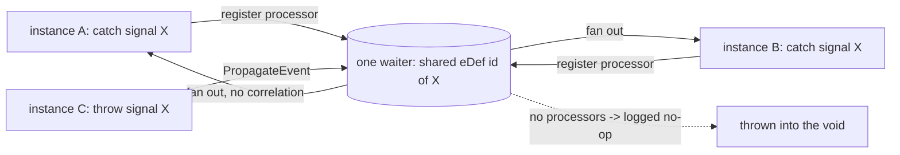

# SRD-020 — Сигнальные события: широковещательные catch и throw с сопоставлением по имени

| Поле | Значение |
|---|---|
| Статус | Принято |
| Версия | v.1 |
| Дата | 2026-06-18 |
| Владелец | Руслан Габитов |
| Реализует | [ADR-006 v.1 Events & Subscriptions](../design/ADR-006-events-and-subscriptions.ru.md) §2.1, §2.4 |

Этот SRD приземляет первый рантайм-срез **events-workstream**, открытого
[ADR-006 v.1](../design/ADR-006-events-and-subscriptions.ru.md): **сигнальные
события** — триггер *публикации / широковещания* (§2.1) — для **промежуточного
catch** и **throw** (intermediate-throw + сигнальное end-событие). Также закрывает
дремлющую **§2.4 no-waiter gap** (распространение события без слушателя становится
залогированным no-op, а не ошибкой), которая ждала сигналов. Сигнальные **start**
(инстанцирующие) и **boundary** события отложены в workstream'ы инстанцирования и
boundary соответственно.

## 1. Контекст и мотивация

### 1.1 Текущее состояние (проверено по коду)

- **Сигналы смоделированы, но не исполнимы.** `SignalEventDefinition`
  (`pkg/model/events/signal.go:59-112`) существует с `Type() → flow.TriggerSignal`
  (`:110-112`) и аксессором `Signal()` над именованным `Signal` (`signal.go:14-51`,
  `Name()` на `:49`); whitelist триггеров промежуточного catch **уже допускает**
  сигналы (`pkg/model/events/intermediate_catch.go:18-23`, `flow.TriggerSignal` на
  `:21`). Но **нет signal waiter**: switch builder'а waiter'ов
  (`internal/eventproc/eventhub/waiters/waiters.go:53-70`) имеет ветки только для
  `TriggerTimer` и `TriggerMessage`; сигнал проваливается в `default`-ошибку
  ("couldn't find builder for event definition of type …", `:64-70`). Так что
  процесс с сигнальным catch/throw сегодня падает на регистрации.
- **Хаб — точка-в-точку, ключ `eDef.ID()`.** Реестр —
  `waiters map[string]eventproc.EventWaiter` (`eventhub.go:48`); `registerWaiter`
  ключует по `eDef.ID()` — *find-or-build*, и если waiter для ключа уже существует,
  он **добавляет в него processor** (`eventhub.go:194-228`). Waiter веером
  раздаёт **всем** своим зарегистрированным `EventProcessor`'ам при срабатывании
  (message waiter перебирает их — `waiters/message.go:307-322`). `PropagateEvent`
  ищет **один** waiter по `eDef.ID()` (`eventhub.go:376`) и доставляет ему.
- **Распространение без waiter'а — ОШИБКА (§2.4 gap).** `PropagateEvent` возвращает
  `ObjectNotFound`, когда `eDef.ID()` отсутствует в реестре (`eventhub.go:379-385`).
  Для **широковещательного сигнала без живого catcher'а** это *неверно* — сигнал,
  брошенный в пустоту, просто не пойман (§10.5.1), нормальное состояние, не сбой
  (ADR-006 §2.4).
- **Доставка идёт на waiter-горутине, синхронизирована треком.** Сработавшее событие
  достигает ждущего трека через `track.ProcessEvent`
  (`internal/instance/track.go:723-778`), который исполняется **на waiter-горутине**
  (комментарий `:743`), охраняет `TrackWaitForEvent` (`:730`), доставляет узлу, затем
  `unregisterEvent` + `TrackReady` (`:769-775`). Регистрация — `track.checkNodeType`
  → `RegisterEvent(t, d)` на определение, когда токен достигает узла
  (`track.go:301-340`, регистрация на `:328`). Сторона throw: `Execute` throw-события
  распространяет через `EventProducer.PropagateEvent` экземпляра
  (`internal/instance/instance.go:987-1002`) → `Thresher.PropagateEvent`
  (`thresher.go:400-419`) → `EventHub.PropagateEvent`. Это проверенный путь, который
  message/timer уже используют; **сигналы переиспользуют его** (single-loop inbound
  edge из ADR-006 §2.1 остаётся концепцией, как и для message/timer сегодня).

### 1.2 Проблема

Сигнальный триггер — широковещательная стратегия публикации BPMN (§10.5.1) — имеет
модель, но не рантайм. Процесс не может бросить или поймать сигнал, а
точка-в-точку поведение хаба с ошибкой-на-нет-waiter'а — неправильная форма для
широковещания. Этот SRD делает сигналы исполнимыми и превращает §2.4-контракт в
реальность.

## 2. Решение

- **Широковещание вытекает из разделяемой идентичности eDef (индекс по имени не
  нужен).** У сигнальных `EventDefinition` **нет `CloneForInstance`**, поэтому
  `Event.clone()` (`events/event.go:161-167`) разделяет их **по ссылке** между
  per-instance клонами node-graph (ADR-009) через `cloneDefsForInstance`
  (`event.go:175-191`, "definitions without the capability are shared by reference").
  Каждый экземпляр, ловящий один и тот же смоделированный сигнальный узел,
  держит **тот же `eDef.ID()`**, так что существующий find-or-add-processor
  `registerWaiter` приземляет всех catcher'ов на **один** waiter с ключом-id как
  отдельные processor'ы, а throw (`PropagateEvent` по этому id) веером раздаёт
  `Process` всем — **широковещание через существующий реестр**, без индекса по
  имени, без смены ключевания. Асимметрия clone-vs-share в `cloneDefsForInstance`
  уже это кодирует: message/timer клонируются → точка-в-точку (правило no-share из
  FIX-004); **сигнал разделяется → широковещание** (умышленная инверсия). Поэтому
  сигнал умышленно **не** добавляет `CloneForInstance`.
- **Пассивный `signalWaiter`.** В отличие от message (подписка брокера) / timer
  (тикер), у сигнала **нет внешнего источника** — он срабатывает только от
  in-process throw через `PropagateEvent`. Поэтому signal waiter **не поднимает
  service-горутину**; его `Service` — no-op, помечающий running, а `Done()` уже
  закрыт. Он подчиняется §2.5-владению (хаб создаёт/удаляет; сам себя никогда не
  удаляет) и веером раздаёт `Process` всем processor'ам **без correlation-фильтра**
  (у сигналов нет корреляции, §10.5.1).
- **Нет waiter'а ⇒ залогированный no-op (закрывает §2.4).** `PropagateEvent` к
  отсутствующему ключу — залогированный no-op, не ошибка — верно для
  широковещательного сигнала без живого catcher'а, безвредно для любого другого.
- **Catch одноразовый; waiter живёт до опустошения.** Промежуточный catch потребляет
  сигнал один раз: при срабатывании трек делает `unregisterEvent` (убирает свой
  processor); когда уходит последний processor, хаб удаляет waiter. Поскольку
  широковещательный fan-out заставляет каждого catcher'а само-разрегистрироваться
  **во время** `Process`, последняя разрегистрация удаляет уже-пустой waiter, так что
  собственная post-`Process` empty-cleanup в `PropagateEvent` (`eventhub.go:397-398`)
  должна **толерировать уже-удалённый waiter** (lock-check-delete, а не жёсткий
  `RemoveWaiter`, который ошибается `ObjectNotFound`). Этот путь сейчас мёртв для
  message (его `Process` ошибается) и timer (срабатывает через `WaiterFired`), так
  что сигнал — первый, кто его задействует.
- **Throw широковещает.** Intermediate-throw и сигнальные **end**-события
  распространяют свой `SignalEventDefinition`; хаб находит waiter с разделяемым id и
  веером раздаёт. Охват — **движок-широкий** (каждый экземпляр, зарегистрированный в
  `Thresher`), **включая catcher'ов самого бросающего экземпляра** — цель
  конформности single-process in-memory (§2.4).



## 3. Функциональные требования

- **FR-1 — signal catch waiter.** `signalWaiter` (`eventproc.EventWaiter`) строится
  для `SignalEventDefinition`; `waiters.CreateWaiter` получает ветку
  `flow.TriggerSignal`. Он **пассивен** (нет service-горутины): `Service` помечает
  его `WSRunned` и оставляет `Done()` закрытым; `Stop` помечает stopped; сам себя
  никогда не удаляет (§2.5).
- **FR-2 — широковещание через разделяемый eDef-id (без смены ключевания).** У
  сигнальных `EventDefinition` умышленно **нет `CloneForInstance`**, поэтому все
  экземпляры, ловящие один смоделированный сигнальный узел, разделяют один
  `eDef.ID()` (`Event.clone` → `cloneDefsForInstance`, разделение по ссылке).
  Существующий find-or-add-processor `registerWaiter` с ключом `eDef.ID()` приземляет
  каждого catcher'а на один waiter как отдельный processor — широковещание, **без
  `waiterKey` и без изменения ключевания
  `registerWaiter`/`PropagateEvent`/`UnregisterEvent`**.
- **FR-3 — fan-out широковещания.** `signalWaiter.Process(eDef)` доставляет
  **каждому** зарегистрированному `EventProcessor` (каждому ловящему треку), без
  correlation-фильтра; ошибка доставки одному processor'у логируется и не прерывает
  остальное широковещание. Каждый доставленный трек возобновляется через существующий
  путь `track.ProcessEvent`.
- **FR-4 — no-waiter no-op (закрывает §2.4).** `EventHub.PropagateEvent` без
  зарегистрированного waiter'а для `eDef.ID()` — **залогированный no-op, возвращающий
  `nil`**, заменяющий текущую `ObjectNotFound`-ошибку (`eventhub.go:379-385`).
  **Приземлено в M1.**
- **FR-5 — одноразовый catch + толерантность cleanup.** Промежуточный сигнальный
  catch потребляется один раз: при срабатывании трек разрегистрирует свой processor
  (существующий `track.ProcessEvent` `unregisterEvent`); waiter удаляется, когда
  уходит его последний processor. Поскольку широковещательный fan-out заставляет
  catcher'ов само-разрегистрироваться **во время** `Process`, post-`Process`
  empty-cleanup в `PropagateEvent` должен толерировать **уже-удалённый** waiter
  (lock-check-delete, а не жёсткий `RemoveWaiter`).
- **FR-6 — signal throw.** Intermediate-throw и **сигнальные end**-события
  распространяют `SignalEventDefinition` через существующий throw-путь
  (`instance.PropagateEvent` → `Thresher.PropagateEvent` → `EventHub`); никакого
  нового throw-обвеса — waiter с разделяемым id веером раздаёт.
- **FR-7 — отложенное (задокументировано, не построено).** Сигнальные **start**
  события (инстанцирующие — расширяют ADR-015) и сигнальные **boundary** события
  (boundary-workstream) — вне scope; путь catch здесь — только промежуточный
  **in-flow** waiter (ADR-006 §2.3 строка 1).

## 4. Нефункциональные требования

- **NFR-1 — семантика широковещания BPMN.** Один throw имени `X` достигает **всех**
  текущих catcher'ов `X` в охвате (§10.5.1); ноль catcher'ов — no-op, никогда не
  ошибка и не буферизованная поздняя доставка (§2.4 — хаб не хранилище).
- **NFR-2 — §2.5-владение.** Signal waiter принадлежит хабу: создаётся на первый
  catch, удаляется при опустошении или на `Shutdown`; сам себя никогда не удаляет;
  дренируется чисто (его `Done()` закрыт, так что ожидание `EventHub.Shutdown`
  мгновенно).
- **NFR-3 — нет новых блокировок / single-mutator сохранён.** Регистрация/распространение
  остаются под существующим `m sync.RWMutex` хаба; доставка переиспользует
  существующую `t.m`/state-синхронизацию трека (ADR-001). Цикл экземпляра не меняется.
- **NFR-4 — покрытие.** Затронутые файлы финишируют ≥80% (цель 100%) diff-coverage;
  `make ci` зелёный (incl. `-race` — широковещание пересекает экземпляры/горутины).

## 5. Анализ путей (альтернативы)

- **Разделяемый eDef-id через существующий реестр (выбрано) vs ключевание по имени
  vs параллельный индекс `map[name][]subscriber`.** Выбрано: полагаться на то, что
  сигнальные eDef разделяются по ссылке между клонами экземпляров (нет
  `CloneForInstance`), так что все catcher'ы разделяют один `eDef.ID()`, и существующая
  машинерия find-or-add-processor + fan-out + §2.5-владение + empty-cleanup с ключом
  `eDef.ID()` даёт широковещание **вообще без смены ключевания**. Отклонено
  ключевание по имени (`waiterKey`): оно вынудило бы
  `registerWaiter`/`PropagateEvent`/`UnregisterEvent` (который берёт `eDef.ID()`) на
  ключ от имени — лишнее протягивание ради асимметрии, которую `cloneDefsForInstance`
  уже кодирует. Отклонён параллельный индекс: дублирует владение/shutdown и расщепляет
  распространение на два пути.
- **Пассивный waiter (выбрано) vs service-горутина, ждущая на канале.** Выбрано: у
  сигнала нет внешнего источника (он срабатывает от in-process throw), так что
  горутина блокировалась бы ни на чём и только усложняла §2.5-дренаж. Пассивный waiter
  (закрытый `Done()`) — честная форма. Отклонена горутина: лишняя конкурентность +
  грань дренажа без пользы.
- **Нет `CloneForInstance` для сигналов (выбрано) vs per-instance клон как
  message/timer.** Выбрано: message/timer клонируются на свежий per-instance ID, чтобы
  конкурентные экземпляры **не** разделяли waiter (точка-в-точку — разделение было
  багом широковещания FIX-004). Для сигналов верно обратное: catcher'ы между
  экземплярами **должны** все сработать на один throw, так что **должны** разделять
  один waiter как отдельные processor'ы — достигается именно *не*-добавлением
  `CloneForInstance` (`cloneDefsForInstance` тогда разделяет eDef по ссылке). Отклонено
  клонирование: оно фрагментировало бы широковещание на per-instance waiter'ы, которых
  один throw не достанет.
- **No-waiter no-op (выбрано) vs оставить ошибку / буферизовать сигнал.** Выбрано:
  залогированный no-op (ADR-006 §2.4) — сигнал без catcher'а нормален для BPMN.
  Отклонены ошибка (неверно для широковещания) и буферизация (хаб не хранилище;
  сигналы не переигрываются — §2.4).
- **Охват = движок-широкий incl. self-instance (выбрано) vs только per-instance.**
  Выбрано: брошенный сигнал достигает каждого catcher'а в движке, включая собственный
  экземпляр бросающего (§10.5.1 "within and across Processes"). Single-process
  in-memory модель — цель конформности (§2.4). Cross-engine охват — дело
  persistence/distribution ADR, не здесь.

## 6. API и ключевые формы

```go
// internal/eventproc/eventhub/waiters — new passive waiter:
//   NewSignalWaiter(eh, ep, eDef, rt) (eventproc.EventWaiter, error)
//   Process fans out to all EventProcessors (no correlation); Service is a
//   no-op (no goroutine); Done() is closed; never self-removes (§2.5).
// waiters.CreateWaiter gains:
//   case flow.TriggerSignal: w, err = NewSignalWaiter(eh, ep, eDef, rt)

// internal/eventproc/eventhub/eventhub.go:
//   PropagateEvent post-Process empty-cleanup tolerates an already-removed
//   waiter (the broadcast fan-out self-unregisters its catchers). The §2.4
//   no-waiter no-op landed in M1.
// No keying change: signal eDefs share one eDef.ID() across instances
// (cloneDefsForInstance shares by reference), so the existing eDef.ID()-keyed
// registry broadcasts via find-or-add-processor.
```

Никакой новой публичной `pkg/`-поверхности: сигналы авторятся существующими
`events.NewSignalEventDefinition` + промежуточными catch/throw + end-event
builder'ами; этот SRD подключает их **рантайм**.

## 7. План тестирования

- **`TestSignalCatchThrow`** — один экземпляр: трек ждёт на промежуточном сигнальном
  catch; другой трек (или второй поток) бросает то же имя сигнала; catch срабатывает,
  процесс завершается (FR-1, FR-3, FR-6).
- **`TestSignalBroadcast`** (`-race`) — два конкурентных экземпляра ловят сигнал `X`;
  throw `X` (от третьего) срабатывает **обоим** — оба достигают своего downstream-узла
  (FR-2, FR-3, NFR-1). Это канарейка широковещания (инверсия no-cross-instance правила
  FIX-004, которое держится для message/timer).
- **`TestSignalThrownIntoVoid`** — бросок сигнала без зарегистрированного catcher'а —
  no-op (без ошибки), и поздний catch того же имени **не** доставляется ретроспективно
  (FR-4, NFR-1; §2.4 no-buffer контракт).
- **`TestSignalSingleShotConsume`** — после срабатывания catch его processor удалён;
  второй throw не пересрабатывает потреблённый catch; waiter исчезает по опустошении
  (FR-5).
- **`TestPropagateNoWaiterIsNoop`** (внутренний `eventhub`) — `PropagateEvent` с
  отсутствующим ключом возвращает `nil` и логирует на debug, для сигнального и
  не-сигнального eDef (FR-4) — прямой §2.4 regression-тест против
  `eventhub.go:379-385`.
- Внутренний юнит `internal/eventproc/eventhub/waiters` для `signalWaiter` (пассивный
  `Service`/закрытый `Done`, fan-out `Process`, `Stop`) для атрибуции межпакетного
  покрытия.

## 8. Кросс-документная консистентность

- **Реализует** [ADR-006 v.1](../design/ADR-006-events-and-subscriptions.ru.md) §2.1
  (охват публикации/широковещания, per-instance идентичность подписки), §2.4 (no-waiter
  no-op, недолговечно, без буферизации — сигналы не дело брокера).
- [ADR-001 v.5](../design/ADR-001-execution-model.ru.md) — модель track/loop, против
  которой работает путь доставки (single-mutator; сигнал переиспользует
  `track.ProcessEvent`).
- [ADR-009 v.1](../design/ADR-009-per-instance-node-graph.ru.md) — per-instance клоны;
  catch каждого экземпляра — отдельный processor на разделяемом waiter'е.
- [ADR-013 v.1](../design/ADR-013-instance-observability.ru.md) §2.5 / [SRD-019 v.1](SRD-019-instance-control-lifecycle.ru.md)
  — дренаж waiter'ов `EventHub.Shutdown`, которому подчиняется пассивный signal waiter
  (закрытый `Done()`).
- [ADR-014 v.1](../design/ADR-014-message-handling.ru.md) — message waiter, который
  этот зеркалит (и умышленно расходится по корреляции/широковещанию).
- Ссылки вверх/вбок, с пином версии; нет ссылок вниз (ADR-006 не цитирует SRD-020).

## 9. Definition of Done

- FR-1…FR-7 подключены и проверены тестами §7 (включая `-race` канарейку широковещания).
- `signalWaiter` + ветка signal в `CreateWaiter` + name-scan `broadcastSignal` + §2.4
  no-op присутствуют; сигнальные catch/throw/end работают end-to-end.
- §2.4 закрыта: no-waiter в `PropagateEvent` — залогированный no-op (старый путь
  `ObjectNotFound` исчез), доказано `TestPropagateNoWaiterIsNoop`.
- `make ci` зелёный (tidy, lint incl. fieldalignment, build, `-race`, diff-coverage
  ≥95, govulncheck); затронутые файлы ≥80% (цель 100%).
- Запускаемый `examples/signal-broadcast` smoke-run выходит с 0, плюс существующие 9
  примеров всё ещё выходят с 0.
- §10 заполнена; статус → Принято; добавлен RU-близнец; связанные доки синхронизированы;
  GitHub sub-issue под epic #90 закрыт PR'ом.

## 10. Сводка реализации

Приземлено на `feat/signal-events` (от `master`): две кодовые вехи + предварительный
fix + запускаемый пример.

### 10.1 Коммиты

| # | Коммит | Объём | Тесты |
|---|---|---|---|
| doc | `24a451c` | Черновик SRD-020 | — |
| fix | `30c8437` | Пред-существующая гонка SRD-019: `EventHub.state` сделан `atomic.Uint32` (Run/PropagateEvent читают lock-free, пока Start/Shutdown пишут). Вскрыта сдвигом тайминга M1. | `TestThresherShutdown -race` |
| M1 | `d4460a7` | §2.4 no-waiter no-op: `PropagateEvent` к отсутствующему ключу → залогированный `nil` (было `ObjectNotFound`). | `TestPropagateNoWaiterIsNoop` |
| M2 | `ed43854` | Рантайм сигналов: пассивный `signalWaiter`, ветка signal в `CreateWaiter`, name-scan `broadcastSignal` в `PropagateEvent`. | `TestSignalWaiter*`, `TestBroadcastSignalFanOut`, `TestSignalCatchThrow`, `TestSignalBroadcast -race`, `TestSignalThrownIntoVoid`, `TestSignalSingleShotConsume` |
| M3 | `ce0bc96` | `examples/signal-broadcast` (один throw → два watcher-экземпляра). | smoke |

### 10.2 Ключевые файлы

- `internal/eventproc/eventhub/waiters/signal.go` (новый) — пассивный `signalWaiter`.
- `internal/eventproc/eventhub/waiters/waiters.go` — ветка `TriggerSignal` в `CreateWaiter` + NOTE про per-trigger-идентичность.
- `internal/eventproc/eventhub/eventhub.go` — `broadcastSignal`/`signalName`, ветка signal в `PropagateEvent` + §2.4 no-op, и `atomic.Uint32` state (race fix).
- `examples/signal-broadcast/` (новый) — `process.go` (builder'ы catcher/thrower) + `main.go`.

### 10.3 Верификация

- `make ci` зелёный: tidy, lint, build, `-race`, **diff-coverage 97.2% из 212
  изменённых строк (≥95)**, govulncheck. Затронутые функции ≥80% (signal.go +
  `broadcastSignal` 100%).
- Все **10** примеров smoke-run выходят с 0 (incl. `signal-broadcast`).

### 10.4 Дельты против черновика

- **Механизм сопоставления исправлен (FR-2/§2/§5).** Черновик сначала набросал
  реестр с ключом по имени (`waiterKey`); реализация вскрыла более простую истину:
  catcher'ы между экземплярами уже разделяют один waiter (сигнальные eDef не
  клонируются), а throw→catch сопоставляется **name-scan'ом** в `PropagateEvent`
  (`broadcastSignal`) — без смены ключевания, без churn'а сигнатуры `UnregisterEvent`.
  Док исправлен в M2. Будущая генерализация `SubscriptionKey()` (когда придут Link
  события) зафиксирована как follow-up, здесь не строится.
- **Предварительный race fix.** `-race`-прогон M1 вскрыл пред-существующую гонку
  `EventHub.state` из SRD-019; исправлено отдельным коммитом `30c8437` до M1, не
  свёрнуто молча.

## История документа

| Версия | Дата | Автор | Изменение |
|---|---|---|---|
| v.1 | 2026-06-18 | Руслан Габитов | Принято. Первый рантайм-срез events-workstream ADR-006 v.1: сигнальные события (промежуточный catch + intermediate/end throw) через пассивный `signalWaiter` (без брокера, без горутины; `Process` веером раздаёт всем catcher'ам, без корреляции; закрытый `Done()` для §2.5-дренажа). Широковещание сопоставляется **name-scan'ом** в `PropagateEvent` (`broadcastSignal`) — throw и catch это разные узлы с разными id — при этом catcher'ы между экземплярами разделяют один waiter, потому что сигнальные eDef не клонируются (`cloneDefsForInstance` разделяет по ссылке; умышленная инверсия точка-в-точку клона FIX-004). Также закрывает §2.4 no-waiter gap (`PropagateEvent` отсутствующий-ключ → залогированный no-op, заменяя `ObjectNotFound`; приземлено в M1) и исправлена пред-существующая гонка данных `EventHub.state` из SRD-019 (atomic). Черновик с реестром по имени; исправлено на shared-id + name-scan в ходе реализации (без churn'а `waiterKey`/`UnregisterEvent`). Сигнальные **start** (инстанцирующие) и **boundary** события отложены; полиморфная генерализация сопоставления `SubscriptionKey()` отложена в Link-events workstream. Обосновано по коду `pkg/model/events`, `internal/eventproc/eventhub`, `internal/instance`. Реализует ADR-006 v.1 §2.1/§2.4; ссылается на ADR-001 v.5, ADR-009 v.1, ADR-013 v.1, ADR-014 v.1, SRD-019 v.1. |
