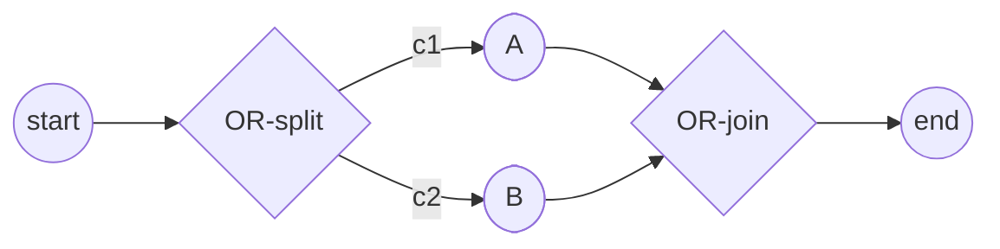

# SRD-022 — Inclusive (OR) join (synchronizing merge)

| Field | Value |
|---|---|
| Status | Draft |
| Version | v.1 |
| Date | 2026-06-19 |
| Owner | Ruslan Gabitov |
| Implements | [ADR-005 v.2 Gateways & Joins](../design/ADR-005-gateways-and-joins.md) §2.10 |

This SRD lands the **Inclusive (OR) join** decided in [ADR-005 v.2](../design/ADR-005-gateways-and-joins.md)
§2.10: the **converging** `InclusiveGateway` becomes a **synchronizing merge** whose
completion is **non-local** — it fires when no live token can still arrive on an
un-marked incoming flow — **re-evaluated on token death as well as arrival**. It is
the sibling of [SRD-021](SRD-021-exclusive-inclusive-split.md) (the splits) and
completes the converging half of the OR gateway (epic #93).

The OR-join introduces one capability the engine lacks today: **park-and-resume**. A
Parallel join never suspends a track — each arrival ends (absorbed → `Merged`) or, if
it is the completing arrival, continues *live*. An OR-join can complete with **no
arrival at all** (a peer branch is never taken, or dies), so a non-completing arrival
must **park** and be **resumed later** by the loop. Reachability is computed **in the
loop, on demand** (no cached graph) — `Arrive` is unchanged and `ParallelGateway` is
untouched.

It also makes track **merges observable**: each absorbed track records an acyclic
`MergedInto` edge to its survivor (FR-8), for **both** synchronizing joins.

Acyclic single-pass; loop re-arming, the Complex gateway, and the spec's two-path
refinement clause stay deferred (ADR-005 §4).

## 1. Background & motivation

### 1.1 Current state (verified against the code)

- **The Inclusive gateway is split-only.** `InclusiveGateway` implements
  `exec.NodeExecutor` but **not** `exec.SynchronizingJoin` (`inclusive.go:136`;
  `TestInclusiveConvergingUnsupported`). A *converging* Inclusive gateway falls into
  `Exec`'s pass-through (`len(out) <= 1 → return out`): it forwards each token
  **without synchronizing**.
- **Parallel is the join template — and it never park-and-resumes.** `ParallelGateway`
  is a `SynchronizingJoin` (`pkg/exec/exec.go:24-33` — `Arrive(incomingFlowID,
  arrivingTrackID string) (complete bool, merged []string)`); it marks per-incoming-flow
  arrivals (`parallel.go:18-22`, `:68-89`) and completes when **all** are marked. In
  `track.synchronize` (`track.go:455-496`) a non-completing arrival's goroutine
  **returns** (`TrackAwaitingMerge` → `Merged` via `applyMerged`, `instance.go:741-747`);
  the completing arrival is a **live** goroutine that continues (survivor). Nothing is
  suspended to be woken later.
- **The loop never re-checks or re-spawns a join.** `instance.go:618-703` handles
  `evFork`/`evEnded`/`evAwaiting`/`evMerged`; registries are `inst.tracks` + an
  `active` count. No re-evaluation on death; only a live `Arrive` ever completes a join.
- **The merge edge is not recorded.** `applyMerged` flips absorbed tracks from the
  transient `evMerged.mergedIDs`; nothing is persisted. `TokenPath.ParentID`
  (`token.go:83`) is single-valued — SRD-005 FR-5b rejected folding absorbed ids into
  the survivor's parent (cyclic `ParentID`), so convergence is left implicit.
- **Positions + graph are reachable.** Active positions: `inst.GetTokens()`
  (`instance.go:769-784`, Alive/WaitForEvent) + `currentStep().node` (`track.go:376-381`).
  Graph: `flow.Node.Incoming()`/`Outgoing()` (`node.go:75-76`) and
  `flow.SequenceFlow.Source()`/`Target()` (`sequenceflow.go:285,290`, each a `flow.Node`),
  bounded by `snapshot.Nodes` (`snapshot.go:15-24`).

### 1.2 Problem

The OR-split (SRD-021) forks a subset of branches, but nothing re-joins them. The
canonical OR diamond cannot be modelled, and a converging Inclusive gateway silently
passes each token through. ADR-005 §2.10 decides the conservative rule — including the
**death-triggered** re-evaluation that fixes Camunda 7's arrival-only hang (an
interrupted awaited branch otherwise stalls the join forever).

## 2. Decision

The **converging** `InclusiveGateway` becomes a **reachability-based synchronizing
join** (ADR-005 §2.10):

- **Arrival table + §2.4 ownership.** Per-incoming-flow marking (`arrived
  map[flowID]trackID`) plus an **ordered arrival log** (track ids in arrival order)
  under a per-node `sync.Mutex`. Per-flow, not a count, so the rule survives loop
  re-arming (deferred).
- **`Arrive` is unchanged — count only.** `Arrive(incomingFlowID, arrivingTrackID)`
  marks the flow and completes **iff every incoming flow is now marked** (the live
  arriving track continues as survivor, *last-in*) — exactly Parallel. Otherwise the
  track **parks** (`AwaitSync`). `ParallelGateway.Arrive` is byte-for-byte untouched;
  there is **no `FlowChecker` parameter** on `Arrive`.
- **Reachability is a loop-only, on-demand instance service.** `FlowChecker.CheckFlows(node,
  flows)` (implemented by the `Instance`) returns the subset of the node's un-marked
  incoming flows still reachable. For each candidate flow it walks **backward** from
  the flow's source toward the start over `Incoming() → Source()`, cycle-guarded, and
  reports the flow **reachable** the moment it finds a **live token** (`Alive`/`WaitForEvent`)
  sitting on any node of that backward closure; **unreachable** if the closure is
  exhausted with none. No cached graph — pure traversal. Condition-ignoring
  (conservative — every structural edge counts).
- **`Recheck` — the loop's completion hook.** `Recheck(fc)` re-prunes the node's
  un-marked flows via `CheckFlows`; when none remain, it fires. The loop calls it on
  **two triggers**:
  1. **A token parks at a join** → `Recheck` that node (it may already be unreachable
     — e.g. a branch that was never taken, with zero deaths).
  2. **Any token dies** (end / cancel / merge) → `Recheck` **every node that holds
     `AwaitSync` tracks** — a death can vacate the last live token on a backward path.
  So `AwaitSync` **is** the death-recheck registry; no separate structure.
- **Park-and-resume — real parking (block-and-signal).** A non-completing arrival
  **suspends its goroutine mid-`run()`**: it sets `TrackAwaitSync`, emits `evParked`
  (so the loop knows to recheck the node), and **blocks** on a per-track resume
  channel (`select`-ing on `ctx.Done()` so termination unblocks it cleanly). The
  goroutine stays **alive and counted active** — so the loop never completes the
  instance out from under a parked track, and there is no re-spawn. When a `Recheck`
  completes the join, the loop flips the absorbed tracks to `Merged` and **signals
  every parked track's channel**: the survivor's goroutine resumes `run()` straight
  into the node's `Exec` (the §2.9 split → fork, continuing with its own id); the
  merged goroutines observe `Merged` and return. Parallel keeps its return-based
  `AwaitingMerge` (its absorbed tracks never resume).
- **Survivor — falls out of the mechanism.** An **arrival** that completes the join
  keeps its live/just-parked track (*last-in*); a **death** that completes it has no
  arrival, so the loop resumes the **earliest-parked** track (*first-in*). No
  candidate bookkeeping.
- **`AwaitSync` track state.** Distinct from `AwaitingMerge` (always doomed to
  `Merged`): an `AwaitSync` track has two fates — `AwaitSync → Alive` (resumed
  survivor) or `AwaitSync → Merged` (absorbed). It still **projects a live token**
  (like `AwaitingMerge`), so it stays in the set the backward walk consults — a parked
  token may resume and reach a downstream flow. What the walk excludes is the **checked
  join itself** (its boundary), not parked tracks; a parked track *at* that join is
  downstream of every un-marked flow's backward path, so it is harmless anyway.
- **Contract.** `SynchronizingJoin.Arrive` is **unchanged**; a new instance-side
  `FlowChecker` carries reachability; a minimal `ReachabilityJoin` adds `Recheck(fc)`.
  Parallel implements only `SynchronizingJoin` and is never rechecked or resumed.
- **Merge edge (FR-8).** Each absorbed track records `MergedInto = survivorID`, set in
  the shared `applyMerged` — a forward, acyclic edge (survivor's `ParentID` untouched,
  preserving FR-5b), observable in `TokenHistory`, for Parallel and Inclusive alike.
- **Scope.** Acyclic, single-pass (ADR-005 §4): each incoming flow marked once; loop
  re-arming, the Complex gateway, and the spec refinement clause stay deferred.

### Worked example — a branch that is never taken (fires with zero deaths)



`c1` true, `c2` false ⟹ the OR-split forks **only** A. A reaches the OR-join, marks the
A→J flow, and **parks** (`AwaitSync`) — the B→J flow is still un-marked. The loop
`Recheck`s J: `CheckFlows` walks **backward** from B→J's source (`B → OR-split →
start`) and finds **no live token** on the way (A sits at the join, downstream of B's
backward path; the B branch never received one) ⟹ B→J is **unreachable** ⟹ pruned ⟹
no un-marked flow remains ⟹
**fire**, with **no token death at all**. The loop signals A's resume channel; A's
goroutine (which blocked at J) continues into J's `Exec` (single outgoing →
pass-through) and on to the end.

If instead both `c1` and `c2` were true, B's live track would sit on that backward
path, so the parking `Recheck` keeps A waiting; J then fires when B arrives (all marked
→ last-in survivor) — or, were B's branch interrupted, on the **death** recheck.

## 3. Functional requirements

- **FR-1 — converging Inclusive gateway synchronizes.** A converging `InclusiveGateway`
  (≥2 incoming) is a `SynchronizingJoin`/`ReachabilityJoin` with a per-incoming-flow
  arrival table under its per-node mutex — not a pass-through.
  (`TestInclusiveConvergingUnsupported` → `TestInclusiveIsReachabilityJoin`.)
- **FR-2 — `Arrive`, count-only, unchanged.** `Arrive` marks the flow and completes
  (live arriving track continues, *last-in*) **iff every incoming flow is marked**;
  else the track parks (`AwaitSync`). Same signature as today; `ParallelGateway.Arrive`
  is untouched.
- **FR-3 — loop-only backward reachability + prune.** `FlowChecker.CheckFlows(node,
  flows)` (instance) walks **backward** from each un-marked flow's source to the start,
  cycle-guarded, condition-ignoring, returning a flow reachable iff a live token sits
  on its backward closure; no cache. The node prunes the unreachable flows from its
  table. The node does not implement the traversal.
- **FR-4 — re-evaluation triggers.** The loop `Recheck`s (a) the node a token just
  parked at, and (b) on **any** token death, every node holding `AwaitSync` tracks. A
  recheck that empties the un-marked set fires the join — covering both *branch never
  taken* (fires on the parking recheck, zero deaths) and *awaited branch dies* (fires
  on the death recheck — the Camunda-7 anti-hang).
- **FR-5 — park-and-resume + survivor.** A non-completing arrival **blocks** its
  goroutine in `AwaitSync` (suspended mid-`run()`, alive and counted active). On a
  `Recheck`-completion the loop **signals** the survivor's resume channel — its
  goroutine continues straight into the join's `Exec` (survivor = *first-in* on a
  death, *last-in* on the parking arrival's own recheck) — and flips the rest to
  `Merged` (their goroutines unblock and return). No re-spawn.
- **FR-6 — post-join split reuse.** The fired join evaluates its outgoing conditions
  and forks the true subset (default/exception per §2.9), reusing `InclusiveGateway.Exec`
  (SRD-021) unchanged; a single outgoing passes through.
- **FR-7 — end-to-end OR round-trip.** OR-split → a subset of branches → OR-join → one
  continuation completes through the engine, **including** a branch that was never
  taken (fires via reachability with zero deaths) **and** a branch that dies mid-way
  (fires via the death-recheck); the instance completes exactly once.
- **FR-8 — explicit merge edge.** Each track absorbed at a synchronizing join (Parallel
  or Inclusive) records `MergedInto = <survivor track id>` (set in the shared
  `applyMerged`), surfaced in the `thresher` `TokenPath` projection. Acyclic — the
  survivor's `ParentID` is untouched (preserves FR-5b).

## 4. Non-functional requirements

- **NFR-1 — standard-grounded, conservative.** Single-reachability-per-track per
  §13.4.3 / Table 13.3; errs toward waiting; not the spec refinement clause.
- **NFR-2 — no Parallel regression.** `ParallelGateway` stays a plain `SynchronizingJoin`
  with an unchanged `Arrive`; it is never in the recheck set and is never resumed.
- **NFR-3 — race-free.** The arrival table is guarded by the per-node mutex (§2.4); all
  reachability + firing run **in the loop** (the single owner of positions), so the
  backward walk reads a consistent live-token set with no concurrent mutation. `make ci`
  `-race` green.
- **NFR-4 — coverage.** Touched files finish ≥80% (target 100%) diff-coverage.

## 5. Path analysis (alternatives)

- **Block-and-signal parking (chosen) vs re-spawning the survivor.** Re-spawning a
  returned goroutine needs a state reset + a skip-`synchronize` flag + re-running the
  node, and it forces an `active` 0→1 dance that risks premature completion. Blocking
  the goroutine mid-`run()` is **real parking**: it stays alive and counted active
  (so completion can't race it), and on a signal it simply continues into `executeNode`
  — no re-spawn, no flag, no reset. The cost is one blocked goroutine per parked track
  (bounded; freed on fire or `ctx.Done()`).
- **Reachability loop-only via `Recheck` (chosen) vs `Arrive(+fc)` in-goroutine.**
  Putting reachability only in the loop keeps `Arrive` (and Parallel) untouched and
  removes any concurrent-position-read question — the loop is the single owner of
  positions. The arrival-time check happens on the parking event's recheck instead of
  in the `Arrive` call.
- **Backward per-flow walk (chosen) vs forward multi-source sweep.** Equivalent, but
  anchoring at the un-marked flow lets the walk **short-circuit** on the first live
  token and never builds a full reachable set.
- **On-demand recompute, no cache (chosen) vs a maintained reachability structure.**
  The graphs are small and the recheck set short (only `AwaitSync`-holding nodes); a
  maintained structure is complex incremental state for no real gain.
- **`AwaitSync` doubling as the recheck registry (chosen).** The state already marks
  "parked at a join," so the loop derives "which nodes to recheck on death" from it —
  no separate registry to keep in sync.
- **Survivor first/last — immaterial; falls out.** Arrival-completion keeps its track
  (last-in); death-completion resumes the earliest-parked (first-in).

## 6. Models & API

### 6.1 `pkg/exec` — the contracts

```go
// FlowChecker answers reachability for a synchronizing join. Implemented by the
// Instance (which owns the static graph + the live track positions). Called only
// from the instance loop.
type FlowChecker interface {
	// CheckFlows returns the subset of flows still reachable for node — those with a
	// live token somewhere on a backward path from the flow's source to the start.
	CheckFlows(node flow.Node, flows []*flow.SequenceFlow) ([]*flow.SequenceFlow, error)
}

type SynchronizingJoin interface { // UNCHANGED
	NodeExecutor
	Arrive(incomingFlowID, arrivingTrackID string) (complete bool, merged []string)
}

// ReachabilityJoin adds the loop's completion hook. Reachability is injected (fc),
// not implemented by the node.
type ReachabilityJoin interface {
	SynchronizingJoin
	// Recheck re-prunes now-unreachable incoming flows via fc and reports completion
	// without a new arrival (the loop calls it when a token parks at the node and on
	// any token death). On completion it returns the promoted survivor (first-in) +
	// the absorbed track ids.
	Recheck(fc FlowChecker) (complete bool, survivor string, merged []string)
}
```

`ParallelGateway` implements only `SynchronizingJoin`; its `Arrive` is unchanged.

### 6.2 `pkg/model/gateways/inclusive.go`

`InclusiveGateway` gains the join surface under `mu sync.Mutex`: `arrived
map[string]string` (mark per incoming flow), an **ordered arrival log** (`[]string`
track ids, so `Recheck` returns the earliest), and a `fired bool` single-fire guard.
`Arrive` marks + appends to the log and returns `complete=true` (live arriving track
continues, last-in) **iff every incoming flow is marked**, else `complete=false`
(park). `Recheck(fc)` calls `fc.CheckFlows` on the un-marked flows, drops the
unreachable ones, and — when none remain — returns `complete=true` with the
**earliest-arrived** track as survivor + the rest. It becomes a `ReachabilityJoin`.
The split `Exec` (SRD-021) is unchanged and reused for the post-fire outgoing split
(FR-6). Field alignment kept (large→small).

### 6.3 `internal/instance` — `FlowChecker` impl, track, loop

- **`CheckFlows` (the `FlowChecker` on `Instance`).** Precompute the **occupied** set
  = nodes holding a live (`Alive`/`WaitForEvent`) token, from the lock-free snapshot
  (dead/`Consumed` tracks excluded; a **parked** track stays in as resumable). For
  each candidate flow `F`, backward-DFS from `F.Source()` over `Incoming() → Source()`,
  with the **join node as the boundary** (never traversed), cycle-guarded (visited-set),
  bounded by
  `snapshot.Nodes`; `F` is reachable on the first visited node ∈ `occupied`. Return the
  reachable subset.
- **`track.synchronize`** — a non-completing OR-join arrival sets `TrackAwaitSync`,
  emits **`evParked{track, node}`**, and **blocks** on the track's resume channel
  (`select`-ing on `ctx.Done()`). On resume it inspects its state: `Merged` →
  `return false` (the goroutine returns); otherwise (survivor) → `return true` (`run`
  proceeds into the join's `Exec`). Parallel's non-completing arrival is unchanged
  (sets `AwaitingMerge`, returns, `evAwaiting`).
- **The loop** gains: (a) a per-track buffered(1) resume channel; (b) on `evParked`
  (which, unlike `evAwaiting`, does **not** decrement `active` — the goroutine is
  alive/blocked) `Recheck` that node; (c) on every `evEnded`/`evMerged`, `Recheck`
  each node currently holding `AwaitSync` tracks; (d) on a `Recheck` completion,
  `applyMerged` the absorbed (sets `MergedInto` + `Merged`) and **signal** every
  parked track's channel — the survivor resumes into `Exec` → fork, the merged return;
  (e) the `AwaitSync` state + its `Alive`-projecting `tokenStateFor`. No `newTrack`
  re-spawn — the survivor is the same suspended goroutine, resumed.

### 6.4 Merge-lineage enrichment (`internal/instance` + `pkg/thresher`)

`TokenPath` (`token.go:81`) gains `MergedInto string`. `applyMerged` (`instance.go:741`)
sets `m.MergedInto = <survivor id>` as it flips each absorbed track to `Merged`. The
`thresher.TokenPath` projection (`handle.go:175`) exposes it. The survivor's `ParentID`
is unchanged. `applyMerged` is the shared merge sink, so Parallel and Inclusive both
populate it.

## 7. Test scenarios

- **Model-unit** (`inclusive_test.go`, mock `FlowChecker`): `TestORJoinArriveAllMarked`
  (every flow marked → `complete`, last-in); `TestORJoinArriveParks` (subset → park);
  `TestORJoinRecheckPrunesAndFires` (mock drops the un-marked flows → `Recheck`
  completes, survivor = earliest); `TestORJoinRecheckStillReachable` (mock keeps one →
  not complete). `TestInclusiveConvergingUnsupported` → `TestInclusiveIsReachabilityJoin`.
- **Instance-unit** (`CheckFlows`): `TestCheckFlowsLiveTokenUpstream` (reachable),
  `TestCheckFlowsBranchNeverTaken` (no token upstream → unreachable, zero deaths),
  `TestCheckFlowsTokenDiedUpstream` (unreachable after death), `TestCheckFlowsCycleGuard`,
  `TestCheckFlowsExcludesParked`.
- **Engine-level** (`pkg/thresher`): `TestORJoinUntakenBranch` (a branch never taken —
  fires on the parking recheck, no death); `TestORJoinDeathTriggered` (an awaited branch
  dies — fires on the death recheck: the anti-hang); `TestORJoinAllArrive` (every branch
  arrives — last-in survivor); `TestORJoinFiresOnce`; `TestMergedIntoRecorded` (Parallel
  **and** OR — each absorbed track's `MergedInto` is the survivor; survivor `ParentID`
  unchanged — FR-8).
- **Example**: `examples/inclusive-join` — OR-split → subset → OR-join → end, exit 0.

## 8. Cross-doc & related

- Implements [ADR-005 v.2](../design/ADR-005-gateways-and-joins.md) §2.10. Refs
  [ADR-001 v.5](../design/ADR-001-execution-model.md) (loop/track lifecycle),
  [ADR-009 v.1](../design/ADR-009-per-instance-node-graph.md) (static per-instance node
  graph + node-owned state). Sibling [SRD-021 v.1](SRD-021-exclusive-inclusive-split.md)
  (the splits).
- Completes the converging (OR-join) half of epic #93. On merge, ADR-005 §2.10 is
  **enriched with these conceptual mechanics** (backward reachability, the two
  re-evaluation triggers, resume-on-death — prose, no code) and its "conception-ahead /
  pending SRD-022" caveat is dropped; SRD-021's caveat too — synced in this same
  branch/PR (SRD-021 + SRD-022 ship together).

## 9. Definition of Done

- FR-1…FR-8 wired and exercised by the §7 tests (model-unit + instance-unit +
  engine-level + a runnable example).
- `make ci` green: lint, build, `-race`, diff-coverage ≥95% on changed lines (touched
  functions ≥80%, aim 100%), govulncheck.
- `examples/inclusive-join` smoke-runs exit 0; all examples exit 0.
- ADR-005 §2.10 enriched with the mechanics + its "pending SRD-022" caveat dropped
  (EN + RU twin); SRD-021's caveat dropped; `ParallelGateway` unchanged.
- Status → Accepted with the RU twin; cross-doc pins consistent; sub-issue closed by
  the PR.

## 10. Implementation summary

> ⚠️ TODO: fill AFTER landing — commits, key files, V-results, deltas vs this draft.

## Open questions

None.
