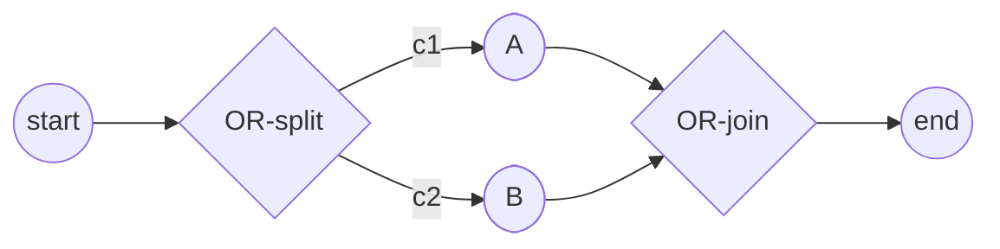

# SRD-022 — Inclusive (OR) join (синхронизирующее слияние)

| Поле | Значение |
|---|---|
| Статус | Принято |
| Версия | v.1 |
| Дата | 2026-06-19 |
| Владелец | Руслан Габитов |
| Реализует | [ADR-005 v.2 Gateways & Joins](../design/ADR-005-gateways-and-joins.ru.md) §2.10 |

Этот SRD приземляет **Inclusive (OR) join**, решённый в
[ADR-005 v.2](../design/ADR-005-gateways-and-joins.ru.md) §2.10: **сходящийся**
`InclusiveGateway` становится **синхронизирующим слиянием**, завершение которого
**нелокально** — он срабатывает, когда ни один живой токен уже не может прийти
по непомеченному входящему потоку, — **переоценивается как при гибели токена,
так и при его приходе**. Это родственник [SRD-021](SRD-021-exclusive-inclusive-split.ru.md)
(разделения) и завершает сходящуюся половину OR-шлюза (epic #93).

OR-join вводит одну способность, которой движку сегодня недостаёт:
**park-and-resume**. Parallel join никогда не приостанавливает track — каждый
приход либо завершается (поглощён → `Merged`), либо, если это завершающий приход,
продолжается *живым*. OR-join может завершиться при **полном отсутствии прихода**
(ветка-сосед не была выбрана или погибла), поэтому незавершающий приход обязан
**припарковаться** (park) и быть **возобновлённым позже** циклом. Достижимость
вычисляется **в цикле, по требованию** (без кэшированного графа) — `Arrive` не
изменяется, а `ParallelGateway` не затрагивается.

Это также делает слияния track'ов **наблюдаемыми**: каждый поглощённый track
записывает ацикличное ребро `MergedInto` к своему выжившему (FR-8), для **обоих**
синхронизирующих join'ов.

Ацикличный single-pass; перевзвод цикла (loop re-arming), Complex-шлюз и
уточняющая two-path-оговорка стандарта остаются отложенными (ADR-005 §4).

## 1. Контекст и мотивация

### 1.1 Текущее состояние (проверено по коду)

- **Inclusive-шлюз только разделяет (split-only).** `InclusiveGateway` реализует
  `exec.NodeExecutor`, но **не** `exec.SynchronizingJoin` (`inclusive.go:136`;
  `TestInclusiveConvergingUnsupported`). *Сходящийся* Inclusive-шлюз попадает в
  pass-through внутри `Exec` (`len(out) <= 1 → return out`): он пересылает каждый
  токен **без синхронизации**.
- **Parallel — это шаблон join'а, и он никогда не делает park-and-resume.**
  `ParallelGateway` — это `SynchronizingJoin` (`pkg/exec/exec.go:24-33` —
  `Arrive(incomingFlowID, arrivingTrackID string) (complete bool, merged []string)`);
  он помечает приходы по каждому входящему потоку (`parallel.go:18-22`, `:68-89`)
  и завершается, когда помечены **все**. В `track.synchronize` (`track.go:455-496`)
  goroutine незавершающего прихода **возвращается** (`TrackAwaitingMerge` → `Merged`
  через `applyMerged`, `instance.go:741-747`); завершающий приход — это **живая**
  goroutine, которая продолжается (выживший). Ничто не приостанавливается, чтобы
  быть разбуженным позже.
- **Цикл никогда не перепроверяет и не перезапускает join.** `instance.go:618-703`
  обрабатывает `evFork`/`evEnded`/`evAwaiting`/`evMerged`; реестры — это
  `inst.tracks` + счётчик `active`. Никакой переоценки при гибели; завершить join
  способен только живой `Arrive`.
- **Ребро слияния не записывается.** `applyMerged` переключает поглощённые track'и
  из переходного `evMerged.mergedIDs`; ничего не сохраняется. `TokenPath.ParentID`
  (`token.go:83`) однозначен — SRD-005 FR-5b отверг свёртку поглощённых id в
  parent выжившего (циклический `ParentID`), так что схождение остаётся неявным.
- **Позиции + граф достижимы.** Активные позиции: `inst.GetTokens()`
  (`instance.go:769-784`, Alive/WaitForEvent) + `currentStep().node` (`track.go:376-381`).
  Граф: `flow.Node.Incoming()`/`Outgoing()` (`node.go:75-76`) и
  `flow.SequenceFlow.Source()`/`Target()` (`sequenceflow.go:285,290`, каждый —
  `flow.Node`), ограничен `snapshot.Nodes` (`snapshot.go:15-24`).

### 1.2 Проблема

OR-split (SRD-021) разветвляет подмножество веток, но ничто их не сливает обратно.
Каноническая OR-диаграмма-«ромб» не моделируется, а сходящийся Inclusive-шлюз
молча пропускает каждый токен насквозь. ADR-005 §2.10 решает консервативное
правило — включая **переоценку, запускаемую гибелью**, которая чинит зависание
Camunda 7 «только-по-приходу» (прерванная ожидаемая ветка иначе застопорит join
навсегда).

## 2. Решение

**Сходящийся** `InclusiveGateway` становится **синхронизирующим join'ом на основе
достижимости** (ADR-005 §2.10):

- **Таблица приходов + владение по §2.4.** Пометка по каждому входящему потоку
  (`arrived map[flowID]trackID`) плюс **упорядоченный журнал приходов** (id track'ов
  в порядке прихода) под per-node `sync.Mutex`. По потокам, не счётчиком, чтобы
  правило пережило перевзвод цикла (отложен).
- **`Arrive` не изменяется — только подсчёт.** `Arrive(incomingFlowID, arrivingTrackID)`
  помечает поток и завершается **тогда и только тогда, когда помечены все входящие
  потоки** (живой пришедший track продолжается как выживший, *last-in*) — в точности
  как Parallel. Иначе track **паркуется** (`AwaitSync`). `ParallelGateway.Arrive`
  не затронут байт-в-байт; **параметра `FlowChecker`** у `Arrive` нет.
- **Достижимость — сервис инстанса, только в цикле и по требованию.**
  `FlowChecker.CheckFlows(node, flows)` (реализованный `Instance`) возвращает
  подмножество непомеченных входящих потоков узла, всё ещё достижимых. Для каждого
  потока-кандидата он идёт **назад** от источника потока к старту по
  `Incoming() → Source()`, с защитой от циклов, и сообщает поток **достижимым** в
  момент, когда находит **живой токен** (`Alive`/`WaitForEvent`) на любом узле этого
  обратного замыкания; **недостижимым** — если замыкание исчерпано и ни одного не
  найдено. Без кэшированного графа — чистый обход. Игнорирует условия
  (консервативно — каждое структурное ребро учитывается).
- **`Recheck` — хук завершения от цикла.** `Recheck(fc)` заново отсеивает
  непомеченные потоки узла через `CheckFlows`; когда не остаётся ни одного — он
  срабатывает. Цикл вызывает его по **двум триггерам**:
  1. **Токен паркуется на join'е** → `Recheck` этого узла (он может уже быть
     недостижим — например, ветка, которая никогда не была выбрана, с нулём гибелей).
  2. **Любой токен гибнет** (end / cancel / merge) → `Recheck` **каждого узла,
     удерживающего `AwaitSync`-track'и** — гибель может освободить последний живой
     токен на обратном пути.
  Так что `AwaitSync` **и есть** реестр перепроверки по гибели; отдельной структуры
  нет.
- **Park-and-resume — настоящий паркинг (block-and-signal).** Незавершающий приход
  **приостанавливает свою goroutine посреди `run()`**: он выставляет `TrackAwaitSync`,
  эмитит `evParked` (чтобы цикл знал, что узел надо перепроверить), и **блокируется**
  на per-track канале возобновления (`select`-я на `ctx.Done()`, чтобы завершение
  чисто его разблокировало). Goroutine остаётся **живой и учтённой активной** — так
  что цикл никогда не завершит инстанс из-под припаркованного track'а, и
  перезапуска нет. Когда `Recheck` завершает join, цикл переключает поглощённые
  track'и в `Merged` и **сигналит канал каждого припаркованного track'а**: goroutine
  выжившего возобновляет `run()` прямо в `Exec` узла (§2.9 split → fork, продолжая
  со своим собственным id); слитые goroutine'ы наблюдают `Merged` и возвращаются.
  Parallel сохраняет своё return-based `AwaitingMerge` (его поглощённые track'и
  никогда не возобновляются).
- **Выживший — выпадает из механизма.** **Приход**, завершающий join, сохраняет
  свой живой/только-что-припаркованный track (*last-in*); **гибель**, завершающая
  его, не имеет прихода, поэтому цикл возобновляет **раньше всех припаркованный**
  track (*first-in*). Учёта кандидатов нет.
- **Состояние track'а `AwaitSync`.** Отличается от `AwaitingMerge` (всегда обречён
  на `Merged`): у `AwaitSync`-track'а две судьбы — `AwaitSync → Alive` (возобновлённый
  выживший) или `AwaitSync → Merged` (поглощён). Он по-прежнему **проецирует живой
  токен** (как `AwaitingMerge`), так что остаётся во множестве, которое читает
  обратный обход — припаркованный токен может возобновиться и достигнуть нижестоящего
  потока. Обход исключает **сам проверяемый join** (его границу), а не припаркованные
  track'и; припаркованный track *на* этом join'е нижестоящ относительно обратного
  пути каждого непомеченного потока, так что всё равно безвреден.
- **Контракт.** `SynchronizingJoin.Arrive` **не изменяется**; новый инстанс-сайд
  `FlowChecker` несёт достижимость; минимальный `ReachabilityJoin` добавляет
  `Recheck(fc)`. Parallel реализует только `SynchronizingJoin` и никогда не
  перепроверяется и не возобновляется.
- **Ребро слияния (FR-8).** Каждый поглощённый track записывает `MergedInto = survivorID`,
  выставляемый в общем `applyMerged` — прямое, ацикличное ребро (`ParentID` выжившего
  не тронут, сохраняя FR-5b), наблюдаемое в `TokenHistory`, как для Parallel, так и
  для Inclusive.
- **Scope.** Ацикличный, single-pass (ADR-005 §4): каждый входящий поток помечается
  один раз; перевзвод цикла, Complex-шлюз и уточняющая оговорка стандарта остаются
  отложенными.

### Разобранный пример — ветка, которая никогда не выбирается (срабатывает с нулём гибелей)



`c1` истинно, `c2` ложно ⟹ OR-split разветвляет **только** A. A достигает OR-join'а,
помечает поток A→J и **паркуется** (`AwaitSync`) — поток B→J всё ещё не помечен.
Цикл делает `Recheck` для J: `CheckFlows` идёт **назад** от источника B→J
(`B → OR-split → start`) и не находит **ни одного живого токена** по пути (A сидит
на join'е, нижестоящ относительно обратного пути B; ветка B никогда токена не
получала) ⟹ B→J **недостижим** ⟹ отсеян ⟹ непомеченных потоков не остаётся ⟹
**срабатывание**, при **полном отсутствии гибели токена**. Цикл сигналит канал
возобновления A; goroutine A (заблокированная на J) продолжается в `Exec` J
(единственный исходящий → pass-through) и далее к end.

Если бы вместо этого и `c1`, и `c2` были истинны, живой track B сидел бы на этом
обратном пути, так что `Recheck` при парковке держал бы A в ожидании; тогда J
срабатывает, когда приходит B (все помечены → выживший last-in) — или, если ветка
B прервана, по перепроверке при **гибели**.

## 3. Функциональные требования

- **FR-1 — сходящийся Inclusive-шлюз синхронизирует.** Сходящийся `InclusiveGateway`
  (≥2 входящих) — это `SynchronizingJoin`/`ReachabilityJoin` с таблицей приходов по
  каждому входящему потоку под своим per-node-мьютексом — не pass-through.
  (`TestInclusiveConvergingUnsupported` → `TestInclusiveIsReachabilityJoin`.)
- **FR-2 — `Arrive`, только подсчёт, без изменений.** `Arrive` помечает поток и
  завершается (живой пришедший track продолжается, *last-in*) **тогда и только
  тогда, когда помечены все входящие потоки**; иначе track паркуется (`AwaitSync`).
  Та же сигнатура, что и сегодня; `ParallelGateway.Arrive` не тронут.
- **FR-3 — обратная достижимость только в цикле + отсев.** `FlowChecker.CheckFlows(node,
  flows)` (инстанс) идёт **назад** от источника каждого непомеченного потока к старту,
  с защитой от циклов, игнорируя условия, возвращая поток достижимым тогда и только
  тогда, когда живой токен сидит на его обратном замыкании; без кэша. Узел отсеивает
  недостижимые потоки из своей таблицы. Узел не реализует обход.
- **FR-4 — триггеры переоценки.** Цикл делает `Recheck` (a) узла, на котором токен
  только что припарковался, и (b) при **любой** гибели токена — каждого узла,
  удерживающего `AwaitSync`-track'и. Перепроверка, опустошающая множество непомеченных,
  заставляет join сработать — покрывая и *ветку, которая никогда не выбрана*
  (срабатывает по перепроверке при парковке, ноль гибелей), и *гибель ожидаемой
  ветки* (срабатывает по перепроверке при гибели — анти-зависание Camunda-7).
- **FR-5 — park-and-resume + выживший.** Незавершающий приход **блокирует** свою
  goroutine в `AwaitSync` (приостановлена посреди `run()`, жива и учтена активной).
  По завершению через `Recheck` цикл **сигналит** канал возобновления выжившего — его
  goroutine продолжается прямо в `Exec` join'а (выживший = *first-in* при гибели,
  *last-in* при перепроверке собственного прихода-парковки) — и переключает остальных
  в `Merged` (их goroutine'ы разблокируются и возвращаются). Без перезапуска.
- **FR-6 — переиспользование split после join'а.** Сработавший join вычисляет свои
  исходящие условия и разветвляет истинное подмножество (default/исключение по §2.9),
  переиспользуя `InclusiveGateway.Exec` (SRD-021) без изменений; единственный исходящий
  проходит насквозь.
- **FR-7 — сквозной OR round-trip.** OR-split → подмножество веток → OR-join → одно
  продолжение проходит через движок, **включая** ветку, которая никогда не была
  выбрана (срабатывает через достижимость с нулём гибелей), **и** ветку, гибнущую
  на полпути (срабатывает через перепроверку при гибели); инстанс завершается ровно
  один раз.
- **FR-8 — явное ребро слияния.** Каждый track, поглощённый на синхронизирующем
  join'е (Parallel или Inclusive), записывает `MergedInto = <id track'а выжившего>`
  (выставляется в общем `applyMerged`), всплывающее в проекции `thresher` `TokenPath`.
  Ацикличное — `ParentID` выжившего не тронут (сохраняет FR-5b).

## 4. Нефункциональные требования

- **NFR-1 — обоснованное стандартом, консервативное.** Single-reachability-per-track
  по §13.4.3 / Table 13.3; ошибается в сторону ожидания; не уточняющая оговорка
  стандарта.
- **NFR-2 — нет регрессии Parallel.** `ParallelGateway` остаётся обычным
  `SynchronizingJoin` с неизменным `Arrive`; он никогда не входит во множество
  перепроверки и никогда не возобновляется.
- **NFR-3 — без гонок.** Таблица приходов защищена per-node-мьютексом (§2.4); вся
  достижимость + срабатывание выполняются **в цикле** (единственном владельце
  позиций), так что обратный обход читает консистентное множество живых токенов без
  конкурентной мутации. `make ci` `-race` зелёный.
- **NFR-4 — покрытие.** Затронутые файлы финишируют ≥80% (цель 100%) diff-покрытия.

## 5. Анализ путей (альтернативы)

- **Block-and-signal-паркинг (выбрано) против перезапуска выжившего.** Перезапуск
  вернувшейся goroutine требует сброса состояния + флага skip-`synchronize` +
  повторного прогона узла, и вынуждает танец `active` 0→1, рискующий преждевременным
  завершением. Блокировка goroutine посреди `run()` — это **настоящий паркинг**: она
  остаётся живой и учтённой активной (так что завершение не может с ней гоняться), и
  по сигналу просто продолжается в `executeNode` — без перезапуска, без флага, без
  сброса. Цена — одна заблокированная goroutine на припаркованный track (ограничено;
  освобождается при срабатывании или `ctx.Done()`).
- **Достижимость только в цикле через `Recheck` (выбрано) против `Arrive(+fc)`
  в goroutine.** Размещение достижимости только в цикле оставляет `Arrive`
  (и Parallel) нетронутыми и снимает любой вопрос о конкурентном чтении позиций —
  цикл единственный владелец позиций. Проверка во время прихода происходит на
  перепроверке события парковки, а не в вызове `Arrive`.
- **Обратный обход по каждому потоку (выбрано) против прямого многоисточникового
  прохода.** Эквивалентно, но привязка к непомеченному потоку позволяет обходу
  **сделать short-circuit** на первом живом токене и никогда не строить полное
  достижимое множество.
- **Пересчёт по требованию, без кэша (выбрано) против поддерживаемой структуры
  достижимости.** Графы малы, а множество перепроверки коротко (только узлы,
  удерживающие `AwaitSync`); поддерживаемая структура — это сложное инкрементное
  состояние без реальной выгоды.
- **`AwaitSync` в роли реестра перепроверки (выбрано).** Состояние и так помечает
  «припаркован на join'е», так что цикл выводит «какие узлы перепроверять при гибели»
  из него — отдельный реестр синхронизировать не нужно.
- **Выживший first/last — несущественно; выпадает.** Завершение по приходу сохраняет
  свой track (last-in); завершение по гибели возобновляет раньше всех припаркованный
  (first-in).

## 6. Модели и API

### 6.1 `pkg/exec` — контракты

```go
// FlowChecker answers reachability for a synchronizing join. Implemented by the
// Instance (which owns the static graph + the live track positions). Called only
// from the instance loop.
type FlowChecker interface {
	// CheckFlows returns the subset of flows still reachable for node — those with a
	// live token somewhere on a backward path from the flow's source to the start.
	CheckFlows(node flow.Node, flows []*flow.SequenceFlow) ([]*flow.SequenceFlow, error)
}

type SynchronizingJoin interface { // UNCHANGED
	NodeExecutor
	Arrive(incomingFlowID, arrivingTrackID string) (complete bool, merged []string)
}

// ReachabilityJoin adds the loop's completion hook. Reachability is injected (fc),
// not implemented by the node.
type ReachabilityJoin interface {
	SynchronizingJoin
	// Recheck re-prunes now-unreachable incoming flows via fc and reports completion
	// without a new arrival (the loop calls it when a token parks at the node and on
	// any token death). On completion it returns the promoted survivor (first-in) +
	// the absorbed track ids.
	Recheck(fc FlowChecker) (complete bool, survivor string, merged []string)
}
```

`ParallelGateway` реализует только `SynchronizingJoin`; его `Arrive` не изменён.

### 6.2 `pkg/model/gateways/inclusive.go`

`InclusiveGateway` получает join-поверхность под `mu sync.Mutex`: `arrived
map[string]string` (пометка по каждому входящему потоку), **упорядоченный журнал
приходов** (`[]string` id track'ов, чтобы `Recheck` возвращал самый ранний) и
`fired bool` — single-fire-guard. `Arrive` помечает + добавляет в журнал и
возвращает `complete=true` (живой пришедший track продолжается, last-in) **тогда
и только тогда, когда помечены все входящие потоки**, иначе `complete=false`
(парковка). `Recheck(fc)` вызывает `fc.CheckFlows` на непомеченных потоках,
отбрасывает недостижимые и — когда не остаётся ни одного — возвращает `complete=true`
с **раньше всех пришедшим** track'ом как выжившим + остальными. Он становится
`ReachabilityJoin`. Split-`Exec` (SRD-021) не изменён и переиспользуется для
исходящего split после срабатывания (FR-6). Выравнивание полей сохранено
(large→small).

### 6.3 `internal/instance` — impl `FlowChecker`, track, цикл

- **`CheckFlows` (`FlowChecker` на `Instance`).** Предвычислить **occupied**-множество
  = узлы, удерживающие живой (`Alive`/`WaitForEvent`) токен, из lock-free-снимка
  (мёртвые/`Consumed`-track'и исключены; **припаркованный** track остаётся как
  возобновляемый). Для каждого потока-кандидата `F` — обратный DFS от `F.Source()`
  по `Incoming() → Source()`, с **узлом join'а как границей** (никогда не обходится),
  с защитой от циклов (visited-set), ограниченный `snapshot.Nodes`; `F` достижим на
  первом посещённом узле ∈ `occupied`. Вернуть достижимое подмножество.
- **`track.synchronize`** — незавершающий приход на OR-join выставляет `TrackAwaitSync`,
  эмитит **`evParked{track, node}`** и **блокируется** на канале возобновления
  track'а (`select`-я на `ctx.Done()`). По возобновлению он инспектирует своё
  состояние: `Merged` → `return false` (goroutine возвращается); иначе (выживший) →
  `return true` (`run` продолжается в `Exec` join'а). Незавершающий приход Parallel
  не изменён (выставляет `AwaitingMerge`, возвращается, `evAwaiting`).
- **Цикл** получает: (a) per-track буферизованный(1) канал возобновления; (b) по
  `evParked` (который, в отличие от `evAwaiting`, **не** декрементирует `active` —
  goroutine жива/заблокирована) — `Recheck` этого узла; (c) по каждому
  `evEnded`/`evMerged` — `Recheck` каждого узла, удерживающего сейчас `AwaitSync`-track'и;
  (d) по завершению через `Recheck` — `applyMerged` поглощённых (выставляет `MergedInto`
  + `Merged`) и **сигнал** каналу каждого припаркованного track'а — выживший
  возобновляется в `Exec` → fork, слитые возвращаются; (e) состояние `AwaitSync` +
  его проецирующий `Alive` `tokenStateFor`. Без `newTrack`-перезапуска — выживший —
  это та же приостановленная goroutine, возобновлённая.

### 6.4 Обогащение происхождения слияния (`internal/instance` + `pkg/thresher`)

`TokenPath` (`token.go:81`) получает `MergedInto string`. `applyMerged`
(`instance.go:741`) выставляет `m.MergedInto = <id выжившего>` по мере переключения
каждого поглощённого track'а в `Merged`. Проекция `thresher.TokenPath`
(`handle.go:175`) её экспонирует. `ParentID` выжившего не изменён. `applyMerged` —
общий sink слияния, так что и Parallel, и Inclusive его заполняют.

## 7. Тестовые сценарии

- **Model-unit** (`inclusive_test.go`, mock `FlowChecker`): `TestORJoinArriveAllMarked`
  (все потоки помечены → `complete`, last-in); `TestORJoinArriveParks` (подмножество
  → парковка); `TestORJoinRecheckPrunesAndFires` (mock отбрасывает непомеченные
  потоки → `Recheck` завершается, выживший = самый ранний); `TestORJoinRecheckStillReachable`
  (mock сохраняет один → не завершён). `TestInclusiveConvergingUnsupported` →
  `TestInclusiveIsReachabilityJoin`.
- **Instance-unit** (`CheckFlows`): `TestCheckFlowsLiveTokenUpstream` (достижим),
  `TestCheckFlowsBranchNeverTaken` (нет токена выше → недостижим, ноль гибелей),
  `TestCheckFlowsTokenDiedUpstream` (недостижим после гибели), `TestCheckFlowsCycleGuard`,
  `TestCheckFlowsExcludesParked`.
- **Engine-level** (`pkg/thresher`): `TestORJoinUntakenBranch` (ветка никогда не
  выбрана — срабатывает по перепроверке при парковке, без гибели); `TestORJoinDeathTriggered`
  (ожидаемая ветка гибнет — срабатывает по перепроверке при гибели: анти-зависание);
  `TestORJoinAllArrive` (каждая ветка приходит — выживший last-in); `TestORJoinFiresOnce`;
  `TestMergedIntoRecorded` (Parallel **и** OR — `MergedInto` каждого поглощённого
  track'а — это выживший; `ParentID` выжившего не изменён — FR-8).
- **Example**: `examples/inclusive-join` — OR-split → подмножество → OR-join → end,
  exit 0.

## 8. Cross-doc и связанное

- Реализует [ADR-005 v.2](../design/ADR-005-gateways-and-joins.ru.md) §2.10. Ссылается
  на [ADR-001 v.5](../design/ADR-001-execution-model.ru.md) (жизненный цикл цикла/track'а),
  [ADR-009 v.1](../design/ADR-009-per-instance-node-graph.ru.md) (статический
  per-instance-граф узлов + состояние, владеемое узлом). Родственник
  [SRD-021 v.1](SRD-021-exclusive-inclusive-split.ru.md) (разделения).
- Завершает сходящуюся (OR-join) половину epic #93. При мерже ADR-005 §2.10
  **обогащается этими концептуальными механиками** (обратная достижимость, два
  триггера переоценки, возобновление-по-гибели — проза, без кода), и его оговорка
  «conception-ahead / pending SRD-022» снимается; оговорка SRD-021 тоже —
  синхронизировано в той же ветке/PR (SRD-021 + SRD-022 едут вместе).

## 9. Definition of Done

- FR-1…FR-8 подключены и задействованы тестами §7 (model-unit + instance-unit +
  engine-level + запускаемый пример).
- `make ci` зелёный: lint, build, `-race`, diff-покрытие ≥95% на изменённых строках
  (затронутые функции ≥80%, цель 100%), govulncheck.
- `examples/inclusive-join` smoke-прогон exit 0; все примеры exit 0.
- ADR-005 §2.10 обогащён механиками + его оговорка «pending SRD-022» снята
  (EN + RU twin); оговорка SRD-021 снята; `ParallelGateway` не изменён.
- Статус → Принято с RU-twin'ом; cross-doc-пины консистентны; sub-issue закрыт
  через PR.

## 10. Сводка по реализации

Приземлено на `feat/routing-gateways` (от `master`): пять майлстоунов + предварительный
fix.

### 10.1 Коммиты

| M | Commit | Scope |
|---|---|---|
| doc | `c294f7d` | черновик SRD-022 |
| M1 | `e2f2fbe` | контракты `exec.FlowChecker`/`ReachabilityJoin` + `Instance.CheckFlows` (обратная достижимость) |
| M2 | `b54edef` | `InclusiveGateway` = `ReachabilityJoin` (count-only `Arrive` + `Recheck` + журнал приходов) |
| M3 | `a1901f4` | ребро слияния `MergedInto` (FR-8) через общий `applyMerged` + проекция thresher |
| M4 | `8b93970` | интеграция в цикл — block-and-signal park/resume, `evParked` + перепроверка при гибели |
| M5 | `6ce573e` | `examples/inclusive-join` + in-package тесты покрытия OR-join |

Предусловие: **FIX-005** (`76ea19b` / `36f3864`) — детерминированные потоки в порядке
объявления (правила first-true / подмножества зависят от него).

### 10.2 Ключевые файлы

- `pkg/exec/exec.go` — `FlowChecker`, `ReachabilityJoin` (`Arrive` не изменён; Parallel не тронут).
- `pkg/model/gateways/inclusive.go` — поверхность OR-join (`Arrive`/`Recheck`, таблица приходов + журнал порядка).
- `internal/instance/reachability.go` — обратный обход `CheckFlows` + `occupiedNodes` (по позиции).
- `internal/instance/track.go` — `TrackAwaitSync`, `parkCh`, блок `synchronize`.
- `internal/instance/instance.go` — `recheckJoin`/`recheckAwaitingJoins`/`fireOrJoin`/`hasInTransitArrival`; цикл `evParked` + перепроверка при гибели.
- `internal/instance/token.go` + `pkg/thresher/handle.go` — `MergedInto`.
- `examples/inclusive-join/` — OR-«ромб».

### 10.3 Верификация

- `make ci` зелёный: lint, build, `-race`, diff-покрытие **97.6%** (≥95), govulncheck.
- Все 12 примеров smoke-прогон exit 0.
- Тесты OR-join проходят под `-race`: untaken-branch срабатывает с **нулём гибелей**;
  death-triggered срабатывает через **перепроверку при гибели** (анти-зависание
  Camunda-7); на уровне thresher (`TestORJoinUntakenBranch`/`DeathTriggered`) и
  in-package (`TestORJoinUntakenInstance`/`DeathInstance`); model-unit
  (`TestORJoinArriveAllMarked`/`ArriveParks`/`RecheckFiresFirstIn`/`RecheckNotComplete`,
  `TestInclusiveIsReachabilityJoin`); достижимость (`TestCheckFlows*`/`TestReachesOccupied`);
  ребро слияния (`TestMergedIntoRecorded`).

### 10.4 Дельты относительно черновика

- **Паркинг развернулся с перезапуска на block-and-signal.** Черновик перезапускал
  выжившего; во время M4 это стало настоящим паркингом — goroutine блокируется на
  канале возобновления посреди `run()` и естественно продолжается по сигналу. §2/§6
  были переписаны.
- **Две гонки достижимости исправлены в M4:** `occupiedNodes` читает фактические
  позиции track'ов (только что разветвлённый сосед ещё не имеет записанной истории),
  а новый guard `hasInTransitArrival` откладывает срабатывание, пока токен в
  процессе прихода на join — оба были настоящими зависаниями преждевременного
  срабатывания, пойманными под тестом.
- **Cancel-while-parked** (`synchronize` `ctx.Done`) — путь без утечки, покрытый
  структурно через `select`; выделенный тест — небольшой follow-up.
- Некоторые имена тестов §7 дрейфовали во время приземления (например,
  `…RecheckPrunesAndFires` → `…RecheckFiresFirstIn`); §10.3 перечисляет фактические
  имена.

## Открытые вопросы

Нет.
