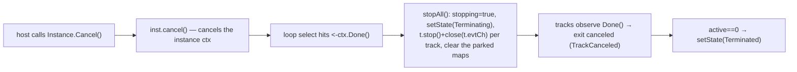

# SRD-030 — Terminate End Event

| Field | Value |
|---|---|
| Status | Draft |
| Version | v.1 |
| Date | 2026-06-28 |
| Owner | Ruslan Gabitov |
| Implements | [ADR-006 v.2 §2.2 Events & Subscriptions](../design/ADR-006-events-and-subscriptions.md) |

This SRD lands the **Terminate End Event** — the last remaining 0.1.0 MVP element
([SAD-001 v.1 §15.3](../design/SAD-001-vision-and-architecture.md)). The conception is
already decided in [ADR-006 v.2 §2.2](../design/ADR-006-events-and-subscriptions.md)
("Cancellation-trigger nodes: Terminate End Event & boundary interruption"); SRD-029 landed
the boundary half of that section, this SRD lands the Terminate half, on the
[ADR-017 v.1](../design/ADR-017-channel-based-event-processing.md) single-writer event loop.

---

## 1. Background & current state (verified against the code)

### 1.1 The model is complete; the runtime ignores it

The model layer already carries Terminate:

- `events.TerminateEventDefinition` — `pkg/model/events/terminate.go:9`; `Type()` returns
  `flow.TriggerTerminate` (`terminate.go:14`).
- `events.WithTerminateTrigger(*TerminateEventDefinition)` — `pkg/model/events/end_options.go:108`;
  validates non-nil and appends to `endConfig.defs`.
- `flow.TriggerTerminate` is a member of the `endTriggers` set (`end.go:19`), so an EndEvent may
  legally carry it.

But the **runtime does nothing with it**. `EndEvent.Exec` (`pkg/model/events/end.go:128`) iterates
`ee.definitions`: it special-cases `*ErrorEventDefinition` (captures `errorCode`, faults), and for
**every other definition — including `*TerminateEventDefinition` — calls `emitDefinition`**
(`end.go:149`), which propagates it through the EventProducer (`event.go:584`). A Terminate
definition is thus **emitted to a bus where nothing catches it**, and `Exec` returns
`[]*flow.SequenceFlow{}, nil` — a *normal* end. The track ends `evEnded`, `active` decrements, and
when the last track ends the instance settles **`Completed`** (`instance.go:804`) — not `Terminated`.

### 1.2 The termination cascade already exists and is proven

The engine already terminates an instance on external abort, and that path is exactly the BPMN
realization ADR-006 §2.2 prescribes:



- `Instance.Cancel()` (`instance.go:630`) → `inst.cancel()`.
- `stopAll` is a loop-local closure (`instance.go:742`): sets `stopping=true`, `setState(Terminating)`,
  stops & wakes every track, clears `waiting`/`msgIdx`/`position`/`parked`.
- The terminal-state decision (`instance.go:801`): `if stopping { Terminated } else { Completed }`.
- A cancelled track resolves to `TrackCanceled` (not `TrackFailed`) at the SRD-029 §3.7 checkpoint
  (`track.go:575` `discardOrFail`: `ctx.Err() != nil` → discard).

### 1.3 The one true gap — a node cannot reach the cascade

A node's `Exec(ctx, re renv.RuntimeEnvironment)` (`end.go:128`) gets only the runtime environment, and
`renv.RuntimeEnvironment` (`pkg/renv/runtimeenvironment.go:21`) exposes `InstanceID()`,
`EventProducer()`, `RenderRegistrator()`, `Put()` — **no instance-control method**. So the Terminate
node has no way to ask its instance to cancel itself. That seam is the whole of this SRD.

## 2. Requirements

### Functional

| ID | Requirement |
|---|---|
| **FR-1** | Reaching a **Terminate End Event** abnormally terminates its process instance: every live track is cancelled, remaining tokens are discarded, and the instance settles in state **`Terminated`** (BPMN §13.5.6; ADR-006 v.2 §2.2). |
| **FR-2** | Terminate is realized by the **instance cancelling its own context** — the exact cascade external abort uses (`inst.cancel()` → `ctx.Done()` → `stopAll` → `Terminated`). The Terminate node triggers it through a new `renv.RuntimeEnvironment.Terminate()` method (§3.1). No new termination primitive is introduced. |
| **FR-3** | When a Terminate trigger is present, `EndEvent.Exec` performs **no other end-event behaviour**: the Terminate definition is **not** emitted through the EventProducer, and co-located non-error definitions are **not** emitted either (ADR-006 v.2 §2.2: "other end-event behaviours are *not* performed"). |
| **FR-4** | The instance terminal-state decision settles `Terminated` whenever the instance context is cancelled — `if stopping \|\| ctx.Err() != nil`. This makes the terminal state deterministic regardless of the `select` race between `ctx.Done()` and the Terminate track's `evEnded` (§4.2). |
| **FR-5** | Terminate is **not a fault**: no `lastErr` is recorded and the instance is not driven through the error/boundary path. It is distinct from the Error End Event, which faults via `BpmnError` (SRD-029 FR-10). A clean Terminate carries no error; a faulted instance keeps its existing `Terminated`+`lastErr` shape. |
| **FR-6** | `renv.RuntimeEnvironment.Terminate()` is **idempotent and safe** to call concurrently with the loop (it forwards to `inst.cancel()`, a `context.CancelFunc`; `stopAll` is already idempotent via its `stopping` guard). |
| **FR-7** | **No compensation** is run on Terminate (BPMN-conformant default; ADR-006 v.2 §2.2). Optional compensation-on-terminate is an explicit **deferred extension** (§4.5), not built here. |

### Non-functional

| ID | Requirement |
|---|---|
| **NFR-1** | `-race` clean — the self-cancel cascade and the terminal-state guard verified under `-race`, including the last-track race (FR-4). |
| **NFR-2** | **No behaviour change** for any instance without a Terminate End Event — the `Completed` path is untouched. |
| **NFR-3** | Reuses the existing abort cascade and `stopAll`; the new surface is one `renv` method + a one-line terminal-state guard + the `Exec` branch. Minimal footprint. |
| **NFR-4** | Diff-coverage ≥95 % (aim 100 %) on touched files. |

## 3. Models

### 3.1 `renv.RuntimeEnvironment.Terminate()` — the node→instance seam (`pkg/renv/runtimeenvironment.go`, `internal/instance/`)

The interface gains one method:

```go
// RuntimeEnvironment ... (existing doc)
type RuntimeEnvironment interface {
	EngineRuntime
	service.DataReader
	data.Source

	InstanceID() string
	EventProducer() eventproc.EventProducer
	RenderRegistrator() interactor.Registrator

	Put(dd ...data.Data) error

	// Terminate abnormally ends the whole process instance (a Terminate End Event,
	// BPMN §13.5.6): it cancels the instance context, so every track observes
	// Done() and exits canceled and the instance settles Terminated. Idempotent.
	Terminate()
}
```

Implemented on `Instance` (which `execEnv` embeds — `execenv.go:14` `type execEnv struct { *Instance; … }` —
so the interface is satisfied for free):

```go
// Terminate cancels the instance context on behalf of a Terminate End Event,
// reusing the external-abort cascade (loop ctx.Done() → stopAll → Terminated).
func (inst *Instance) Terminate() {
	inst.Cancel() // → inst.cancel(); the loop arbitrates the rest (single writer)
}
```

`Terminate()` is a named, intent-revealing seam distinct from the host-facing `Instance.Cancel()`
(`instance.go:630`) even though both funnel to `inst.cancel()` — node-requested self-termination vs
host-requested abort. The `var _ renv.RuntimeEnvironment = (*execEnv)(nil)` check (`execenv.go:62`)
keeps the wiring honest.

### 3.2 `EndEvent.Exec` — Terminate handling (`pkg/model/events/end.go`)

A Terminate trigger is detected **before** the emit loop and short-circuits it:

```go
func (ee *EndEvent) Exec(ctx context.Context, re renv.RuntimeEnvironment) ([]*flow.SequenceFlow, error) {
	// A Terminate End Event abnormally terminates the instance and performs NO other
	// end-event behaviour (ADR-006 v.2 §2.2, BPMN §13.5.6): no definition is emitted,
	// no error is raised. It precedes the Error path — Terminate wins over a co-located
	// Error trigger.
	for _, ed := range ee.definitions {
		if _, ok := ed.(*TerminateEventDefinition); ok {
			re.Terminate()
			return []*flow.SequenceFlow{}, nil
		}
	}

	// ... existing Error capture + non-error emit + BpmnError fault (unchanged) ...
}
```

The Terminate track returns success (`nil` error) → ends `evEnded` (clean, having done its job); the
cascade triggered by `re.Terminate()` cancels the siblings.

### 3.3 Terminal-state guard (`internal/instance/instance.go` loop)

```go
// settle Terminated whenever the ctx was cancelled (host abort OR a Terminate End
// Event self-cancel), independent of the ctx.Done()-vs-evEnded select ordering.
if stopping || ctx.Err() != nil {
	inst.setState(Terminated)
} else {
	inst.setState(Completed)
}
```

## 4. Analysis

### 4.1 Mechanism — self-cancel via `renv` (decided)

Three seams were surveyed:

- **Self-cancel via a `renv` method (chosen).** The node calls `re.Terminate()` → `inst.cancel()` →
  the loop's existing `ctx.Done()` → `stopAll` cascade. This is the **literal ADR-006 v.2 §2.2
  realization** ("the instance cancels its own context → every track observes `Done()` → each exits as
  canceled → the instance reaches `Terminated`"), reuses the **already-tested external-abort path**
  verbatim, and adds the smallest surface (one interface method, satisfied for free by `execEnv`'s
  embedding). Cost: the `select` race (§4.2), closed by FR-4's one-line guard.
- **A `terminate` sentinel error returned from `Exec`** (parallel to `BpmnError`) — *rejected*: it
  routes Terminate through the **failure** path (`discardOrFail`/`applyFailed`/`evFailed`), conflating
  an abnormal-but-clean termination with a fault, and needs the loop to special-case the sentinel to
  avoid `failFromTrack`. Terminate is not a failure; abusing the fault path is a semantic smell.
- **A new `evTerminate` trackEvent** mirroring SRD-029's `evBoundary` — *rejected*: deterministic via
  channel FIFO, but it adds a new `trackEventKind` + an `applyEvent` case, couples the generic track to
  a specific event trigger, and **does not reuse the proven abort cascade** — more moving parts for
  identical observable semantics.

All three end at the same `stopAll`; the chosen one gets there by the route the conception already
fixed and the engine already exercises.

### 4.2 The terminal-state race and its guard (decided)

`re.Terminate()` cancels the ctx from the **track goroutine**; the loop then has both `<-ctx.Done()`
(persistently ready) and the Terminate track's `evEnded` ready in its `select`. If Terminate is the
**last active track**, a `select` that picks `evEnded` first drops `active` to 0 and exits the loop
**before** `stopAll` runs — settling `Completed` (wrong). FR-4's guard (`|| ctx.Err() != nil`) makes the
terminal state depend on the *fact* of cancellation, not on `select` ordering: a cancelled ctx can never
report `Completed`. This is also a latent-correctness improvement for the host-abort path (same
guarantee, deterministically). Verified by a repeated/`-race` last-track test (T-3).

### 4.3 Emit suppression (decided)

ADR-006 v.2 §2.2: "other end-event behaviours are *not* performed." So a Terminate trigger suppresses
**all** emits, including co-located non-error definitions — the `for`-scan returns the moment it finds a
`*TerminateEventDefinition`, before any `emitDefinition`. This also fixes the current pointless
propagation of the Terminate definition to a bus with no catcher (§1.1).

### 4.4 Terminate precedes Error (decided)

If an EndEvent carries both Terminate and Error triggers (legal in the model), **Terminate wins** — the
instance terminates abnormally; it does not fault. This follows from §4.3 ("no other behaviour") and the
scan ordering (Terminate checked before the Error capture). A clean `Terminated`, no `BpmnError`.

### 4.5 Compensation — deferred extension point (out of scope)

0.1.0 runs **no compensation** on Terminate (the conformant default). A future **opt-in** mode — run
compensation for completed activities in scope, *then* terminate — is a deliberate extension, gated on
the compensation machinery (epic #90) and Transaction/Event Sub-Process structures (epic #91) existing
first. It is **not built here**; the default (no compensation) is preserved, and the opt-in, when it
lands, will follow the "parametrize the relaxation, default to the standard" rule. Noted so the seam is
known, not to scope work into 0.1.0.

## 5. Public API surface

- **`renv.RuntimeEnvironment`** gains `Terminate()`. New method on a public interface — every
  implementation must provide it; the only production implementation is `*execEnv` (via `*Instance`),
  satisfied by the new `Instance.Terminate()`. Mock regeneration (`make gen_mock_files`) picks it up.
- **No change** to `NewEndEvent` / `WithTerminateTrigger` / `NewTerminateEventDefinition` — already
  public and sufficient.

## 6. Test scenarios

| ID | Scenario | Asserts |
|---|---|---|
| **T-1** | A single-track process `start → … → Terminate-End` | instance settles **`Terminated`**, not `Completed`. |
| **T-2** | A parallel split where one branch reaches a Terminate-End while a sibling is still running/waiting | the sibling is **cancelled** (does not run its downstream node); instance `Terminated`. |
| **T-3** | Terminate as the **last active track**, run repeatedly / under `-race` | deterministically `Terminated` (FR-4 guard; the §4.2 race). |
| **T-4** | A process with a plain (None) End Event, no Terminate | **`Completed`** — no regression (NFR-2). |
| **T-5** | A Terminate-End carrying a co-located Message/Signal definition | the definition is **not** emitted through the EventProducer (FR-3 / §4.3). |
| **T-6** | Terminate-End vs Error-End | Terminate → `Terminated`, **no `lastErr`**; Error → faults (distinct paths, FR-5). |
| **T-7** | `Instance.Terminate()` called twice / concurrently with the loop | idempotent, no panic, no send-on-closed (FR-6). |
| **T-8** | Runnable example `examples/terminate-end-event/` | builds **and runs** (exit 0); shows one branch terminating the instance. |

## 7. Milestones

| # | Milestone | FRs | Notes |
|---|---|---|---|
| **M1** | `renv.RuntimeEnvironment.Terminate()` + `Instance.Terminate()` seam; regenerate mocks | FR-2,6 | Pure seam; the cascade is reused. Tests T-7. |
| **M2** | `EndEvent.Exec` Terminate branch (call + emit-suppression) + loop terminal-state guard | FR-1,3,4,5 | The behaviour. Tests T-1..T-6. |
| **M3** | Runnable example + `-race` sweep | all | `examples/terminate-end-event/`. T-8. |

Each milestone is one commit, tests included; coverage gate per milestone (NFR-4).

## 8. Cross-doc

| Ref | Pin | Direction |
|---|---|---|
| ADR-006 Events & Subscriptions §2.2 (Terminate End Event — decided realization) | v.2 | SRD → ADR (Implements) ✓ |
| ADR-001 Execution Model §4.6 (cancellation cascade) | v.6 | SRD → ADR ✓ |
| ADR-017 Channel-based event processing (single-writer loop, `stopAll`) | v.1 | SRD → ADR ✓ |
| SAD-001 §15.3 (0.1.0 scope — last MVP element) | v.1 | SRD → SAD ✓ |
| SRD-029 (boundary cancellation, `discardOrFail`/`TrackCanceled`, §3.7 checkpoint) | — | SRD → SRD (number only) ✓ |

Direction is up/sideways only. The terminal-state and cascade this SRD touches are grounded in code
(`instance.go` `stopAll`/terminal-state, `track.go` `discardOrFail`), not by a downward reference.

## 9. Definition of Done

- [ ] FR-1..FR-7 implemented and wired (seam + Exec branch + terminal-state guard).
- [ ] NFR-1 (`-race` clean incl. last-track race), NFR-2 (no change without Terminate), NFR-3 (minimal surface), NFR-4 (diff-coverage ≥95 %).
- [ ] T-1..T-8 green; `examples/terminate-end-event/` builds **and runs** (exit 0); its binary gitignored.
- [ ] `make ci` green (tidy, lint, build, `-race`, cover-check, govulncheck); mocks regenerated.
- [ ] §8 cross-doc pins verified directional + present.
- [ ] §10 filled (files/lines, V-results, milestone SHAs); status flipped Draft → Accepted at landing.

## 10. Implementation summary

_Filled at landing (files/lines, verification results, milestone commit SHAs)._

## Open questions

None.
