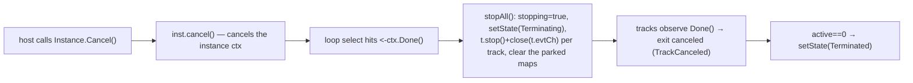

# SRD-030 — Terminate End Event

| Field | Value |
|---|---|
| Status | Accepted |
| Version | v.1 |
| Date | 2026-06-28 |
| Owner | Ruslan Gabitov |
| Implements | [ADR-006 v.2 §2.2 Events & Subscriptions](../design/ADR-006-events-and-subscriptions.md) |

This SRD lands the **Terminate End Event** — the last remaining 0.1.0 MVP element
([SAD-001 v.1 §15.3](../design/SAD-001-vision-and-architecture.md)). The conception is
already decided in [ADR-006 v.2 §2.2](../design/ADR-006-events-and-subscriptions.md)
("Cancellation-trigger nodes: Terminate End Event & boundary interruption"); SRD-029 landed
the boundary half of that section, this SRD lands the Terminate half, on the
[ADR-017 v.1](../design/ADR-017-channel-based-event-processing.md) single-writer event loop.

---

## 1. Background & current state (verified against the code)

### 1.1 The model is complete; the runtime ignores it

The model layer already carries Terminate:

- `events.TerminateEventDefinition` — `pkg/model/events/terminate.go:9`; `Type()` returns
  `flow.TriggerTerminate` (`terminate.go:14`).
- `events.WithTerminateTrigger(*TerminateEventDefinition)` — `pkg/model/events/end_options.go:108`;
  validates non-nil and appends to `endConfig.defs`.
- `flow.TriggerTerminate` is a member of the `endTriggers` set (`end.go:19`), so an EndEvent may
  legally carry it.

But the **runtime does nothing with it**. `EndEvent.Exec` (`pkg/model/events/end.go:128`) iterates
`ee.definitions`: it special-cases `*ErrorEventDefinition` (captures `errorCode`, faults), and for
**every other definition — including `*TerminateEventDefinition` — calls `emitDefinition`**
(`end.go:149`), which propagates it through the EventProducer (`event.go:584`). A Terminate
definition is thus **emitted to a bus where nothing catches it**, and `Exec` returns
`[]*flow.SequenceFlow{}, nil` — a *normal* end. The track ends `evEnded`, `active` decrements, and
when the last track ends the instance settles **`Completed`** (`instance.go:804`) — not `Terminated`.

### 1.2 The termination cascade already exists and is proven

The engine already terminates an instance on external abort, and that path is exactly the BPMN
realization ADR-006 §2.2 prescribes:



- `Instance.Cancel()` (`instance.go:630`) → `inst.cancel()`.
- `stopAll` is a loop-local closure (`instance.go:750`): sets `stopping=true`, `setState(Terminating)`,
  stops (`t.stop()`) & wakes (`close(t.evtCh)`) every track, clears `waiting`/`msgIdx`/`position`/`parked`.
  It does **not** cancel track contexts — in the abort path a *running* ctx-honouring activity is
  interrupted by `inst.cancel()` cascading to the per-track `tctx` (`instance.go:761` "stopIt covers the
  running path" means the *between-node* check, not a blocked `Exec`). §3.3 adds `t.cancel()` to `stopAll`
  so the `evTerminate` path interrupts a running activity without relying on instance-ctx cancellation.
- The terminal-state decision (`instance.go:801`): `if stopping { Terminated } else { Completed }`.
- A cancelled track resolves to `TrackCanceled` (not `TrackFailed`) at the SRD-029 §3.7 checkpoint
  (`track.go:575` `discardOrFail`: `ctx.Err() != nil` → discard).

### 1.3 The one true gap — a node cannot reach the cascade

A node's `Exec(ctx, re renv.RuntimeEnvironment)` (`end.go:128`) gets only the runtime environment, and
`renv.RuntimeEnvironment` (`pkg/renv/runtimeenvironment.go:21`) exposes `InstanceID()`,
`EventProducer()`, `RenderRegistrator()`, `Put()` — **no instance-control method**. So the Terminate
node has no way to ask its instance to cancel itself. That seam is the whole of this SRD.

## 2. Requirements

### Functional

| ID | Requirement |
|---|---|
| **FR-1** | Reaching a **Terminate End Event** abnormally terminates its process instance: every live track is cancelled, remaining tokens are discarded, and the instance settles in state **`Terminated`** (BPMN §13.5.6; ADR-006 v.2 §2.2). |
| **FR-2** | Terminate is realized on the loop's **native single-writer lane**: `renv.RuntimeEnvironment.Terminate()` (§3.1) emits an **`evTerminate`** trackEvent via `inst.emit` — the same channel every other signal uses — and the loop's `applyEvent` handles `case evTerminate` by calling its own `stopAll` (§3.3). No instance-context self-cancel reached from the node; no new termination primitive. |
| **FR-3** | When a Terminate trigger is present, `EndEvent.Exec` performs **no other end-event behaviour**: the Terminate definition is **not** emitted through the EventProducer, and co-located non-error definitions are **not** emitted either (ADR-006 v.2 §2.2: "other end-event behaviours are *not* performed"). |
| **FR-4** | The terminal state is **deterministic by construction**: the Terminate track emits `evTerminate` during `Exec`, then its terminal `evEnded` after — same goroutine, same channel, so **FIFO** guarantees the loop processes `evTerminate` (setting `stopping`) **before** that track's `evEnded`. The existing `if stopping → Terminated` decision is therefore correct with **no `select` race and no extra guard** (§4.2). |
| **FR-5** | Terminate is **not a fault**: no `lastErr` is recorded and the instance is not driven through the error/boundary path. It is distinct from the Error End Event, which faults via `BpmnError` (SRD-029 FR-10). A clean Terminate carries no error; a faulted instance keeps its existing `Terminated`+`lastErr` shape. |
| **FR-6** | Terminate is **idempotent**: repeated `evTerminate` events (multiple Terminate End Events firing, or one per concurrent branch) each reach `stopAll`, a no-op after the first via its `stopping` guard. `evTerminate` is emitted only during an active run — a Terminate End Event is reached *by* the loop, so the loop is always present to receive it. |
| **FR-7** | **No compensation** is run on Terminate (BPMN-conformant default; ADR-006 v.2 §2.2). Optional compensation-on-terminate is an explicit **deferred extension** (§4.5), not built here. |

### Non-functional

| ID | Requirement |
|---|---|
| **NFR-1** | `-race` clean — the `evTerminate` teardown, including per-track cancellation of a running ctx-honouring activity, verified under `-race`; plus the last-track FIFO ordering (FR-4). |
| **NFR-2** | **No behaviour change** for any instance without a Terminate End Event — the `Completed` path is untouched. |
| **NFR-3** | Reuses `stopAll` and the per-track `cancel` from SRD-029; the new surface is one `renv` method + one `evTerminate` trackEventKind + one `applyEvent` case + a per-track `t.cancel()` inside `stopAll` + the `Exec` branch. No terminal-state guard. Minimal footprint. |
| **NFR-4** | Diff-coverage ≥95 % (aim 100 %) on touched files. |

## 3. Models

### 3.1 `renv.RuntimeEnvironment.Terminate()` — the node→instance seam (`pkg/renv/runtimeenvironment.go`, `internal/instance/`)

The interface gains one method:

```go
// RuntimeEnvironment ... (existing doc)
type RuntimeEnvironment interface {
	EngineRuntime
	service.DataReader
	data.Source

	InstanceID() string
	EventProducer() eventproc.EventProducer
	RenderRegistrator() interactor.Registrator

	Put(dd ...data.Data) error

	// Terminate abnormally ends the whole process instance (a Terminate End Event,
	// BPMN §13.5.6): it cancels the instance context, so every track observes
	// Done() and exits canceled and the instance settles Terminated. Idempotent.
	Terminate()
}
```

Implemented on `Instance` (which `execEnv` embeds — `execenv.go:14` `type execEnv struct { *Instance; … }` —
so the interface is satisfied for free):

```go
// Terminate abnormally ends the instance on behalf of a Terminate End Event
// (renv.RuntimeEnvironment): it emits an evTerminate trackEvent onto the loop's
// own channel — the single-writer lane every signal uses — and the loop tears
// the instance down (stopAll). Reached only during an active run.
func (inst *Instance) Terminate() {
	inst.emit(trackEvent{kind: evTerminate})
}
```

`Terminate()` travels the **same `inst.emit` lane** as every other loop signal (`evDeliver`,
`evMoved`, `evBoundary`, …) — the node never reaches across to cancel the instance context; the
**loop** owns the teardown. The `var _ renv.RuntimeEnvironment = (*execEnv)(nil)` check (`execenv.go:62`)
keeps the wiring honest.

### 3.2 `EndEvent.Exec` — Terminate handling (`pkg/model/events/end.go`)

A Terminate trigger is detected **before** the emit loop and short-circuits it:

```go
func (ee *EndEvent) Exec(ctx context.Context, re renv.RuntimeEnvironment) ([]*flow.SequenceFlow, error) {
	// A Terminate End Event abnormally terminates the instance and performs NO other
	// end-event behaviour (ADR-006 v.2 §2.2, BPMN §13.5.6): no definition is emitted,
	// no error is raised. It precedes the Error path — Terminate wins over a co-located
	// Error trigger.
	for _, ed := range ee.definitions {
		if _, ok := ed.(*TerminateEventDefinition); ok {
			re.Terminate()
			return []*flow.SequenceFlow{}, nil
		}
	}

	// ... existing Error capture + non-error emit + BpmnError fault (unchanged) ...
}
```

The Terminate track returns success (`nil` error) → ends `evEnded` (clean, having done its job); the
cascade triggered by `re.Terminate()` cancels the siblings.

### 3.3 The `evTerminate` loop handler + `stopAll` per-track cancel (`internal/instance/`)

A new `trackEventKind` `evTerminate` (`event.go`); the loop's `applyEvent` gains:

```go
case evTerminate:
	// A Terminate End Event was reached: abnormally terminate the instance. stopAll
	// sets stopping, tears down parked/between-node tracks, and cancels each track's
	// context to interrupt a running activity. It does NOT touch active — the
	// terminate track's own evEnded accounts for it.
	stopAll()
```

`stopAll` (`instance.go:750`) gains a per-track `t.cancel()` in its existing track loop, so a
**running** ctx-honouring `ServiceTask` is interrupted (the cooperative-cancellation contract,
SRD-029): `stopIt` + the closed `evtCh` cover the between-node and parked paths (`instance.go:761`),
`t.cancel()` covers the running one. This also makes `stopAll` self-sufficient on the abort/fault
paths (idempotent there — the ctx is already cancelled via `inst.cancel()`). The terminal-state
decision (`instance.go:801` `if stopping → Terminated`) is **unchanged** — no guard is needed (§4.2).

## 4. Analysis

### 4.1 Mechanism — `evTerminate` on the loop's native lane (decided)

- **`evTerminate` trackEvent (chosen).** `renv.Terminate()` emits an `evTerminate` to the loop via
  `inst.emit` — the **same single-writer channel** every other signal uses — and the loop calls its own
  `stopAll`. Deterministic by channel FIFO (§4.2), single-writer-consistent (mirrors SRD-029's
  `evBoundary`), and the **loop** — which owns `stopAll` — performs the teardown in-goroutine.
- **Self-cancel via the instance context** (`re.Terminate()` → `inst.cancel()`, reusing the abort
  path) — *rejected*. It matches ADR-006 §2.2's literal phrasing ("the instance cancels its own
  context") and reuses the tested abort cascade, but the **signal travels an indirect lane**: the node
  cancels the ctx and the loop only *reacts* via `<-ctx.Done()`, which **races** the Terminate track's
  `evEnded` in the `select` (last-track case → spurious `Completed`) and forces a `ctx.Err()`
  terminal-state guard — a patch over a mechanism that fights the loop's native channel. ADR-006 §2.2's
  "cancels its own context" is a realization *sketch*; this SRD reconciles it with the code — the
  observable semantics are identical (tracks cancelled, tokens discarded, `Terminated`, no compensation).
- **A `terminate` sentinel error returned from `Exec`** (parallel to `BpmnError`) — *rejected*: routes
  Terminate through the **failure** path (`discardOrFail`/`evFailed`), conflating an abnormal-but-clean
  termination with a fault.

Running-track interruption still requires context cancellation (a live goroutine cannot be stopped any
other way — SRD-029's cooperative contract), but it is now **loop-owned** inside `stopAll` (§3.3), not
reached from the node.

### 4.2 Determinism by FIFO (no race)

`evTerminate` and the Terminate track's own `evEnded` are emitted from the **same goroutine** (the
track) onto the **same channel** (`inst.events`), so the loop processes them **in order**: `evTerminate`
first → `stopAll` sets `stopping` → then `evEnded` drops `active`. So even when Terminate is the **last
active track**, the terminal state is `Terminated` with **no `select` race and no guard** — the property
the rejected self-cancel design had to patch with `ctx.Err()`. Verified by a repeated `-race` last-track
test (T-3).

### 4.3 Emit suppression (decided)

ADR-006 v.2 §2.2: "other end-event behaviours are *not* performed." So a Terminate trigger suppresses
**all** emits, including co-located non-error definitions — the `for`-scan returns the moment it finds a
`*TerminateEventDefinition`, before any `emitDefinition`. This also fixes the current pointless
propagation of the Terminate definition to a bus with no catcher (§1.1).

### 4.4 Terminate precedes Error (decided)

If an EndEvent carries both Terminate and Error triggers (legal in the model), **Terminate wins** — the
instance terminates abnormally; it does not fault. This follows from §4.3 ("no other behaviour") and the
scan ordering (Terminate checked before the Error capture). A clean `Terminated`, no `BpmnError`.

### 4.5 Compensation — deferred extension point (out of scope)

0.1.0 runs **no compensation** on Terminate (the conformant default). A future **opt-in** mode — run
compensation for completed activities in scope, *then* terminate — is a deliberate extension, gated on
the compensation machinery (epic #90) and Transaction/Event Sub-Process structures (epic #91) existing
first. It is **not built here**; the default (no compensation) is preserved, and the opt-in, when it
lands, will follow the "parametrize the relaxation, default to the standard" rule. Noted so the seam is
known, not to scope work into 0.1.0.

## 5. Public API surface

- **`renv.RuntimeEnvironment`** gains `Terminate()`. New method on a public interface — every
  implementation must provide it; the only production implementation is `*execEnv` (via `*Instance`),
  satisfied by `Instance.Terminate()`. Mock regeneration (`make gen_mock_files`) picks it up.
- **`internal/instance`** gains the `evTerminate` trackEventKind, its `applyEvent` case, and a per-track
  `t.cancel()` inside `stopAll` — all unexported, no public-surface change.
- **No change** to `NewEndEvent` / `WithTerminateTrigger` / `NewTerminateEventDefinition` — already
  public and sufficient.

## 6. Test scenarios

| ID | Scenario | Asserts |
|---|---|---|
| **T-1** | A single-track process `start → … → Terminate-End` | instance settles **`Terminated`**, not `Completed`. |
| **T-2** | A parallel split where one branch reaches a Terminate-End while a sibling is still running/waiting | the sibling is **cancelled** (does not run its downstream node); instance `Terminated`. |
| **T-3** | Terminate as the **last active track**, run repeatedly under `-race` | deterministically `Terminated` (FIFO ordering §4.2 — `evTerminate` precedes the track's `evEnded`). |
| **T-4** | A process with a plain (None) End Event, no Terminate | **`Completed`** — no regression (NFR-2). |
| **T-5** | A Terminate-End carrying a co-located Message/Signal definition | the definition is **not** emitted through the EventProducer (FR-3 / §4.3). |
| **T-6** | Terminate-End vs Error-End | Terminate → `Terminated`, **no `lastErr`**; Error → faults (distinct paths, FR-5). |
| **T-7** | A process with **two** Terminate End Events on concurrent branches (both fire) | idempotent — `Terminated`, no panic, no send-on-closed (`stopAll` `stopping` guard, FR-6). |
| **T-8** | Runnable example `examples/terminate-end-event/` | builds **and runs** (exit 0); shows one branch terminating the instance. |

## 7. Milestones

| # | Milestone | FRs | Notes |
|---|---|---|---|
| **M1** | `renv.RuntimeEnvironment.Terminate()` interface seam; regenerate mocks (**landed** — commit `a8ae43c`; its `Instance.Terminate()` body is finalized in M2) | FR-2 | Pure seam. |
| **M2** | `evTerminate` trackEventKind + loop `applyEvent` case + `stopAll` per-track `t.cancel()`; finalize `Instance.Terminate()` to emit `evTerminate`; `EndEvent.Exec` Terminate branch (call + emit-suppression) | FR-1,3,4,5,6 | The behaviour. Tests T-1..T-7. |
| **M3** | Runnable example + `-race` sweep | all | `examples/terminate-end-event/`. T-8. |

Each milestone is one commit, tests included; coverage gate per milestone (NFR-4).

## 8. Cross-doc

| Ref | Pin | Direction |
|---|---|---|
| ADR-006 Events & Subscriptions §2.2 (Terminate End Event — decided realization) | v.2 | SRD → ADR (Implements) ✓ |
| ADR-001 Execution Model §4.6 (cancellation cascade) | v.6 | SRD → ADR ✓ |
| ADR-017 Channel-based event processing (single-writer loop, `stopAll`) | v.1 | SRD → ADR ✓ |
| SAD-001 §15.3 (0.1.0 scope — last MVP element) | v.1 | SRD → SAD ✓ |
| SRD-029 (boundary cancellation, `discardOrFail`/`TrackCanceled`, §3.7 checkpoint) | — | SRD → SRD (number only) ✓ |

Direction is up/sideways only. The terminal-state and cascade this SRD touches are grounded in code
(`instance.go` `stopAll`/terminal-state, `track.go` `discardOrFail`), not by a downward reference.

## 9. Definition of Done

- [x] FR-1..FR-7 implemented and wired (renv seam + `evTerminate` kind/handler + `stopAll` per-track cancel + Exec branch).
- [x] NFR-1 (`-race` clean incl. last-track race), NFR-2 (no change without Terminate), NFR-3 (minimal surface), NFR-4 (diff-coverage ≥95 %).
- [x] T-1..T-8 green; `examples/terminate-end-event/` builds **and runs** (exit 0); its binary gitignored.
- [x] `make ci` green (tidy, lint, build, `-race`, cover-check, govulncheck); mocks regenerated.
- [x] §8 cross-doc pins verified directional + present.
- [x] §10 filled (files/lines, V-results, milestone SHAs); status flipped Draft → Accepted at landing.

## 10. Implementation summary

**Mechanism (final).** A Terminate End Event flows on the loop-native event lane, not by context
self-cancellation: `EndEvent.Exec` calls `renv.Terminate()`, which emits an `evTerminate` `trackEvent`
on `inst.emit` (the same single-writer channel every other event uses). The loop's `applyEvent`
processes it in FIFO order ahead of the terminating track's own `evEnded`, so `stopAll` sets
`stopping=true` *before* the natural completion is observed — the instance settles `Terminated`
deterministically with no `select` race and no `ctx.Err()` guard. Running siblings are interrupted by
the per-track `t.cancel()` that `stopAll` now calls (a goroutine blocked in `Exec` cannot be stopped any
other way); that cancellation is loop-owned, issued from inside `applyEvent`.

**Files / lines.**
- `pkg/renv/runtimeenvironment.go` — `RuntimeEnvironment` interface gains `Terminate()` (M1); mocks regenerated.
- `internal/instance/event.go` — `evTerminate` kind appended to the iota block; `String()` refactored to a keyed `trackEventKindNames` data table (M2).
- `internal/instance/instance.go` — `Instance.Terminate()` emits `evTerminate`; `applyEvent` `case evTerminate` calls `stopAll`; `stopAll` per-track loop adds `t.cancel()` between `t.stop()` and `close(t.evtCh)`; `applyParked` helper extracted to keep `applyEvent` under gocyclo 15 (M2).
- `pkg/model/events/end.go` — `EndEvent.Exec` scans definitions for `*TerminateEventDefinition` first; on match calls `re.Terminate()` and returns `nil, nil` (no definition emitted, no error) so Terminate wins over a co-located Error trigger (M2).
- `examples/terminate-end-event/` — runnable demo (`main.go`/`process.go`/`handlers.go`), `README.md`; binary gitignored (M3).

**Tests.** T-1 `TestTerminateEndEventTerminatesInstance`, T-2 `TestTerminateCancelsRunningSibling`,
T-3 `TestTerminateLastTrackDeterministic` (50× under `-race`), T-4 `TestNoneEndEventCompletes`,
T-5 `TestEndEventTerminateWins`, T-6 `TestTerminateIsNotAFault`, T-7 `TestTwoTerminateBranchesIdempotent`,
plus `TestTrackEventKindStringTerminate`. T-8 = the runnable example.

**Verification.** `make ci` green (tidy, golangci-lint, build, `-race`, cover-check, govulncheck).
Diff-coverage 100 % on touched files (`event.go` 2/2, `instance.go` 26/26, `end.go` 10/10). The example
runs to exit 0 and prints the `Terminated` state.

**Milestone commits.** doc `52ec148` (+ `e85c628` review fold) · M1 `a8ae43c` · M2 `a1b0c5b` · M3 `c78b95b`.

## Open questions

None.
