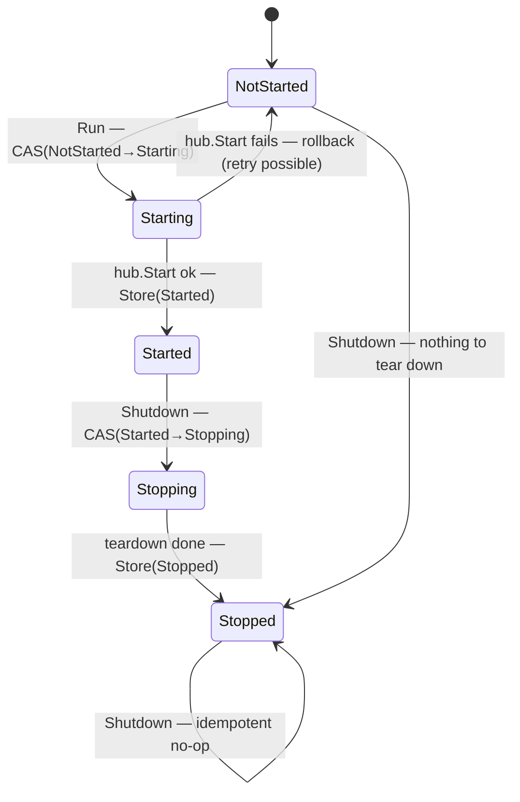

# SRD-031.B — Thresher registry concurrency discipline

| Field | Value |
|---|---|
| Status | Draft |
| Version | v.1 |
| Date | 2026-06-29 |
| Owner | Ruslan Gabitov |
| Implements | [ADR-019 v.1 §2.7 Definition versioning](../design/ADR-019-definition-versioning.md) |

This SRD lands the **concurrency half** of [ADR-019
v.1](../design/ADR-019-definition-versioning.md) (§2.7), the sibling of
[SRD-031.A](SRD-031.A-definition-versioning.md). It retires architecture-audit
**§2.6** ("fragile Thresher mutex discipline", MAJOR) by (a) making the engine
`state` an **atomic** value read and written **without** the engine mutex, with
explicit **transitional** states (`Starting` / `Stopping`) that make the
lifecycle transitions atomic; and (b) replacing the comment-dependent "release
before launch, re-acquire" rule with a **structural** lock boundary — every
critical section is confined to a small locked helper that returns plain data, so
it is *impossible by construction* to hold the lock across an instance launch or
an EventHub call.

**Behavior:** successful single-caller behavior is unchanged. Two deliberate
refinements: concurrent double-`Run` / double-`Shutdown` are now **deterministic**
(one wins, the rest reject / no-op, instead of being undefined), and two new
publicly-observable `State` values (`Starting`, `Stopping`) tighten the meaning of
`Started` ("hub accepting") and `Stopped` ("teardown complete").

---

## 1. Background & current state (verified against the code)

### 1.1 The audit finding (§2.6, MAJOR)

> `pkg/thresher/thresher.go` — correctness rests on a comment ("release BEFORE
> launchInstance … re-acquire t.m", FIX-002 RC2). Any refactor without reading the
> comment reintroduces self-deadlock. Consider atomic for state and an explicit
> split between lock-held / lock-free methods.

### 1.2 The precedent the discipline guards (FIX-002 RC2)

`Thresher.m` is a non-reentrant `sync.Mutex`, and **`State()` acquires it**
(`thresher.go:227-232`). So any goroutine that holds `t.m` and then reads the
state self-deadlocks. FIX-002 RC2 is exactly that failure: `StartProcess` held
`t.m` across `launchInstance` → `instance.New` → `RegisterEvent` →
`Thresher.State()` → second acquire of the same mutex → permanent block (the
`timer-event` example hang). The cure was to release `t.m` before the launch and
re-acquire it inside `launchInstance` — correctness that today lives in prose, not
structure.

### 1.3 The current lock map (ground truth)

`Thresher` (`thresher.go:110-122`) carries `m sync.Mutex` and `state State`
(`type State uint8`; `Invalid, NotStarted, Started, Paused, Stopped` —
`thresher.go:59-100`; `Paused` is reserved, no subsystem yet —
`handle.go:125-132`). `t.m` guards five fields: `registrations`, `nextVersion`,
`instances`, `seenKeys`, and `state`.

- **`state` is always touched under `t.m`** — `State()` (`:227`), `UpdateState()`
  (`:235`), the `started := t.state == Started` caches inside `RegisterProcess`
  (`:443`), `UnregisterVersion` (`:545`), `UnregisterProcess` (`:618`), and the
  `state == Stopped` check + `state = Stopped` flip inside `Shutdown` (`:318`).
- **`ensureStarted()` (`:920`) calls `State()`** — so every `Start*` entry point
  takes `t.m` once just to read the state.
- **The release-before-launch pattern is comment-documented at four sites:**
  `RegisterProcess` (`:443`), `UnregisterVersion` (`:545`), `UnregisterProcess`
  (`:618`), `resolveAndLaunch` (`:712`) — each caches `started`/captures the
  needed data, unlocks `t.m`, and only then calls the EventHub
  (`registerStarters`/`unregisterStarters`) or `launchInstance` lock-free.
- **`launchInstance` (`:947`) and `launchInstanceFromEvent` (`:765`) re-acquire
  `t.m`** to write `t.instances` after `inst.Run` returns.
- **`eventHub` is never touched under `t.m`** (independent subsystem, by FIX-002
  RC2 design); `cfg` is immutable after `New`.

The discipline is correct but **un-enforced**: a maintainer who moves a hub call
above the `t.m.Unlock()`, or who makes `launchInstance` callable while the caller
still holds `t.m`, silently reintroduces the RC2 deadlock — nothing fails at
compile time.

### 1.4 The lifecycle transitions

- **`Run` (`:252`)** reads `State()` (must be `NotStarted`) at the top, starts
  the hub synchronously, spawns the hub loop, then `UpdateState(Started)` at the
  bottom — **two separate lock acquisitions** (a non-atomic check-then-set). The
  `Started` write lands *after* `hub.Start` succeeds, so any observer of `Started`
  sees a ready hub (the ordering that makes a lock-free `started` read safe).
- **`Shutdown` (`:318-340`)** flips `state → Stopped` and snapshots `instances`
  under one `t.m` hold; idempotent (early-return if already `Stopped`).

---

## 2. Requirements

### Functional

- **FR-1 — Atomic engine state with transitional values.** `Thresher.state`
  becomes an atomic value (`atomic.Uint32` holding the `State`), read and written
  with atomic operations, **never** under `t.m`. The `State` enum gains two
  **implemented** transitional values, `Starting` and `Stopping`, between
  `NotStarted`/`Started` and `Started`/`Stopped` respectively. `t.m`'s remaining
  responsibility is exactly the four maps (`registrations`, `nextVersion`,
  `instances`, `seenKeys`).
- **FR-2 — Lock-free state access.** `State()`, `UpdateState(ns)`, and
  `ensureStarted()` read/write the atomic state without acquiring `t.m`.
  `UpdateState` keeps validating the value before storing. Their external
  signatures and semantics are unchanged.
- **FR-3 — RC2 deadlock vector removed by construction.** Because `State()` no
  longer takes `t.m`, a goroutine holding `t.m` may read the state freely — the
  re-entrant-via-`State()` self-deadlock (FIX-002 RC2) becomes impossible, not
  merely avoided by convention.
- **FR-4 — Structural lock boundary.** Every `t.m` critical section is confined to
  a small **locked helper** that acquires `t.m`, mutates/reads only the maps, and
  returns **plain data** (no `*snapshot`, slice, or struct that the caller then
  acts on while the lock is *released*). Callers run the EventHub / `launchInstance`
  work on the returned data **after** the helper returned, so the lock provably
  never spans a subsystem call. The four release-before-launch methods
  (`RegisterProcess`, `UnregisterVersion`, `UnregisterProcess`, `registerAllStarters`)
  and the three lookup-then-launch methods (`StartProcess` via `launchInstance`,
  `StartLatest`, `StartVersion`, `resolveAndLaunch`) are reshaped onto these
  helpers.
- **FR-5 — Documented lock contract.** A single canonical comment on the
  `Thresher` struct states the invariant: *`t.m` guards `registrations` /
  `nextVersion` / `instances` / `seenKeys` only; `state` is atomic (lock-free);
  `eventHub` is an independent subsystem that MUST NOT be called while `t.m` is
  held; locked sections live only in the `…Locked` helpers, which return plain
  data.*
- **FR-6 — Atomic lifecycle via transitional states.** `Run` and `Shutdown` drive
  the state machine with atomic compare-and-swap, so concurrent calls are
  deterministic:
  - **`Run`** does `CAS(NotStarted → Starting)`. On failure (state was not
    `NotStarted`) it returns a self-identifying error (`"Run: engine already
    <state>"`) — a concurrent second `Run` loses the CAS and rejects. On success
    it starts the hub, then `Store(Started)`. If `hub.Start` fails it **rolls back**
    `Starting → NotStarted` (a retry stays possible, preserving today's behavior)
    and returns the hub error. `Started` is published only after the hub accepts,
    so no observer of `Started` sees a not-yet-ready hub.
  - **`Shutdown`** is idempotent: `Stopped` / `Stopping` → return `nil`;
    `Started` → `CAS(Started → Stopping)`, tear down instances, then
    `Store(Stopped)`; `NotStarted` → `CAS(NotStarted → Stopped)` (nothing to tear
    down). `Shutdown` while `Starting` returns `"Shutdown: engine is starting"`
    (cannot arise under the single-caller lifecycle; rejected rather than
    spin-waited).
  - Every existing public behavior (start modes, supersession,
    promote-on-removal, discovery) is preserved; the only change is the
    deterministic rejection of concurrent double-start/stop (FR-1's transitional
    states).

### Non-functional

- **NFR-1 — No new races.** `go test -race ./...` stays green, plus a new
  concurrency stress test exercising concurrent `RegisterProcess` / `Start*` /
  `UnregisterVersion` / `UnregisterProcess` / `State` reads (NFR-2 of SRD-031.A
  extended).
- **NFR-2 — No regression in lock contention.** The atomic state read removes a
  `t.m` acquisition from every `Start*`/`ensureStarted` call; the helper split adds
  no extra acquisitions (same number of locked sections, now named).
- **NFR-3 — Coverage.** Diff-coverage ≥ project standard (95%, aim 100%) on every
  touched file; `make ci` green.
- **NFR-4 — Audit §2.6 retired.** The audit item is marked resolved (in the audit
  doc's status), this SRD named as its closure.

---

## 3. Models

### 3.1 The atomic state field and the `State` enum (`pkg/thresher/thresher.go`)

The field type changes to atomic and the `State` enum gains the two transitional
values. Order stays iota-ascending with `Stopped` terminal (so `Validate`'s
`s > Stopped` bound and the `String()` table still hold):

```go
const (
	Invalid State = iota
	NotStarted        // created, not yet Run
	Starting          // Run claimed the transition; hub not yet accepting
	Started           // hub up and accepting launches
	Paused            // reserved, unimplemented
	Stopping          // Shutdown claimed; teardown in progress
	Stopped           // terminal; teardown complete
)
```

```go
type Thresher struct {
	// ... unchanged ...
	registrations map[string][]*ProcessRegistration // guarded by m
	nextVersion   map[string]int                    // guarded by m
	instances     map[string]instanceReg            // guarded by m
	seenKeys      map[string]struct{}               // guarded by m
	id            string
	m             sync.Mutex // guards the four maps above ONLY
	state         atomic.Uint32 // a State; lock-free, NEVER under m
}

func (t *Thresher) State() State { return State(t.state.Load()) }
```

`atomic.Uint32` (not `atomic.Value`) — `State` is a `uint8`, so a 32-bit cell
stores it without interface boxing, and `Thresher` is always used by pointer
(`New` returns `*Thresher`), so the no-copy constraint is already met.

The lifecycle the transitions realize:



Rejections: `Run` when `state != NotStarted` (CAS fails) → error; `Shutdown` while
`Starting` → error. `Paused` is reserved (no `Pausing` until pausing is
implemented).

### 3.2 The locked helpers (the structural boundary)

Each returns plain data; the lock is born and dies inside it. Indicative shapes:

```go
// appendVersionLocked records a new version and returns the bookkeeping the
// caller needs to drive the (lock-free) hub work.
func (t *Thresher) appendVersionLocked(reg *ProcessRegistration) (prevLatest *ProcessRegistration)

// removeVersionLocked drops reg's version; returns whether it was the live latest
// and the now-newest version's starters to promote (nil if none).
func (t *Thresher) removeVersionLocked(reg *ProcessRegistration) (found, wasLatest bool, promote []*instanceStarter)

// removeKeyLocked drops every version of key; returns the live latest's starters.
func (t *Thresher) removeKeyLocked(key string) (live []*instanceStarter, existed bool)

// snapshotForLocked / latestSnapshotLocked resolve a *snapshot under the lock and
// return it; the caller launches lock-free.
func (t *Thresher) snapshotForVersionLocked(key string, version int) *snapshot.Snapshot
func (t *Thresher) latestSnapshotLocked(key string) *snapshot.Snapshot

// trackInstanceLocked registers a launched instance in the instances map.
func (t *Thresher) trackInstanceLocked(inst *instance.Instance, cancel context.CancelFunc) *InstanceHandle
```

(Exact names/returns finalized in implementation; the invariant is the contract:
**plain data out, lock confined**.)

---

## 4. Analysis

### 4.1 Atomic state over a mutex-guarded field (decided)

`state` has exactly one writer-class (lifecycle transitions) and many readers
(`ensureStarted` on every `Start*`, the `started` caches, `Shutdown`). A
`sync.Mutex` for a single `uint8` is heavier than needed and — fatally — couples
state reads to the *map* lock, which is what creates the RC2 re-entrancy. An
atomic cell decouples them: state reads never contend with map operations and
never re-enter `t.m`.

### 4.2 Why this kills the RC2 class, not just an instance (decided)

FIX-002 RC2 fixed the *symptom* (one call path) by moving the launch outside the
lock. The *cause* is that `State()` takes `t.m`. Once `State()` is lock-free, no
code path — present or future — can deadlock by reading the state under the lock.
The dangerous edge the audit calls "refactor-hostile" stops existing.

### 4.3 Lifecycle transitions via transitional states (decided)

A single top-of-`Run` `CompareAndSwap(NotStarted, Started)` would be atomic but
**wrong**: it publishes `Started` before `hub.Start` returns, so a concurrent
`RegisterProcess` could call a not-yet-accepting hub. Keeping the old
check-(top)/set-(bottom) shape is **correctly-ordered but not atomic**: two
callers can both observe `NotStarted` and both proceed (undefined double-`Run`).

The **transitional `Starting` state** resolves both at once. `Run` does
`CAS(NotStarted → Starting)`: the CAS atomically *claims* the transition (a second
`Run` loses it and rejects deterministically) **without** signalling readiness —
`Starting` is not `Started`, so nothing treats the hub as accepting yet. `Started`
is stored only after `hub.Start` succeeds; if it fails, the state rolls back
`Starting → NotStarted` so a retry is still possible (today's behavior). This is
strictly better than the documented single-caller assumption the earlier draft
carried — concurrent double-start is now *safe*, not merely *assumed-away*.

`Stopping` does the symmetric job for `Shutdown`: `CAS(Started → Stopping)` claims
teardown, and `Stopped` is published only when teardown is **complete** — so a
second `Shutdown` (or any state observer) never sees `Stopped` while cleanup is
still running. Idempotency falls out of the CAS: `Stopping`/`Stopped` short-circuit
to `nil`. `Shutdown` while `Starting` is rejected rather than spin-waited; under
the single-caller lifecycle (a caller does not shut the engine down in the middle
of its own `Run`) it cannot occur, so a clear error beats extra machinery.

`t.m` is still taken inside `Shutdown` — but only to snapshot `instances` and read
`engineCancel`, never for the state flip.

### 4.4 The boundary is enforced by extraction, not by comment (decided)

Today a reviewer must read the FIX-002 RC2 comment to know not to hold `t.m`
across a hub call. After this SRD, the locked code lives only inside `…Locked`
helpers that return plain data and take no callbacks; a caller physically has no
lock to hold across the subsequent launch, because the helper already released
it. The comment becomes a restatement of a structural fact, not the thing keeping
it true.

### 4.5 What stays the same (decided)

`eventHub` remains an independent subsystem touched only with `t.m` released;
`registrations` / `nextVersion` / `instances` / `seenKeys` remain `t.m`-only;
`cfg` immutable. The maps are not converted to `sync.Map` or sharded — contention
is low (registration/start are not hot loops) and a single mutex over four
correlated maps is the simpler correct model.

---

## 5. Public API surface

**Signatures unchanged.** `State() State`, `UpdateState(State) error`, `Run`,
`Shutdown`, `RegisterProcess`, `StartProcess`, `StartVersion`, `StartLatest`,
`UnregisterVersion`, `UnregisterProcess`, `Registrations`, and the SRD-019
discovery surface keep their signatures. All internal additions are unexported
`…Locked` helpers; no caller migration is required.

**Additive enum change:** the `State` enum gains two exported values (`Starting`,
`Stopping`). Callers that `switch` on `State()` may now observe them. No value is
removed and the relative order is preserved; inserting the two values does shift
the underlying `iota` integers of `Started`/`Paused`/`Stopped`, which is safe
because `State` is referenced by name (never by literal int) and is in-memory only
— it is not persisted in snapshots or anywhere durable. `Run` now returns an error
on a concurrent/repeat start (the non-`NotStarted` rejection already existed;
double-start is now *deterministic*).

---

## 6. Test scenarios

| # | Scenario | FR | Where |
|---|---|---|---|
| T-1 | `State()` reads with no `t.m` acquisition; value matches the lifecycle (NotStarted→Started→Stopped) | FR-1, FR-2 | `thresher/*_test.go` |
| T-2 | A goroutine holding `t.m` (white-box) can call `State()` without deadlock — the RC2 vector is gone | FR-3 | `thresher/*_internal_test.go` |
| T-3 | `Shutdown` is idempotent under concurrent calls; `Stopping`→`Stopped`, only one teardown, all instances settle | FR-6 | `thresher/*_test.go` |
| T-4 | `Run` rejects a second start (non-`NotStarted`) with a self-identifying error | FR-6 | existing + new |
| T-5 | Concurrency stress: N goroutines concurrently `RegisterProcess` / `StartLatest` / `StartVersion` / `UnregisterVersion` / `UnregisterProcess` / `State` on shared keys; `-race` clean, no panic, registry consistent | NFR-1 | `thresher/*_internal_test.go` |
| T-6 | Each `…Locked` helper returns correct plain data (unit) and leaves the maps consistent | FR-4 | `thresher/*_internal_test.go` |
| T-7 | `go test -race ./...` green across the repo | NFR-1 | CI |
| T-8 | Concurrent double-`Run`: M goroutines call `Run` at once; exactly one succeeds (engine ends `Started`), the rest get the "already" error; `-race` clean | FR-6 | `thresher/*_test.go` |
| T-9 | `Shutdown` while `Starting` returns the "engine is starting" error (white-box: force `Starting`, no completed hub) | FR-6 | `thresher/*_internal_test.go` |
| T-10 | `hub.Start` failure rolls back `Starting → NotStarted`; the engine is re-`Run`-able afterward | FR-6 | `thresher/*_internal_test.go` |

---

## 7. Milestones

- **B1 — Atomic state + transitional lifecycle.** `state atomic.Uint32`; the
  `Starting`/`Stopping` enum values; `State` / `UpdateState` / `ensureStarted`
  lock-free; `Run` via `CAS(NotStarted→Starting)`→hub→`Store(Started)` with
  rollback on hub failure; `Shutdown` via `CAS(Started→Stopping)`→teardown→
  `Store(Stopped)` (idempotent); the `started` caches read the atomic. The struct
  lock-contract comment (FR-5). T-1/T-2/T-3/T-4/T-8/T-9/T-10.
- **B2 — Lock-confined helpers.** Extract the `…Locked` helpers (§3.2) and reshape
  `RegisterProcess` / `Unregister*` / `Start*` / `resolveAndLaunch` /
  `registerAllStarters` / `launchInstance*` onto them. Behavior identical. T-6.
- **B3 — Verify & retire §2.6.** The concurrency stress test (T-5); `make ci` +
  `-race` green; mark audit §2.6 resolved; fill §10. T-5/T-7.

## 8. Cross-doc

- **Implements** [ADR-019 v.1](../design/ADR-019-definition-versioning.md) §2.7
  (concurrency discipline owned by this SRD).
- [ADR-001 v.6](../design/ADR-001-execution-model.md) — the Instance+track
  execution model / race-freedom invariants this registry hardening sits within.
- Sibling [SRD-031.A](SRD-031.A-definition-versioning.md) — the versioning half;
  this lands on the same branch after it (number-only sideways ref).
- Architecture audit 2026-06-11 **§2.6** — the MAJOR finding retired here (§3.3
  was closed by SRD-031.A).
- FIX-002 — the RC2 self-deadlock precedent §1.2 grounds (number-only ref).

## 9. Definition of Done

- [ ] FR-1..FR-6 wired and covered by T-1..T-10.
- [ ] `state` is `atomic.Uint32`; the `Starting`/`Stopping` transitional values
  exist; no `t.m` acquisition remains in `State` / `UpdateState` / `ensureStarted`;
  `Run`/`Shutdown` transitions are CAS-driven (rollback on hub failure;
  idempotent `Shutdown`).
- [ ] Every `t.m` critical section is inside a `…Locked` helper returning plain
  data; no `t.m` is held across an EventHub or `launchInstance*` call.
- [ ] The `Thresher` struct carries the lock-contract comment (FR-5).
- [ ] `/check-style` clean; `/check-srd` PASS.
- [ ] `make ci` green incl. diff-coverage ≥95% on touched files (NFR-3);
  `go test -race ./...` green (NFR-1).
- [ ] §8 cross-doc pins consistent; frozen one-shot SRD/FIX not retro-edited.
- [ ] Audit §2.6 marked resolved; §10 filled; status flipped Draft → Accepted
  (user's call).

## 10. Implementation summary

_(filled at landing: files/lines, T-results, milestone SHAs.)_

## Open questions

None.
