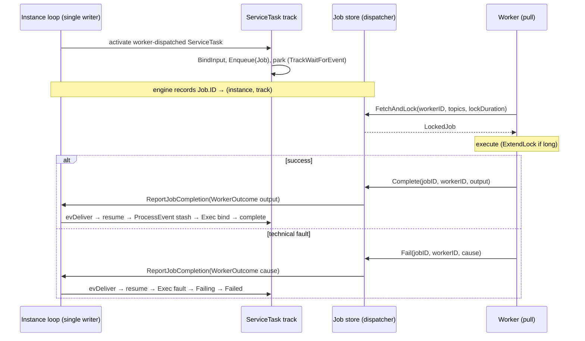

# SRD-036 — Service Task external-worker job queue & wait-node (M2, M3)

| Field | Value |
|---|---|
| Status | Accepted |
| Version | v.1 |
| Date | 2026-07-06 |
| Owner | Ruslan Gabitov |
| Implements | [ADR-021 v.1 Service Task Execution Model](../design/ADR-021-service-task-execution-model.md) §2.1–§2.5 |

> **Accepted** — second of four SRDs landing [ADR-021 v.1](../design/ADR-021-service-task-execution-model.md)
> (**M2 + M3** of M1–M8). Lands the **external-worker foundation**: **M2** redefines the reserved
> `WorkerDispatcher` seam from a blocking dispatch into an **asynchronous fetch-and-lock job queue** and reworks
> the in-memory `localdispatcher` into a **job store**; **M3** makes a `WithWorker(topic)` ServiceTask a
> **wait node** that parks on activation, enqueues its bound input, and resumes when a worker reports. Outcomes
> here are **success (`Complete`)** or **technical fault (`Fail`)**; classification (`ErrorMapper` /
> `WithStatus` / `BpmnError`), output mapping, retry, and the `WithWorkerTrust` protocols land in **SRD-037**
> (M4/M5) and **SRD-038** (M6–M8). Sibling: **SRD-035** (M1, `WithTimeout`, Accepted).

---

## 1. Background (verified against the code)

### 1.1 The decision this SRD lands ([ADR-021 v.1](../design/ADR-021-service-task-execution-model.md) §2.1–§2.5)

A worker-dispatched ServiceTask is a **wait node**: on activation it parks, the engine **enqueues** a job onto an
asynchronous **fetch-and-lock** queue, a worker **pulls** it, executes, and **reports**; the report re-enters the
instance loop and resumes the parked track. The engine holds **no live call** — only a queued job and a parked
track — so a worker-waiting instance is dehydration-ready.

### 1.2 The seam being reworked (verified)

The reserved `WorkerDispatcher` is a **blocking dispatch** with no consumer:

```go
// pkg/tasks/workerdispatcher.go:13-32
type Job struct { Input any; Type string; ID string }
type Handler func(ctx context.Context, job Job) (any, error)
type WorkerDispatcher interface {
	Register(jobType string, h Handler) error
	Dispatch(ctx context.Context, job Job) (any, error)   // REWORKED away
}
```

The in-memory impl is a semaphore-backed **goroutine pool** (`pkg/tasks/localdispatcher/localdispatcher.go:31-93`:
`Dispatcher{handlers, sem, mu}`, `New(poolSize)`, `Register`, `Dispatch`). Nothing in the ServiceTask/track path
calls it today (ADR-021 §1 problem 2) — so the rework has **no in-tree consumer to break**.

### 1.3 The rails M3 rides — the wait-node template (verified, REUSE)

M3 mirrors the **UserTask** wait-node path exactly ([ADR-020 v.1](../design/ADR-020-human-interaction-execution-model.md),
SRD-034):

- **`checkNodeType`** (`internal/instance/track.go:345-351`) diverts wait nodes **before** the EventNode path:
  `if _, ok := node.(interactor.HumanTask); ok { return t.parkHumanTask(node) }`. M3 adds a ServiceTask branch.
- **`parkHumanTask`** (`track.go:427-441`): `t.updateState(TrackWaitForEvent)` (`track.go:71`, the shared
  wait-node state) + `t.instance.emit(trackEvent{kind: evTaskWaiting, track: t, node, taskID})`. M3 adds an
  analogous `parkExternalServiceTask` with a new `trackEventKind`.
- **Resume**: the loop delivers to `t.evtCh`; `deliver` calls the node's `ProcessEvent` (`track.go:1005-1031`,
  `ep.ProcessEvent` at `:1029`).
  **`UserTask.ProcessEvent`** (`user_task.go:215-235`) type-asserts a synthetic `*interactor.TaskCompletion`,
  stashes `completedOutputs`, and `Exec` binds them on resume. M3's `ServiceTask.ProcessEvent` stashes a
  `WorkerOutcome` the same way.
- **Single-writer delivery**: `Instance.events chan trackEvent` (`instance.go:90`, loop-only sender) +
  `evDeliver` (`event.go:98-104`); `Instance.ProcessEvent` (`instance.go:355-368`) shows the `inst.emit(evDeliver…)`
  pattern a report re-enters through.

### 1.4 The operation contract M3 reuses (verified)

`op.Execute(ctx, re)` binds a single input message item and produces a single output item
(`pkg/model/service/operation.go` `BindInput:252-284`, `produceOutput:219-246`). A `goOperation` is an in-process
Go closure with `Type() == gooper.GoOperType` (`"##GoOper"`, `gooper.go:22`) — **not** shippable. `Job.Input` /
`Complete` output are single `*data.ItemDefinition`s per the operation contract (multi-variable assembly is a
data-layer follow-up, **AB-005**).

## 2. Requirements

### Functional — M2 (job queue)

- **FR-1** — **Redefine `pkg/tasks.WorkerDispatcher`** into the async job-queue interface (§3.1):
  `Enqueue` / `FetchAndLock` / `ExtendLock` / `Complete` / `Fail`, with named ids (`JobID`/`Topic`/`WorkerID`) and
  `Job{ID, Topic, Input *data.ItemDefinition, Policy *Policy}`, `LockedJob{Job, WorkerID, Deadline}`. `Policy` is
  a nil placeholder here (populated by
  SRD-038). The old `Register`/`Dispatch`/`Handler` and `Job.Input any` are removed.
- **FR-2** — **Rework `localdispatcher`** into an in-memory **job store**: topic-keyed queue; per-job **lock
  state** (holder `workerID`, `Deadline`); `FetchAndLock` hands out unlocked jobs for the requested topics and
  locks them for `lockDuration`; a lock that expires without a report makes the job fetchable again
  (crash-resilience); `ExtendLock` is **holder-only** and bounded by a configurable **`maxLockDuration`** cap;
  a **local worker pool** fetches-and-locks and runs registered per-topic handlers.
- **FR-3** — The reworked `localdispatcher` stays the **wired default** (`enginert`/`thresher` `defaultConfig`,
  `renv.EngineRuntime.WorkerDispatcher()`); `thresher.WithWorkerDispatcher` still injects an alternative.

### Functional — M3 (wait-node)

- **FR-4** — **`activities.WithWorker(topic)`** selects the external-worker locus (a new `SrvTaskOption` on the
  M1 `srvTaskConfig`). On activation the ServiceTask **parks** — `checkNodeType` gains a branch that, for a
  worker-dispatched ServiceTask, calls `parkExternalServiceTask`: bind the input (`BindInput`), **`Enqueue`** a
  `Job{ID, Topic, Input}`, `updateState(TrackWaitForEvent)`, and emit a new `evJobWaiting` `trackEventKind`.
- **FR-5** — `WithWorker` is valid **only on message-operations**: a ServiceTask whose `operation.Type() ==
  gooper.GoOperType` with `WithWorker` set is a **build-time error** (a Go closure has no shippable message
  boundary).
- **FR-6** — A worker report re-enters the engine via **`ReportJobCompletion`** (a `JobCompletionSink` the engine
  implements, §3.4): the dispatcher, on `Complete`/`Fail`, delivers a **`WorkerOutcome`** to the sink; the engine
  resolves `Job.ID` → the parked `(instance, track)` (a registry populated at `Enqueue`) and
  `inst.emit(evDeliver, &WorkerOutcome, track)`. The parked track resumes: `ServiceTask.ProcessEvent` stashes the
  outcome, `Exec` binds/faults.
- **FR-7** — Under `WithWorker` the Operation's in-process **executor is ignored** (ADR-021 §2.5): the Operation
  contributes only its **contract** (`inMessage` → `Job.Input`; `outMessage` ← the worker's output). A present
  `Implementor` is never invoked — **not** a build error.
- **FR-8** — M2/M3 outcomes are two: **`Complete(output)`** → bind `output` to `DataOutput` (the existing
  `MustParameter`/`re.Put` path) and complete; **`Fail(cause)`** → **fault** the task (`Failing → Failed`, a
  wrapped error). Classification (business `BpmnError`/`Status`), output mapping, and retry are **out of scope**
  (SRD-037/038) — a `Fail` here is terminal, not yet retried.

### Non-functional

- **NFR-1 (dehydration-friendly)** — a parked worker-waiting task holds **no goroutine and no live call**: only a
  queued job (in the store) and a parked track. (Contrast the rejected push model, ADR-021 §2.4.)
- **NFR-2 (single-writer preserved)** — worker reports re-enter only via `inst.emit`; the loop remains the sole
  sender to any `t.evtCh` (ADR-017). The dispatcher never touches instance internals — it calls the sink.
- **NFR-3 (liveness & crash-resilience)** — `maxLockDuration` caps `ExtendLock` (a hung/monopolising worker's job
  eventually re-enters the queue); an expired lock makes a job fetchable again (worker-crash recovery).
- **NFR-4 (gate)** — diff-coverage ≥95% on touched files; `make ci` green; the store's lock/expiry and the
  park/resume path are `-race` clean.

## 3. Models

### 3.1 The job-queue interface — `pkg/tasks/workerdispatcher.go` (REWORK)

```go
// Named identifiers keep the extendable interface mixing-proof at compile time:
// a Topic can't be passed where a JobID is expected, and vice versa.
type (
	JobID    string // instance+track+node; the worker's idempotency key
	Topic    string // the fetch key (== a ServiceTask's WithWorker topic)
	WorkerID string
)

// Policy is the per-service execution bundle shipped to a WorkerTrusted worker
// (SRD-038): output mapping + error mapping + retry policy. Nil under
// EngineAuthoritative and throughout M2/M3. A placeholder here; SRD-037 adds
// ErrorMapper/OutputMapping, SRD-038 adds RetryPolicy.
type Policy struct{ /* extended by SRD-037/038 */ }

// Job is the enqueued unit. Input is the single bound input-message item
// (nil if the operation has no inMessage).
type Job struct {
	ID     JobID
	Topic  Topic
	Input  *data.ItemDefinition
	Policy *Policy
}

// LockedJob is a Job handed to a worker by FetchAndLock, plus its lock.
type LockedJob struct {
	Job
	WorkerID WorkerID
	Deadline time.Time // extend before this, or the lock expires
}

// WorkerDispatcher is an asynchronous fetch-and-lock job queue (ADR-021 §2.4).
type WorkerDispatcher interface {
	// engine → queue (non-blocking); the engine then parks the task.
	Enqueue(ctx context.Context, job Job) error
	// worker ← queue (pull); locks each returned job for lockDuration.
	FetchAndLock(ctx context.Context, workerID WorkerID,
		topics []Topic, lockDuration time.Duration) ([]LockedJob, error)
	ExtendLock(ctx context.Context, jobID JobID, workerID WorkerID,
		newDuration time.Duration) error
	// worker → engine report (exactly one per job).
	Complete(ctx context.Context, jobID JobID, workerID WorkerID,
		output *data.ItemDefinition) error
	Fail(ctx context.Context, jobID JobID, workerID WorkerID, cause error) error
}
```

*(`Report(status)` / `BpmnError(code)` join in SRD-037 — an interface-method addition, contained to the single
impl + its mock.)*

### 3.2 `WorkerOutcome` — the synthetic completion event

A worker report becomes a `WorkerOutcome`, a `flow.EventDefinition` delivered into the loop to resume the parked
track (mirroring `interactor.TaskCompletion` for UserTask). It lives beside the dispatcher.

```go
// WorkerOutcome carries a worker's terminal report for job JobID. Exactly one
// of Output / Cause is meaningful. SRD-037 adds the classified variants
// (status value, BPMN errorCode).
type WorkerOutcome struct {
	JobID  JobID
	Output *data.ItemDefinition // set on Complete
	Cause  error                // set on Fail
	// embeds the definition machinery implementing flow.EventDefinition
}
```

### 3.3 `localdispatcher` job store (REWORK)

```go
type Dispatcher struct {
	mu       sync.Mutex
	byTopic  map[string][]*jobEntry // FIFO queue per topic
	byID     map[string]*jobEntry   // ID → entry (lock/report lookup)
	sink     tasks.JobCompletionSink
	maxLock  time.Duration
	// local worker pool (registered per-topic handlers) fetch-and-locks
}

type jobEntry struct {
	job       tasks.Job
	workerID  tasks.WorkerID // "" = unlocked
	deadline  time.Time      // lock expiry
	firstLock time.Time      // for the maxLockDuration cap
}
```

`New(...)` takes the `maxLockDuration` cap and (during Thresher startup) the completion `sink`. `FetchAndLock`
skips locked-and-unexpired entries; `Complete`/`Fail` validate `workerID` == holder, then deliver a
`WorkerOutcome` to `sink`.

### 3.4 Completion sink + job registry (engine side)

```go
// JobCompletionSink routes a worker's report to the owning instance. The engine
// implements it; the dispatcher calls it from Complete/Fail. (pkg/tasks)
type JobCompletionSink interface {
	ReportJobCompletion(ctx context.Context, outcome WorkerOutcome) error
}
```

The engine records `Job.ID → (instanceID, trackID)` at `Enqueue` (in `parkExternalServiceTask`); `ReportJobCompletion`
looks it up and `inst.emit(evDeliver, &outcome, track)`. `Job.ID` is minted from instance+track+node, so the
lookup is O(1) and needs no scan.

### 3.5 ServiceTask worker fields + wait-node hook (`activities`, EXTEND)

`srvTaskConfig` (added in M1) gains `workerTopic tasks.Topic`; `WithWorker(topic string) SrvTaskOption` sets it
(converting the ergonomic string literal to `tasks.Topic`) and marks the task external. `ServiceTask` exposes a
marker the track checks (mirroring `interactor.HumanTask`):

```go
// WorkerTopic reports the external-worker topic and whether the ServiceTask is
// worker-dispatched. checkNodeType diverts a worker-dispatched task to the
// wait-node park path; an in-process task (ok == false) runs Exec as today.
func (st *ServiceTask) WorkerTopic() (topic tasks.Topic, ok bool)
```

`ServiceTask.ProcessEvent` (new, implements `eventproc.EventProcessor`) type-asserts `*WorkerOutcome`, stashes it;
`Exec` branches: worker-dispatched → bind the stashed `Output` (or fault on `Cause`); else the M1 in-process path.

### 3.6 Lifecycle



## 4. Analysis

### 4.1 Report delivery — a sink, not the dispatcher touching instances (FR-6, NFR-2)

The dispatcher must stay decoupled from instance internals (it may be a remote adapter later). So `Complete`/`Fail`
deliver a `WorkerOutcome` to an engine-provided **`JobCompletionSink`**; the engine (which owns the `Job.ID →
(instance, track)` registry) does the `inst.emit`. This preserves the single-writer loop (NFR-2) and keeps the
queue a pure transport. *Rejected: the dispatcher calling `inst.emit` directly* — couples the queue to instance
internals and breaks the remote case.

### 4.2 `WorkerOutcome` as a `flow.EventDefinition` (FR-6)

Reusing the ADR-017 park/resume delivery means the report must arrive as an event the parked track's
`ProcessEvent` consumes — exactly the `interactor.TaskCompletion` shape UserTask uses. A synthetic
`WorkerOutcome` event definition is the minimal, precedented choice. *Rejected: a bespoke resume channel* — would
duplicate the loop-delivery machinery ADR-017 already owns.

### 4.3 Park-and-enqueue at `checkNodeType`; bind output at `Exec` on resume (FR-4, FR-7)

Input binding + `Enqueue` happen at **park** time (`parkExternalServiceTask`), so the job carries the bound input
and the engine holds no call. `Exec` runs **on resume** and binds the *stashed* output (or faults) — it does
**not** run `op.Execute` for a worker-dispatched task (FR-7: the worker is the executor). This matches UserTask
(`Exec` binds stashed `completedOutputs`).

### 4.4 `Fail` faults now; retry arrives in SRD-038

Without the retry policy (SRD-038), a `Fail` is terminal: `Exec` returns a wrapped error →
`Failing → Failed`. SRD-038 re-routes `Fail` through the retry policy (re-enqueue with backoff) — a change to how
the outcome is *handled*, not to the report call. Forward-compatible.

### 4.5 Named identifier types over bare strings

`JobID` / `Topic` / `WorkerID` are named `string` types, not bare `string`s (§3.1). For an interface meant to
**grow** (remote adapters, more report kinds — SRD-037/038, ADR-004), the compile-time guard is worth the small
verbosity: the type checker rejects passing a `Topic` where a `JobID` is expected, catching argument-order
mistakes for free. This is the same instinct as the concrete `*data.ItemDefinition` (over the stub's `any`) — a
durable, extendable contract should carry meaning in its types. `WithWorker` still takes an ergonomic `string` at
the public boundary (a string literal converts to `tasks.Topic`). *Rejected: bare strings* — convenient, but an
extendable queue interface with several string parameters is exactly where silent argument-swaps hide.

### 4.6 What stays the same

The in-process locus (M1 `WithTimeout` + synchronous `op.Execute`) is untouched — `checkNodeType` diverts only a
worker-dispatched ServiceTask (`WorkerTopic()` ok). The operation contract, `BindInput`/output binding, and the
options type-switch are reused unchanged.

## 5. API / contract surface

- **Reworked:** `pkg/tasks.WorkerDispatcher` (job-queue interface), the named ids `pkg/tasks.JobID` / `Topic` /
  `WorkerID`, `pkg/tasks.Job` / `LockedJob` / `Policy` (new/changed), `pkg/tasks.WorkerOutcome`,
  `pkg/tasks.JobCompletionSink`.
- **New:** `activities.WithWorker(topic string) SrvTaskOption`; `ServiceTask.WorkerTopic()`,
  `ServiceTask.ProcessEvent(...)`; the engine's `ReportJobCompletion`.
- **Reworked impl:** `pkg/tasks/localdispatcher` (job store). Wiring (`defaultConfig`, `renv.EngineRuntime`) keeps
  the accessor shape.

## 6. Test scenarios

| Test | FR/NFR | Scenario |
|---|---|---|
| `TestDefaultRuntimeWorkerDispatcherIsJobStore` | FR-3 | a default runtime's `WorkerDispatcher()` returns the reworked `localdispatcher` job store (satisfying the new interface); `WithWorkerDispatcher` overrides it |
| `TestLocalDispatcherEnqueueFetchComplete` | FR-1, FR-2 | enqueue → fetch-and-lock → complete delivers a `WorkerOutcome` to the sink |
| `TestLocalDispatcherLockExpiryRefetch` | FR-2, NFR-3 | a locked job whose lock expires is fetchable again |
| `TestLocalDispatcherExtendLockHolderOnlyAndCap` | FR-2, NFR-3 | non-holder `ExtendLock` fails; extension past `maxLockDuration` is refused |
| `TestLocalDispatcherFetchOnlyRequestedTopics` | FR-2 | `FetchAndLock` returns only jobs for the requested topics |
| `TestServiceTaskWithWorkerRejectsGoOperation` | FR-5 | `WithWorker` on a `goOperation` → build-time error |
| `TestServiceTaskWorkerParksAndEnqueues` | FR-4, NFR-1 | activation parks (`TrackWaitForEvent`) + enqueues a `Job` with the bound input; no goroutine held |
| `TestServiceTaskWorkerCompleteResumesAndBinds` | FR-6, FR-8 | a `Complete` report resumes the parked track and binds the output to `DataOutput` |
| `TestServiceTaskWorkerFailFaults` | FR-6, FR-8 | a `Fail` report faults the task (`Failing → Failed`) |
| `TestServiceTaskWorkerExecutorIgnored` | FR-7 | a worker-dispatched op with a present `Implementor` never invokes it |
| `TestReportJobCompletionRoutesToParkedTrack` | FR-6, NFR-2 | `ReportJobCompletion` resolves `Job.ID` → the parked track and delivers via `inst.emit` |

## 7. Milestones

1. **M2** — `WorkerDispatcher` job-queue interface + `localdispatcher` job store (store, lock/expiry, `ExtendLock`
   cap, local pool) + `WorkerOutcome`/`JobCompletionSink` types + wiring. One commit.
2. **M3** — `WithWorker` + `parkExternalServiceTask` (`checkNodeType` branch, `evJobWaiting`) + `Enqueue` at park +
   `ReportJobCompletion` + `ServiceTask.ProcessEvent`/`Exec` resume-bind + the message-operation build guard. One
   commit.

## 8. Cross-doc

- **Implements:** [ADR-021 v.1](../design/ADR-021-service-task-execution-model.md) §2.1–§2.5.
- **References (up / sideways):** [ADR-001 v.6](../design/ADR-001-execution-model.md) (execution model),
  [ADR-017 v.1](../design/ADR-017-channel-based-event-processing.md) §2 (wait-node park/resume + loop delivery),
  [ADR-018 v.1](../design/ADR-018-boundary-events-and-activity-interruption.md) (fault path),
  [ADR-020 v.1](../design/ADR-020-human-interaction-execution-model.md) (UserTask wait-node template),
  [ADR-011 v.5](../design/ADR-011-process-data-flow.md) (operation / data binding),
  [SAD-001 v.1](../design/SAD-001-vision-and-architecture.md) §11, §13.
- **Sibling SRDs:** SRD-035 (M1, Accepted); SRD-037 (M4/M5 — classification + output mapping), SRD-038
  (M6–M8 — retry + trust + example) forthcoming. SRD→SRD sideways; pins by number.
- **Backlog:** **AB-005** (structured `ItemDefinition` compose/spread — multi-variable data binding) is a
  data-layer follow-up, out of scope here.
- Direction: SRD → ADR / SAD (up), SRD → SRD (sideways); no downward reference.

## 9. Definition of Done

- FR-1…FR-8 implemented and wired; NFR-1…NFR-4 upheld.
- Every FR/NFR covered by ≥1 named §6 test, all green under `-race`.
- The old `Register`/`Dispatch`/`Handler` surface and `Job.Input any` are removed; no stale callers.
- `make ci` green (tidy · lint · build · `-race` · diff-coverage ≥95% on touched files · govulncheck).
- SRD-036 flips to Accepted. **ADR-021 stays Draft** until SRD-037/038 are grounded.

## 10. Implementation summary (stage-by-stage actual landings + deltas vs draft)

### 10.1 Stage commits (branch `feat/service-task-execution`)

| Stage | Commit | Scope | Key tests |
|---|---|---|---|
| M2 | `237d6fc` | `WorkerDispatcher` job-queue interface + `localdispatcher` job store (topic queue, per-job lock/expiry, holder-only `ExtendLock` + `maxLockDuration` cap, local worker pool) + `WorkerOutcome` / `JobCompletionSink` types + wiring | `TestLocalDispatcher{EnqueueFetchComplete, LockExpiryRefetch, ExtendLockHolderOnlyAndCap, FetchOnlyRequestedTopics, …}` |
| M3 | `24cfa36` | `WithWorker` + `parkServiceTask` (`checkNodeType` branch, `evJobWaiting`) + loop `onJobWaiting` (bind + `Enqueue`) + `ReportJobCompletion` routing (Thresher sink + jobID-embedded instance id) + `ServiceTask.ProcessEvent`/`Exec` resume-bind + message-operation build guard | `TestServiceTaskWorker{ParksAndEnqueues, CompleteResumesAndBinds, FailFaults, ExecutorIgnored, ExecBindsCompletedOutput, ExecFaultsOnCause, BoundaryInterruptDropsJob, EnqueueFailureFaults, BindInputFailureFaults}`, `TestReportJobCompletion{RoutesToParkedTrack, CanceledContext}`, `TestThresherReportJobCompletionRoutes`, `TestServiceTaskWithWorkerRejectsGoOperation`, `TestMakeJobIDRoundTrip`, `TestDefaultRuntimeWorkerDispatcherIsJobStore` |

`make ci` green — lint/vet/build/`-race` clean, govulncheck clean, diff-coverage 97.7% of 519 changed lines (min 95%).

### 10.2 Empirical findings — where the implementation refined the §3/§4 draft

Both refinements preserve every required invariant (single-writer NFR-2, park/resume, dehydration-friendliness NFR-1) and are recorded here rather than by rewriting §3/§4 (one-shot doc). The draft used the UserTask-analogy prose; the code sharpened it.

- **Bind + `Enqueue` moved from park (track) to the loop's `onJobWaiting` handler (FR-4, §4.3).** The draft placed input binding + `Enqueue` inside `parkExternalServiceTask` on the track. The implementation splits it: `parkServiceTask` (`internal/instance/track.go`) only mints the `JobID`, parks (`TrackWaitForEvent`), and emits `evJobWaiting`; the loop's `onJobWaiting` (`internal/instance/jobs.go`) opens a frame, binds the input, and `Enqueue`s — on the loop goroutine. **Why:** scope access (the frame) stays single-writer on the loop, exactly like `authorizeTask` for a UserTask; binding on the parked track's goroutine would cross that boundary. A bind/enqueue failure delivers a synthetic `Fail` outcome so the task faults rather than parking forever.
  - Two supporting seams were added (not named in the draft): `service.Operation.BindInputOnly(ctx, r)` — bind the input message without running the executor (the worker is the executor) — on both `messageOperation` and `goOperation`; and a `tasks.ExternalWorker` interface (`WorkerTopic` + `BindJobInput`) that `checkNodeType` type-asserts, decoupling `internal/instance` from the concrete `ServiceTask`.

- **Report re-entry uses a dedicated `jobReq` channel + `handleJobCompletion`, not `evDeliver`; routing is by an instance id embedded in the `JobID`, not a separate registry (FR-6, §3.4/§4.1).** The draft described `inst.emit(evDeliver, &outcome, track)` and a `Job.ID → (instanceID, trackID)` registry populated at `Enqueue`. The implementation mirrors the UserTask completion path instead: `Instance.ReportJobCompletion(ctx, *WorkerOutcome)` (a pointer, not the §3.4 value) hands the outcome to the loop over a dedicated `jobReq` channel (like `taskReq`), and `handleJobCompletion` resolves it against a loop-owned `jobs map[JobID]*track` and delivers on the track's `evtCh`. Cross-instance routing (one shared dispatcher, many instances) is solved by embedding the owning instance id in the `JobID` (`tasks.MakeJobID` / `JobID.InstanceID`): the Thresher implements `tasks.JobCompletionSink`, is bound at `New` via `SinkBinder`, and forwards to the owning instance — the WorkerDispatcher analogue of the UserTask `routingDistributor`. **Why:** a completion is a distinct control signal, not a generic hub event; the dedicated channel keeps it explicit, and the self-routing `JobID` needs no separate registry.

### 10.3 Out-of-scope hardening folded in

- The `internal/enginert` fluent override setters (`WithClock` / `WithLogger` / `WithExpressionEngine` / `WithWorkerDispatcher`) were hardened to ignore a nil argument and keep the bundled default rather than erasing it — the FIX-020 bug class (a public setter must not let bad input silently replace a working default). A fluent setter cannot report an error, so keep-default is the honoring; the public option API (`thresher.WithWorkerDispatcher`) already rejects nil with an explicit error.

### 10.4 Coverage-gate note

The diff-coverage gate is measured **per-package** (`make test-all` runs `go test -coverprofile ./...` without `-coverpkg`). The `ServiceTask` worker methods (`execWorkerOutcome`, `ProcessEvent`, the `Exec` worker branch) and `Operation.BindInputOnly` are exercised end-to-end by the `internal/instance` wait-node tests, but that cross-package coverage is not attributed to the `activities` / `service` packages. Same-package unit tests were therefore added (`service_task_worker_test.go` `Exec`/`ProcessEvent` cases; `operation_test.go` / `gooper_test.go` `BindInputOnly`) so each package's own coverage carries these methods and the per-package gate holds.
