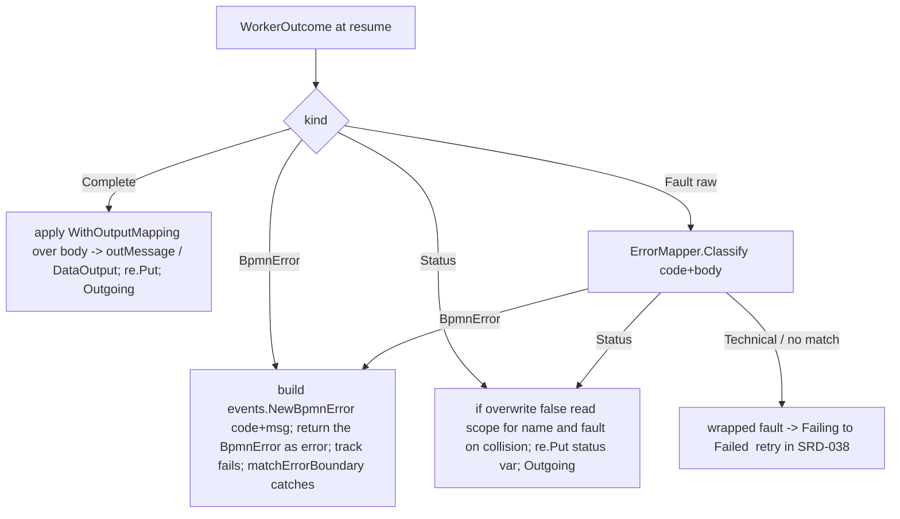
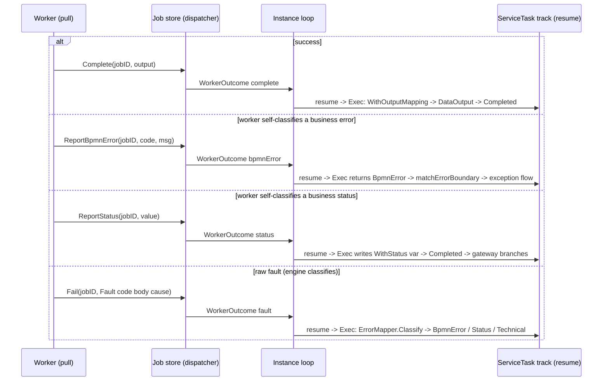

# SRD-037 — Service Task outcome classification & output mapping (M4, M5)

| Field | Value |
|---|---|
| Status | Draft (pending impl) |
| Version | v.1 |
| Date | 2026-07-07 |
| Owner | Ruslan Gabitov |
| Implements | [ADR-021 v.1 Service Task Execution Model](../design/ADR-021-service-task-execution-model.md) §2.5–§2.6 |

> **Draft** — third of four SRDs landing [ADR-021 v.1](../design/ADR-021-service-task-execution-model.md)
> (**M4 + M5** of M1–M8). Builds on the external-worker foundation ([SRD-036](SRD-036-service-task-job-queue.md),
> Accepted): a worker-dispatched ServiceTask parks, enqueues, and resumes on a **`Complete` / `Fail`** report.
> **M4** adds **outcome classification** — a worker outcome resolves to one of four kinds (success, **Business
> Error** → BPMN errorCode, **Business Status** → status variable, **technical** → terminal here) by **code +
> body**, via worker self-classification **and** a first-class declarative **`ErrorMapper`**, with
> **`WithStatus`**. **M5** adds **output mapping** — **`WithOutputMapping`** shapes a raw response body into the
> `DataOutput`. **Out of scope, → [SRD-038](../design/ADR-021-service-task-execution-model.md) (M6–M8):** the
> **`WithWorkerTrust`** knob (policy-bundle shipping + `EngineAuthoritative`), the **retry policy** (technical
> faults stay **terminal** here; SRD-038 re-routes them through retry), and the worked example. Sibling:
> **SRD-035** (M1, Accepted), **SRD-036** (M2/M3, Accepted).

---

## 1. Background (verified against the code)

### 1.1 The decision this SRD lands ([ADR-021 v.1](../design/ADR-021-service-task-execution-model.md) §2.5–§2.6)

A worker outcome is **not** a bare `Complete`/`Fail`. It resolves to **four kinds** (§2.6): **Success** (bind the
output, complete); **Business Error** — an *interrupting*, model-relevant failure raised as a **BPMN Error**
(errorCode) that an Error **boundary event** catches (ADR-018); **Business Status** — a *non-interrupting*
outcome written to a **status variable** so the task **completes normally** and a downstream gateway branches (the
Camunda-Connector idiom); **technical fault** — a transient infrastructure failure. Classification is decided
**when the report arrives** (no goroutine) by the outcome's **code** (a protocol/domain status) and **body** (the
payload): a worker may **self-classify**, or report a raw fault the engine classifies via a declarative
**`ErrorMapper`** (`match(code, bodyClause?) → BpmnError | Status | Technical`, first match wins). Output mapping
(§2.5) shapes a raw response **body** into the `DataOutput` via **`WithOutputMapping`** — the success-path twin of
the `ErrorMapper`, both reading the body through the same **protocol-bound** path mechanism.

### 1.2 The base this SRD extends — SRD-036 M2/M3 (verified, Accepted)

The worker report surface today is two terminal kinds (`pkg/tasks/workerdispatcher.go:108-118`):

```go
Complete(ctx, jobID JobID, workerID WorkerID, output *data.ItemDefinition) error
Fail(ctx, jobID JobID, workerID WorkerID, cause error) error   // ← reworked in M4 (structured fault)
// "Report methods for the classified outcomes (business status, BPMN error) join in SRD-037." (:82-83)
```

The report rides back as a `tasks.WorkerOutcome` (`pkg/tasks/workeroutcome.go:21-45`: `{cause, output, jobID}`,
`NewWorkerComplete` / `NewWorkerFail`), a synthetic `flow.EventDefinition` delivered to the parked track;
`ServiceTask.ProcessEvent` (`pkg/model/activities/service_task.go:356-378`) type-asserts it and stashes
`completedOutput` / `outcomeErr`; `execWorkerOutcome` (`:305-332`) binds the output (`re.Put`) **or** returns the
fault on resume. M4/M5 extend exactly these three seams — the report surface, the `WorkerOutcome`, and
`ProcessEvent`/`execWorkerOutcome`.

### 1.3 The machinery M4/M5 reuse (verified — all present, nothing new at the foundation)

- **Raise a BPMN Error caught by errorCode.** `events.BpmnError{Code string, Err error}` +
  `events.NewBpmnError(code, cause)` (`pkg/model/events/bpmn_error.go:15-33`). The loop's
  **`matchErrorBoundary`** (`internal/instance/boundary_watch.go:186-224`) does
  `errors.As(t.lastErr, &be)` (`:194`) and matches `be.Code` against each Error boundary's
  `ErrorEventDefinition.Error().ErrorCode()` (`:210-213`), spawning the boundary's exception flow on a match
  (`:215-217`); no match → the instance faults (`applyFailed`, `instance.go:1138`). **So a Business Error is
  raised by returning a `*events.BpmnError` from `execWorkerOutcome`** — the track fails with it as `lastErr`, and
  the existing SRD-029 path catches it. No new raise mechanism.
- **Write a named scope variable.** `renv.RuntimeEnvironment.Put(dd ...data.Data)`
  (`pkg/renv/runtimeenvironment.go:39`) stores node-produced values that reach the container scope at frame
  commit; `data.MustParameter(name, data.MustItemAwareElement(item, data.ReadyDataState))`
  (`service_task.go:317-319`) is the exact shape `execWorkerOutcome` already uses to commit its output. **So
  `WithStatus` writes a Parameter named by the option** — a downstream exclusive gateway reads it.
- **Evaluate an expression over data (predicates + output mapping).** `expression.Engine.Evaluate(ctx, expr
  data.FormalExpression, src data.Source) (data.Value, error)` (`pkg/model/expression/expression.go:21-24`),
  Go-native default `goexpr` (`goexpr/goexpr.go:20-24`); the exclusive gateway evaluates its conditions this way —
  `re.ExpressionEngine().Evaluate(ctx, cond, re)` (`pkg/model/gateways/gateway.go:236`). **So the in-process
  `ErrorMapper` body-clause and `WithOutputMapping` reuse `re.ExpressionEngine()`** over a Source exposing the
  outcome's `{code, body}`.
- **Operation error classes.** `service.Operation.Errors() []string` (`operation.go:52`, from
  `Implementor.ErrorClasses()`, `:114-116`) — string classes, **no explicit `errorRef` field**. The ADR's "the
  mapped errorCode should correspond to a declared `errorRef`" is thus an **advisory convention** (name ↔ code),
  not an enforced link.

### 1.4 Scope boundary — **trusted-implicit**; trust knob & retry → SRD-038 (design choice, confirmed)

0.1.x has only **in-process local Go workers** via the `localdispatcher` pool (SRD-036) — no remote or untrusted
worker until ADR-004. Every worker is therefore effectively **trusted**, so M4/M5 land the outcome **model +
engine-side application** on the `WorkerTrusted`-implicit path (worker self-classification honored; `ErrorMapper`
as the fallback over a raw fault), **without** the explicit `WithWorkerTrust(mode)` knob. The knob (policy-bundle
shipping + the `EngineAuthoritative` sole-authority path) and the **retry policy** move to **SRD-038** — where the
two trust modes' only observable difference (retry **location**) becomes real. A **technical fault is terminal
here** (`Failing → Failed`), exactly as `Fail` is in M3; SRD-038 re-routes it through retry — a change to *how the
outcome is handled*, forward-compatible (no signature change on the report call).

## 2. Requirements

### Functional — M4 (classification)

- **FR-1 — Structured fault `{code, body}`.** `Fail` is reworked to carry a **structured fault**, not a bare Go
  `error`: `Fault{ Code string; Body *data.ItemDefinition; Cause error }` (`Cause` is the diagnostic Go error).
  `WorkerDispatcher.Fail(ctx, jobID, workerID, Fault)`; the `WorkerOutcome` carries the raw fault so the engine
  `ErrorMapper` can classify `{code, body}` at resume. A pure-technical fault is `Fault{Cause: err}` (empty code,
  nil body) — no rule matches → default technical (§2.6).
- **FR-2 — Worker self-classified reports.** Two report methods join `WorkerDispatcher` (SRD-036 forward note):
  **`ReportBpmnError(ctx, jobID, workerID, code string, message string)`** (the worker declares a Business Error =
  Camunda `handleBpmnError`) and **`ReportStatus(ctx, jobID, workerID, value *data.ItemDefinition)`** (the worker
  declares a Business Status). Each becomes a classified `WorkerOutcome` variant. Explicit worker classification
  **wins** over the `ErrorMapper` (precedence §2.6).
- **FR-3 — Declarative `ErrorMapper` (engine-side).** An `ErrorMapper` is an **ordered rule list**,
  `match(codeMatcher, bodyClause?) → BpmnError{code, message?} | Status{value} | Technical` (first match wins);
  `bodyClause` is an optional `data.FormalExpression` evaluated over the fault's `{code, body}` (in-process
  binding: gobpm expressions over Go values), `value` a literal or body-extracted. A **pluggable `ErrorMapper`
  interface** covers imperative cases the rule list can't express. Configured **two-level**:
  **`WithWorkerErrorMapper(m)`** (engine-wide default) and **`WithErrorMapper(m)`** (per-service override). The
  engine applies it to a **raw `Fail`** only (an explicit `ReportBpmnError`/`ReportStatus` bypasses it); no rule
  matches → **default technical**.
- **FR-4 — Business Error application.** A `BpmnError{code, message?}` outcome (worker-reported or mapper-yielded)
  makes `execWorkerOutcome` **return `events.NewBpmnError(code, message-as-cause)`** as the resume error; the track
  fails with it and the existing `matchErrorBoundary` path (§1.3) routes it to a matching Error **boundary event**
  (interrupting, `Failing → Failed` → exception flow) or, unmatched, faults the instance. The mapped `errorCode`
  **should correspond** to one of the `Operation`'s declared error classes (advisory, §1.3). Never retried.
- **FR-5 — Business Status application + `WithStatus`.** A `Status{value}` outcome writes `value` into a
  task-scoped variable named by **`WithStatus(statusName string, overwrite bool)`** (via
  `re.Put(data.MustParameter(statusName, …))`) and the task **completes normally** (tokens on the outgoing
  flows). **`overwrite = false`** (default): a pre-existing `statusName` in scope is a **runtime fault** (no
  silent clobber); **`overwrite = true`**: upsert. A `Status` outcome (worker-reported **or** an `ErrorMapper`
  rule yielding `Status`) on a ServiceTask with **no `WithStatus`** is a **build-time error** where statically
  detectable (a mapper rule) and a **runtime fault** otherwise (a worker report). Never retried.
- **FR-6 — Technical fault is terminal (retry → SRD-038).** A `Technical` outcome (raw `Fail` unmatched by the
  mapper, or `default technical`) faults the task `Failing → Failed` with the wrapped `Cause` — exactly as M3's
  `Fail`. Retry (re-enqueue / worker-internal) is **out of scope** (SRD-038); the outcome handling is
  forward-compatible (SRD-038 re-routes it, no report-surface change).

### Functional — M5 (output mapping)

- **FR-7 — `WithOutputMapping`.** An optional **`WithOutputMapping(rules)`** declares
  `{ body-path → output variable }` rules that extract fields from a `Complete`'s raw response **body** into the
  `Operation`'s `outMessage` / `DataOutput`, via `data.FormalExpression` over the body (in-process binding). Absent
  a mapping, the `Complete` payload is taken as the `outMessage` **directly** (the existing M3 path — it must match
  the shape). A **required** output path the response does not satisfy is a **technical fault** (the worker's
  response violated the contract, §2.6). This is the success-path twin of the `ErrorMapper` (FR-3), sharing the
  path mechanism.

### Non-functional

- **NFR-1 (no goroutine).** Classification + mapping run **at resume** in `execWorkerOutcome` (on the track's
  resume, triggered by the report) using `re`'s expression engine + scope — synchronous, no held goroutine
  (§2.6 "evaluated when the report arrives — no goroutine").
- **NFR-2 (single-writer preserved).** The status write is a `re.Put` into the resume frame (committed on the
  single-writer path); the Business Error reuses the loop-owned `matchErrorBoundary` (ADR-017/SRD-029). The
  dispatcher only reports; it never classifies against instance scope.
- **NFR-3 (protocol-bound mapper seam).** The mapper **abstraction** (rule = `code` + a predicate over `body`) is
  fixed and **shared** by `ErrorMapper` and `WithOutputMapping`; the concrete **binding** is a seam — in-process =
  gobpm `FormalExpression` over Go values (this SRD); JSON body + JSONPath + HTTP-status → ADR-004. An embedder can
  supply a binding for any protocol.
- **NFR-4 (trusted-implicit, forward-compatible).** No `WithWorkerTrust` knob (SRD-038); worker self-classification
  is honored and the `ErrorMapper` is the fallback — the `WorkerTrusted` precedence (§2.6). SRD-038 adds the knob
  + `EngineAuthoritative` (ignore worker self-classification) + policy shipping without changing these outcomes.
- **NFR-5 (gate).** diff-coverage ≥95% on touched files; `make ci` green; the classification/mapping + the
  Business-Error boundary path are `-race` clean.

## 3. Models

### 3.1 Report surface — `pkg/tasks/workerdispatcher.go` (EXTEND)

```go
// Fault is a worker's raw (unclassified) terminal fault. Code is a protocol/domain
// status (e.g. an HTTP status once a remote transport exists, ADR-004); Body is the
// response payload; Cause is the diagnostic Go error. The engine ErrorMapper
// classifies {Code, Body}; an all-empty Fault (just Cause) → default technical.
type Fault struct {
	Body  *data.ItemDefinition
	Cause error
	Code  string
}

type WorkerDispatcher interface {
	// ... Enqueue / FetchAndLock / ExtendLock unchanged (SRD-036) ...

	// Complete reports success (unchanged).
	Complete(ctx context.Context, jobID JobID, workerID WorkerID, output *data.ItemDefinition) error

	// ReportBpmnError declares a Business Error (Camunda handleBpmnError): the engine
	// raises errorCode, caught by a matching Error boundary event.
	ReportBpmnError(ctx context.Context, jobID JobID, workerID WorkerID, code, message string) error

	// ReportStatus declares a Business Status: the engine writes value to the
	// WithStatus variable and the task completes normally.
	ReportStatus(ctx context.Context, jobID JobID, workerID WorkerID, value *data.ItemDefinition) error

	// Fail reports a raw fault; the engine ErrorMapper classifies it (REWORKED: Fault
	// replaces the bare cause error).
	Fail(ctx context.Context, jobID JobID, workerID WorkerID, fault Fault) error
}
```

### 3.2 `WorkerOutcome` — the classified completion event (EXTEND)

```go
// WorkerOutcome now carries one of four classifications for job JobID. kind selects
// which fields are meaningful; ServiceTask.Exec dispatches on it at resume.
type WorkerOutcome struct {
	output   *data.ItemDefinition // kindComplete
	bpmnCode string               // kindBpmnError
	bpmnMsg  string               // kindBpmnError
	status   *data.ItemDefinition // kindStatus
	fault    Fault                // kindFault (raw — engine classifies)
	jobID    JobID
	kind     outcomeKind
	foundation.BaseElement
}

// Constructors: NewWorkerComplete(jobID, output) (existing), NewWorkerBpmnError(jobID,
// code, msg), NewWorkerStatus(jobID, value), NewWorkerFault(jobID, Fault) (replaces
// NewWorkerFail). Accessors expose kind + the active field.
```

### 3.3 The `ErrorMapper` rule model — `pkg/tasks` (NEW)

```go
// Outcome kinds a rule yields.
type MappedOutcome interface{ mappedOutcome() }
type BpmnError struct{ Code, Message string } // -> Business Error (interrupting, ADR-018)
type Status    struct{ Value data.Value }     // -> Business Status (WithStatus var)
type Technical struct{}                        // -> retry policy (SRD-038); terminal here

// Rule matches on code and, optionally, a predicate over the body; first match wins.
type Rule struct {
	Code       string                // exact code match ("" = any)
	BodyClause data.FormalExpression // optional predicate over {code, body}; nil = code-only
	Yield      MappedOutcome
}

// ErrorMapper classifies a raw fault. The declarative implementation is an ordered
// Rule list; a custom implementation covers imperative cases.
type ErrorMapper interface {
	Classify(ctx context.Context, ee expression.Engine, f Fault) (MappedOutcome, error)
}
```

The declarative `ErrorMapper` evaluates each `Rule.BodyClause` (when present) with `ee.Evaluate` over a transient
`data.Source` exposing the fault's `code` and `body`, returning the first rule's `Yield`; none match →
`Technical{}`. The `data.Source` interface is just `Find(ctx, name string) (Data, error)`
(`pkg/model/data/data.go:28-32`), so the binding is a **lightweight in-memory adapter** whose `Find` resolves
`"code"` → a string datum and `"body"` → the fault body — the same shape a `FormalExpression` reads from `re`
(the gateway-condition precedent, `gateway.go:236`). (Validating this adapter's ergonomics is the one open
implementation detail M4 confirms first.)

### 3.4 ServiceTask options + config (`activities`, EXTEND)

`srvTaskConfig` (SRD-035/036) gains `errorMapper tasks.ErrorMapper`, `statusVar string` + `statusOverwrite bool`,
and `outputMapping []tasks.OutputRule`. New `SrvTaskOption`s (same closure pattern as `WithTimeout`/`WithWorker`,
[[feedback_option_constructors]] — self-naming, reject invalid input, never erase a default):

```go
func WithErrorMapper(m tasks.ErrorMapper) SrvTaskOption      // per-service; nil rejected
func WithStatus(statusName string, overwrite bool) SrvTaskOption // empty name rejected
func WithOutputMapping(rules ...tasks.OutputRule) SrvTaskOption
// engine-wide default: WithWorkerErrorMapper(m) on the thresher/enginert config (two-level, §2.2)
```

Build-time guards (in `NewServiceTask`, beside the M3 `WithWorker`+goOperation guard): a declarative `ErrorMapper`
rule that yields `Status` while `WithStatus` is unset → error; `WithStatus`/`WithErrorMapper`/`WithOutputMapping`
on a **non-worker** ServiceTask → error (they govern the worker outcome only).

### 3.5 Resume dispatch — `ServiceTask.ProcessEvent` / `execWorkerOutcome` (EXTEND)

`ProcessEvent` stashes the whole `WorkerOutcome` (its kind + active field). `execWorkerOutcome` dispatches:



### 3.6 Lifecycle (worker report → classified terminal)



## 4. Analysis

### 4.1 Classify at **resume** (`execWorkerOutcome`), not at report time (FR-3, FR-4, NFR-1)

The `ErrorMapper` needs both the ServiceTask's mapper config **and** an expression engine + data source; `re`
(the `RuntimeEnvironment`) carries both, and it exists **only** on the track's resume `Exec`. Running the mapper
there — the direct, synchronous consequence of the report arriving (report → `ReportJobCompletion` →
`handleJobCompletion` → deliver → resume → `Exec`) — satisfies the ADR's "evaluated when the report arrives — no
goroutine" while reusing the exact seam M3 already runs (`execWorkerOutcome`). *Rejected: classify on the loop in
`handleJobCompletion`* — the loop would have to open a frame and run expression evaluation per report (heavier,
and it duplicates the resume machinery); the raw `{code, body}` riding in the `WorkerOutcome` to the resume is
cheaper and keeps the loop a pure router (NFR-2).

### 4.2 Business Error reuses the existing raise→catch path (FR-4)

`matchErrorBoundary` already does `errors.As(t.lastErr, &be)` against `*events.BpmnError` (§1.3). So a Business
Error is raised by building `events.NewBpmnError(code, message)` and **returning the resulting `*events.BpmnError`
as the resume error**; the track fails with it as `lastErr` and the SRD-029 boundary path catches it by `code`.
`errors.As` traverses the chain (`errs.ApplicationError.Unwrap` links the cause, verified), so returning it raw
is simplest and an `errs`-wrapped one would also match. `NewBpmnError` returns `(*BpmnError, error)` and errors
**only** on an empty code — which a Business-Error outcome's non-empty code precludes; the construction error is
propagated defensively as a technical fault. Zero new raise mechanism. *Rejected: a bespoke "throw error" call
from Exec* — duplicates the fail→boundary path ADR-018/SRD-029 owns.

### 4.3 Structured `Fault{code, body, cause}` over a bare error (FR-1)

The declarative `ErrorMapper` (ADR §7 requires it functional in 0.1.x) needs a `{code, body}` to classify; a bare
Go `error` carries neither. `Fault` gives the in-process worker a structured raw fault the mapper reads, and is
the **ready seam** ADR-004 plugs HTTP `{status, JSON}` into. `Cause` is retained for the diagnostic (a
pure-technical fault is `Fault{Cause: err}` → default technical). *Rejected: keep `Fail(cause error)` + a separate
raw-fault method* — two fault-report methods for one concept; a single structured `Fault` is cleaner and matches
the ADR's "a fault is a structured outcome carrying a code and a body".

### 4.4 `WithStatus` writes a free-named scope variable (FR-5)

`re.Put(data.MustParameter(statusName, …))` writes a named `Parameter` into the resume frame → the container
scope at commit (§1.3), exactly the shape a downstream exclusive gateway reads via `re.ExpressionEngine()`. The
`overwrite=false` collision guard reads scope for `statusName` before writing and faults on a hit — no silent
clobber (§2.6). *Rejected: require a declared `DataOutput` for the status* — the status variable is an engine
addition orthogonal to the Operation's `outMessage` contract; a free-named var matches the Camunda-Connector
"response-mapping → variable → gateway" idiom the ADR cites.

### 4.5 Mapper binding is a **protocol seam**, shared by both mappers (FR-3, FR-7, NFR-3)

`ErrorMapper` (classify a fault) and `WithOutputMapping` (shape an output) read the body through the **same** path
mechanism — a `(body format, path language)` binding. In-process that is gobpm `FormalExpression` over Go values
(this SRD); JSONPath-over-JSON rides with the HTTP transport in ADR-004. Fixing the abstraction now and leaving
the binding pluggable means ADR-004 adds a binding, not a redesign. *Rejected: a Go predicate `func(code, body)
bool` for the in-process body-clause* — it bypasses the expression mechanism the ADR names and diverges from the
`WithOutputMapping` path; the pluggable `ErrorMapper` interface already covers imperative cases.

### 4.6 Trusted-implicit; trust knob + retry deferred (NFR-4, FR-6)

See §1.4. 0.1.x workers are trusted local Go workers, so worker self-classification is honored and the
`ErrorMapper` is the fallback (`WorkerTrusted` precedence) — the knob would be inert. Deferring `WithWorkerTrust`
and retry to SRD-038 keeps this SRD to the **outcome model** and its **application**; SRD-038 adds *where the
policy runs* (trust) and *what a technical outcome triggers* (retry) together, since that is their shared concern.

## 5. API / contract surface

- **Reworked:** `WorkerDispatcher.Fail` (`cause error` → `Fault`); `WorkerOutcome` (classified variants,
  `NewWorkerFail` → `NewWorkerFault`); `localdispatcher` + the generated `WorkerDispatcher` mock update.
- **New (`pkg/tasks`):** `Fault`, `ReportBpmnError` / `ReportStatus` (interface methods), `ErrorMapper` +
  `Rule`/`MappedOutcome`/`BpmnError`/`Status`/`Technical`, `OutputRule`, `NewWorkerBpmnError`/`NewWorkerStatus`.
- **New (`activities`):** `WithErrorMapper`, `WithStatus`, `WithOutputMapping` `SrvTaskOption`s + `srvTaskConfig`
  fields + build guards; `execWorkerOutcome`/`ProcessEvent` classification dispatch.
- **New (engine config):** `WithWorkerErrorMapper` (engine-wide default) on the thresher/enginert config +
  `renv.EngineRuntime` accessor (two-level, §2.2).

## 6. Test scenarios

| Test | FR/NFR | Scenario |
|---|---|---|
| `TestWorkerReportBpmnErrorRaisesBoundary` | FR-2, FR-4 | `ReportBpmnError(code)` on a ServiceTask with a matching Error boundary → interrupts, resumes the exception flow |
| `TestWorkerBpmnErrorUnmatchedFaultsInstance` | FR-4 | a Business Error with no matching boundary → instance faults (not silently completed) |
| `TestWorkerReportStatusWritesVarAndCompletes` | FR-2, FR-5 | `ReportStatus(value)` writes the `WithStatus` variable and the task completes; a downstream gateway reads it |
| `TestWithStatusOverwriteGuard` | FR-5 | `overwrite=false` + pre-existing var → runtime fault; `overwrite=true` → upsert |
| `TestStatusWithoutWithStatusIsError` | FR-5 | a mapper rule yielding `Status` with no `WithStatus` → build error; a worker `ReportStatus` with none → runtime fault |
| `TestErrorMapperCodeOnlyToBpmnError` | FR-3, FR-4 | a raw `Fail{code:"409"}`, mapper rule `code 409 → BpmnError` → boundary |
| `TestErrorMapperBodyClauseToStatus` | FR-3, FR-5 | `Fail{code:"404", body}` + `bodyClause $.type=="NOT_FOUND"` → `Status` written |
| `TestErrorMapperNoMatchIsTechnical` | FR-3, FR-6 | `Fail{code:"500"}` unmatched → default technical → `Failing → Failed` |
| `TestWorkerClassificationBeatsMapper` | FR-2, FR-3 | an explicit `ReportBpmnError` is honored even when a mapper rule would classify differently (precedence) |
| `TestTwoLevelErrorMapperOverride` | FR-3 | per-service `WithErrorMapper` overrides the engine-wide `WithWorkerErrorMapper` |
| `TestWithOutputMappingShapesBody` | FR-7 | `Complete` with a raw body + `WithOutputMapping {$.data.id → orderId}` → `orderId` in `DataOutput` |
| `TestOutputMappingDirectReconciliationDefault` | FR-7 | no `WithOutputMapping` → the `Complete` payload is the `outMessage` directly (M3 path) |
| `TestRequiredOutputPathUnsatisfiedFaults` | FR-7 | a required output path the body lacks → technical fault |
| `TestClassificationOptionsRejectNonWorker` | FR-5, §3.4 | `WithStatus`/`WithErrorMapper`/`WithOutputMapping` on a non-worker ServiceTask → build error |

## 7. Milestones

1. **M4** — structured `Fault` + classified report surface (`ReportBpmnError`/`ReportStatus`, `Fail(Fault)`) +
   `WorkerOutcome` variants + the `ErrorMapper` rule model + `WithStatus`/`WithErrorMapper`/`WithWorkerErrorMapper`
   + `execWorkerOutcome`/`ProcessEvent` classification dispatch (Business Error → boundary, Business Status →
   var, technical → terminal) + build guards. `localdispatcher` + mock update. One commit.
2. **M5** — `WithOutputMapping` + the shared body-path binding (in-process `FormalExpression`) applied on a
   `Complete`; direct-reconciliation default; required-path fault. One commit.

## 8. Cross-doc

- **Implements:** [ADR-021 v.1](../design/ADR-021-service-task-execution-model.md) §2.5 (output mapping),
  §2.6 (outcome classification).
- **References (up / sideways):** [ADR-018 v.1](../design/ADR-018-boundary-events-and-activity-interruption.md)
  (Business Error → Error boundary interruption + chain — the FR-4 application),
  [ADR-011 v.5](../design/ADR-011-process-data-flow.md) (operation / data binding, expression mechanism),
  [ADR-017 v.1](../design/ADR-017-channel-based-event-processing.md) §2 (loop delivery / single-writer),
  [ADR-001 v.6](../design/ADR-001-execution-model.md) (execution model),
  [SAD-001 v.1](../design/SAD-001-vision-and-architecture.md) §11, §13.2.
- **Sibling SRDs:** SRD-035 (M1, Accepted), SRD-036 (M2/M3, Accepted); SRD-038 (M6–M8 — `WithWorkerTrust`,
  retry, example) forthcoming. SRD→SRD sideways; pins by number.
- **Backlog:** **AB-005** (structured `ItemDefinition` compose/spread) is the data-layer follow-up a rich
  `WithOutputMapping` (multi-variable spread) will lean on; out of scope here.
- Direction: SRD → ADR / SAD (up), SRD → SRD (sideways); no downward reference. **ADR-021 stays Draft** until
  SRD-038 lands.

## 9. Definition of Done

- FR-1…FR-7 implemented and wired; NFR-1…NFR-5 upheld.
- Every FR/NFR covered by ≥1 named §6 test, all green under `-race` (per-package coverage for the `activities` /
  `service` / `tasks` worker methods — the [[SRD-036]] per-package-gate lesson).
- The `Fail(cause error)` surface is reworked to `Fail(Fault)` with no stale callers; `WorkerOutcome` variants
  wired; the generated mock regenerated.
- `make ci` green (tidy · lint · build · `-race` · diff-coverage ≥95% on touched files · govulncheck).
- SRD-037 flips to Accepted. **ADR-021 stays Draft** until SRD-038 is grounded.

## 10. Implementation summary (stage-by-stage actual landings + deltas vs draft)

> ⚠️ TODO: fill AFTER landing (§10.1 stage commit SHAs for M4/M5, §10.2 empirical findings vs this draft).
