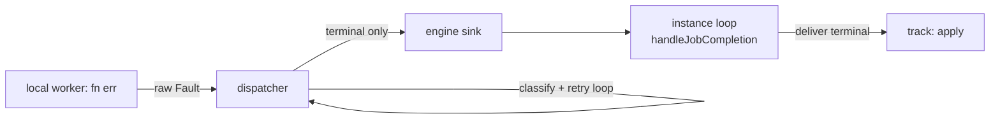
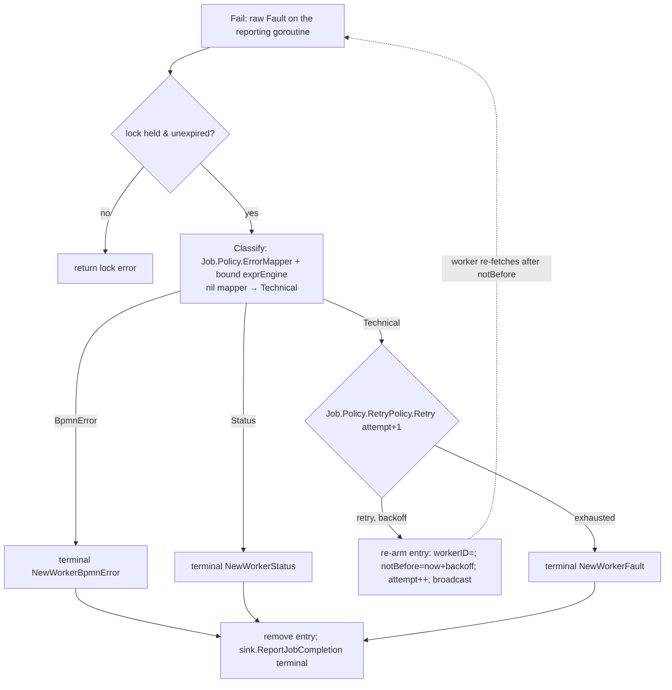

# SRD-038 — Service Task dispatch reshape & retry policy (M6, M7)

| Field | Value |
|---|---|
| Status | Accepted |
| Version | v.1 |
| Date | 2026-07-08 |
| Owner | Ruslan Gabitov |
| Implements | [ADR-021 v.1 Service Task Execution Model](../design/ADR-021-service-task-execution-model.md) §2.6–§2.8 |

> **Accepted** — fourth of five SRDs landing [ADR-021 v.1](../design/ADR-021-service-task-execution-model.md).
> Builds on classification ([SRD-037](SRD-037-service-task-classification.md), Accepted). Two coupled changes:
> **(1) Dispatch reshape** — move a worker fault's **classification** off the parked **track** and into the
> **dispatcher**, so classification + retry happen **before** the instance loop and the track only **applies** a
> pre-decided terminal outcome. This restores ADR-021 §2.7 ("only the terminal outcome reaches the loop"); SRD-037
> (M4) drifted classification to track-resume. **(2) Retry policy** — an extendable, batteries-included, two-level
> `RetryPolicy` (default 3× exponential-backoff+jitter). Retry is a **dispatcher-side delayed re-enqueue** (the
> dispatcher re-arms the job with a clock-gated backoff, no sleeping goroutine, the track stays parked), and
> retries-exhausted → an incident-like terminal `Failed` that reaches the **instance** (incident-ready). This is the
> ADR-021 **`EngineAuthoritative`** mode: the engine (here, its default in-process dispatcher) owns the policy and
> the worker returns raw `{code, body}`. **Out of scope, → SRD-039:** the `WithWorkerTrust` knob + the
> **`WorkerTrusted`** protocol (the worker runs the shipped policy internally, retries in-process, reports a verdict)
> + the worked example. Sibling: SRD-035 (M1), SRD-036 (M2/M3), SRD-037 (M4/M5), all Accepted.

---

## 1. Background (verified against the code)

### 1.1 SRD-037 (M4) left classification on the track — a drift from the ADR (verified)

Today a worker fault rides all the way to the parked track before it is classified. The dispatcher's `Fail` method
delivers a raw `tasks.WorkerOutcome` (`OutcomeFault`) to the engine sink; `Instance.handleJobCompletion`
(`internal/instance/jobs.go:59-90`) resolves `jobID → track` and **delivers straight to the track's `evtCh`**:

```go
// jobs.go:85-89 (current)
flipNotParked(tr, waiting, msgIdx)
delete(jobs, jobID)
tr.evtCh <- req.outcome        // ← wakes the track for it to classify + apply
req.reply <- nil
```

The woken track runs `ServiceTask.execWorkerOutcome` (`service_task.go:337-363`), whose `OutcomeFault` case calls
`classifyFault` (`:478-519`) — running the two-level `ErrorMapper` at **resume, on the track**. But ADR-021 §2.7 is
explicit that under `EngineAuthoritative` "**only the terminal outcome reaches the loop**", and §2.6 that "the
**engine** runs the `ErrorMapper` (sole authority)". So classification is meant to happen **before** the instance
loop; M4 drifted it onto the track (as its own §4.1 acknowledged, deferring the locus). SRD-038 moves it to where
the ADR puts it — the **dispatcher** — and that move is exactly what retry needs.

### 1.2 Why classification must precede the loop (the design driver)

Retry applies to **technical faults only** (ADR-021 §2.7): a technical fault re-runs the worker with backoff, and
the ServiceTask must **stay parked** across attempts. A raw fault is only known to be technical (vs a business
`BpmnError`/`Status` the `ErrorMapper` extracts from `{code, body}`) **after** classification — so the retry
decision **requires** classification first. If classification stayed on the track, every intermediate technical
fault would have to wake the track and send it back to sleep per attempt ("re-park"), and the track would have to
carry the retry-cycle count it should not own.

The clean structure (and the ADR's): **the worker returns a raw fault; the dispatcher classifies it and decides —
re-publish (retry) or escalate a terminal outcome to the instance; the instance loop receives only terminals; the
track applies one terminal.** The engine holds no live call between attempts — a re-armed job plus a parked track
are both persistable (§2.7).



### 1.3 Incident-readiness — the terminal reaches the instance, not the dispatcher's edge (design intent)

Retries-exhausted terminates the task `Failed` (§2.8), but the exhausted **terminal is delivered to the instance
loop** (like every other terminal), not swallowed at the dispatcher's edge. This is deliberate: it keeps the
**instance** the single owner of every ServiceTask terminal, which is what a future first-class **Incident**
construct needs — on exhaustion the instance can hold the track **parked** (an incident awaiting operator
resolution) instead of faulting it, and a parked-during-incident track is the same shape that **dehydrates**
cleanly, unified with parked UserTasks (ADR-020) and long timer events. SRD-038 lands the terminal `Failed`; the
incident-hold + dehydration is a **future ADR** (§2.8) the seam is built for.

### 1.4 The reshape rails (verified)

- **Classification needs only the fault + an expression engine — no process scope.**
  `ErrorMapper.Classify(ctx, ee expression.Engine, f Fault)` (`pkg/tasks/errormapper.go:67`) takes the expression
  engine **directly** and builds its transient source from the `Fault`'s `{code, body}` — it reads no frame. So the
  dispatcher can classify a raw fault on the reporting goroutine given a bound expression engine, no frame, no
  instance involvement.
- **The dispatcher already has a per-job store to re-arm.** `localdispatcher.jobEntry`
  (`localdispatcher.go:46-51`) holds each job's lock state keyed in `byID`/`byTopic`; `lockNext`
  (`:181-214`) hands out an entry when `e.workerID == "" || now.After(e.deadline)`, over the injected
  `clock.Clock`. A retry re-arms the **existing** entry (unlock + a `notBefore` gate + attempt++) — no re-enqueue
  round-trip through the instance.
- **The clock already supports a timed wake.** `clock.Clock` (`pkg/clock/clock.go:10-15`) is `Now()` +
  `After(d time.Duration) <-chan time.Time`; `syscl` and the `clocktest` fake both implement `After`. So
  `FetchAndLock` can wake at the nearest future `notBefore` with `clk.After(until)` — no timer per job, no clock
  interface change.
- **The binder seam exists to give the dispatcher the expression engine.** The engine already binds its sink and
  logger onto the dispatcher at startup via `tasks.SinkBinder`/`tasks.LoggerBinder`
  (`workerdispatcher.go:156-170`, called in `thresher.go:209-218`). SRD-038 mirrors it with a
  `tasks.ExpressionEngineBinder`.
- **`Job.Policy` is a ready placeholder.** `tasks.Policy` (`workerdispatcher.go:61-65`) is an empty `struct{}`
  documented as the SRD-037/038 fill; `Job` carries `Policy *Policy` (`:69-74`, the field at `:71`), populated
  nowhere yet (`enqueueJob`, `jobs.go:155-156`, sets only `{ID, Topic, Input}`). SRD-038 fills `Policy` with the
  resolved `{ErrorMapper, RetryPolicy}` and populates it at enqueue.

## 2. Requirements

### Functional — dispatch reshape (M6)

- **FR-1 — Classification moves to the dispatcher.** A raw worker fault (`Fail`) is classified **in the dispatcher**,
  on the reporting goroutine, via the resolved `Job.Policy.ErrorMapper` and a bound expression engine — **not** on
  the track, **not** on the instance loop. This restores ADR-021 §2.7 ("only the terminal outcome reaches the
  loop"). `ServiceTask.classifyFault` is removed from the track.
- **FR-2 — `Job.Policy` carries the resolved outcome policy; the instance resolves it at enqueue.** The instance,
  in `enqueueJob` (loop goroutine), resolves the **two-level** policy — per-service (a new `tasks.WorkerConfig`
  exposed by the node) over engine-wide defaults — and populates `Job.Policy{ErrorMapper, RetryPolicy}`.
  `tasks.WorkerConfig` (implemented by `ServiceTask`, `ok == false` for an in-process task) surfaces the node's
  per-service `ErrorMapper`/`RetryPolicy`. `tasks.Policy` grows from the empty placeholder to
  `{ErrorMapper, RetryPolicy}`.
- **FR-3 — The dispatcher receives the expression engine via a binder seam.** A new `tasks.ExpressionEngineBinder`
  (`BindExpressionEngine(expression.Engine)`), bound at engine startup exactly like `BindLogger`/`BindSink`, gives
  the dispatcher the engine it needs to run the `ErrorMapper`. A dispatcher that reaches an engine another way
  (a remote adapter) need not implement it.
- **FR-4 — The track's apply shrinks to terminals only.** `execWorkerOutcome` receives only **terminal** outcomes:
  `OutcomeComplete` → `bindOutput` (+ `WithOutputMapping`), `OutcomeBpmnError` → `raiseBpmnError`, `OutcomeStatus`
  → `writeStatus`, `OutcomeFault` → `technicalFault` (the terminal, retries-exhausted case — **not** re-classified).
  The track parks once and wakes once.

### Functional — retry policy (M7)

- **FR-5 — `RetryPolicy` abstraction + batteries.** `pkg/tasks.RetryPolicy` decides, given the attempt count and
  the technical cause, whether to retry and the backoff before the next attempt. Batteries-included: `NoRetry`,
  `FixedDelay(maxAttempts, delay)`, `ExponentialBackoff(maxAttempts, base, max, jitter)`. **Default — 3 attempts,
  exponential backoff with jitter** (count 3 = Camunda `defaultNumberOfRetries`; backoff improves on Camunda's
  zero-wait default, ADR-021 §2.7).
- **FR-6 — Two-level config.** Engine-wide `WithWorkerRetryPolicy(p)` (on the thresher/enginert config +
  `renv.EngineRuntime.WorkerRetryPolicy()` accessor) and per-service `activities.WithRetryPolicy(p)`; the
  per-service policy overrides the engine-wide default; absent both, `DefaultRetryPolicy` applies. The instance
  resolves the effective policy at enqueue into `Job.Policy` (so `Job.Policy.RetryPolicy` is always non-nil).
  Mirrors `WorkerErrorMapper` (SRD-037 FR-3) exactly.
- **FR-7 — Retry = dispatcher-side delayed re-enqueue (no sleeping goroutine).** On a **Technical** classification
  the dispatcher consults `Job.Policy.RetryPolicy` against the entry's attempt count: if it retries, the dispatcher
  **re-arms the existing store entry** — unlock it, set `notBefore = clk.Now() + backoff`, increment `attempt` —
  **without delivering** (the track stays parked). `lockNext` skips a still-gated entry; `FetchAndLock` wakes at the
  nearest `notBefore` via `clk.After`; a worker re-fetches after the backoff and the loop repeats. The engine holds
  no live call (a re-armed job + a parked track are both persistable, §2.7).
- **FR-8 — Retries-exhausted → incident-like `Failed`, delivered to the instance.** When the policy is exhausted,
  the dispatcher delivers a **terminal** technical `OutcomeFault` to the sink; the instance loop routes it to the
  track, which faults `Failing → Failed` with a diagnostic identifying the exhausted job (topic, attempts, last
  error). It is **not** an auto-raised catchable BPMN Error (§2.8) — infrastructure exhaustion is operational, not
  a model fault. The terminal reaching the **instance** (not the dispatcher's edge) is the incident-ready seam
  (§1.3); the first-class Incident construct (parked-hold + operator surface + dehydration) is a **future ADR**.

### Non-functional

- **NFR-1 (park-once).** The track parks exactly once (`onJobWaiting`) and wakes exactly once (on the terminal
  outcome). Intermediate retried faults never reach the instance loop or `evtCh` — no re-park.
- **NFR-2 (only-terminal-to-loop).** `handleJobCompletion` receives only terminal outcomes; classification + the
  retry loop run in the dispatcher, before the instance loop (ADR-021 §2.7). The instance's role in a retried job is
  one enqueue (with the resolved policy) and one terminal.
- **NFR-3 (dehydration-friendly / incident-ready).** Retry is a clock-gated re-arm — no per-job timer goroutine
  (the fetch loop's single `clk.After` wait), no sleeping goroutine; a re-armed (waiting-for-`notBefore`) job plus a
  parked track are both persistable (§2.7). The exhausted terminal reaches the instance (§1.3).
- **NFR-4 (technical-only).** Only a Technical classification is retried; Success / Business Error / Business Status
  are terminal on first report — never retried (§2.7).
- **NFR-5 (single-writer preserved).** The instance loop stays the sole owner of the `jobs` registry and the sole
  sender to `evtCh`. The dispatcher's classify+retry runs on the worker's reporting goroutine over the dispatcher's
  own mutex-guarded store — it shares no state with the loop, and delivers terminals through the existing sink.
- **NFR-6 (gate).** diff-coverage ≥95% on touched files; `make ci` green; the dispatcher classify/retry
  (clock-driven re-arm + timed wake) is `-race` clean.

## 3. Models

### 3.1 `RetryPolicy` — `pkg/tasks/retrypolicy.go` (NEW)

```go
// RetryPolicy decides whether a technical fault is retried and the backoff before
// the next attempt (ADR-021 §2.7). attempt is the 1-based number of the attempt
// that just failed; cause is its technical error.
type RetryPolicy interface {
	Retry(attempt int, cause error) (backoff time.Duration, retry bool)
}

// Batteries: NoRetry (never), FixedDelay(maxAttempts, delay), and
// ExponentialBackoff(maxAttempts, base, max, jitter). DefaultRetryPolicy is
// ExponentialBackoff(3, base, max, jitter) — Camunda's count-of-3 with a
// non-zero backoff.
func NoRetry() RetryPolicy
func FixedDelay(maxAttempts int, delay time.Duration) RetryPolicy
func ExponentialBackoff(maxAttempts int, base, max time.Duration, jitter bool) RetryPolicy
func DefaultRetryPolicy() RetryPolicy
```

### 3.2 `Policy` filled — `pkg/tasks/workerdispatcher.go` (EXTEND)

The empty placeholder becomes the resolved outcome bundle the dispatcher consumes (and, under SRD-039
`WorkerTrusted`, ships to the worker):

```go
// Policy is a worker-dispatched ServiceTask's resolved outcome policy. Under
// EngineAuthoritative (SRD-038) the dispatcher uses it to classify a raw fault
// (ErrorMapper) and drive retries (RetryPolicy); under WorkerTrusted (SRD-039) it
// is shipped to the worker. The instance resolves it (two-level) at enqueue.
type Policy struct {
	ErrorMapper ErrorMapper // nil = raw faults fall through to the default Technical outcome
	RetryPolicy RetryPolicy // always non-nil after resolution (DefaultRetryPolicy if unset)
}
```

`OutputMapping`/`StatusVar` are **not** in `Policy` — the track applies them and it holds the `ServiceTask`
directly (`execWorkerOutcome` is a `*ServiceTask` method), so they need no shipping. (SRD-039 revisits this if a
`WorkerTrusted` worker maps its own output.)

### 3.3 `WorkerConfig` — `pkg/tasks` (NEW), feeds enqueue

```go
// WorkerConfig is implemented by a node whose worker outcome the engine
// classifies + retries. WorkerConfig returns the node's per-service policy
// (either field nil = fall back to the engine-wide default at resolution).
// ok == false for an in-process ServiceTask.
type WorkerConfig interface {
	WorkerConfig() (errorMapper ErrorMapper, retryPolicy RetryPolicy, ok bool)
}
```

`ServiceTask` gains a `retryPolicy tasks.RetryPolicy` field (from `WithRetryPolicy`) and implements `WorkerConfig`
(returning `st.errorMapper`, `st.retryPolicy`, `ok == workerTopic != ""`).

### 3.4 Dispatcher classify + retry — `pkg/tasks/localdispatcher` (RESHAPE)

`jobEntry` gains `attempt int` and `notBefore time.Time`; `Dispatcher` gains an `exprEngine expression.Engine`
(bound). `Fail` becomes the classify+retry locus (the other report methods stay terminal-only):



Classification runs **outside** `d.mu` while the entry stays locked by the reporting worker (its lock is still
valid, so no concurrent fetch); the decision (re-arm or remove) re-acquires `d.mu`. **On re-acquire, `Fail`
re-validates the entry via the `heldEntry` invariant** (still present, still held by the reporting worker) before
re-arm/remove — a lock that expired *during* a long classification is dropped rather than stomping a new holder.
That expiry is only reachable with **multiple workers per topic**; the shipped `localdispatcher` registers exactly
one worker per topic (`RegisterWorker` rejects duplicates) and `runWorker` calls `Fail` synchronously before its
next fetch, so no concurrent fetch can occur during the classify window in 0.1.x — the re-validation guards the
general `Dispatcher` seam (its crash-recovery reclaim path). Because the retry path must **keep** the entry to
re-arm it, `Fail` gets its own classify+retry path and **stops delegating to `report()`** (which removes the entry
before delivery); `Complete`/`ReportBpmnError`/`ReportStatus` keep using `report()`. Only the **Fault** kind is
classified — `Complete` is terminal as today; `ReportBpmnError`/`ReportStatus` (worker self-classified verdicts)
stay terminal pass-throughs (the local pool emits only `Complete`/`Fail`, so they matter for SRD-039).

### 3.5 `lockNext` gate + `FetchAndLock` timed wake — `pkg/tasks/localdispatcher` (EXTEND)

`lockNext` grows its return from `(LockedJob, bool)` to `(LockedJob, time.Time, bool)` — the middle value is the
earliest future gate across the scanned entries, captured under the same `d.mu` — so it can skip a re-armed entry
while gated and hand the fetch loop a wake time:

```go
// in lockNext's per-entry scan, after the lock check:
if !e.notBefore.IsZero() && now.Before(e.notBefore) {
    // track the earliest future gate for the caller's timed wake
    if next.IsZero() || e.notBefore.Before(next) {
        next = e.notBefore
    }
    continue
}

// FetchAndLock: when nothing is immediately available, also wake at the nearest gate.
var timer <-chan time.Time
if !next.IsZero() {
    timer = d.clk.After(next.Sub(d.clk.Now()))
}
select {
case <-wake:  continue // a job was enqueued
case <-timer: continue // a backoff gate elapsed (nil channel blocks forever)
case <-ctx.Done(): return nil, ctx.Err()
}
```

### 3.6 Instance enqueue resolves the policy — `internal/instance/jobs.go` (EXTEND)

`enqueueJob` resolves the two-level policy and populates `Job.Policy`; `handleJobCompletion` is **unchanged** (it
already delivers the — now always terminal — outcome to the track). The `jobs` registry stays `map[JobID]*track`.

```go
// enqueueJob, after binding input:
em, rp := inst.resolveWorkerPolicy(ev.node) // per-service (WorkerConfig) over engine-wide over default
return inst.WorkerDispatcher().Enqueue(ctx, tasks.Job{
    ID: jobID, Topic: topic, Input: input,
    Policy: &tasks.Policy{ErrorMapper: em, RetryPolicy: rp},
})

// resolveWorkerPolicy: em may stay nil (→ default Technical); rp is never nil.
//   em: node.WorkerConfig().errorMapper  ?? inst.WorkerErrorMapper()
//   rp: node.WorkerConfig().retryPolicy  ?? inst.WorkerRetryPolicy() ?? tasks.DefaultRetryPolicy()
```

### 3.7 Track apply — `activities.execWorkerOutcome` (SHRINK)

The `OutcomeFault` case changes from `classifyFault(...)` to `st.technicalFault(fault)` (the terminal
retries-exhausted case); `classifyFault` is **deleted** from the ServiceTask. `technicalFault`'s doc-comment
(`service_task.go:521-522`, currently "retry arrives in SRD-038") is refreshed — it is now the terminal
retries-exhausted apply, not a placeholder. `bindOutput` / `raiseBpmnError` / `writeStatus` / `ProcessEvent` are
unchanged.

## 4. Analysis

### 4.1 Classify in the dispatcher, before the loop (FR-1, NFR-2)

`ErrorMapper.Classify` reads the fault's `{code, body}` and takes the expression engine as a parameter, so it runs
on the reporting goroutine with the dispatcher's bound engine — no frame, no instance involvement. Placing it in
the dispatcher (not the instance loop) is the ADR's own wording ("only the terminal outcome reaches the loop",
"the engine runs the ErrorMapper") and is what lets the retry loop stay entirely off the track. *Rejected:
classify on the instance loop (an earlier SRD-038 sketch)* — it makes the instance run the dispatcher's
retry-orchestration (re-enqueue, attempt counting) per attempt; the user's design correction is that retry is
dispatcher work and the instance should see only terminals. *Rejected: keep classify on the track (SRD-037 status
quo)* — forces re-park per attempt and track-held retry state, the exact coupling this SRD removes.

### 4.2 The dispatcher owns classify+retry; ADR-004 remote is a later locus call (FR-1, scope)

For the in-process `localdispatcher` — the default and only transport in 0.1.x — the dispatcher owns classify+retry
directly: it already has the per-job store to re-arm, and gets the expression engine + resolved policy via the
binder seam + `Job.Policy`. A **remote** dispatcher (ADR-004) under `EngineAuthoritative` would either implement
the same behavior in its adapter or the engine grows a shared pre-loop classify locus — an ADR-004 transport
decision, not this SRD's. SRD-038 scopes to the local transport, matching the user's model ("the worker sends raw
data to the dispatcher, and the dispatcher decides re-publish vs escalate").

### 4.3 Retry = re-arm the existing entry, attempt count in the store (FR-7, NFR-3)

The backoff is a `notBefore` gate on the **existing** entry (unlock + gate + `attempt++`), not a re-enqueue round
trip and not a timer — so no goroutine sleeps and a waiting-to-retry job is persistable (§2.7). The attempt count
is retry state owned by the dispatcher's store (where the job already lives), not shipped to the worker and not held
by the instance. The fetch loop wakes at the nearest gate via `clk.After` — one bounded wait shared by all gated
jobs on a topic, not one timer per job. *Rejected: a per-retry timer/goroutine* — un-persistable, one goroutine per
retried job. *Rejected: re-enqueue via `Enqueue` (remove + re-add)* — needless index churn and a duplicate-id
window; re-arming the entry in place is simpler and keeps the job's identity and input.

### 4.4 Exhaustion is `Failed` and reaches the instance (FR-8, §1.3)

Exhausted retries are an **operational** condition (a stuck job), not a business fault, so they terminate the task
`Failed` with a diagnostic rather than raising a catchable errorCode — Camunda's incident distinction (§2.8).
Delivering that terminal **to the instance** (not resolving it at the dispatcher's edge) keeps the instance the
single owner of every terminal, which is the seam a future Incident construct needs to hold the track parked
(instead of faulting) and dehydrate it — unified with parked UserTasks and long timers. What lands here is the
terminal, observable `Failed`.

### 4.5 `EngineAuthoritative`; `WorkerTrusted` → SRD-039 (scope)

With the engine (its dispatcher) owning classification + retry and the worker returning raw `{code, body}`, this
**is** ADR-021 `EngineAuthoritative`. SRD-039 adds the `WithWorkerTrust` knob and the `WorkerTrusted` protocol (the
worker runs the shipped `Job.Policy` internally — maps its output, self-classifies, retries in-process holding its
lock — and reports a verdict the dispatcher forwards without re-classify/retry), plus the worked example. No ADR-004
dependency: ADR-004 is the remote *transport* for the same two protocols. Until SRD-039 lands the knob,
`EngineAuthoritative` is the implicit (only) mode.

## 5. API / contract surface

- **New (`pkg/tasks`):** `RetryPolicy` + `NoRetry`/`FixedDelay`/`ExponentialBackoff`/`DefaultRetryPolicy`;
  `WorkerConfig` interface; `ExpressionEngineBinder` interface. **Filled:** `Policy{ErrorMapper, RetryPolicy}`.
- **New (`activities`):** `WithRetryPolicy(p)` `SrvTaskOption`; `ServiceTask.WorkerConfig()`; `retryPolicy` field.
  **Removed from the track:** `ServiceTask.classifyFault`.
- **New (engine config):** `WithWorkerRetryPolicy` (thresher + enginert) + a `WorkerRetryPolicy()` method **added to
  the `renv.EngineRuntime` interface** — forcing accessors on `enginert.Runtime` and `thresher.thresherConfig` (the
  `WorkerErrorMapper()` mirror) and a **`mockrenv` regeneration** (`make gen_mock_files`).
- **Reshaped (`localdispatcher`):** `Dispatcher.exprEngine` + `BindExpressionEngine`; `Fail` classify+retry;
  `jobEntry.{attempt, notBefore}`; `lockNext` gate + `FetchAndLock` timed wake.
- **Reshaped (`instance`):** `enqueueJob` resolves + populates `Job.Policy` (`handleJobCompletion` unchanged).
- **New startup wiring (`thresher`):** `BindExpressionEngine(cfg.ExpressionEngine())` alongside the existing
  `BindSink`/`BindLogger`.

## 6. Test scenarios

**Proposed** (to be implemented in M6/M7; §10 records the actual landed names).

| Test | FR/NFR | Scenario |
|---|---|---|
| `TestDispatcherClassifiesFaultToBpmnError` | FR-1, FR-4 | a raw `Fail` classified **by the dispatcher** → the sink/loop receives a terminal BpmnError → the track raises it → boundary |
| `TestDispatcherClassifiesFaultToStatus` | FR-1 | a raw `Fail` mapped to Status → terminal Status → the track writes the status var and completes |
| `TestEnqueueResolvesTwoLevelPolicy` | FR-2, FR-6 | `enqueueJob` populates `Job.Policy` from per-service `WorkerConfig` over engine-wide over `DefaultRetryPolicy`; an in-process task enqueues nothing |
| `TestBindExpressionEngineSeam` | FR-3 | the engine binds its expression engine onto the dispatcher at startup; a fault classifies with it |
| `TestTrackAppliesTerminalOnly` | FR-4, NFR-1 | the track parks once / wakes once; a raw fault reaches the track **only** as a terminal (never re-classified there) |
| `TestRetryPolicyBatteries` | FR-5 | `NoRetry` never retries; `FixedDelay`/`ExponentialBackoff` retry to `maxAttempts` with the expected backoff; `DefaultRetryPolicy` = 3 attempts |
| `TestTechnicalFaultRetriesViaReArm` | FR-7, NFR-1/3 | a technical fault re-arms the entry with backoff; advancing the clock lets a worker re-fetch; the track stays parked across attempts; no delivery until terminal |
| `TestLocalDispatcherNotBeforeGate` | FR-7 | a re-armed entry with a future `notBefore` is skipped by `FetchAndLock` until `clk.After` fires at the gate |
| `TestRetryExhaustedFaultsWithDiagnostic` | FR-8 | after `maxAttempts` technical faults, the dispatcher delivers a terminal Fault; the task `Failed` with a topic/attempts/last-error diagnostic; not a catchable BpmnError |
| `TestBusinessOutcomeNotRetried` | NFR-4 | a fault classified BpmnError / Status is terminal on first report (RetryPolicy not consulted) |

## 7. Milestones

1. **M6 — dispatch reshape.** Move classification into the dispatcher: `ExpressionEngineBinder` seam +
   `Dispatcher.exprEngine` + startup wiring; fill `Policy{ErrorMapper, RetryPolicy}`; `WorkerConfig` + instance
   `resolveWorkerPolicy`/`Job.Policy` population; classify in `Dispatcher.Fail` (Technical stays terminal for now);
   shrink `execWorkerOutcome` (remove `classifyFault`; `OutcomeFault` → `technicalFault`). One commit.
2. **M7 — retry policy.** `RetryPolicy` + batteries + default + two-level config (`WithRetryPolicy` /
   `WithWorkerRetryPolicy` + `renv` accessor); the dispatcher re-arm loop (`jobEntry.{attempt, notBefore}`,
   `lockNext` gate, `FetchAndLock` timed wake); retries-exhausted → terminal `Failed` with diagnostic. One commit.

## 8. Cross-doc

- **Implements:** [ADR-021 v.1](../design/ADR-021-service-task-execution-model.md) §2.6 (`EngineAuthoritative`:
  the engine classifies, the worker returns raw), §2.7 (retry by re-enqueue; "only the terminal reaches the loop"),
  §2.8 (retries-exhausted → incident-like Failed). The §2.10 sequence diagram places the retry loop in `JQ`
  (job queue / dispatcher) — `W→JQ: Fail` → `JQ→JQ: re-enqueue with backoff until exhausted` → `JQ→IL: exhausted`
  — with only the terminal crossing to `IL` (instance loop); SRD-038 realizes exactly that locus.
- **References (up / sideways):** [ADR-018 v.1](../design/ADR-018-boundary-events-and-activity-interruption.md)
  (Business Error boundary — the unchanged apply path), [ADR-017 v.1](../design/ADR-017-channel-based-event-processing.md)
  §2 (loop delivery / single-writer — the instance side stays within it),
  [ADR-011 v.5](../design/ADR-011-process-data-flow.md) (data / expression), [ADR-001 v.6](../design/ADR-001-execution-model.md)
  (execution model), [SAD-001 v.1](../design/SAD-001-vision-and-architecture.md) §11, §13.2.
- **Sibling SRDs:** SRD-035/036/037 (Accepted); **SRD-039** (`WithWorkerTrust` + `WorkerTrusted` protocol + worked
  example) forthcoming — **ADR-021 flips Accepted after SRD-039**. SRD→SRD sideways; pins by number.
- Direction: SRD → ADR / SAD (up), SRD → SRD (sideways); no downward reference.

## 9. Definition of Done

- FR-1…FR-8 implemented and wired; NFR-1…NFR-6 upheld.
- Every FR covered by ≥1 named §6 test, all green under `-race` (per-package coverage for the `tasks` /
  `activities` / `localdispatcher` / `instance` touched code — the SRD-036 per-package-gate lesson). NFR-1/3/4 have
  dedicated rows; **NFR-2** (only-terminal-to-loop) is asserted by `TestTrackAppliesTerminalOnly`; **NFR-5**
  (single-writer) is a structural invariant that rides the `-race` gate (NFR-6).
- `ServiceTask.classifyFault` removed from the track with no stale callers; the dispatcher classifies every raw
  fault before delivery; `handleJobCompletion` receives only terminal outcomes.
- `make ci` green (tidy · lint · build · `-race` · diff-coverage ≥95% on touched files · govulncheck).
- SRD-038 flips to Accepted. **ADR-021 stays Draft** until SRD-039.

## 10. Implementation summary (stage-by-stage actual landings + deltas vs draft)

### 10.1 Stages by commit (branch `feat/service-task-retry`)

| Stage | Commit | Scope | Tests |
|---|---|---|---|
| Doc | `4534255` | SRD-038 (this document) | — |
| M6 | `d79208c` | Dispatch reshape: `classify` in `localdispatcher.Fail`; `ExpressionEngineBinder` + `BindExpressionEngine` + startup wiring; `Policy{ErrorMapper, RetryPolicy}`; `WorkerConfig` + `resolveWorkerPolicy` (ErrorMapper level) → `Job.Policy`; `classifyFault` deleted, `execWorkerOutcome` `OutcomeFault → technicalFault` | `TestDispatcherClassifiesFaultTo{BpmnError,Status}`, `TestDispatcher{UnmatchedFaultIsTechnical,FaultWithoutEngineDefaultsTechnical,FaultMapperErrorFallsBackTechnical}`, `TestBindExpressionEngineSeam`, `TestThresherBindsExpressionEngineToDispatcher`, `TestServiceTaskWorkerConfig`, `TestEnqueueResolves{PerServiceErrorMapper,FallsBackToEngineErrorMapper}`, `TestServiceTaskWorkerExecFaultsOnCause` (terminal-fault apply) |
| M7 | `1367eee` | Retry policy: `RetryPolicy` batteries + `DefaultRetryPolicy`; two-level `WithRetryPolicy` / `WithWorkerRetryPolicy` (+ `renv.WorkerRetryPolicy()`); dispatcher re-arm loop (`retryOrExhaust`, `jobEntry.{attempt, notBefore}`, `lockNext` gate, `FetchAndLock` `clk.After` wake); exhaustion → terminal `Failed` | `TestRetryPolicy{NoRetry,FixedDelay,ExponentialBackoff,ExponentialCap,ExponentialJitter}`, `TestDefaultRetryPolicy`, `TestTechnicalFaultRetriesViaReArm`, `TestLocalDispatcherNotBeforeGate`, `TestRetryExhaustedFaultsWithDiagnostic`, `TestBusinessOutcomeNotRetried`, `TestRetryReValidatesExpiredLock`, `TestEnqueueResolves{PerServiceRetryPolicy,FallsBackToEngineRetryPolicy}`, `TestWith{RetryPolicy,WorkerRetryPolicy}RejectsNil` |

`make ci` green at each milestone (tidy · lint 0 issues · build · `-race` · diff-coverage ≥95% on touched files · govulncheck); every new/changed function measured at 100% coverage.

### 10.2 Empirical findings — deltas vs the §3 draft

- **Classification locus landed exactly as designed** — in `localdispatcher.Fail` (the dispatcher), not the instance loop. `handleJobCompletion` is unchanged; the only instance-side addition is `resolveWorkerPolicy` at enqueue (populating `Job.Policy`). Confirms §1.1/§4.1.
- **Interfaces reached final shape in M6, wiring in M7** — `RetryPolicy`, `WorkerConfig`, `ExpressionEngineBinder`, and both `Policy` fields were defined in M6 with the retry field inert, so M7 added no signature churn.
- **`Fail` stopped delegating to `report()` for the retry branch** — the technical-retry path must keep the store entry to re-arm it, so it re-acquires `d.mu` and re-validates (`heldEntry`); the business-verdict and exhausted branches still deliver via `report()`.
- **Re-validation guard is covered deterministically** — `TestRetryReValidatesExpiredLock` uses a clock-advancing `ErrorMapper` (`clockPokeMapper`) to expire the lock mid-classify, exercising the drop-the-re-arm path the shipped single-worker-per-topic pool never hits.
- **SRD-037 track-side classification tests were relocated** — the M4 tests that drove `classifyFault` at the track were removed from `pkg/model/activities` (the logic moved) and re-established at the dispatcher (`classify_test.go`) and instance (`resolveWorkerPolicy`) layers.
- **§6 test-name drift (all covered, no gaps):** the proposed `TestEnqueueResolvesTwoLevelPolicy` landed split per level (`…PerServiceErrorMapper` / `…PerServiceRetryPolicy` / `…FallsBackToEngine{ErrorMapper,RetryPolicy}`); `TestRetryPolicyBatteries` landed split per battery; `TestTrackAppliesTerminalOnly` is realized by `TestServiceTaskWorkerExecFaultsOnCause` plus the dispatcher classify tests.
