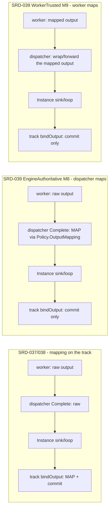
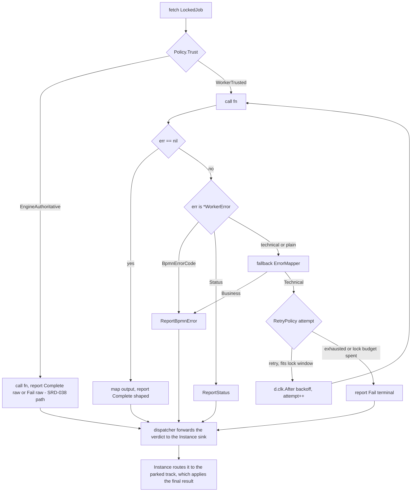

# SRD-039 — Service Task worker trust & policy relocation (M8, M9, M10)

| Field | Value |
|---|---|
| Status | Draft (pending impl) |
| Version | v.1 |
| Date | 2026-07-08 |
| Owner | Ruslan Gabitov |
| Implements | [ADR-021 v.1 Service Task Execution Model](../design/ADR-021-service-task-execution-model.md) §2.5–§2.7 |

> **Draft** — fifth and final SRD landing [ADR-021 v.1](../design/ADR-021-service-task-execution-model.md).
> It completes the "the track and the Instance take **only final results**" arc that SRD-038 began (classification
> moved off the track into the dispatcher) and introduces the trust protocols. Three coupled changes:
> **(1) Output-mapping relocation** — `WithOutputMapping` moves off the parked track (where SRD-037 put it) into
> whoever owns the policy, so the track only **commits** an already-shaped result. **(2) The `WithWorkerTrust` knob**
> — a two-level trust mode (`WorkerTrusted` default / `EngineAuthoritative`) that governs **where the whole policy
> bundle executes** (output mapping + classification + retry). **(3) The `WorkerTrusted` worker** — the batteries
> local pool runs the shipped policy **in-process** (maps output, self-classifies via a rich `WorkerError` error or
> the fallback `ErrorMapper`, retries technical faults within its held lock window) and reports a verdict; the
> dispatcher forwards it without re-classify / re-map / retry. Plus the **worked example**. **ADR-021 flips Accepted
> after this SRD.** Siblings: SRD-035/036/037/038 (Accepted).

---

## 1. Background (verified against the code)

### 1.1 Output mapping still lives on the track — the last thing that isn't a "final result" (verified)

SRD-038 moved classification off the track, but a successful completion's **output mapping** still runs on the
parked track: `ServiceTask.bindOutput` (`service_task.go:376-413`) applies `WithOutputMapping` at resume —

```go
// service_task.go:388-401 (current)
if len(st.outputMapping) > 0 {
	mapped, err := tasks.ApplyOutputMapping(
		ctx, re.ExpressionEngine(), st.outputMapping, output)   // ← shaping on the track
	...
	res = mapped
}
// re.Put(res...)  — commits to scope
```

`tasks.ApplyOutputMapping` (`outputmapping.go:28-58`) evaluates each rule's `Path` over the raw body and returns the
committed `[]data.Data`; it reads **no process scope** (only the body + the expression engine), the same
frame-free property classification has. So — like classification — it can run **before** the track, and per the
SRD-038 principle it should: the track must receive a **final result** and only commit it.

### 1.2 The trust knob is ADR-named but unimplemented (verified)

ADR-021 §2.6 defines `WithWorkerTrust(mode)` (per-service) / `WithWorkerTrustDefault(mode)` (engine-wide), modes
**`WorkerTrusted`** *(default, Camunda-aligned)* and **`EngineAuthoritative`**, governing "where the whole policy
bundle executes." A grep for `WorkerTrust` / `TrustMode` over non-doc code is **empty** — SRD-039 introduces the
enum, the options, the `Policy.Trust` carrier, and the `WorkerTrusted` worker path. SRD-038 landed the
`EngineAuthoritative` behaviour (dispatcher classifies + retries) as the implicit, only mode.

### 1.3 What each mode means, and why relocation comes first (the design)

ADR-021 §2.6 makes trust govern the **whole** policy bundle, so all three of output mapping, classification, and
retry share one locus per mode:

- **`EngineAuthoritative`** — the worker returns raw `{code, body}`; the **engine (its dispatcher)** runs the
  `ErrorMapper`, `WithOutputMapping`, and manages retries by re-enqueue (SRD-038 already does classify + retry
  here; SRD-039 adds output mapping).
- **`WorkerTrusted`** *(default)* — the engine ships the policy (§2.5); the **worker** maps its output,
  self-classifies (a `BpmnError` code, a Status, or a technical `Fail`), and retries technical faults **internally**
  (holding + extending its lock, backing off in-process), reporting only a verdict. The engine `ErrorMapper` is a
  **fallback** for a raw/unclassified fault.

Because both modes must keep mapping **off the track**, SRD-039 relocates output mapping first (**M8**, mode-agnostic
groundwork — the dispatcher becomes the `EngineAuthoritative` mapping locus and the track shrinks to a commit), then
adds the trust knob + the `WorkerTrusted` worker (**M9**), then the example (**M10**).

### 1.4 The rails (verified)

- **The dispatcher can map, like it classifies.** `ApplyOutputMapping(ctx, ee, rules, body)` (`outputmapping.go:28`)
  takes the expression engine directly; the dispatcher already holds a bound engine (`Dispatcher.exprEngine`,
  `localdispatcher.go:61`, SRD-038) and the resolved policy on the job. So the dispatcher applies output mapping in
  its `Complete` path with the same rails it uses for `Fail`/classification.
- **`Job.Policy` is the shipping channel.** `resolveWorkerPolicy` (`internal/instance/jobs.go:163-192`) already
  resolves `{ErrorMapper, RetryPolicy}` two-level at enqueue; SRD-039 adds `OutputMapping` and the resolved `Trust`.
  `Job.Policy` (`workerdispatcher.go:62-75`) grows two fields; a fetched `LockedJob` already wraps `Job` so a worker
  sees `Policy`.
- **The local pool already fetch-runs-reports.** `runWorker` (`localdispatcher.go:567-602`) fetches for `d.maxLock`
  (`:575`) and calls the user `WorkerFunc` (`func(ctx, LockedJob) (*data.ItemDefinition, error)`, `:41-44`),
  reporting `Complete`/`Fail`. SRD-039 adds a `WorkerTrusted` branch that runs the in-process policy loop around the
  same `fn` within that held `maxLock` window (`ExtendLock`, `:260-288`, is capped at `firstLock + maxLock`, so it
  can't extend a lock already taken for `maxLock` — see §3.5/FR-7).
- **The four report verdicts already exist.** `WorkerDispatcher` has `Complete` / `ReportBpmnError` / `ReportStatus`
  / `Fail` (`workerdispatcher.go:100-156`); the `WorkerTrusted` worker uses `ReportBpmnError`/`ReportStatus` for a
  self-classified business outcome (the local pool never used them before — SRD-037 §note).

## 2. Requirements

### Functional — output-mapping relocation (M8)

- **FR-1 — Output mapping runs off the track.** `WithOutputMapping` is applied **before** the outcome reaches the
  instance loop, by the policy owner: under `EngineAuthoritative` the **dispatcher** applies it in its `Complete`
  path (via `Dispatcher.exprEngine` + `Job.Policy.OutputMapping`); the shaped result is conveyed on the completion
  outcome. `ServiceTask.bindOutput`'s `ApplyOutputMapping` call is removed.
- **FR-2 — The track only commits.** The completion `WorkerOutcome` conveys the **final committed output** (the
  `[]data.Data` that `ApplyOutputMapping` yields, or the direct-reconciliation default when no mapping); the track's
  `bindOutput` shrinks to `re.Put(...)` of that result and advance. It never re-maps.
- **FR-3 — `Job.Policy` carries the output mapping.** `Policy` grows `OutputMapping []OutputRule`; `resolveWorkerPolicy`
  populates it from the node's per-service config; `tasks.WorkerConfig` surfaces it alongside the ErrorMapper /
  RetryPolicy.

### Functional — the trust knob (M9)

- **FR-4 — `TrustMode` + the two-level knob.** A `tasks.TrustMode` (`WorkerTrusted` / `EngineAuthoritative`,
  ADR-default `WorkerTrusted`); per-service `activities.WithWorkerTrust(mode)` and engine-wide
  `thresher.WithWorkerTrustDefault(mode)` (+ `renv.EngineRuntime.WorkerTrustDefault()` + `enginert`); resolved at
  enqueue into `Job.Policy.Trust` (per-service over engine-wide over `WorkerTrusted`). Mirrors the
  `WorkerErrorMapper` / `WorkerRetryPolicy` two-level wiring.
- **FR-5 — Trust governs the whole bundle, exclusively.** `Job.Policy.Trust` selects the locus of output mapping +
  classification + retry: `EngineAuthoritative` → the dispatcher (SRD-038 classify/retry + M8 mapping);
  `WorkerTrusted` → the worker. Retry ownership is **exclusive per mode** (§2.7): a `WorkerTrusted` worker's terminal
  `Fail` is delivered as retries-exhausted, **not** re-classified or re-enqueued by the dispatcher.

### Functional — the `WorkerTrusted` worker + rich fault (M9)

- **FR-6 — Rich `WorkerError` for self-classification.** A `tasks.WorkerError` struct implementing `error`, carrying
  a `BpmnErrorCode` (+ `Message`), a `Status data.Value`, and a technical `Cause`. A `WorkerFunc` returns it as its
  error to self-classify; precedence is BpmnError → Status → technical. A **plain** (non-`*WorkerError`) error is an
  unclassified technical fault the worker runs through the fallback `ErrorMapper`.
- **FR-7 — The `WorkerTrusted` in-process policy loop.** For a `WorkerTrusted` job, `runWorker` runs the policy
  around `fn`: on success it **maps the output** (`Job.Policy.OutputMapping`) and reports the completion; on a
  `*WorkerError` it reports the declared `ReportBpmnError` / `ReportStatus`; on a technical/plain error it applies
  the fallback `ErrorMapper`, and if still technical **retries in-process** (a `d.clk.After` backoff + re-call `fn`)
  per `Job.Policy.RetryPolicy` until success or exhaustion, then reports a terminal `Fail`. The whole retry sequence
  runs **within the single lock window** the worker already holds — the local pool fetches for `d.maxLock` up front
  (the ceiling), so `ExtendLock` cannot extend past it and is not the local mechanism; instead the loop **bounds
  each backoff against the lock deadline**: if the next attempt+backoff would not fit (or `ExtendLock` returns
  `ErrMaxLockExceeded`, relevant only if a shorter lease is used), it stops and reports terminal `Fail`
  (retries-exhausted) — it **never lets the lock lapse into a re-fetch** (which would double-execute, breaking
  NFR-2). Holds no live engine call — the locked-and-retrying job plus a parked track are persistable.
  (Lock **extension** — a short lease grown up to `maxLockDuration` — is a *remote* trusted worker's mechanism,
  ADR-004; the in-process pool takes the full lease at fetch, so it holds rather than extends.)
- **FR-8 — The dispatcher honours trust on report.** For a `WorkerTrusted` job the dispatcher **forwards** the
  worker's verdict: `Complete` (already-mapped) is delivered as-is, and `Fail` is delivered as the terminal
  retries-exhausted fault — no re-map, no re-classify, no re-enqueue. For an `EngineAuthoritative` job the dispatcher
  keeps the SRD-038 behaviour (classify + retry) plus M8 mapping.

### Functional — worked example (M10)

- **FR-9 — A runnable worker example.** `examples/service-task-worker/` builds a process with a `ServiceTask`
  `WithWorker`, registers a local pool worker whose handler fails transiently then succeeds, and runs it end-to-end
  under `WorkerTrusted` (the worker retries in-process) — with a one-line note on toggling `EngineAuthoritative`. It
  runs to completion under a timeout (the SDD example-smoke step).

### Non-functional

- **NFR-1 (track takes only final results).** After M8, no policy logic (mapping, classification, retry) runs on the
  track or the instance loop; the track commits a final result and advances.
- **NFR-2 (exclusive retry ownership).** A job is retried by exactly one owner — the dispatcher
  (`EngineAuthoritative`) or the worker (`WorkerTrusted`) — never both (§2.7).
- **NFR-3 (default is `WorkerTrusted`).** A worker-dispatched task with no trust configured resolves to
  `WorkerTrusted` (ADR-021 §2.6); `EngineAuthoritative` is the explicit opt-out.
- **NFR-4 (untrusted isolation).** An `EngineAuthoritative` job's worker never influences classification/retry: the
  engine is the sole authority (the SRD-038 property, preserved).
- **NFR-5 (dehydration-friendly).** The `WorkerTrusted` in-process retry holds its lock for the whole sequence
  (fetched for `d.maxLock`, the ceiling) and bounds retries against that deadline; it uses the injected clock
  (`d.clk.After`), no wall-clock sleep, so it is testable and the job stays a persistable locked-and-retrying entry.
- **NFR-6 (gate).** diff-coverage ≥95% on touched files; `make ci` green; the `WorkerTrusted` loop (clock-driven
  backoff, lock extension) is `-race` clean; the example runs green under a timeout.

## 3. Models

### 3.1 `TrustMode` — `pkg/tasks/trustmode.go` (NEW)

```go
// TrustMode governs where a worker-dispatched ServiceTask's policy bundle (output
// mapping, classification, retry) executes (ADR-021 §2.6). The zero value is
// "unset" (an internal resolution sentinel); a resolved job is always one of the
// two exported modes, defaulting to WorkerTrusted.
type TrustMode int

const (
	trustUnset TrustMode = iota // unexported: not configured (resolve to the default)
	WorkerTrusted               // the worker runs the policy and reports a verdict (default)
	EngineAuthoritative         // the engine runs the policy; the worker returns raw {code, body}
)

func (m TrustMode) String() string // "workerTrusted" / "engineAuthoritative" via a name table
```

### 3.2 `Policy` grows + `WorkerError` — `pkg/tasks` (EXTEND / NEW)

```go
// Policy (workerdispatcher.go) gains the output mapping and the resolved trust mode.
type Policy struct {
	ErrorMapper   ErrorMapper
	RetryPolicy   RetryPolicy
	OutputMapping []OutputRule // applied by the policy owner (dispatcher or worker), not the track
	Trust         TrustMode    // resolved at enqueue; selects the policy locus
}

// WorkerError is a WorkerFunc's rich, self-classifying error (ADR-021 §2.6). A
// WorkerTrusted worker returns it to declare its own outcome; precedence is
// BpmnErrorCode → Status → technical (Cause). A plain error is an unclassified
// technical fault the worker runs through the fallback ErrorMapper.
type WorkerError struct {
	Cause         error
	Status        data.Value // non-nil → a Business Status verdict
	BpmnErrorCode string     // non-empty → a Business Error verdict
	Message       string
}

func (f *WorkerError) Error() string
```

`tasks.WorkerConfig` grows to return the per-service `OutputMapping` and `TrustMode` alongside the ErrorMapper /
RetryPolicy (so `resolveWorkerPolicy` ships the full bundle).

**Completion carrier (pinned).** Only the **internal** completion `WorkerOutcome` changes: its `output` field +
`Output()` accessor go from `*data.ItemDefinition` to the final `[]data.Data` (what `ApplyOutputMapping` yields, or
the direct-reconciliation default `[]data.Data{Parameter(output.ID(), output)}` when no mapping). The **exported**
`WorkerDispatcher.Complete(ctx, jobID, workerID, output *data.ItemDefinition)` (`workerdispatcher.go:126-131`) stays
**raw** — the worker-facing contract is unchanged; under `EngineAuthoritative` the dispatcher's `Complete`
implementation maps the raw item into the `[]data.Data` outcome, and under `WorkerTrusted` the in-process worker
(in-package `runWorker`) maps and builds the completion outcome via the internal `report` path, bypassing
`Complete`. (Reconciling a *remote* trusted worker's already-mapped output with `Complete`'s raw signature is an
ADR-004 transport concern.) One producer (`Complete`) and one consumer (`bindOutput` via `Output()`) plus ~15 test
call sites change — mechanical.

### 3.3 Two-level trust config (mirrors `WorkerErrorMapper` / `WorkerRetryPolicy`)

- `activities.WithWorkerTrust(mode)` `SrvTaskOption` (worker-only, like `WithRetryPolicy`).
- `thresher.WithWorkerTrustDefault(mode)` + `renv.EngineRuntime.WorkerTrustDefault()` + `enginert` accessor +
  `mockrenv` regen.
- `resolveWorkerPolicy` resolves `Trust` = per-service (`WorkerConfig`) over engine-wide (`WorkerTrustDefault()`)
  over `WorkerTrusted`; and populates `OutputMapping`.

### 3.4 Output-mapping relocation (M8)



Either way the map runs **off the track**: the dispatcher applies it
(`EngineAuthoritative`, M8) or the worker applies it before it reports
(`WorkerTrusted`, M9); the dispatcher then wraps the already-shaped result and the
Instance routes it to the track, which only commits.

`Dispatcher.Complete` today builds the outcome directly and never reads the entry's Policy; M8 restructures it to
mirror `Fail` (`localdispatcher.go:335-357`) — acquire `e.job.Policy` via `heldEntry(jobID, workerID)` under
`d.mu`, read `d.exprEngine`, unlock, then apply `ApplyOutputMapping` **outside** the lock (or the direct default
when no mapping), and `report` the shaped `[]data.Data`. `ServiceTask.bindOutput` drops its `ApplyOutputMapping`
call and shrinks to a commit. (M8 lands this for the current `EngineAuthoritative`-only world; M9's `WorkerTrusted`
worker maps before it reports.)

### 3.5 The `WorkerTrusted` worker loop (M9) — `localdispatcher.runWorker`



Every verdict a worker reports is delivered to the **Instance** (via the completion sink), never straight to a
track — the Instance routes it to the owning parked track, which applies the already-final result. The dispatcher's
`Fail`/`Complete` branch on `Job.Policy.Trust`: a `WorkerTrusted` verdict is forwarded as-is (no
re-classify/re-map/retry); an `EngineAuthoritative` report keeps the SRD-038 + M8 behaviour.

### 3.6 Track apply (M8, SHRINK) — `activities.bindOutput`

`bindOutput` loses its `ApplyOutputMapping` branch: it commits the final result the outcome carries and advances.
`execWorkerOutcome`'s other cases (BpmnError / Status / terminal Fault) are unchanged from SRD-038.

## 4. Analysis

### 4.1 Relocation first, mode-agnostic (FR-1, NFR-1)

Output mapping is frame-free (reads only the body + engine), so it moves off the track exactly as classification did
in SRD-038 — and it must, for the track to take only final results. M8 lands the dispatcher as the mapping locus
(the `EngineAuthoritative` owner) independent of the trust knob, so the reshape is reviewable on its own before the
trust machinery. *Rejected: keep mapping on the track only for `EngineAuthoritative`* — that re-introduces track-side
policy and splits the mapping locus by mode on the track, the coupling this SRD removes.

### 4.2 A rich `WorkerError`, not a new `WorkerFunc` signature (FR-6)

Keeping `WorkerFunc` as `(output, error)` and letting the error be a self-classifying `*WorkerError` gives a worker
full verdict control with **zero signature change** and a natural fallback (a plain error → the engine `ErrorMapper`,
the ADR's exact wording). *Rejected: a richer `WorkerFunc` return type* (e.g. an outcome struct) — a larger API for
the same expressiveness, and it breaks every existing worker. *Rejected: the pool always runs the shipped ErrorMapper
(no rich fault)* — then a `WorkerTrusted` worker can't self-classify, contradicting §2.6.

### 4.3 In-process retry holds the lock; exclusive ownership (FR-7, FR-8, NFR-2/5)

The `WorkerTrusted` worker retries by re-calling `fn` under its held lock, extending the lock and backing off on the
injected clock — no re-enqueue, no re-fetch, fewest round-trips (§2.7). The dispatcher must therefore **not** retry a
trusted job's terminal `Fail` (that would double-retry); it forwards it as exhausted. Ownership keys off
`Job.Policy.Trust`, the single source. *Rejected: the dispatcher retries in both modes* — violates §2.7's exclusive
ownership and the "worker owns retry accounting within its lock" property (§2.5).

### 4.4 Trust rides in `Job.Policy`, resolved at enqueue (FR-4, FR-5)

The instance resolves the mode two-level at enqueue (it has both config levels) and ships it in `Job.Policy.Trust`,
so both the pool worker (which path to run) and the dispatcher (whether to forward or own the report) read one
resolved value. This mirrors the `ErrorMapper`/`RetryPolicy` shipping SRD-037/038 established. The ADR default
`WorkerTrusted` is the zero-resolution fallback.

### 4.5 Local pool now; remote transport later (scope)

SRD-039 realises both modes for the **in-process local pool** — the batteries default. A **remote** worker
(ADR-004) runs the same `WorkerTrusted` protocol over the wire (it maps/classifies/retries remotely and reports a
verdict) or `EngineAuthoritative` (raw report, engine owns it); the serialization of the shipped `Policy` (Go-closure
`ErrorMapper`/`OutputMapping` vs a serializable JSONPath form) is an ADR-004 transport concern, not this SRD's.
ADR-021 §2.5 says `Job.Policy` is "empty under `EngineAuthoritative`" — that is the **wire/remote** security property
(don't ship the policy to an untrusted remote worker). In-process there is no wire boundary, so `resolveWorkerPolicy`
**always** populates `Job.Policy` (the engine reads it locally); the local behaviour is not a divergence.

## 5. API / contract surface

- **New (`pkg/tasks`):** `TrustMode` + `WorkerTrusted`/`EngineAuthoritative`; `WorkerError`. **Extended:**
  `Policy{OutputMapping, Trust}`; `WorkerConfig` (returns OutputMapping + TrustMode); the completion `WorkerOutcome`
  carrier (final `[]data.Data`).
- **New (`activities`):** `WithWorkerTrust(mode)` `SrvTaskOption`; `ServiceTask` `trustMode` + `outputMapping` surfaced
  via `WorkerConfig`. **Removed from the track:** `bindOutput`'s `ApplyOutputMapping` call.
- **New (engine config):** `WithWorkerTrustDefault` (thresher + enginert) + `renv.EngineRuntime.WorkerTrustDefault()`
  + `mockrenv` regen.
- **Reshaped (`localdispatcher`):** `Complete` applies mapping (`EngineAuthoritative`); `runWorker` gains the
  `WorkerTrusted` in-process policy loop; `Fail`/`Complete` branch on `Policy.Trust`.
- **Reshaped (`instance`):** `resolveWorkerPolicy` resolves `Trust` + `OutputMapping` (`handleJobCompletion`/
  `enqueueJob` structure unchanged).
- **New (`examples`):** `examples/service-task-worker/`.

## 6. Test scenarios

**Proposed** (to be implemented in M8/M9/M10; §10 records the actual landed names).

| Test | FR/NFR | Scenario |
|---|---|---|
| `TestDispatcherAppliesOutputMapping` | FR-1 | an `EngineAuthoritative` Complete with `Policy.OutputMapping` shapes the body in the dispatcher; the outcome carries the shaped result |
| `TestTrackCommitsFinalOutputNoRemap` | FR-2, NFR-1 | the track `bindOutput` commits the outcome's final result and never calls `ApplyOutputMapping` |
| `TestEnqueueResolvesOutputMappingAndTrust` | FR-3, FR-4 | `resolveWorkerPolicy` populates `Policy.OutputMapping` + `Policy.Trust` two-level (per-service over engine-wide over `WorkerTrusted`) |
| `TestTrustModeString` | FR-4 | the `TrustMode` name table |
| `TestWithWorkerTrustRejectsNonWorker` / `...Default` nil-guards | FR-4 | the option guards (worker-only; engine-wide accepts a valid mode) |
| `TestWorkerErrorSelfClassifies` | FR-6 | a `*WorkerError` with a BpmnErrorCode / Status / Cause classifies by precedence; a plain error is technical |
| `TestWorkerTrustedReportsBpmnError` / `...Status` | FR-7 | a trusted worker returning a `*WorkerError` verdict reports `ReportBpmnError` / `ReportStatus` |
| `TestWorkerTrustedRetriesInProcess` | FR-7, NFR-5 | a trusted worker whose `fn` fails transiently then succeeds retries in-process (lock extended, `clk.After` backoff) and completes — no re-enqueue |
| `TestWorkerTrustedFallbackErrorMapper` | FR-6 | a trusted worker's **plain** error runs the fallback `ErrorMapper` (→ Business or Technical) |
| `TestWorkerTrustedExhaustionForwarded` | FR-8, NFR-2 | a trusted worker's terminal `Fail` is delivered as retries-exhausted, not re-classified/re-enqueued by the dispatcher |
| `TestTrustSelectsPolicyLocus` | FR-5 | a `WorkerTrusted` job runs the policy in the worker (dispatcher forwards); an `EngineAuthoritative` job runs it in the dispatcher — never both |
| `TestEngineAuthoritativeUnchanged` | FR-8, NFR-4 | an `EngineAuthoritative` job keeps the SRD-038 classify+retry path (+ M8 mapping) |
| `TestServiceTaskWorkerExample` (example smoke) | FR-9 | `examples/service-task-worker/` runs to completion under a timeout |

## 7. Milestones

1. **M8 — output-mapping relocation.** `Policy.OutputMapping` + `WorkerConfig`/`resolveWorkerPolicy` populate it;
   `Dispatcher.Complete` applies mapping (`EngineAuthoritative`); the completion outcome conveys the final result;
   `bindOutput` shrinks to a commit. Mode-agnostic groundwork (still `EngineAuthoritative`-only). One commit.
2. **M9 — trust knob + `WorkerTrusted` worker.** `TrustMode` + `WithWorkerTrust`/`WithWorkerTrustDefault` (+ renv/
   enginert/mock) + `Policy.Trust` resolution; `WorkerError`; the `WorkerTrusted` `runWorker` in-process policy loop
   (map / self-classify / fallback / in-process retry) + `Fail`/`Complete` trust-branching. One commit.
3. **M10 — worked example.** `examples/service-task-worker/` (split per the >80-line rule: `process.go`,
   `worker.go`, `main.go`); CI builds it, and the example-smoke runs it green. One commit.

## 8. Cross-doc

- **Implements:** [ADR-021 v.1](../design/ADR-021-service-task-execution-model.md) §2.5 (policy shipping / the
  locked-job view), §2.6 (`WithWorkerTrust`, the two modes), §2.7 (retry ownership per mode).
- **References (up / sideways):** [ADR-018 v.1](../design/ADR-018-boundary-events-and-activity-interruption.md)
  (Business Error boundary), [ADR-017 v.1](../design/ADR-017-channel-based-event-processing.md) §2 (loop delivery /
  single-writer), [ADR-011 v.5](../design/ADR-011-process-data-flow.md) (data / expression / output),
  [ADR-001 v.6](../design/ADR-001-execution-model.md), [SAD-001 v.1](../design/SAD-001-vision-and-architecture.md)
  §11, §13.2.
- **Sibling SRDs:** SRD-035/036/037/038 (Accepted). **This SRD completes ADR-021 → it flips Accepted after SRD-039
  lands.** SRD→SRD sideways; pins by number.
- Direction: SRD → ADR / SAD (up), SRD → SRD (sideways); no downward reference.

## 9. Definition of Done

- FR-1…FR-9 implemented and wired; NFR-1…NFR-6 upheld.
- Every FR covered by ≥1 named §6 test, all green under `-race` (per-package coverage for the `tasks` / `activities`
  / `localdispatcher` / `instance` / `enginert` touched code).
- `ServiceTask.bindOutput` no longer calls `ApplyOutputMapping`; no policy logic runs on the track; retry ownership
  is exclusive per mode.
- `examples/service-task-worker/` runs green end-to-end under a timeout; its built binary is gitignored.
- `make ci` green (tidy · lint · build · `-race` · diff-coverage ≥95% on touched files · govulncheck).
- SRD-039 flips to Accepted **and ADR-021 flips to Accepted** (the epic completes).

## 10. Implementation summary (stage-by-stage actual landings + deltas vs draft)

> ⚠️ TODO: fill AFTER landing (§10.1 stage commit SHAs for M8/M9/M10, §10.2 empirical findings vs this draft).
