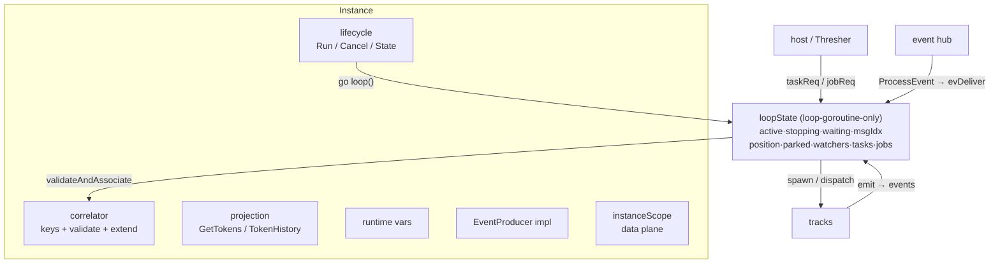

# SRD-040 — Instance internal structure: loop-state and correlation collaborators

| Field | Value |
|---|---|
| Status | Accepted |
| Version | v.1 |
| Date | 2026-07-10 |
| Owner | Ruslan Gabitov |
| Implements | — (behavior-preserving structural refactor; no parent ADR — no new execution contract is decided) |
| Refines | [SAD-001 v.1](../design/SAD-001-vision-and-architecture.md) §10 Execution Model (clarifies the Instance's internal composition) |
| Upholds | [ADR-001 v.6](../design/ADR-001-execution-model.md) (single-writer instance loop), [ADR-017 v.1](../design/ADR-017-channel-based-event-processing.md) (channel-based event processing, Rules 1–2) |

This SRD restructures `internal/instance` **without changing behavior**: it gives the
single-writer loop's stack-local registry state a named home (**`loopState`**), extracts the
message-correlation cluster into a named collaborator (**`correlator`**), and splits the
1661-line `instance.go` into one-concern-per-file units. It closes the remaining half of audit
finding §2.3 (*Instance god-object*) — the first half (the data-plane `instanceScope`
extraction) already landed. No public API changes, no new goroutines, channels, or locks; the
ADR-001/ADR-017 single-writer invariant is preserved **by construction** (the loop state stays
loop-goroutine-owned — it becomes a named type, not an `Instance` field).

The refactor is deliberately structural, which is why it is an SRD refining SAD-001, not an
ADR: nothing about *how the engine should work* is being decided — only how the existing,
decided machinery is organized. Precedents for a standalone refactor SRD: SRD-028 (loop-owned
positions), SRD-032 (snapshot starts / instance scope).

---

## 1. Background & current state (verified against the code)

The 2026-06-11 audit (§2.3) flagged the `Instance` as a god-object. Since then, several
responsibilities were extracted or landed already-separated — the refactor below targets only
what remains tangled. A grounding inventory (2026-07-10, `master` = v0.8.0-rc.1) established
the following.

### 1.1 What is already cleanly factored (NOT touched by this SRD)

| Collaborator | Type & file | State |
|---|---|---|
| Data plane | `instanceScope` — `internal/instance/scope.go:20` | Extracted (audit §2.3 first half) |
| Per-execution env | `execEnv` — `internal/instance/execenv.go:14` | Separate type, embeds `*Instance` |
| Boundary watch | `boundaryWatch` — `internal/instance/boundary_watch.go:19` | Separate type |
| Human-task plane | `taskRequest`/`taskReply`/`taskEntry` — `internal/instance/tasks.go:32-53` | Own file, own channel |
| Worker-job plane | `jobRequest` — `internal/instance/jobs.go:14` | Own file, own channel |
| Node graph | `*snapshot.Snapshot` — `internal/instance/snapshot/` | Separate sub-package |
| Observation | `obsReg`/`ObsEvent` — `internal/instance/observer.go` | Own file |
| Token projection types | `Token`/`TokenPath`/`StepVisit` — `internal/instance/token.go` | Own file |
| Track | `track` — `internal/instance/track.go:155` | Separate type (large file, but a single entity) |

There is **no history/audit collaborator** at the Instance level: token history is per-track
(`track.hist`) and derived by `TokenHistory()`. This SRD does not invent one.

### 1.2 Seam A — the loop's registry state is stack-local and threaded by argument

The single-writer loop (`internal/instance/instance.go:608-775`) declares its entire registry
state as **local variables** (`instance.go:611-648`):

```go
active := 0
stopping := false
waiting := map[string]struct{}{}            // parked-and-undelivered tracks (SRD-027)
msgIdx := map[string]*track{}               // Message catch-def id → parked track (SRD-027)
position := map[string]flow.Node{}          // loop-owned token positions (SRD-028)
parked := map[string]flow.Node{}            // parked-at-join view (SRD-028)
watchers := map[string][]*boundaryWatch{}   // boundary subscriptions (SRD-029)
tasks := map[string]taskEntry{}             // human-task registry (SRD-034)
jobs := map[wtasks.JobID]*track{}           // worker-job registry (SRD-036)
```

plus two closures, `spawn` (`:656`) and `stopAll` (`:706`), that capture them. This state is
loop-goroutine-only **by design** — no locks needed — but it has no type: **27 methods**
thread it through their signatures. The worst case is the loop's own dispatcher
(`instance.go:816-829`):

```go
func (inst *Instance) applyEvent(
	ctx context.Context,
	ev trackEvent,
	active *int,
	stopping *bool,
	waiting map[string]struct{},
	msgIdx map[string]*track,
	position, parked map[string]flow.Node,
	watchers map[string][]*boundaryWatch,
	tasks map[string]taskEntry,
	jobs map[wtasks.JobID]*track,
	spawn func(*track),
	stopAll func(),
) {
```

— **13 parameters**, called once per track event (`instance.go:757-758`). The full threading
inventory (method → loop-state parameters it carries), verified by signature grep:

| Method | File:line | Threads |
|---|---|---|
| `applyEvent` | `instance.go:816` | all 7 maps + `*active` + `*stopping` + `spawn` + `stopAll` |
| `dropLoopState` | `instance.go:784` | `waiting, msgIdx, position, parked, tasks, jobs` |
| `onWaiting` | `instance.go:915` | `stopping, waiting, msgIdx` |
| `dispatchToParked` | `instance.go:943` | `waiting, …` |
| `failFromTrack` | `instance.go:1046` | `stopAll` |
| `spawnForks` | `instance.go:1061` | `spawn, stopAll, stopping` |
| `applyParked` | `instance.go:1102` | `position, parked, stopAll, stopping` |
| `applyFailed` | `instance.go:1127` | `*active, waiting, …` |
| `applyMerged` | `instance.go:1153` | `position, parked` |
| `recheckAwaitingJoins` | `instance.go:1186` | `position, parked, stopAll` |
| `recheckParked` | `instance.go:1208` | `position, parked, stopAll` |
| `recheckJoin` | `instance.go:1234` | `position, parked, stopAll` |
| `fireOrJoin` | `instance.go:1286` | `position, parked` |
| `settleFinalState` | `instance.go:801` | `stopping` |
| `handleTaskRequest` | `tasks.go:145` | `tasks, waiting, msgIdx` |
| `completeTask` | `tasks.go:199` | `tasks, waiting, …` |
| `addTask` | `tasks.go:231` | `tasks` |
| `recordBornWaiter` | `tasks.go:258` | `waiting, msgIdx, tasks` |
| `onTaskWaiting` | `tasks.go:282` | `stopping, waiting, tasks` |
| `withdrawAllTasks` | `tasks.go:300` | `tasks` |
| `cleanupTask` | `tasks.go:310` | `tasks` |
| `handleJobCompletion` | `jobs.go:62` | `jobs, waiting, msgIdx` |
| `onJobWaiting` | `jobs.go:97` | `stopping, waiting, jobs` |
| `armBoundaries` | `boundary_watch.go:65` | `watchers, stopAll` |
| `disarmBoundaries` | `boundary_watch.go:121` | `watchers` |
| `fireBoundary` | `boundary_watch.go:148` | `watchers, spawn, stopAll, stopping` |
| `matchErrorBoundary` | `boundary_watch.go:186` | `position, spawn, stopAll, stopping` |

Beyond the methods, five **package-level functions** also carry loop-owned state in their
signatures:

| Function | File:line | Threads | Fate under this SRD |
|---|---|---|---|
| `flipNotParked` | `instance.go:975` | `waiting, msgIdx` | becomes a `loopState` method |
| `clearMsgIdx` | `instance.go:986` | `msgIdx` | becomes a `loopState` method |
| `clearPosition` | `instance.go:997` | `position` | becomes a `loopState` method |
| `cleanupJob` | `jobs.go:209` | `jobs` | becomes a `loopState` method |
| `joinPositions` | `reachability.go:62` | `position, parked` | **stays a pure function** — its purity over explicit map arguments is a deliberate SRD-028 design property (unit-testable join view); the one documented exemption |

Every signature change to the loop state ripples through this whole set (the SRD-029/034/036
landings each grew the argument lists). A large slice of instance state has no home object —
the "god-function" seam.

### 1.3 Seam B — correlation is an un-extracted collaborator

The message-correlation/conversation cluster is inlined into `Instance`: two fields
(`convKeys map[string]string`, `convMu sync.Mutex` — `instance.go:86-111`) and eight methods
(`instance.go:303-495`):

| Method | Line | Role |
|---|---|---|
| `AssociateConversationKey` | `:307` | public set-if-absent (no result) |
| `associateConversationKey` | `:314` | set-if-absent under `convMu`, reports "added" |
| `conversationKeyValues` | `:336` | snapshot of held values (receiver subscription keys) |
| `ProcessEvent` | `:360` | `eventproc.EventProcessor` — hub entry for Message catches |
| `CorrelationKeys` | `:381` | declared filter for the message waiter |
| `validateAndAssociate` | `:393` | SRD-017 §4.5 / BPMN §8.4.2 two-pass mismatch-then-associate |
| `heldConversationKey` | `:454` | read one key under `convMu` |
| `extendReceivers` | `:469` | grow parked receivers' broker subscriptions on a new key |

This unit has its **own mutex** (`convMu` — the only lock on `Instance` besides the
observation `obsMu`), its own data (`convKeys`), and a self-contained protocol (SRD-017). It
is a collaborator in everything but name.

### 1.4 Seam C — `instance.go` is a catch-all file

`instance.go` is 1661 lines and mixes ~7 concerns: the struct + constructors, lifecycle
(`Run`/`Cancel`/`State`/…), the event loop + appliers + join arbitration, correlation (§1.3),
the read projection (`GetTokens`/`TokenHistory`), runtime-var supply
(`RuntimeVar`/`RuntimeVarNames`), and the `eventproc.EventProducer` implementation. It is the
one file in the package violating the project's *one entity per file* rule.

---

## 2. Requirements

### Functional

- **FR-1 — `loopState` collaborator.** A `loopState` struct owns the loop's registry state:
  the seven maps of §1.2 plus the `active` counter and `stopping` flag, and an `inst
  *Instance` back-pointer (the `track` pattern — `track.go:155` holds `instance *Instance`).
  It is constructed **inside `loop()`** and never stored on `Instance` — loop-goroutine
  ownership is preserved by construction.
- **FR-2 — threading methods become `loopState` methods.** Every method in the §1.2 table
  — except `settleFinalState`, which runs after the loop exits, takes a plain
  `stopping bool` value, and stays lifecycle-side — moves onto `*loopState` (keeping its
  current file home per concern); its loop-state parameters disappear (read from the
  receiver). The four package-level helpers (`flipNotParked`, `clearMsgIdx`,
  `clearPosition`, `cleanupJob`) become `loopState` methods too; the `spawn`/`stopAll`
  closures become `loopState` methods. After the move, **no method or function signature
  in the package carries a loop-owned map, `*active`, `*stopping`, or a `spawn`/`stopAll`
  closure parameter** — with one documented exemption: `joinPositions` stays a pure
  function over explicit `position, parked` arguments (SRD-028 design, §1.2).
- **FR-3 — single-writer invariant intact.** `loopState` methods execute only on the loop
  goroutine (same call sites as today); no new locks, goroutines, or channels are introduced;
  tracks still report exclusively via `emit`/`taskReq`/`jobReq`. The `evtCh`
  single-sender/teardown protocol (SRD-027), the loop-owned position/join view (SRD-028), the
  boundary arm/disarm discipline (SRD-029), and the task/job registries (SRD-034/036) keep
  their exact semantics.
- **FR-4 — `correlator` collaborator.** A `correlator` struct owns `convKeys`+`convMu` (as
  its `keys`+`m`) and the §1.3 logic: `associate` (set-if-absent, reports added), `values`,
  `held`, `validateAndAssociate`, `extendReceivers`. It holds an `inst *Instance`
  back-pointer for its dependencies (`inst.s.CorrelationKeys`, `ExpressionEngine()`,
  `Logger()`, `parentEventProducer`, `s.Nodes`). `Instance` holds it as one field.
- **FR-5 — public surface unchanged.** The outward contract keeps its exact signatures and
  receivers: `AssociateConversationKey`, `CorrelationKeys`, and `ProcessEvent`
  (`eventproc.EventProcessor` must remain implemented by `*Instance` — it is the processor
  registered at the hub) stay `Instance` methods, delegating to the `correlator`. All other
  exported methods (`New`, `NewFromEvent`, `Run`, `Cancel`, `Terminate`, `Done`, `State`,
  `LastErr`, `InstanceID`, `EventProducer`, `DataReader`, `RuntimeVar`, `RuntimeVarNames`,
  `RegisterEvent`, `UnregisterEvent`, `PropagateEvent`, `Take`, `Complete`,
  `ReportJobCompletion`, `AddObserver`, `GetTokens`, `TokenHistory`) are untouched;
  `pkg/thresher` compiles without modification.
- **FR-6 — `instance.go` split by concern.** One concern per file (§3.3 table); no file in
  the package mixes unrelated concerns after the split.

### Non-functional

- **NFR-1 — behavior-preserving.** The full existing test suite passes unchanged in
  semantics (tests calling moved unexported methods are updated mechanically — receiver and
  argument-list only). `make ci` green (`-race` included).
- **NFR-2 — no hot-path allocation growth.** The loop dispatch path performs no new
  per-event allocations: `loopState` is one struct allocated once per `loop()` invocation;
  the maps are the same maps.
- **NFR-3 — observability unchanged.** Log lines, observer notifications, and their
  ordering are not altered.
- **NFR-4 — coverage.** Diff-coverage on the committed change ≥95% (aim 100%) per the
  `make ci` gate. Moved-but-previously-uncovered lines are covered, not excluded — the gate
  is never lowered.

---

## 3. Models

### 3.1 `loopState` (`internal/instance/loop.go`, new home of the loop)

```go
// loopState is the single-writer loop's registry state (ADR-001, ADR-017). It is
// created by loop() and lives only on the loop goroutine: no locks — ownership is
// the synchronization. It must never be stored on Instance or escape the loop.
type loopState struct {
	inst *Instance

	active   int
	stopping bool

	waiting  map[string]struct{}            // parked-and-undelivered (SRD-027)
	msgIdx   map[string]*track              // Message def id → parked track (SRD-027)
	position map[string]flow.Node           // token positions (SRD-028)
	parked   map[string]flow.Node           // parked-at-join (SRD-028)
	watchers map[string][]*boundaryWatch    // boundary subscriptions (SRD-029)
	tasks    map[string]taskEntry           // human tasks (SRD-034)
	jobs     map[wtasks.JobID]*track        // worker jobs (SRD-036)
}
```

`loop()` shrinks to construction + the select:

```go
func (inst *Instance) loop(ctx context.Context, initial []*track) {
	defer close(inst.loopDone)

	ls := newLoopState(inst)

	for _, t := range initial {
		ls.spawn(ctx, t)
	}
	if ls.active == 0 {
		inst.setState(Completed)
		return
	}

	done := ctx.Done()
	for ls.active > 0 {
		select {
		case <-done:
			done = nil
			ls.stopAll()
		case ev := <-inst.events:
			// (debug log as today)
			ls.apply(ctx, ev)
		case req := <-inst.taskReq:
			ls.handleTaskRequest(ctx, req)
		case req := <-inst.jobReq:
			ls.handleJobCompletion(req)
		}
	}

	inst.settleFinalState(ls.stopping)
}
```

Method moves (receiver `*loopState`, file homes stay by concern):

| Today (on `*Instance`) | Becomes | File |
|---|---|---|
| `applyEvent` | `ls.apply(ctx, ev)` | `loop.go` |
| `spawn` closure | `ls.spawn(ctx, t)` | `loop.go` |
| `stopAll` closure | `ls.stopAll()` | `loop.go` |
| `dropLoopState` | `ls.drop()` | `loop.go` |
| `onWaiting`, `dispatchToParked`, `spawnForks`, `applyParked`, `applyFailed`, `applyMerged`, `failFromTrack` | same names on `ls` | `loop.go` |
| `flipNotParked`, `clearMsgIdx`, `clearPosition` (package functions) | same names on `ls` | `loop.go` |
| `cleanupJob` (package function) | same name on `ls` | `jobs.go` |
| `recheckAwaitingJoins`, `recheckParked`, `recheckJoin`, `fireOrJoin` | same names on `ls` | `loop.go` (join arbitration stays with the loop) |
| `handleTaskRequest`, `completeTask`, `addTask`, `recordBornWaiter`, `onTaskWaiting`, `withdrawAllTasks`, `cleanupTask` | same names on `ls` | `tasks.go` |
| `handleJobCompletion`, `onJobWaiting` | same names on `ls` | `jobs.go` |
| `armBoundaries`, `disarmBoundaries`, `fireBoundary`, `matchErrorBoundary` | same names on `ls` | `boundary_watch.go` |

Instance access inside these methods goes through `ls.inst` (`ls.inst.emit`,
`ls.inst.tracks`, `ls.inst.setState`, `ls.inst.addToSnap`, …). `inst.tracks` (the
loop-owned live/ended registry field) **stays an `Instance` field** — written by
`New`/`createTracks`/`seedParallelStart` pre-loop, read by `Run` (`instance.go:564`) to
seed the initial track list; only the stack-local state moves into `loopState`.
`joinPositions` (`reachability.go:62`) keeps its pure explicit-argument form (§1.2) —
`loopState` callers pass `ls.position, ls.parked`. `ctx` stays a per-call parameter on
`ls.spawn`/`ls.apply` (contexts are not stored in structs — Go guidance; the confinement
is identical either way).

### 3.2 `correlator` (`internal/instance/correlation.go`)

```go
// correlator owns the instance's conversation keys and the message-correlation
// protocol (SRD-017, BPMN §8.4.2). It has its own lock because forked tracks
// associate keys concurrently — the one Instance concern (besides observation)
// that is NOT loop-confined.
type correlator struct {
	inst *Instance

	m    sync.Mutex
	keys map[string]string
}

func (c *correlator) associate(name, value string) bool   // set-if-absent, reports added
func (c *correlator) held(name string) (string, bool)
func (c *correlator) values() []string
func (c *correlator) validateAndAssociate(ctx context.Context, eDef flow.EventDefinition) (mismatch bool)
func (c *correlator) extendReceivers(value string)
```

`Instance` replaces `convKeys`+`convMu` with one field, `corr correlator`, and keeps thin
public delegators:

```go
func (inst *Instance) AssociateConversationKey(name, value string) { inst.corr.associate(name, value) }
func (inst *Instance) CorrelationKeys() []string                   { return inst.corr.values() }
// ProcessEvent stays on Instance (eventproc.EventProcessor is the Instance,
// registered at the hub) — unchanged body, it only emits evDeliver.
```

The loop's dispatch path calls `inst.corr.validateAndAssociate(...)` where it calls
`inst.validateAndAssociate(...)` today (`dispatchToParked`, `instance.go:943`).

### 3.3 File split (`internal/instance/`)

| File | Content (after) | Source |
|---|---|---|
| `instance.go` | `Instance` struct, `New`/`NewFromEvent`, `createTracks`/`seedParallelStart`, `emit` | trimmed from today's `instance.go` |
| `lifecycle.go` | `Run`, `Cancel`, `Terminate`, `Done`, `State`, `setState`, `LastErr`, `settleFinalState` | moved |
| `loop.go` | `loopState` + `loop` + appliers + dispatch + join arbitration (§3.1) | moved + reshaped |
| `correlation.go` | `correlator` (§3.2) + the `Instance` delegators + `ProcessEvent` | moved + reshaped |
| `projection.go` | `GetTokens`, `TokenHistory`, `addToSnap` | moved |
| `runtimevars.go` | `RuntimeVar`, `RuntimeVarNames`, `DataReader` | moved |
| `eventproducer.go` | `RegisterEvent`, `UnregisterEvent`, `PropagateEvent`, `EventProducer`, `InstanceID` | moved |

`event.go`, `scope.go`, `execenv.go`, `jobs.go`, `tasks.go`, `observer.go`, `token.go`,
`boundary_watch.go`, `reachability.go`, `activation.go`, `track.go` keep their current
concerns (their loop-state methods change receiver per §3.1, in place).

### 3.4 Structure after (overview)



---

## 4. Analysis

### 4.1 Why a named loop-state type, and why NOT Instance fields

Two alternatives were considered for Seam A:

| Alternative | Assessment |
|---|---|
| **A. Hoist the maps to `Instance` fields** | ❌ Rejected. Fields are reachable from any goroutine in the package; the compiler cannot tell "loop-only" from "shared", so every future reader must re-derive the ownership rule, and one careless off-loop read reintroduces exactly the cross-goroutine race class ADR-017/SRD-028 eliminated — or forces locks onto a lock-free design. Stack locals were chosen deliberately at SRD-027/028; the flaw is namelessness, not locality. |
| **B. `loopState` constructed inside `loop()` (chosen)** | ✅ Keeps the goroutine-confinement guarantee structural (the value never escapes the loop), while giving the state a type: 27 signatures shrink, `applyEvent`'s 13 parameters become `(ctx, ev)`, and the appliers/join arbitration become unit-testable — a test constructs a `loopState` and drives `apply` directly on one goroutine, no full engine spin-up. |
| **C. Keep threading (organize files only)** | ❌ Rejected as insufficient: every past landing that touched loop state (SRD-029, SRD-034, SRD-036) grew the argument lists again; the seam regrows. |

A deeper carve (separate `joinArbiter`, `boundaryRegistry` types) was considered and
declined: those clusters read/write the *same* position/parked/watchers state on the *same*
goroutine — separating them adds types without adding a real ownership boundary (see the
*no speculative universality* project rule). They remain method groups on `loopState`,
separated by file.

### 4.2 The back-pointer pattern

`loopState.inst` and `correlator.inst` follow the package's existing convention — `track`
holds `instance *Instance` (`track.go:155`) and `boundaryWatch` reaches the instance the
same way. Injecting narrow interfaces instead was considered and rejected: these are
intra-package collaborators of one concrete type; an interface seam here is speculative
abstraction with no second implementation (project rule: no speculative universality).

### 4.3 Why `correlator` IS extracted (unlike the join arbiter)

Correlation crosses a real ownership boundary: it is touched from **three** goroutine
contexts — track goroutines via the msgflow recorder
(`pkg/model/msgflow/send.go:79` → `AssociateConversationKey`), the message waiter's
structural `CorrelationKeys()` read
(`internal/eventproc/eventhub/waiters/message.go:203`), and the loop
(`validateAndAssociate` in dispatch) — which is why it owns the only non-observation lock
on `Instance`. (`ProcessEvent` itself never touches the keys — it only emits `evDeliver`.)
Own data + own lock + own protocol (SRD-017) = a genuine collaborator, not a method group.

### 4.4 Risks

- **Move-heavy diff vs the coverage gate.** `covercheck` measures the committed diff;
  moved lines count as changed. Mitigation: `internal/instance` sits above the bar today,
  and any moved-but-uncovered line gets a test in the same milestone (NFR-4) — the gate is
  not lowered and not excluded around.
- **Mechanical test churn.** Package-internal tests that call moved unexported methods
  (e.g. the SRD-027/028 loop tests) are updated receiver-and-arguments-only; assertions do
  not change. Any test whose *assertion* would need to change is a STOP (behavior drifted).
- **Comment drift.** The moved blocks carry doc comments citing SRD-027/028/029/034/036
  semantics; the move keeps them attached and re-reads each against the relocated code
  (project rule: check comment vs code).

---

## 5. Public API surface

**None added, removed, or changed.** The package's exported surface after this SRD is
byte-identical in signatures: `New`, `NewFromEvent`, `Run`, `Cancel`, `Terminate`, `Done`,
`State`, `LastErr`, `InstanceID`, `EventProducer`, `DataReader`, `RuntimeVar`,
`RuntimeVarNames`, `RegisterEvent`, `UnregisterEvent`, `PropagateEvent`, `ProcessEvent`,
`Take`, `Complete`, `ReportJobCompletion`, `AddObserver`, `GetTokens`, `TokenHistory`,
`CorrelationKeys`, `AssociateConversationKey` — all on `*Instance`, unchanged.
`pkg/thresher` (the only external consumer — `thresher.go`, `handle.go`,
`instance_starter.go`, `observer.go`, `tasks.go`, `jobs.go`, `locked.go`, `discovery.go`)
compiles without edits. The compile-time interface assertions
(`eventproc.EventProcessor` — `instance.go:353`; `eventproc.EventProducer` and
`scope.RuntimeVarsSupplier` — `instance.go:1658-1661`) keep holding on `*Instance`;
`tasks.JobCompletionSink` remains satisfied structurally (no assertion exists today —
`ReportJobCompletion`'s signature is unchanged).

---

## 6. Test scenarios

The primary verification is the **existing suite as the canary** — this SRD changes
structure, not behavior, so every existing test in `internal/instance` and `pkg/thresher`
must pass with unchanged assertions (`make ci`, `-race` included). On top:

| # | Test | Type | Verifies |
|---|---|---|---|
| T-1 | `TestCorrelatorAssociateSetIfAbsent` | unit, `correlation_test.go` | `associate` adds a new key (true), refuses an overwrite (false), no-ops empty name/value | 
| T-2 | `TestCorrelatorValuesSnapshot` | unit | `values()` returns nil when empty, all held values otherwise; concurrent `associate` under `-race` |
| T-3 | `TestCorrelatorMismatchRejects` | unit | `validateAndAssociate` reports mismatch on a differing held key and associates nothing (relocation of the existing SRD-017 behavior tests where they drive unexported methods) |
| T-4 | `TestLoopStateDropClearsAll` | unit, `loop_test.go` | `drop()` clears exactly the six maps `dropLoopState` clears today (`waiting`, `msgIdx`, `position`, `parked`, `jobs`, and `tasks` via `withdrawAllTasks`) — `watchers` is deliberately untouched, as today |
| T-5 | `TestLoopStateApplySequences` | unit | a `loopState` driven directly with `evMoved`/`evParked`/`evEnded` sequences maintains `position`/`parked` per SRD-028 semantics (unit-level access this refactor unlocks) |
| T-6 | existing suite | integration | all instance/thresher behavior tests green, `-race` |
| T-7 | examples smoke | runtime | every `examples/*` runs to exit 0 under a timeout (project step 13a) |

Existing tests that call moved methods are renamed/re-receivered mechanically; a list of
touched test files is recorded in §10 at landing.

---

## 7. Milestones

| # | Scope | Commit shape |
|---|---|---|
| **M1** | File split (§3.3): pure moves out of `instance.go` into `lifecycle.go`, `projection.go`, `runtimevars.go`, `eventproducer.go`, plus the loop block into `loop.go` — **no signature changes** | mechanical, reviewable as moves |
| **M2** | `correlator` extraction (§3.2) + its unit tests (T-1..T-3) | small, isolated |
| **M3** | `loopState` extraction (§3.1): the struct, closure→method conversion, 27 signature shrinks across `loop.go`/`tasks.go`/`jobs.go`/`boundary_watch.go` + tests (T-4..T-5) | the core milestone |

Each milestone lands green (`make ci`) and independently revertable.

---

## 8. Cross-doc

| Ref | Version | Direction | Role |
|---|---|---|---|
| [SAD-001](../design/SAD-001-vision-and-architecture.md) | v.1 | SRD → SAD (up) | §10 Execution Model — this SRD clarifies the Instance-internal composition it describes |
| [ADR-001](../design/ADR-001-execution-model.md) | v.6 | SRD → ADR (up) | single-writer instance loop — upheld, not modified |
| [ADR-017](../design/ADR-017-channel-based-event-processing.md) | v.1 | SRD → ADR (up) | channel-based event processing — the loop-ownership rules this refactor preserves by construction |
| SRD-027, SRD-028, SRD-029, SRD-034, SRD-036, SRD-017 | (one-shot, by number) | SRD → SRD (sideways) | the landings whose loop-state and correlation semantics are relocated verbatim |

No document references SRD-040 downward; no ADR/SAD text changes are required (the refactor
implements what they already prescribe).

---

## 9. Definition of Done

- [x] `instance.go` split per §3.3; no package file mixes unrelated concerns; every file
      ≤ its single concern (FR-6).
- [x] `loopState` exists, constructed only inside `loop()`, never stored on `Instance`;
      grep proof: no `loopState` field on the `Instance` struct (FR-1/FR-3).
- [x] No method or package-function signature in `internal/instance` carries a loop-owned
      map, `*int` active/`*bool` stopping, or `spawn`/`stopAll` closure parameter — grep
      clean, with the single documented exemption of the pure `joinPositions`
      (`position, parked` — SRD-028 design) (FR-2).
- [x] `correlator` owns `keys`+`m`; `convKeys`/`convMu` no longer exist on `Instance`;
      public delegators intact (FR-4/FR-5).
- [x] `pkg/thresher` compiles with zero edits; exported signatures byte-identical (FR-5).
- [x] §6 tests exist and pass; the full suite green under `-race`; examples run to exit 0
      under a timeout.
- [x] `make ci` green; diff-coverage ≥95% (aim 100%) with no gate lowering or new
      exclusions (NFR-4).
- [x] Doc comments on moved blocks re-read against the relocated code; drift fixed in the
      same milestone.
- [x] §10 filled with milestone SHAs and deltas; status flipped only after `/check-srd` PASS.

---

## 10. Implementation summary

Landed on `refactor/instance-internal-structure` in three milestones, exactly per §7; every
milestone `make ci`-green; final `/check-srd` audit: **PASS** (28 🟢 / 1 🟡 / 0 🔴).

### 10.1 Milestones by commit

| # | Commit | Scope | Gate |
|---|---|---|---|
| doc | `d90651c` | this SRD, Draft v.1 (post-/review-srd, zero red) | — |
| M1 | `07dee51` | file split §3.3 (instance.go 1661 → 374 lines; six new files) + a coverage top-up (the moved lines re-exposed pre-existing uncovered branches to the diff gate: new unit tests in `eventproducer_test.go`/`lifecycle_test.go`/`loop_test.go`) | ci PASS, diff-coverage 97.8% |
| M2 | `d20158d` | `correlator` extraction §3.2 + `correlation_test.go` (T-1/T-2) + mechanical re-receiver of `conversation_key_test.go`/`inbound_delivery_test.go` | ci PASS, 97.8% |
| M3 | `122e747` | `loopState` extraction §3.1 — 26 methods + 4 package helpers re-receivered across `loop.go`/`tasks.go`/`jobs.go`/`boundary_watch.go`; `spawn`/`stopAll` closures → methods; T-4/T-5 + branch unit tests | ci PASS, **98.0%** of 762 changed lines; every touched file 100% |

Examples smoke: **21/21** `examples/*` ran to exit 0 under a timeout. Full `-race` suite green.
`pkg/thresher`: `git diff d90651c..HEAD -- pkg/thresher/` is **empty** (FR-5 held exactly).

### 10.2 Deltas vs the §3 draft

- **T-3 test name.** The doc sketched `TestCorrelatorMismatchRejects`; the behavior landed as
  the re-receivered SRD-017 suite driving `inst.corr.*` — `TestValidateAndAssociateMismatch`
  (+ `SameValue`/`DeriveError`/`UnresolvedKey`, `TestDeriveAndAssociate(NoOp)`,
  `TestExtendReceivers*`) in `conversation_key_test.go`; assertions unchanged.
- **Field order (cosmetic, fieldalignment).** `loopState` places the seven maps first and
  `active`/`stopping` last; `correlator` is `inst; keys; m` (the §3.2 sketch had the mutex
  mid-struct).
- **Same-concern extra decls per file.** `lifecycle.go` also carries the `State` type +
  consts + `String()`; `loop.go` the log helpers `eventTrackID`/`nodeIDOf`/`trackEndKind`;
  `instance.go` the `newConfig`/`newOption`/`withBornEvent`/`withConversationKey`
  constructor options.
- **Assertion placement.** `eventproc.EventProcessor` asserts in `correlation.go`;
  `EventProducer` + `RuntimeVarsSupplier` in `eventproducer.go`.
- **Test-harness reshape (assertions preserved).** The old direct-drive tests injected
  `spawn`/`stopAll` closures as observation points; with methods, they assert on the
  loop-state observables (`ls.watchers`/`ls.position`/`inst.tracks` growth, `ls.stopping` +
  `Terminating`) and drain each really-running continuation track's terminal event
  (`drainUntilEnd` — the loop's stand-in). Touched: `boundary_watch_test.go`,
  `reachability_loop_test.go`, `spawnforks_test.go`, `failed_track_internal_test.go`.
- **Extra unit tests beyond §6** (the access the extraction unlocked):
  `TestLoopStateOnTaskWaitingStoppingDrops`, `TestLoopStateOnJobWaitingStoppingDrops`,
  `TestLoopStateCleanupTaskDropsOwned`, `TestLoopStateApplyMergedGhost`,
  `TestOnWaitingStoppingDrops`, `TestFireOrJoinUnknownSurvivor`,
  `TestLoopNoInitialTracksCompletes`.
- **Coverage carve-out (no exclusion added, gate untouched).** `runtimevars.go` sits at
  64.3% per-file within the passing 98.0% aggregate: its three constructor-error wraps
  (`NewItemDefinition`/`NewItemAwareElement`/`NewParameter`) are unreachable by construction
  — the switch above always supplies a valid value; documented in `07dee51`.
- **`ls.spawn`'s track goroutine closes over `ls`** but reads only the immutable `ls.inst`
  (to `emit`) — the same synchronization as the former `inst` capture; no map is touched
  off-loop.

---

## Open questions

None.
