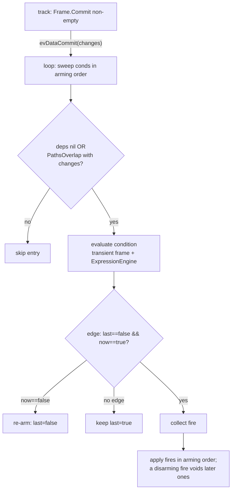

# SRD-048 — Conditional events: catch, boundary, and event-based-gateway arms

| Field | Value |
|---|---|
| Status | Accepted |
| Version | v.1 |
| Date | 2026-07-15 |
| Owner | Ruslan Gabitov |
| Implements | [ADR-006 v.3](../design/ADR-006-events-and-subscriptions.md) §2.7 (conditional events — status-based triggering by commit-diff); GitHub issue #89 |
| Upstream | [ADR-011 v.6](../design/ADR-011-structured-process-data.md) §2.9.4 (the commit-diff change signal this rides), [ADR-018 v.1](../design/ADR-018-boundary-events-and-activity-interruption.md) §2.7 (the boundary-trigger deferral this closes for Conditional), [ADR-005 v.4](../design/ADR-005-gateways-and-joins.md) (event-based-gateway arms), [ADR-001 v.6](../design/ADR-001-execution-model.md) (the single-writer loop the registry lives on), [ADR-013 v.2](../design/ADR-013-observability.md) (fact kinds the new signals reuse) |
| Refines | — |

Note on numbering: SRD-047 is reserved for the structural-data maps slice
(S5); this workstream takes 048.

## §1 Background

The model layer already carries a complete `ConditionalEventDefinition`
(`pkg/model/events/conditional.go:11-63`: non-nil-condition constructor,
`Type() == flow.TriggerConditional`, `Condition()` getter), and two positions
already *accept* it — `startTriggers` (`start.go:21`) and
`intermediateCatchTriggers` (`intermediate_catch.go:19`) — while **nothing
executes it**: the hub waiter factory has no Conditional case and rejects it
with `ObjectNotFound` (`internal/eventproc/eventhub/waiters/waiters.go:54-81`),
and no runtime path evaluates a condition. A modeller can build a process with
a conditional catch that then hangs forever — the silent-misbehavior class
SRD-046 §1 fixed for flow conditions, now at the event layer.

ADR-006 v.3 §2.7 settles the conception this SRD lands:

- **In scope:** intermediate catch, boundary (interrupting and
  non-interrupting), and event-based-gateway arms.
- **Not supported:** top-level conditional START — BPMN Table 10.84 forbids
  the start condition to reference process data, and gobpm exposes no legal
  static-attribute surface; it becomes a **fail-fast placement rejection**
  in `Process.Validate` (registration time — construction stays legal for
  the future event-sub-process reuse).
  Conditional start returns for **event sub-processes only**, with the
  Sub-Process workstream, where §10.4.3 legally scopes the condition to the
  enclosing instance.
- **Trigger source** is the instance's own data commits, so ownership is
  **loop-local** (per-instance, single-writer) — the hub is never involved.
  The substrate exists: `Frame.Commit()` returns the committed changed-path
  set `[]data.Change` (`internal/scope/frame.go:251-283`, SRD-044), consumed
  today only by `track.reportDataChanges`
  (`internal/instance/track.go:964-983`, `datachange.go:18-35`).
- **Firing** follows the normative false→true **edge rule** (Table 10.84);
  arm-time evaluation fires immediately when the condition is already true.
- **Granularity** is one uniform per-subscription rule with **no processing
  modes**: an expression may carry an optional `Dependencies() []string`
  statement — absent/nil re-evaluates on every non-empty commit (the safe
  fallback), non-empty re-evaluates only when the commit-diff intersects the
  declared paths (segment-prefix match), explicitly-empty is rejected at
  construction.
- **Multi-fire ordering:** one commit → one evaluation sweep in arming order;
  a disarming fire voids later-collected deliveries.

## §2 Requirements

### Functional

- **FR-1 — `data.DependencyLister` capability.** New optional interface in
  `pkg/model/data` (new file `dependencies.go`, one entity per file):
  `Dependencies() []string` — the data paths (structural grammar,
  `path.go`) the expression reads. Absent capability or a nil return means
  "may read anything" → always re-evaluate. No process/engine-level mode
  exists.
- **FR-2 — `goexpr.WithDependencies`.** New functional option on
  `goexpr.New`/`Must` declaring the expression's read paths. Validation:
  at least one path, each non-empty and parseable by the structural grammar
  (`data.SplitPath`); an explicitly-empty call is rejected ("depends on
  nothing" would mean never re-evaluate — the degenerate trap). `GExpression`
  stores the list and implements `DependencyLister`. The option is a
  goexpr-local option type carrying the `options.Option` marker (the
  `events.EventOption` pattern), dispatched by type-switch in `New`;
  non-goexpr options continue to `data.NewExpression` unchanged. The option
  is a self-naming closure returning `errs` errors (project option rule).
- **FR-3 — Boolean condition enforced at construction.**
  `NewConditionalEventDefinition` (`conditional.go:23`) additionally rejects
  a condition whose `ResultType() != "bool"` — the SRD-046
  `checkCondition` precondition (`flowselect.go:85-90`) moved to model-build
  time, so a non-bool condition never reaches the runtime.
- **FR-4 — Top-level conditional START fail-fast, at the placement seam.**
  The StartEvent **construction surface stays legal** — `TriggerConditional`
  remains in `startTriggers` (`start.go:21`) with the comment flipped to
  "only for event Sub-Processes" (the existing pattern: Compensation /
  Error / Escalation sit in the same set marked "only for in-line
  Sub-Processes", `start.go:20-25`), and `startConfig.setCondition`
  (`start_options.go:154-159`) keeps appending — because construction is
  context-free and the same StartEvent type is the future event-sub-process
  start. The **rejection moves to `Process.Validate`**
  (`process/process.go:220`), the only context-aware seam: a `Process` is
  the top-level container, so a direct node that is a Start Event
  (`flow.EventNode` with the Start class) carrying a Conditional definition
  is a classified error (message: not supported on a top-level Start Event
  per BPMN Table 10.84 — the start condition may not reference process
  data; conditional start arrives with event sub-processes). `Validate`
  runs at registration (`snapshot.New`), so this is still fail-fast before
  any snapshot or instance — and it needs **no rework** when event
  sub-processes land: their start events are not direct nodes of the
  top-level Process. The per-node self-validation hook already in
  `Validate` (`process.go:245-254`, the Complex-gateway precedent) is NOT
  used — a node-owned `Validate()` would be context-free again.
- **FR-5 — Boundary position opens.** Add `flow.TriggerConditional` to
  `boundaryTriggers` (`boundary.go:14-19`) and update the deferral comment
  (Conditional leaves the ADR-018 v.1 §2.7 deferred set).
- **FR-6 — Event-based-gateway arms open.** The arm validation
  (`gateways/event_based.go:427-442`) accepts `flow.TriggerConditional`
  alongside Message/Timer/Signal; the rejection message at
  `event_based.go:435` gains `/Conditional`.
- **FR-7 — Conditional defs bypass the hub.** In the catch registration path
  (`track.go` `checkNodeType`, lines 413-465) `TriggerConditional`
  definitions are **not** passed to `RegisterEvent`; they are carried to the
  loop on the `evWaiting` emit (new `trackEvent` field `condDefs
  []*events.ConditionalEventDefinition`, sibling of `msgDefIDs`) and on the
  spawn path for a track that parks before the loop drains (the `msgIdx`
  seeding precedent, `loop.go:306-320`). The waiter factory stays untouched
  — no `ConditionalWaiter` exists, by design.
- **FR-8 — Loop-local armed registry.** `loopState` gains `conds
  []*condWatch` — a **slice**, because the multi-fire ordering contract is
  arming order (a map would lose it). Each entry records the flavor (catch /
  boundary), the parked or host track, the node, the definition, the
  dependency paths (extracted **once at arm** via the `DependencyLister`
  assert), and the last observed value (edge state). Entries are torn down
  when their track flips out of waiting, moves, ends, or fails — the
  `clearMsgIdx` / `disarmBoundaries` lifecycle (`loop.go:365-373`,
  `boundary_watch.go:122-150`).
- **FR-9 — Arm-time evaluation.** On arming (catch: the `evWaiting`/spawn
  handling; boundary: `armBoundaries`), the loop evaluates the condition
  once: true → fire immediately (ADR-006 v.3 §2.7); false → record
  `last=false` and wait for commits.
- **FR-10 — Commit signal to the loop.** New `trackEvent` kind
  `evDataCommit` carrying the committed `[]data.Change` and the committing
  node. `finalizeNodeExecution` emits it after a successful non-empty
  commit — but **only when the process can have armed conditionals**:
  `snapshot.Snapshot` precomputes a `HasConditionals` flag in one node pass
  at build (the `InstantiatingStarts` precedent, `snapshot.go:16-36`), so a
  conditional-free process never pays the emit (NFR-1).
- **FR-11 — The uniform re-evaluation rule.** On `evDataCommit`, the loop
  sweeps `conds` in arming order; for each armed entry: skip when its
  dependency list is non-empty and does not intersect the commit's changed
  paths (segment-prefix overlap, FR-12); otherwise evaluate. Fire on the
  false→true edge only: `last==false && now==true` → fire; `now==false` →
  re-arm (`last=false`); already-true without an edge → no fire. Fires
  collected in the sweep are applied in arming order; a **disarming** fire
  (an interrupting boundary cancelling its host, a catch flipping its track
  out of waiting) voids later-collected fires whose entry it tore down.
- **FR-12 — `data.PathsOverlap`.** New helper beside the path grammar
  (`pkg/model/data/path.go`): two paths overlap when equal or when one is a
  **segment-boundary prefix** of the other (`order` ↔ `order.total` overlap;
  `order` ↔ `orders` do not). Used by FR-11; exported — it is the public
  semantics of a dependency declaration.
- **FR-13 — Evaluation idiom.** Loop-side evaluation uses the
  `authorizeTask` precedent (`tasks.go:186-199`): open a transient root
  frame (`inst.sc.openFrame`), wrap in `newExecEnv(inst, frame)` as the
  `data.Source`, evaluate via `inst.ExpressionEngine().Evaluate(ctx, cond,
  env)`, `Discard` the frame. An evaluation error is an instance failure
  (`inst.fail` + `stopAll` — the `armBoundaries` registration-failure
  handling, `boundary_watch.go:90-101`): a condition the engine cannot
  evaluate leaves the model's declared wait meaningless, the fail-fast
  class (never log-and-continue).
- **FR-14 — Catch fire delivery.** A firing catch/EBG-arm conditional
  delivers through the existing parked-dispatch contract
  (`dispatchToParked` semantics, `loop.go:333-355`): the track must still be
  parked-and-undelivered, `flipNotParked` makes deferred choice atomic (a
  conditional arm losing to a Message/Timer/Signal arm — and vice versa — is
  a benign drop), the definition goes to the track's buffered `evtCh`.
- **FR-15 — Boundary fire delivery.** An **interrupting** conditional
  boundary fires through the `fireBoundary` arbitration (the `evBoundary`
  handling — host cancel + exception-flow continuation, SRD-029 semantics);
  already on the loop goroutine, it calls the handler directly instead of
  re-emitting to its own channel. A **non-interrupting** one spawns the
  boundary's outgoing track without cancelling the host and **re-arms** with
  `last=true` — a re-fire needs a fresh false→true edge.
- **FR-16 — Observability.** No new kind. Catch-flavor arm/fire/drop emit
  `KindEventFlow` facts (`PhaseRegistered`/`PhaseFired`/`PhaseDropped`,
  `fact.go:23,50,69-71`); boundary-flavor arm/fire/disarm emit
  `KindBoundary` (`PhaseArmed`/`PhaseFired`/`PhaseDisarmed`) — the
  `armBoundaries`/`disarmBoundaries` fact shape (`boundary_watch.go:105-113`, `140-146`).
- **FR-17 — Front-door sync.** Runnable example
  `examples/conditional-events/` (entry >80 lines → split by concern, the
  examples rule), `CHANGELOG.md` `[Unreleased]` entry, the
  `docs/design/conformance-status.md` row flip (§2 row 1 → §1, same-PR
  tracker rule), `examples/README.md` + root `README.md` (and RU twin)
  feature-list refresh.

### Non-functional

- **NFR-1 — Zero cost without conditionals.** A process with no
  `ConditionalEventDefinition` anywhere emits no `evDataCommit` (the
  `HasConditionals` static gate, FR-10) and allocates no registry.
- **NFR-2 — Single-writer preserved.** All conditional state
  (`conds`, edge flags) is `loopState`-owned, mutated only on the loop
  goroutine, no locks (ADR-001 v.6, `loop.go:14-18`). Scope reads during
  evaluation are Scope-serialized (`frame.go:24-26`), safe from the loop.
- **NFR-3 — Hub untouched.** No waiter type, no `CreateWaiter` case, no
  hub registration for Conditional — the trigger's source is the instance
  itself (ADR-006 v.3 §2.7).
- **NFR-4 — Camunda-aligned default.** No dependency statement →
  re-evaluate on every non-empty commit; a declared list is the
  `variableName`-style narrowing. Deviation-free: a missing statement costs
  performance, never correctness.
- **NFR-5 — Coverage.** Touched files land at 100% (min 80%) with the
  change; diff-coverage gate ≥95% (`make ci`).

## §3 Models

### §3.1 `data.DependencyLister` (new: `pkg/model/data/dependencies.go`)

```go
// DependencyLister is the optional capability of a FormalExpression to
// declare the data paths it reads (ADR-006 v.3 §2.7). A nil/absent list
// means the expression may read anything — its conditional subscription
// re-evaluates on every non-empty commit; a non-empty list narrows
// re-evaluation to commits whose diff overlaps a declared path
// (PathsOverlap). An expression never declares an empty non-nil list —
// constructors reject it.
type DependencyLister interface {
	Dependencies() []string
}
```

### §3.2 `goexpr` option (new: `pkg/model/data/goexpr/options.go`)

```go
// GExpOption configures a GExpression at construction.
type GExpOption func(g *GExpression) error

// Option marks GExpOption as an options.Option.
func (GExpOption) Option() {}

// WithDependencies declares the data paths the expression's gfunc reads
// (data.DependencyLister). At least one path is required — an empty
// declaration would mean "never re-evaluate", the degenerate trap — and
// every path must parse under the structural grammar.
func WithDependencies(paths ...string) GExpOption {
	return GExpOption(func(g *GExpression) error {
		if len(paths) == 0 {
			return errs.New(
				errs.M("WithDependencies: at least one path is required"),
				errs.C(errorClass, errs.InvalidParameter))
		}
		// per-path: non-empty + data.SplitPath parses; errors name the
		// option and the offending path (self-identifying message rule).
		...
		g.deps = append(g.deps, paths...)
		return nil
	})
}
```

`GExpression` gains `deps []string` and

```go
// Dependencies implements data.DependencyLister: the paths declared via
// WithDependencies, or nil when the expression declared nothing (= may
// read anything, re-evaluate on every non-empty commit).
func (ge *GExpression) Dependencies() []string { return ge.deps }
```

`goexpr.New` type-switches its `opts`: `GExpOption` applies locally, all
other options forward to `data.NewExpression` as today
(`goexpr.go:62-71`).

### §3.3 `condWatch` (new: `internal/instance/conditional.go`)

```go
// condWatch is one armed conditional subscription, loop-owned (ADR-006
// v.3 §2.7). Flavor catch: track is the parked catch/EBG track and node
// its event node. Flavor boundary: track is the HOST activity track, node
// the boundary event node, interrupting per the boundary's model flag.
type condWatch struct {
	track        *track
	node         flow.Node
	def          *events.ConditionalEventDefinition
	deps         []string // extracted once at arm (DependencyLister)
	last         bool     // edge state: last observed condition value
	boundary     bool
	interrupting bool
}
```

`loopState` gains `conds []*condWatch` (slice — arming order is the
multi-fire contract, FR-8/FR-11).

### §3.4 `trackEvent` deltas (`internal/instance/event.go`)

- New field `condDefs []*events.ConditionalEventDefinition` — carried on
  `evWaiting` (sibling of `msgDefIDs`, same emit; `track.go:437-443`).
- New field `changes []data.Change` — carried on the new kind.
- New kind `evDataCommit` (+ its `trackEventKindNames` row): a track's
  frame commit produced a non-empty changed-path set; the loop sweeps the
  armed conditionals (FR-11). Emitted from `finalizeNodeExecution` after
  `f.Commit()` succeeds, gated on `len(changes) > 0 &&
  snapshot.HasConditionals`.

### §3.5 `snapshot.Snapshot` delta

`HasConditionals bool` — precomputed by `New` in the same node pass style
as `InstantiatingStarts` (`snapshot.go:29-35`): true iff any node's event
definitions include a `TriggerConditional`. Immutable, shared by `Clone`.

## §4 Analysis

### §4.1 Why loop-local, not a hub waiter

The hub distributes **external** occurrences (messages, timers, signals)
to registered waiters. A conditional trigger's occurrence source is the
instance's **own** committed data — the loop already owns both the commit
signal (it receives every track's events) and the subscription lifecycle
maps (`waiting`, `watchers`). Registering the instance's own state change
into a global hub and routing it back would add two goroutine hops, a
correlation surface, and a teardown protocol for zero reach gain (no other
instance may observe this instance's data — ADR-010 scope isolation).
Rejected alternative: a `ConditionalWaiter` polling scope — polling is the
exact anti-pattern ADR-006 v.3 §3 names ("data-driven waiting is
expressible without polling").

### §4.2 Why a new event kind, not piggybacking `reportDataChanges`

`reportDataChanges` emits **observability facts** — observer-plane,
fire-and-forget, explicitly not a control signal (ADR-013 v.2 §2.2
separation). Routing engine semantics through the observer plane would
make correctness depend on an observer being attached. The control-plane
lane for track→loop signals is `trackEvent` (`event.go:5-43`); a new kind
is the established extension point (13 kinds today, each one landing).

### §4.3 Sweep semantics — one commit, one snapshot, arming order

The loop evaluates all due conditionals in one `evDataCommit` application
(`apply`, `loop.go:225-304`, runs to completion before the next event).
Evaluations read the **current** committed scope — a concurrent commit by
another track may already be visible; that is correct for status-based
semantics (the condition is about state, not about the triggering event's
payload — ADR-006 v.3 §2.7) and its own `evDataCommit` follows in FIFO
order anyway, so no edge is lost. Fires are collected during the sweep and
applied in arming order; applying a disarming fire tears its entries out
of `conds`, and later-collected fires whose entry is gone are voided —
exactly the ADR's multi-fire rule.



### §4.4 Edge state at re-arm (non-interrupting boundary)

After a non-interrupting fire the entry stays armed with `last=true`: the
next commit that evaluates true produces **no** edge; a commit evaluating
false re-arms (`last=false`); the subsequent true fires again. This is
Table 10.84's re-fire semantics verbatim (the vendored appendix,
`docs/bpmn-spec/semantics/event-handling.md`).

A boundary event carrying a Conditional definition **beside** another
definition needs no special casing: `armBoundaries` already arms each
definition independently (the per-def loop, `boundary_watch.go:79-116` —
OR semantics), so a conditional def is just one more independent watch;
combined AND semantics would be a parallel-multiple event, which stays
deferred.

### §4.5 Rejected: process-level processing modes

An earlier design draft carried `CondReevaluateAll`/`CondFiltered`
process modes with registration-time completeness validation. Deleted: the
uniform rule makes a **missing** declaration fail-safe (always
re-evaluate — correct, just unfiltered), so the mode guarded a condition
that is already safe; the runtime behaviour of any mode combination is
byte-identical to the per-expression rule. A **wrong** non-empty
declaration remains the author's contract, declared beside the
expression's logic — the same ownership Camunda assigns `variableName`.

### §4.6 Rejected: runtime read-tracing

Inferring the dependency set by tracing a `GExpFunc`'s reads is unsound:
the functor takes data-dependent paths, and a closure can read a captured
live wrapped struct without touching `ds.Find` at all — a silently
incomplete trace means a missed wake-up, the worst failure mode. Exact
sets come only from **derivation** (introspectable declarative
expressions, the expression-layer workstream #74; a conservative codegen
source analyzer later), both failing toward re-evaluation.

## §5 API surface

Public: `data.DependencyLister`, `data.PathsOverlap`,
`goexpr.WithDependencies` (+ `GExpression.Dependencies`), the tightened
`events.NewConditionalEventDefinition` (bool-typed condition required),
the widened `boundaryTriggers`/EBG-arm acceptance, and the
`Process.Validate` placement gate (a top-level conditional Start is
rejected at registration; construction stays legal — it is the future
event-sub-process surface).
Everything else is `internal/instance` machinery.

## §6 Test scenarios

Model (M1/M2):

- `TestDependencyLister` (`pkg/model/data`) — capability assert on an
  implementing/non-implementing expression.
- `TestPathsOverlap` — table: equal, prefix both directions, sibling
  (`order` vs `orders`) no-overlap, indexed steps.
- `TestWithDependencies` (`goexpr`) — declared list surfaces via
  `Dependencies()`; empty call rejected; empty/unparseable path rejected;
  plain construction returns nil.
- `TestConditionalDefinitionBoolGate` — non-bool condition rejected at
  `NewConditionalEventDefinition`.
- `TestStartConditionalRejected` (`pkg/model/process`) — a process whose
  Start Event carries a Conditional definition fails `Validate()` with the
  classified placement error; today's all-triggers accept-assert
  (`start_test.go:163-198`) **stays** — construction remains legal.
- `TestBoundaryConditionalAccepted`, `TestEBGConditionalArmAccepted` —
  allow-list/arm-validation flips.

Runtime (M3/M4, `internal/instance`):

- `TestConditionalArmTimeFire` — condition already true at park → fires
  immediately, no commit needed.
- `TestConditionalEdgeRule` — false at arm; commit→true fires;
  staying true across commits does not re-fire; false then true re-fires
  (non-interrupting boundary flavor).
- `TestConditionalDependencyFiltering` — declared `["order"]`: commit
  touching `customer` skips evaluation (counted via an evaluation-counter
  expression), commit touching `order.total` evaluates; undeclared
  expression evaluates on both.
- `TestConditionalMultiFireOrder` — two conditionals turning true on one
  commit fire in arming order; an interrupting-boundary fire voids the
  later-collected fire of the same host.
- `TestConditionalBoundaryInterrupting` / `NonInterrupting` — host
  cancel + exception flow; parallel spawn + re-arm.
- `TestConditionalLosingArm` — EBG with Conditional + Signal arms: the
  signal fires first, the conditional's later fire drops (flip contract).
- `TestConditionalEvalFailureFailsInstance` — an erroring condition →
  instance failure (FR-13).
- `TestNoConditionalsNoCommitSignal` — `HasConditionals=false` process
  emits no `evDataCommit` (NFR-1).

E2E (M5, `pkg/thresher`): `TestConditionalEventsE2E` — a process where a
service task's committed output flips an intermediate-catch condition and
a boundary condition; asserts both paths complete and the `KindEventFlow`/
`KindBoundary` facts appear.

## §7 Milestones

| # | Scope | Commit shape |
|---|---|---|
| M1 | `data.DependencyLister` + `data.PathsOverlap` + `goexpr.WithDependencies`/`Dependencies` + bool gate in `NewConditionalEventDefinition` + tests | `feat(data,goexpr): dependency statements for conditional expressions` |
| M2 | `Process.Validate` top-level placement gate + startTriggers comment + boundary allow-list + EBG arm acceptance + tests | `feat(events,gateways,process): open conditional positions, gate top-level start` |
| M3 | `Snapshot.HasConditionals` + `evDataCommit` + `condWatch` registry + catch flavor (arm/evaluate/edge/deliver/teardown) + tests | `feat(instance): loop-local conditional subscriptions (catch)` |
| M4 | boundary flavor (interrupting + non-interrupting) + EBG-arm e2e in-package tests | `feat(instance): conditional boundary events` |
| M5 | thresher e2e + `examples/conditional-events/` + changelog + conformance-tracker row + README/examples sync | `feat: conditional events — e2e, example, front-door sync` |

Post-M5: `/check-srd`, §10 fill, SRD status flip, ADR-006 v.3 → Accepted +
RU twin refresh, sync linked docs (ADR-018 §2.7 deferral annotation,
ADR-005 arm note).

## §8 Cross-doc

- Implements [ADR-006 v.3](../design/ADR-006-events-and-subscriptions.md)
  §2.7 — every §2 requirement realizes a §2.7 clause (traced inline
  above).
- Closes the Conditional row of [ADR-018 v.1](../design/ADR-018-boundary-events-and-activity-interruption.md)
  §2.7's deferred boundary triggers.
- Rides [ADR-011 v.6](../design/ADR-011-structured-process-data.md) §2.9.4
  commit-diff and [ADR-005 v.4](../design/ADR-005-gateways-and-joins.md)
  event-based-gateway semantics; preserves
  [ADR-001 v.6](../design/ADR-001-execution-model.md) single-writer.
- Observability shapes per [ADR-013 v.2](../design/ADR-013-observability.md)
  (no new kind).

## §9 Definition of Done

- [ ] All FR/NFR wired and traced to §6 tests.
- [ ] `make ci` green (lint 0, race tests, diff-coverage ≥95%, vuln 0);
      touched files at 100% (min 80%).
- [ ] Example runs to completion under timeout (exit 0), binary
      gitignored.
- [ ] Conformance tracker row 1 flipped to §1 in this PR.
- [ ] Changelog `[Unreleased]` updated before the PR description.
- [ ] `/check-srd` PASS; §10 filled; ADR-006 flipped Accepted + RU twin
      refreshed; linked docs synced.
- [ ] Issue #89 closable (top-level START explicitly out per ADR-006 v.3;
      noted in the closing comment).

## §10 Implementation summary

### §10.1 Milestones by commit (branch `feat/conditional-events`)

| Stage | Commit | Scope | Tests |
|---|---|---|---|
| doc | `39f2bef` | SRD-048 + the ADR-006 §2.7 wording alignment ("rejected at model validation") | — |
| M1 | `9e853e8` | `data.DependencyLister` + `data.PathsOverlap` + `goexpr.WithDependencies`/`Dependencies()` + the bool gate | TestPathsOverlap, TestWithDependencies, TestConditionalDefinitionBoolGate |
| M2 | `986ec83` | `Process.Validate` placement gate + startTriggers comment + boundary allow-list + EBG arms | TestStartConditionalRejected, boundary rows, the flipped EBG accept case |
| M3 | `46d3454` | `Snapshot.HasConditionals` (+ `Clone` copy) + `evDataCommit` + `condWatch` registry + the catch flavor | TestCondDue, ArmTimeFire, EdgeRule, DependencyFiltering, MultiFireVoiding, eval-failure cases, emit gates, snapshot flags |
| M4 | `75a05e3` | Boundary flavor (loop-owned `boundaryWatch`, interrupting + non-interrupting) + EBG-arm tests + the spawn cancel-order fix | TestConditionalBoundary{ArmTimeInterrupting, InterruptingSweep, NonInterrupting, ArmEvalFailure}, TestEBGConditionalArm{Wins, Loses} |
| M5 | `f0dc475` | Thresher e2e + `examples/conditional-events/` + guide + changelog + tracker row + README sync + the fork-into-catch deadlock fix | TestConditionalEventsE2E |

Every milestone landed with `make ci` green; final diff-coverage 97.9% of
379 changed lines (min 95%).

### §10.2 Deltas vs the draft

- **FR-4 was redesigned during the doc review** (before approval, reflected
  above): the rejection moved from the StartEvent construction surface to
  the `Process.Validate` placement seam, keeping construction legal for the
  future event-sub-process start (owner's catch).
- **§3.3 `condWatch` shape**: the draft carried `boundary bool +
  interrupting bool`; landed with `boundary bool` only — the interrupting
  discrimination lives where it always did, in `fireBoundary` reading the
  model's `CancelActivity()`, so duplicating it on the watch was dropped.
- **Boundary lifecycle reuse**: instead of a parallel conditional-boundary
  lifecycle, a conditional def gets a regular `boundaryWatch` entry marked
  `loopOwned` (no hub registration; disarm skips the hub unregister), so
  `armedFor` and the disarm path govern both flavors unchanged.
- **`clearConds` is keyed by trackID**, not the pointer — the disarm sites
  carry the id.

### §10.3 Empirical findings

- **Fork-into-catch loop deadlock (fixed in M5).** Building a fork-born
  track directly on a catch node emitted `evWaiting` from the loop
  goroutine (`spawnForks → newTrack → checkNodeType`), deadlocking the loop
  on its own channel; pre-existing for every catch trigger, first exposed
  by this SRD's e2e process shape. Fixed by an `atConstruction` flag:
  construction never emits — `spawn`'s `recordBornWaiter` records
  born-parked tracks; only the mid-run path (the track's own goroutine)
  emits.
- **`Snapshot.Clone` silently dropped the new flag.** The first
  `HasConditionals` implementation set the field in `New` but not in
  `Clone`'s literal — and the instance runs on the clone, so the commit
  signal was silently disabled (a hung test caught it). Pinned by
  `TestSnapshotHasConditionals` asserting the flag on the clone.

### §10.4 Backlog (out of SRD-048 scope)

- **Fork-born Message catch with a broker-buffered message**: the
  synchronous waiter fire at registration (`MessageWaiter` draining on
  RegisterEvent) can also run on the loop goroutine for a fork-born track
  — the evDeliver sibling of the fixed evWaiting deadlock. Needs its own
  FIX (likely: move fork-born hub registration to the spawn path).

## Open questions

None.
