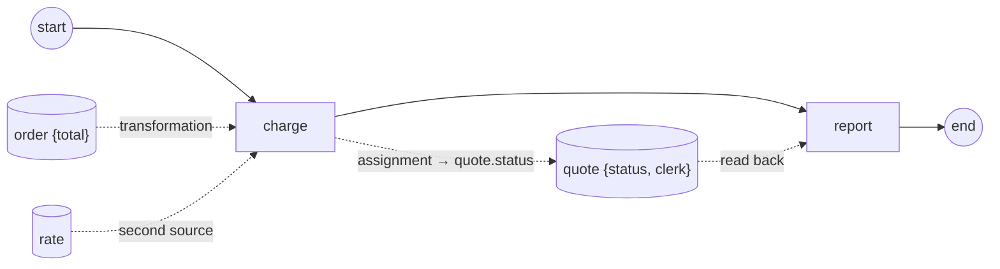

# association-expressions

Demonstrates the two **expression shapes** BPMN gives a data association
(§10.4.2 rules 1 and 2, [ADR-011 §2.4](../../docs/design/ADR-011-process-data-flow.md),
[SRD-097](../../docs/srd/SRD-097-association-expressions.md)) — a
**transformation**, whose result replaces the target, and an **assignment**,
which writes at a path *inside* it.

```
order {total: 120}   rate {2}
     │                   │
     └──── transformation ────▶  charge.amount = 240      (order.total * rate)
                                     │
                          charge.note │ assignment
                                     ▼
                          quote {status: ← written, clerk: untouched}
```



## What each shape shows

- **Transformation** (`wireInput`). Two sources — `order` and `rate` — and an
  expression whose result *replaces* the task's input. Several sources are
  legal **because** a transformation is present (§10.4.2 rule 3 allows exactly
  one without either shape), and the expression reads one of them by
  **structural path**, `order.total`, through the same resolver a gateway
  condition reads.
- **Assignment** (`wireOutput`). The task's `note` is written into **one field**
  of the `quote` record. The `to` path is absolute — its head names the
  association's own target — so `quote.status` is replaced while `quote.clerk`
  is left exactly as it was. The `report` task reads both back and fails the
  instance if either is wrong, so the example asserts its claim rather than
  only printing it.

Two details worth noticing in the code:

- `AssociateTargetInput`, not `AssociateTarget`, wires the input association:
  the by-item form picks the node input whose `itemDefinition` matches the
  source's, and under a transformation the two ends deliberately differ.
- `order` and `quote` are separate objects on purpose. An association marks its
  **target** Unavailable at construction — a data object fed by an association
  is not readable until its producer writes it — so one object cannot be both a
  source and a target here.

## Run

```bash
cd examples/association-expressions
go run .
```

Expected: the transformation hands `charge` **240**, the assignment writes
`quote.status`, `quote.clerk` stays `"ann"`, and the instance completes.
