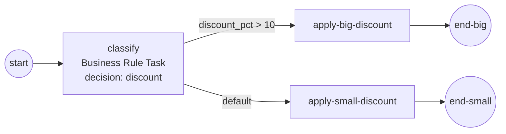

# business-rule-task

Demonstrates the **Business Rule Task** on the pluggable **Business Rule
Engine seam** (ADR-027, SRD-060) — the task calls a named decision on the
configured engine and commits the result to process data; the decision
outcome then routes the flow.

```
start → [classify (BRT: decision "discount")]
          ├─ discount_pct > 10 ─> [apply-big-discount] ──> end-big
          └─ (default) ────────> [apply-small-discount] ─> end-small
```



The engine here is the **batteries-included `gorules` registry**
(`##GoRules`): the `discount` decision is a plain Go function registered by
name — it reads the order `total` through the process-data walk-up and yields
one result row (`discount_pct`). The task's **1-row/1-output fold** commits
that as a scalar variable, so the conditional flow reads it with zero
ceremony. Swapping in a DMN or any external rules service is one option
(`thresher.WithRuleEngine(...)`) — the model is untouched by the swap.

An unknown decision reference fails **loud** (a classified error through the
ordinary fault machinery), and every evaluation emits a `Rules` observability
fact carrying the decision reference, the engine kind, and the result shape.

## Run

```bash
cd examples/business-rule-task && go run .
```

Expected output: the decision log line (`total=250 -> discount_pct=15`), the
`apply-big-discount` announcement, and the completion summary.
