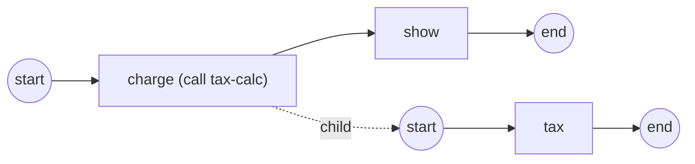

# call-activity

**Composition: a child instance — the reuse boundary** — the Call Activity
(ADR-023 / SRD-050).

`tax-calc` is a process registered on its own. The `checkout` process reuses
it through a **Call Activity** (`charge`), which launches it as a **separate
child instance** — not a nested scope (contrast the embedded Sub-Process,
which runs inside the same instance). When the caller's token reaches it:

- the caller's token **parks** and the loop launches the callee through the
  engine's registry — **latest-at-launch** by default, or a pinned version
  (`activities.WithCalledVersion`);
- the declared **Input** parameters (`subtotal`) are resolved at the caller's
  scope and **cloned across the boundary** — the child runs on an isolated
  data plane, no walk-up to the caller (the isolation contract);
- when the child completes, its declared **Output** parameters (`total`) are
  read by name and **committed back** into the caller's scope, and the caller
  resumes;
- a child `BpmnError` faults the caller **at the Call Activity node**, where
  an Error boundary can catch it (the §2.6 error chain); the child terminates
  with the caller (the cancel cascade).



`process.go` builds the callee + caller, `observer.go` prints the call
lifecycle, `main.go` wires + runs.

```bash
go run .
```

```
  ▶ call charge: Started (tax-calc v.1 → instance …)
    (child) subtotal=100 → total=120
  ✓ caller sees total=120
  ▶ call charge: Completed (tax-calc v.1 → instance …)
  ✓ completed (Completed)
```

See [`docs/guides/composition.md`](../../docs/guides/composition.md).
