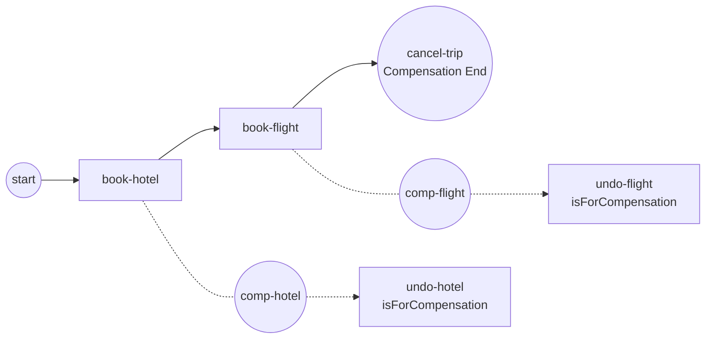

# compensation-events

Demonstrates **Compensation events** (SRD-059, ADR-026) — undoing work that
already **completed successfully**, the saga pattern in BPMN form.

```
start → [book-hotel] → [book-flight] → cancel-trip (Compensation End Event)
            ╳ undo-hotel   ╳ undo-flight     (Compensation boundaries)
```



Each booking carries a **Compensation boundary** linked to its
`isForCompensation` undo handler. When a booking completes, it enters the
engine's **completion ledger** with a **data snapshot** taken at that instant.
The `cancel-trip` **Compensation End Event** (no `activityRef`, `waitForCompletion`)
then compensates the whole scope in **reverse completion order** — `undo-flight`
runs before `undo-hotel` — and the throw waits until both handlers finish.

Key semantics on display:

- Only **completed** work compensates (presumed abort — a failed booking never
  enters the ledger).
- A handler reads the **snapshot** its activity completed with, not the current
  data; its writes go to the live scope.
- A throw that resolves to nothing is **logged**, never a fault, never silent.

## Run

```bash
cd examples/compensation-events
go run .
```

Expected: both bookings print, then the undo handlers print **flight first,
hotel second**, and the instance completes.
