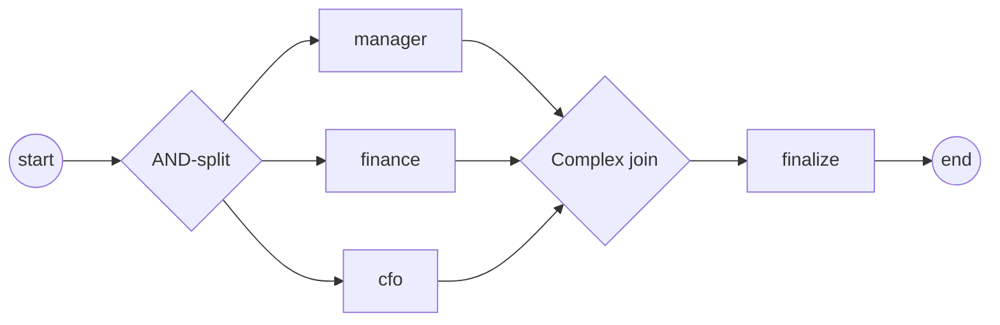

# complex-gateway

**Complex gateway: an activation-threshold join — fire once N of M arrive**
(ADR-005 §2.11).

Three approvers run in parallel; the Complex join fires on the data-aware
activation rule `[(amount<1000, 2), (amount>=1000, 3)]`:

- the AND-split runs all three approvers concurrently;
- the join picks its threshold by guard — two approvals suffice for a small
  order, all three for a large one (partial-join / discriminator family,
  WCP-30 / WCP-9);
- any approval arriving after the join has fired is consumed as a
  **trailing token** — it does not re-fire the join;
- the demo runs with `amount = 500`, so the join fires on the 2nd approval.



`process.go` builds the process (the activation rule lives in
`approvalJoin`), `main.go` wires the engine and runs.

```bash
cd examples/complex-gateway && go run .
```

```
order amount = 500 (needs 2 approvals)
  ▶ manager approved
  ▶ finance approved
  ▶ cfo approved
  ✓ order finalized
✓ complex-gateway completed (Completed): the join fired on the 2nd approval; ...
```
