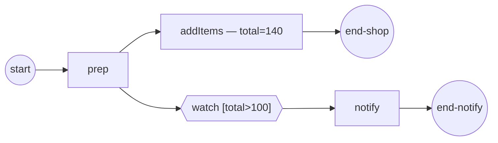

# conditional-events

**Data-driven waiting without polling** — conditional events (ADR-006 v.3
§2.7 / SRD-048).

A branch parks on an **intermediate conditional catch** whose condition reads
process data; when a sibling task's frame commit changes that data, the engine
re-evaluates the condition and the **false→true edge** releases the branch:

- `watch [total>100]` arms at `total=20` → condition false, the branch parks;
- `addItems` commits `total=140` → the commit-diff wakes the subscription,
  the edge fires, `notify` runs.

The condition **declares its read paths** (`goexpr.WithDependencies("total")`),
so only commits overlapping `total` re-evaluate it; an undeclared condition is
safely re-evaluated on every non-empty commit.



`model.go` builds the process, `process.go` the tasks and the condition,
`observer.go` prints the subscription lifecycle, `main.go` wires + runs.

```bash
go run .
```

```
  prep → commit cart=1
  ▶ watch-total: Registered
  addItems → commit total=140
  ▶ watch-total: Fired
  notify → the total crossed 100, shipping upgraded
  ✓ completed (Completed)
```

Conditional triggers also work on **boundary events** (interrupting and
non-interrupting) and **event-based-gateway arms**; a top-level conditional
Start Event is rejected at process validation (BPMN Table 10.84). See
[`docs/guides/conditional-events.md`](../../docs/guides/conditional-events.md).
