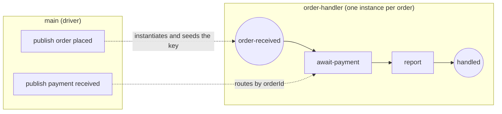

# conversation-routing

**A follow-up message routes back to the specific handler instance whose
conversation it belongs to; two conversations stay isolated** (SRD-017
phase-2c — conversation-token threading).

- each `order placed` message spawns a keyed `order-handler` instance
  (phase-2b instantiation) and **seeds its conversation key** with the
  order id derived from the payload (`orderId` correlation property);
- the in-instance `await-payment` ReceiveTask subscribes **keyed to that
  conversation**, so a `payment received` carrying the same order id routes
  back to the originating handler — never the other one;
- the driver runs two conversations (`ORD-1`, `ORD-2`) concurrently and
  verifies each handler reported its own order paired with its own payment
  (no cross-talk).



`correlation.go` builds the correlation key, `handler.go` the handler
process, `main.go` drives both conversations and verifies.

```bash
cd examples/conversation-routing && go run .
```

```
handler reported order/payment: ORD-1/ORD-1
handler reported order/payment: ORD-2/ORD-2
OK: each payment routed to its originating handler conversation
```
