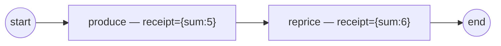

# data-change

Observing **which data changed** — commit-diff change detection (ADR-011 v.6
§2.9.4 / SRD-044, the S3 slice).

Every node's frame commit is **diffed** against the prior committed value, and
each changed path surfaces as one `DataChange` observability fact:

- `produce` commits `receipt = {sum:5}` for the first time → **one**
  `Value_Added` at the `receipt` root (a new subtree is one change, not one per
  leaf);
- `reprice` re-commits `receipt = {sum:6}` → **one** `Value_Updated` at the
  changed leaf `receipt.sum`.

`DataChange` is **observer-only** — it never echoes to the operator log (the
flood guard), so the `dataChangePrinter` observer is how you see it.



`process.go` builds the model, `observer.go` filters the facts, `main.go`
wires + runs.

```bash
go run .
```

```
  produce → commit receipt={sum:5}
  ▶ Value_Added receipt @produce
  reprice → commit receipt={sum:6}
  ▶ Value_Updated receipt.sum @reprice
  ✓ completed (Completed)
```

See also [`../structural-data/`](../structural-data/) (reading into a value by
path) and [`../structural-output-mapping/`](../structural-output-mapping/)
(assembling one by path) — this example closes the trio: detecting the change.
