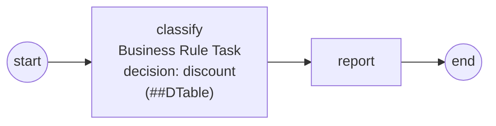

# decision-table

Demonstrates the **Decision Table engine adapter** (`adapters/dtable`,
ADR-029 / SRD-062) — the first out-of-core Business Rule Engine: a JSON
decision table **deployed from an embedded artifact** onto the pluggable
engine, evaluated per order by the **Business Rule Task** through the
ADR-027 seam.

```
start → [classify (BRT: decision "discount")] → [report] → end
```



The deployed artifact carries **structure only** — the rule grid, the FIRST
hit policy, and *names*:

```json
{
  "name": "discount",
  "hitPolicy": "FIRST",
  "rules": [
    {"when": ["vip", "big-order"], "then": {"discount_pct": 25}},
    {"when": ["big-order"], "then": {"discount_pct": 15}},
    {"when": [], "thenFn": "default-discount"}
  ]
}
```

All **behavior stays compiled Go**: `vip` and `big-order` are conditions
registered in a `Vocabulary` (`Eq("tier","vip")`, `GT("total",100)`), and
`default-discount` is a named yield functor. Re-wiring the rules — order,
policy, thresholds-by-name — is a redeploy of the artifact; an unresolved
name fails the deploy loud. The engine plugs into the process engine with
one line (`thresher.WithRuleEngine(...)`), and the model is untouched by
the swap — the same `NewBusinessRuleTask("classify", "discount")` would
run on the in-core `gorules` registry or a future DMN adapter.

Three order profiles route through the FIRST-policy grid: vip+big → 25%,
big → 15%, the match-always fallthrough → 5%.

## Run

```bash
cd examples/decision-table && go run .
```

Expected output: one `[report] discount=…%` line per order (25/15/5), with
the fallthrough rule announcing itself on the last one.
